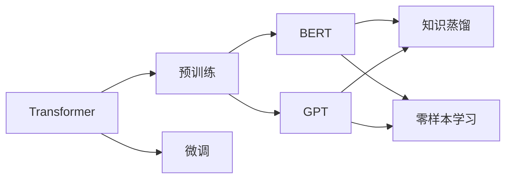

# 大语言模型原理基础与前沿 沟通意图

关键词：大语言模型、自然语言处理、深度学习、Transformer、GPT、BERT、知识表示、预训练、微调、零样本学习

## 1. 背景介绍
### 1.1 问题的由来
随着人工智能技术的飞速发展,自然语言处理(NLP)领域也取得了突破性进展。传统的自然语言处理方法主要基于规则、统计等方式,难以应对语言的复杂性和多样性。近年来,深度学习技术的兴起为NLP带来了新的契机。特别是以Transformer为代表的大语言模型,在多项NLP任务上取得了超越人类的性能,引发了学术界和产业界的广泛关注。

### 1.2 研究现状
目前,大语言模型已经成为NLP领域的研究热点。谷歌、OpenAI、Facebook、微软等科技巨头纷纷推出了自己的大语言模型,如BERT、GPT、XLNet等,在机器翻译、问答系统、情感分析等任务上取得了state-of-the-art的表现。同时,大语言模型的应用也逐渐拓展到更广泛的领域,如医疗、金融、教育等。

### 1.3 研究意义
大语言模型代表了NLP技术的前沿发展方向,对于推动人工智能在认知智能层面的进步具有重要意义。深入研究大语言模型的原理和应用,不仅有助于提升NLP系统的性能,还可以加深我们对人类语言认知机制的理解。此外,大语言模型在垂直领域的应用探索,有望催生出更多智能化的产品和服务,为社会发展带来新的动力。

### 1.4 本文结构
本文将全面探讨大语言模型的原理基础与前沿进展。第2部分介绍大语言模型的核心概念;第3部分阐述大语言模型的核心算法原理与具体操作步骤;第4部分建立大语言模型的数学模型并给出详细的公式推导;第5部分通过代码实例演示如何实现一个基于Transformer的语言模型;第6部分讨论大语言模型的实际应用场景;第7部分推荐相关的学习资源和开发工具;第8部分总结大语言模型的研究现状并展望未来发展方向;第9部分列举了一些常见问题解答。

## 2. 核心概念与联系
大语言模型的核心概念包括:

1. **语言模型(Language Model)**: 用于计算一个句子或词序列的概率分布的模型。给定上文,语言模型可以预测下一个最可能出现的词。常见的语言模型有N-gram、RNN、Transformer等。

2. **Transformer**: 一种基于自注意力机制(Self-Attention)的神经网络结构,摒弃了传统RNN/CNN等结构中的循环和卷积操作,通过Self-Attention学习序列内部的依赖关系。Transformer是大语言模型的核心组件。

3. **预训练(Pre-training)**: 在大规模无标注语料上,以自监督学习的方式训练通用的语言表示模型。预训练阶段通常采用语言建模、完形填空等任务,使模型学习到语言的基本规律和知识。

4. **微调(Fine-tuning)**: 在特定任务的标注数据集上,以监督学习的方式对预训练模型进行二次训练,使其适应具体的下游任务。微调阶段通常只需少量标注数据,即可取得很好的效果。

5. **BERT**: 基于Transformer的双向语言表示模型,通过Masked Language Model和Next Sentence Prediction两个预训练任务,学习深层次的上下文语义表示。BERT是大语言模型的代表之一。

6. **GPT**: 基于Transformer Decoder的单向语言生成模型,通过Language Modeling预训练任务,学习强大的文本生成能力。GPT系列模型在许多NLP任务上取得了突破性进展。

7. **知识蒸馏(Knowledge Distillation)**: 将大型复杂模型的知识迁移到小型简单模型的过程。通过蒸馏,可以在保持较高性能的同时,大幅降低模型的参数量和推理时间。

8. **零样本学习(Zero-shot Learning)**: 在没有任何标注数据的情况下,直接使用预训练模型进行推理预测的学习范式。大语言模型强大的语言理解和生成能力,使其在许多任务上展现出优异的零样本学习效果。

这些核心概念之间密切相关,共同构成了大语言模型的理论基础。Transformer作为大语言模型的核心组件,通过预训练和微调两个阶段,学习到强大的语言表示能力。BERT和GPT是两类典型的大语言模型,分别侧重于语言理解和生成任务。知识蒸馏和零样本学习则是大语言模型的重要应用方式,进一步拓展了其应用范围。

## 3. 核心算法原理 & 具体操作步骤 
### 3.1 算法原理概述
大语言模型的核心算法是基于Transformer的自注意力机制和预训练-微调范式。Transformer通过Self-Attention学习序列内部的依赖关系,捕捉词之间的长距离依赖。预训练阶段在大规模无标注语料上进行自监督学习,通过Masked Language Model等任务学习通用的语言表示。微调阶段在特定任务的标注数据上进行监督学习,使预训练模型适应具体的下游任务。

### 3.2 算法步骤详解
1. **Transformer结构**:
   - 输入嵌入(Input Embedding):将离散的词转换为连续的向量表示。
   - 位置编码(Positional Encoding):为每个词的向量表示添加位置信息。
   - 多头自注意力(Multi-Head Self-Attention):通过Scaled Dot-Product Attention学习序列内部的依赖关系,多头机制增强表示能力。
   - 前馈神经网络(Feed-Forward Network):对自注意力的输出进行非线性变换。
   - 残差连接(Residual Connection)和层归一化(Layer Normalization):促进梯度传播和模型收敛。
   - Encoder和Decoder:Encoder负责编码输入序列,Decoder负责解码生成输出序列。

2. **预训练阶段**:
   - 语料构建:收集大规模无标注文本数据,进行清洗和预处理。
   - 任务设计:常见的预训练任务有Masked Language Model(MLM)、Next Sentence Prediction(NSP)、Permutation Language Model(PLM)等。
   - 模型训练:在预训练任务上训练Transformer模型,优化语言建模等目标函数。
   - 模型评估:在验证集上评估预训练模型的性能,如困惑度(Perplexity)、BLEU等指标。

3. **微调阶段**:
   - 任务定义:确定具体的下游NLP任务,如文本分类、命名实体识别、问答等。
   - 数据准备:标注少量任务相关的数据集,划分训练集、验证集和测试集。
   - 模型调整:根据任务需求,调整预训练模型的输入输出层、超参数等。
   - 模型训练:在标注数据上对预训练模型进行微调,优化任务相关的损失函数。
   - 模型评估:在验证集和测试集上评估微调后模型的性能,如准确率、F1值等指标。

### 3.3 算法优缺点
优点:
- 通过预训练学习通用的语言表示,可以有效缓解标注数据稀缺的问题。
- Transformer结构能够捕捉长距离依赖关系,具有强大的语言建模能力。
- 微调阶段只需少量标注数据,即可在特定任务上取得很好的效果。
- 支持零样本学习,无需标注数据即可直接应用于新任务。

缺点:
- 预训练需要大规模语料和算力,对计算资源要求较高。
- 模型参数量巨大,推理速度较慢,不易部署到资源受限的环境中。
- 对低资源语言和领域适应性较差,需要针对性的数据和调优。
- 解释性和可控性较差,存在偏见和安全隐患。

### 3.4 算法应用领域
大语言模型已经在多个NLP任务上取得了state-of-the-art的表现,主要应用领域包括:

- 机器翻译:将源语言文本翻译成目标语言文本。
- 问答系统:根据给定问题,从大规模文本中检索并生成答案。
- 情感分析:判断文本的情感倾向,如正面、负面、中性等。
- 文本分类:将文本划分到预定义的类别中,如新闻分类、垃圾邮件识别等。
- 命名实体识别:从文本中识别出人名、地名、机构名等实体。
- 文本摘要:自动生成文本的简短摘要,提取关键信息。
- 对话系统:实现人机对话,如客服聊天机器人、智能助手等。

除了NLP领域,大语言模型还在语音识别、图像描述、推荐系统等领域展现出广阔的应用前景。

## 4. 数学模型和公式 & 详细讲解 & 举例说明
### 4.1 数学模型构建
大语言模型的数学基础是概率图模型和变分推断。给定一个词序列 $\mathbf{x}=(x_1,\cdots,x_T)$,语言模型的目标是计算该序列的概率 $p(\mathbf{x})$。根据链式法则,序列概率可以分解为:

$$p(\mathbf{x})=\prod_{t=1}^T p(x_t|x_1,\cdots,x_{t-1})$$

其中 $p(x_t|x_1,\cdots,x_{t-1})$ 表示在给定前 $t-1$ 个词的情况下,第 $t$ 个词为 $x_t$ 的条件概率。语言模型的任务就是学习这个条件概率分布。

传统的N-gram语言模型通过统计词频来估计条件概率,但难以刻画长距离依赖。神经语言模型使用神经网络来参数化条件概率分布:

$$p(x_t|x_1,\cdots,x_{t-1})=\mathrm{softmax}(f(x_1,\cdots,x_{t-1};\theta))$$

其中 $f(\cdot;\theta)$ 表示神经网络,通常使用RNN或Transformer等结构。$\mathrm{softmax}$ 函数将神经网络的输出归一化为一个概率分布。

大语言模型在预训练阶段,通过最大化语言模型的似然概率来学习模型参数 $\theta$:

$$\mathcal{L}(\theta)=\sum_{i=1}^N\log p(\mathbf{x}^{(i)};\theta)$$

其中 $\{\mathbf{x}^{(i)}\}_{i=1}^N$ 表示预训练语料中的句子。模型训练过程通常使用随机梯度下降等优化算法,最小化负对数似然损失函数。

### 4.2 公式推导过程
以BERT为例,详细推导其预训练任务Masked Language Model(MLM)的损失函数。

MLM任务随机遮挡一部分词,并让模型预测被遮挡的词。设输入序列为 $\mathbf{x}=(x_1,\cdots,x_T)$,遮挡位置为 $\mathcal{M}$,被遮挡词为 $\mathbf{x}_{\mathcal{M}}$。BERT通过双向Transformer编码器对输入序列进行建模:

$$\mathbf{h}=\mathrm{Transformer}(\mathbf{x};\theta)$$

其中 $\mathbf{h}=(\mathbf{h}_1,\cdots,\mathbf{h}_T)$ 表示编码后的上下文向量序列。对于每个遮挡位置 $t\in\mathcal{M}$,BERT使用 $\mathbf{h}_t$ 预测被遮挡词 $x_t$:

$$p(x_t|\mathbf{x}_{\backslash t})=\mathrm{softmax}(\mathbf{W}\mathbf{h}_t+\mathbf{b})$$

其中 $\mathbf{W}$ 和 $\mathbf{b}$ 是可学习的参数矩阵和偏置向量。MLM任务的损失函数定义为:

$$