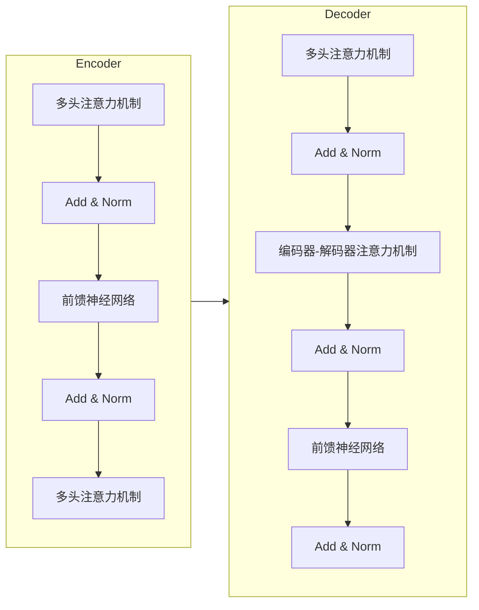

好的,我会按照您的要求,以"大语言模型原理基础与前沿 语言建模的挑战"为题,撰写一篇逻辑严谨、内容丰富、结构完整的专业技术博客文章。

# 大语言模型原理基础与前沿 语言建模的挑战

## 1. 背景介绍

### 1.1 问题的由来

随着人工智能技术的快速发展,大型语言模型(Large Language Model,LLM)已经成为自然语言处理领域的关键技术之一。LLM通过在海量文本数据上进行预训练,学习语言的语义和语法规则,从而获得强大的语言理解和生成能力。这些模型可以应用于机器翻译、问答系统、文本摘要、内容创作等多个领域,展现出令人惊叹的性能表现。

然而,尽管取得了长足的进步,大型语言模型仍然面临着诸多挑战和局限性。例如,模型可能会产生不合逻辑的输出、缺乏常识推理能力、存在偏见和不当内容等问题。因此,深入探究大型语言模型的原理基础,并研究其前沿发展方向,对于提高模型性能、确保其可靠性和安全性至关重要。

### 1.2 研究现状  

近年来,大型语言模型的研究受到了广泛关注,涌现出了一系列重要的模型和技术,如GPT(Generative Pre-trained Transformer)、BERT(Bidirectional Encoder Representations from Transformers)、XLNet、T5等。这些模型采用了transformer编码器-解码器架构,通过自注意力机制有效捕获长距离依赖关系,在各种自然语言处理任务上取得了卓越的表现。

与此同时,研究人员也在探索提高大型语言模型性能的各种方法,包括模型压缩、知识增强、多模态融合、控制生成等。此外,一些新兴的模型架构和训练范式也开始受到关注,如前馈神经网络语言模型、基于retrieval的语言模型等。

尽管取得了长足的进步,但大型语言模型仍然面临着诸多挑战,如模型的可解释性、鲁棒性、公平性、效率等问题亟待解决。同时,如何将大型语言模型应用于实际场景,并确保其安全可靠,也是一个重要的研究课题。

### 1.3 研究意义

深入研究大型语言模型的原理基础和前沿发展方向,对于推动自然语言处理技术的进步具有重要意义。具体来说,本研究的意义包括但不限于以下几个方面:

1. **提高模型性能**:通过深入理解模型的工作原理和局限性,我们可以设计出更加高效和准确的模型架构和训练方法,从而提高模型在各种任务上的性能表现。

2. **增强模型可解释性**:探究模型内部的决策过程和知识表示方式,有助于提高模型的可解释性,从而更好地理解模型的行为,并进行有针对性的优化和调整。

3. **确保模型的安全性和公平性**:研究模型中存在的偏见、不当内容等问题,并提出相应的缓解措施,有助于确保模型的输出是安全、公平和可靠的。

4. **拓展模型的应用场景**:通过深入研究模型的局限性和挑战,我们可以探索新的应用场景,并设计出更加适合特定任务的模型和算法。

5. **推动理论和技术创新**:大型语言模型的研究涉及多个领域的交叉,如自然语言处理、机器学习、神经网络等,有助于推动这些领域的理论和技术创新。

总之,深入研究大型语言模型的原理基础和前沿发展方向,不仅有助于提高模型的性能和可靠性,还将推动自然语言处理技术的长足进步,为智能系统的发展做出重要贡献。

### 1.4 本文结构

本文将全面探讨大型语言模型的原理基础和前沿发展方向,内容安排如下:

1. **背景介绍**:阐述大型语言模型的由来、研究现状和意义,为后续内容做好铺垫。

2. **核心概念与联系**:介绍大型语言模型的核心概念,如transformer架构、自注意力机制、预训练等,并探讨它们之间的联系。

3. **核心算法原理与具体操作步骤**:深入解析大型语言模型中的核心算法原理,如transformer的自注意力计算过程、掩码语言模型预训练等,并详细讲解具体的操作步骤。

4. **数学模型和公式详细讲解与举例说明**:介绍大型语言模型中所采用的数学模型和公式,如transformer的计算公式、损失函数等,并通过具体案例进行详细讲解和举例说明。

5. **项目实践:代码实例和详细解释说明**:提供大型语言模型的代码实例,包括开发环境搭建、源代码实现、代码解读与分析、运行结果展示等,帮助读者更好地理解和掌握相关技术。

6. **实际应用场景**:介绍大型语言模型在机器翻译、问答系统、文本摘要、内容创作等领域的实际应用场景,并探讨未来的应用展望。

7. **工具和资源推荐**:为读者推荐大型语言模型相关的学习资源、开发工具、论文资料等,方便进一步的学习和研究。

8. **总结:未来发展趋势与挑战**:总结大型语言模型的研究成果,展望未来的发展趋势,并分析所面临的挑战和研究展望。

9. **附录:常见问题与解答**:针对大型语言模型的常见问题,提供详细的解答和说明。

通过全面而深入的探讨,本文旨在为读者提供大型语言模型的核心知识和前沿动态,帮助读者掌握这一领域的基础理论和实践技能,并了解未来的发展方向和挑战。

## 2. 核心概念与联系

在深入探讨大型语言模型的算法原理和数学模型之前,我们首先需要了解一些核心概念,这些概念构成了大型语言模型的基础。本节将介绍transformer架构、自注意力机制、预训练等核心概念,并探讨它们之间的联系。

### 2.1 Transformer架构

Transformer是大型语言模型中广泛采用的一种架构,它完全基于注意力机制,摒弃了传统序列模型中的递归和卷积结构。Transformer架构主要由编码器(Encoder)和解码器(Decoder)两个部分组成,如下图所示:

编码器的主要作用是将输入序列编码为一系列向量表示,而解码器则根据编码器的输出和前一步的预测结果,生成目标序列。编码器和解码器内部都由多个相同的层组成,每一层包含了多头自注意力机制(Multi-Head Attention)和前馈神经网络(Feed-Forward Neural Network)两个子层。

自注意力机制是Transformer的核心,它允许模型捕捉输入序列中任意两个位置之间的依赖关系,而不受距离的限制。多头注意力机制则是通过将注意力机制分成多个"头"来提高模型的表达能力。

除了编码器内部的自注意力机制外,解码器还包含一个编码器-解码器注意力机制,用于将编码器的输出与解码器的状态进行关联,从而更好地生成目标序列。

Transformer架构的优点在于并行计算能力强、能够有效捕获长距离依赖关系,因此在大型语言模型中得到了广泛应用。但同时,它也存在一些缺陷,如计算复杂度较高、缺乏位置信息等,后续的研究工作也在不断探索改进方向。

### 2.2 自注意力机制

自注意力机制(Self-Attention)是Transformer架构中的核心组件,它允许模型捕捉输入序列中任意两个位置之间的依赖关系,而不受距离的限制。传统的序列模型,如RNN和LSTM,由于其递归性质,在捕捉长距离依赖关系时存在一定困难。而自注意力机制通过计算输入序列中所有位置之间的相似性,从而直接建立它们之间的关联,有效解决了这一问题。

自注意力机制的计算过程可以概括为三个步骤:

1. **计算注意力分数**:对于输入序列中的每个位置,计算它与其他所有位置之间的注意力分数,注意力分数反映了两个位置之间的相似性程度。

2. **计算加权和**:将每个位置的值乘以其对应的注意力分数,然后对所有位置进行加权求和,得到该位置的注意力表示。

3. **多头注意力**:为了提高模型的表达能力,自注意力机制通常会被分成多个"头",每个头都会独立计算注意力表示,最后将所有头的结果进行拼接。

自注意力机制的优点在于能够有效捕捉长距离依赖关系,并且计算过程可以高度并行化,提高了模型的计算效率。但同时,它也存在一些缺陷,如计算复杂度较高、缺乏位置信息等,后续的研究工作也在不断探索改进方向。

### 2.3 预训练

预训练(Pre-training)是大型语言模型中一种常见的训练范式。由于大型语言模型需要在海量文本数据上进行训练,以学习语言的语义和语法规则,因此预训练成为了一种有效的方法。

预训练的基本思想是:首先在大规模无监督数据上训练一个通用的语言模型,使其学习到语言的基本知识和规则;然后在特定的下游任务上进行微调(Fine-tuning),将通用语言模型针对性地调整,以更好地适应该任务。

目前,常见的预训练方法包括:

1. **掩码语言模型(Masked Language Modeling, MLM)**:在输入序列中随机掩码一部分单词,要求模型根据上下文预测被掩码的单词。这种方式可以让模型学习到双向的语言表示。

2. **下一句预测(Next Sentence Prediction, NSP)**:给定两个句子,要求模型判断第二个句子是否为第一个句子的下一句。这种方式可以让模型学习到句子之间的关系和语义连贯性。

3. **因果语言模型(Causal Language Modeling, CLM)**:根据前面的单词序列,预测下一个单词。这种方式可以让模型学习到单向的语言表示。

4. **替换令牌检测(Replaced Token Detection, RTD)**:在输入序列中随机替换一部分单词,要求模型检测出被替换的单词位置和原始单词。

通过预训练,大型语言模型可以在海量无监督数据上学习到通用的语言知识,从而为后续的下游任务奠定良好的基础。预训练的范式不仅提高了模型的性能,也极大地降低了在特定任务上的训练成本。

### 2.4 核心概念之间的联系

上述三个核心概念——Transformer架构、自注意力机制和预训练——构成了大型语言模型的基础,它们之间存在着紧密的联系:

1. **Transformer架构提供了自注意力机制的实现框架**。自注意力机制作为Transformer架构的核心组件,在编码器和解码器的每一层中都得到了应用,用于捕捉输入序列中任意两个位置之间的依赖关系。

2. **预训练为大型语言模型提供了通用的语言知识**。通过在海量无监督数据上进行预训练,大型语言模型