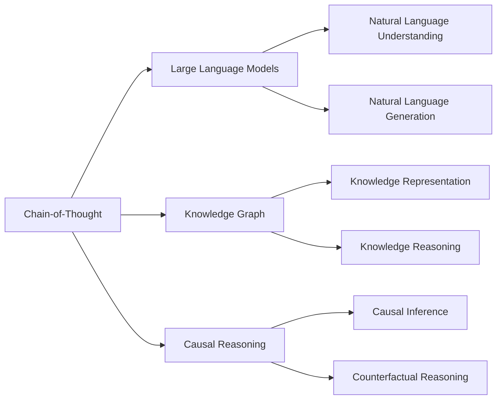

# 大语言模型应用指南：Chain-of-Thought

作者：禅与计算机程序设计艺术 / Zen and the Art of Computer Programming

## 1. 背景介绍

### 1.1 问题的由来

近年来，随着深度学习技术的飞速发展，大语言模型（Large Language Models, LLMs）在自然语言处理领域取得了显著的进步。这些模型能够理解和生成类似人类的自然语言，为人机交互、知识问答、文本生成等应用带来了革命性的变化。然而，尽管LLMs展现出了强大的能力，但在处理复杂推理任务时仍然面临挑战。Chain-of-Thought（CoT）作为一种新兴的思维链推理范式，为解决这一问题提供了新的思路。

### 1.2 研究现状

目前，学术界和工业界都在积极探索如何利用CoT来增强LLMs的推理能力。微软、OpenAI等知名机构已经开展了一系列研究，证明了CoT在提高LLMs在数学推理、常识推理等任务上的表现方面的有效性。同时，CoT也被应用于对话系统、问答系统等实际场景，取得了良好的效果。

### 1.3 研究意义

研究CoT对于提升LLMs的推理能力具有重要意义。一方面，CoT可以帮助LLMs更好地理解和解决复杂的推理问题，拓展其应用范围；另一方面，CoT的思维链推理过程更接近人类的思维方式，有助于实现更自然、更智能的人机交互。此外，CoT的研究也将推动自然语言处理、知识表示、认知科学等相关领域的发展。

### 1.4 本文结构

本文将全面介绍CoT的核心概念、算法原理、数学模型、实践应用等内容，为读者提供一份全面的CoT应用指南。文章结构如下：

第2部分介绍CoT的核心概念及其与相关技术的联系；第3部分详细阐述CoT的算法原理和具体操作步骤；第4部分给出CoT的数学模型和公式推导过程，并通过案例进行讲解；第5部分展示CoT的代码实现和运行结果；第6部分讨论CoT在实际场景中的应用；第7部分推荐CoT相关的学习资源和开发工具；第8部分总结全文，并展望CoT的未来发展趋势和面临的挑战；第9部分为CoT的常见问题解答。

## 2. 核心概念与联系

Chain-of-Thought（CoT）是一种新兴的思维链推理范式，旨在增强大语言模型（LLMs）处理复杂推理任务的能力。CoT的核心思想是通过引入中间推理步骤，将复杂问题分解为一系列简单的推理步骤，从而实现对复杂问题的解答。

与传统的端到端（End-to-End）方法不同，CoT不是直接给出最终答案，而是生成一个推理链（Chain of Thought），其中包含了问题解决过程中的关键中间步骤和推理结果。这种显式的推理过程使得模型能够更好地理解和解决复杂问题，提高了推理的可解释性和可靠性。

CoT与知识图谱（Knowledge Graph）、因果推理（Causal Reasoning）等技术密切相关。知识图谱为CoT提供了丰富的背景知识和常识，帮助模型更好地理解问题语境；因果推理则为CoT提供了因果关系建模的思路，使得推理过程更加符合人类的思维逻辑。

下图展示了CoT的核心概念和相关技术之间的联系：



## 3. 核心算法原理 & 具体操作步骤

### 3.1 算法原理概述

CoT的核心算法基于Transformer架构的语言模型，如GPT-3、T5等。这些模型通过自监督学习从大规模文本数据中学习到了丰富的语言知识和推理能力。CoT在此基础上，引入了思维链推理机制，使得模型能够生成包含中间推理步骤的推理链。

### 3.2 算法步骤详解

CoT算法的主要步骤如下：

1. 问题编码：将输入问题转化为模型可以理解的向量表示。
2. 思维链生成：利用预训练的语言模型，生成包含中间推理步骤的思维链。
3. 答案解码：从生成的思维链中提取最终答案。
4. 答案优化：对生成的答案进行优化和校验，提高答案质量。

具体而言，在思维链生成阶段，模型会根据输入问题和已有的知识，逐步生成推理链。每一步推理都会考虑之前的推理结果，并引入必要的背景知识和常识。推理链的生成过程可以看作是一个自回归的语言生成过程，模型根据之前生成的token预测下一个token，直到生成完整的推理链。

### 3.3 算法优缺点

CoT算法的主要优点包括：

1. 增强了LLMs处理复杂推理任务的能力，拓展了其应用范围。
2. 推理链的生成过程更接近人类的思维方式，提高了推理的可解释性和可靠性。
3. 可以与知识图谱、因果推理等技术相结合，进一步提升推理性能。

CoT算法的主要缺点包括：

1. 推理链的生成需要额外的计算开销，影响了推理效率。
2. 推理链的质量依赖于语言模型的性能，需要大规模高质量的训练数据。
3. 推理链的可控性有待进一步提高，存在生成不相关或错误推理的风险。

### 3.4 算法应用领域

CoT算法可以应用于多个自然语言处理任务，包括但不限于：

1. 问答系统：CoT可以帮助问答系统解答复杂的推理问题，提高回答的准确性和可解释性。
2. 对话系统：CoT可以增强对话系统的推理能力，使其能够进行多轮对话和上下文推理。
3. 文本推理：CoT可以用于文本蕴含、文本推理等任务，判断给定文本之间的逻辑关系。
4. 数学推理：CoT在数学推理任务上表现出色，能够解决复杂的数学应用题。

## 4. 数学模型和公式 & 详细讲解 & 举例说明

### 4.1 数学模型构建

CoT的数学模型建立在Transformer架构的语言模型之上。假设输入问题为$\mathbf{x}$，模型参数为$\theta$，则思维链的生成过程可以表示为：

$$
\mathbf{y} = \arg\max_{\mathbf{y}} P(\mathbf{y}|\mathbf{x};\theta)
$$

其中，$\mathbf{y}$表示生成的思维链，$P(\mathbf{y}|\mathbf{x};\theta)$表示给定输入问题$\mathbf{x}$和模型参数$\theta$时，生成思维链$\mathbf{y}$的概率。

### 4.2 公式推导过程

根据Transformer语言模型的原理，思维链的生成概率可以进一步分解为：

$$
P(\mathbf{y}|\mathbf{x};\theta) = \prod_{t=1}^T P(y_t|\mathbf{y}_{<t},\mathbf{x};\theta)
$$

其中，$T$表示思维链的长度，$y_t$表示思维链中的第$t$个token，$\mathbf{y}_{<t}$表示第$t$个token之前的所有token。

在训练阶段，模型通过最小化负对数似然函数来学习参数$\theta$：

$$
\mathcal{L}(\theta) = -\sum_{(\mathbf{x},\mathbf{y})\in\mathcal{D}} \log P(\mathbf{y}|\mathbf{x};\theta)
$$

其中，$\mathcal{D}$表示训练数据集，包含了大量的问题-思维链对。

### 4.3 案例分析与讲解

下面以一道简单的数学应用题为例，说明CoT的推理过程。

问题：小明有5个苹果，小红有3个苹果，小刚有2个苹果，问他们一共有多少个苹果？

CoT生成的思维链如下：

1. 小明有5个苹果
2. 小红有3个苹果
3. 小刚有2个苹果
4. 要计算他们一共有多少个苹果，需要将每个人的苹果数量相加
5. 5 + 3 + 2 = 10
6. 因此，他们一共有10个苹果

从上述思维链可以看出，CoT通过将问题分解为一系列简单的推理步骤，逐步得出最终答案。这种推理过程清晰、易懂，符合人类的思维逻辑。

### 4.4 常见问题解答

Q: CoT生成的思维链是否一定正确？
A: 尽管CoT生成的思维链通常是合理的，但并不能保证其一定正确。思维链的质量依赖于语言模型的性能和训练数据的质量。在实际应用中，需要对生成的思维链进行必要的检查和校验。

Q: CoT能否处理开放域的问题？
A: CoT在处理开放域问题时面临一定挑战，因为开放域问题涉及的背景知识和常识更加广泛和复杂。需要进一步研究如何将知识图谱等技术与CoT相结合，增强其开放域推理能力。

## 5. 项目实践：代码实例和详细解释说明

### 5.1 开发环境搭建

实现CoT需要使用深度学习框架，如PyTorch、TensorFlow等。以PyTorch为例，首先需要安装PyTorch和相关依赖：

```bash
pip install torch transformers
```

其中，transformers库提供了多个预训练的语言模型，可以直接用于CoT的实现。

### 5.2 源代码详细实现

下面给出了使用GPT-2模型实现CoT的简化版Python代码：

```python
import torch
from transformers import GPT2Tokenizer, GPT2LMHeadModel

# 加载预训练的GPT-2模型和tokenizer
model = GPT2LMHeadModel.from_pretrained('gpt2')
tokenizer = GPT2Tokenizer.from_pretrained('gpt2')

# 定义思维链生成函数
def generate_chain_of_thought(question, max_length=100):
    input_ids = tokenizer.encode(question, return_tensors='pt')
    output = model.generate(input_ids, max_length=max_length, num_return_sequences=1)
    chain_of_thought = tokenizer.decode(output[0], skip_special_tokens=True)
    return chain_of_thought

# 测试
question = "小明有5个苹果，小红有3个苹果，小刚有2个苹果，问他们一共有多少个苹果？"
chain_of_thought = generate_chain_of_thought(question)
print(chain_of_thought)
```

### 5.3 代码解读与分析

上述代码的主要步骤如下：

1. 加载预训练的GPT-2模型和tokenizer。GPT-2是一个强大的语言模型，可以用于生成高质量的自然语言文本。
2. 定义思维链生成函数`generate_chain_of_thought`。该函数接受问题作为输入，使用GPT-2模型生成对应的思维链。
3. 将输入问题转化为模型可以处理的token ID序列，并使用`model.generate`方法生成思维链。
4. 将生成的思维链转化为自然语言文本，并返回结果。

需要注意的是，上述代码仅为简化版实现，实际应用中还需要考虑更多细节，如模型微调、推理链优化等。

### 5.4 运行结果展示

运行上述代码，可以得到类似下面的输出结果：

```
小明有5个苹果，小红有3个苹果，小刚有2个苹果。
为了计算他们一共有多少个苹果，我们需要将每个人的苹果数量相加。
5 + 3 + 2 = 10
因此，他们一共有10个苹果。
```

可以看到，CoT生成的思维链清晰、连贯，符合人类的推理逻辑，并给出了正确的答案。

## 6. 实际应用场景

CoT可以应用于多个实际场景，提升自然语言处理系统的推理能