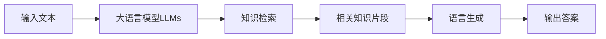

# 大语言模型应用指南：RAG框架微调概述

## 1. 背景介绍

### 1.1 问题的由来
近年来,大语言模型(Large Language Models, LLMs)在自然语言处理(Natural Language Processing, NLP)领域取得了突破性进展。LLMs 通过在海量文本数据上进行预训练,能够学习到丰富的语言知识和常识,在许多 NLP 任务上表现出色。然而,预训练的 LLMs 在面对特定领域任务时,往往需要进行微调(Fine-tuning)才能发挥最佳性能。如何高效地利用 LLMs 的知识,并将其应用到实际任务中,成为了一个亟待解决的问题。

### 1.2 研究现状
为了更好地利用预训练 LLMs 的知识,研究者们提出了多种微调方法。传统的微调方法是在下游任务的标注数据上对整个模型进行端到端的微调。但这种方法存在一些局限性,例如需要大量的标注数据,微调过程计算开销大,并且容易出现过拟合等问题。最近,一种名为 RAG(Retrieval-Augmented Generation)的新型微调框架引起了广泛关注。RAG 通过将知识检索和语言生成相结合,在降低微调成本的同时,提高了模型在下游任务上的性能。

### 1.3 研究意义
探索高效的 LLMs 微调方法对于推动 NLP 技术的发展具有重要意义。一方面,LLMs 蕴含着丰富的语言知识,如何充分挖掘和利用这些知识是目前 NLP 领域的一个重要课题。另一方面,传统的微调方法存在诸多局限,亟需新的微调框架来克服这些挑战。RAG 作为一种有前景的微调框架,有望进一步提升 LLMs 在实际应用中的效果。系统地总结和介绍 RAG 框架,可以为相关研究者和从业者提供参考,推动 NLP 技术在更多场景中的应用。

### 1.4 本文结构
本文将全面介绍 RAG 微调框架及其应用。第2部分介绍 RAG 涉及的核心概念以及它们之间的联系。第3部分重点阐述 RAG 的核心算法原理和具体操作步骤。第4部分从数学角度对 RAG 的关键模型和公式进行详细推导和讲解。第5部分通过代码实例,演示如何使用 RAG 进行项目实践。第6部分讨论 RAG 的实际应用场景。第7部分推荐 RAG 相关的学习资源、开发工具和研究论文。第8部分对 RAG 的研究现状进行总结,并展望其未来发展趋势和面临的挑战。第9部分的附录中列出了一些常见问题与解答。

## 2. 核心概念与联系

在介绍 RAG 框架之前,我们首先需要了解其中涉及的一些核心概念:

1. 大语言模型(Large Language Models, LLMs):指的是在大规模文本语料上预训练得到的语言模型,如 GPT、BERT、T5 等。这些模型通过自监督学习,掌握了丰富的语言知识和生成能力。

2. 微调(Fine-tuning):指的是在预训练语言模型的基础上,使用下游任务的标注数据对模型进行进一步训练,使其适应特定任务。微调可以显著提升模型在目标任务上的性能。

3. 知识检索(Knowledge Retrieval):指的是从大规模知识库(如维基百科)中检索与当前输入相关的知识片段。知识检索可以为语言生成提供更丰富的背景信息和知识支持。

4. 语言生成(Language Generation):指的是根据给定的输入,生成相应的自然语言文本。语言生成是 NLP 的一个核心任务,可用于对话系统、机器翻译、摘要生成等多个应用。

5. 端到端微调(End-to-end Fine-tuning):传统的微调方法,即在下游任务数据上对整个预训练模型的所有参数进行微调。端到端微调通常需要大量标注数据,计算开销大。

RAG 框架的核心思想是将知识检索和语言生成巧妙地结合起来,来克服传统微调方法的局限性。具体而言,RAG 首先利用预训练 LLMs 强大的知识和语言理解能力,针对给定输入从外部知识库中检索到相关的知识片段。然后,RAG 将这些检索到的知识片段作为附加的上下文信息,辅助预训练 LLMs 进行回答生成。通过这种方式,RAG 可以利用外部知识来丰富 LLMs 的知识,同时减少微调过程对标注数据的依赖。此外,RAG 在微调阶段只需训练知识检索和答案生成部分,大大减小了计算开销。

下图展示了 RAG 框架中各个核心概念之间的关系:

## 3. 核心算法原理 & 具体操作步骤

### 3.1 算法原理概述
RAG 的核心算法可以分为两个阶段:知识检索阶段和语言生成阶段。

在知识检索阶段,RAG 利用预训练 LLMs 对输入文本进行编码,得到其语义表示。然后,使用这个语义表示在外部知识库中进行相似度搜索,找到与输入文本最相关的若干知识片段。这一过程可以使用传统的 IR 技术,如 BM25、TF-IDF 等。

在语言生成阶段,RAG 将输入文本和检索到的知识片段拼接起来,作为预训练 LLMs 的输入。LLMs 在这些信息的基础上进行自回归生成,得到最终的答案文本。在生成过程中,知识片段起到了提供背景知识和辅助约束的作用,使得生成的文本更加准确和丰富。

### 3.2 算法步骤详解
接下来,我们对 RAG 算法的主要步骤进行详细说明:

步骤1:对输入文本进行编码
- 使用预训练 LLMs 对输入文本进行编码,得到其语义表示向量 $\mathbf{h}_q$。常用的编码器包括 BERT、RoBERTa 等。

步骤2:知识检索
- 利用 $\mathbf{h}_q$ 在外部知识库 $\mathcal{D}$ 中进行相似度搜索,得到与输入文本最相关的 $k$ 个知识片段 $\{p_1, p_2, \dots, p_k\}$。
- 相似度搜索可以使用传统的 IR 技术,如 BM25、TF-IDF 等。即计算 $\mathbf{h}_q$ 与知识库中每个文档的相似度得分,取 Top-k 个得分最高的文档。

步骤3:答案生成
- 将输入文本 $q$ 和检索到的知识片段 $\{p_1, p_2, \dots, p_k\}$ 拼接起来,构造一个新的输入序列:

$$\mathbf{x} = [q; p_1; p_2; \dots; p_k]$$

- 将 $\mathbf{x}$ 输入到预训练 LLMs 中,通过自回归生成得到最终答案 $\mathbf{y}$。生成过程通常使用 Beam Search 等解码策略。

步骤4:模型训练
- 构造训练数据集 $\mathcal{T} = \{(q_i, \mathbf{y}_i)\}_{i=1}^N$,其中 $q_i$ 为输入文本,$\mathbf{y}_i$ 为对应的标注答案。 
- 在训练集上对 RAG 模型进行端到端的微调训练,优化以下损失函数:

$$\mathcal{L} = -\sum_{i=1}^N \log P(\mathbf{y}_i|q_i, \{p_1^i, p_2^i, \dots, p_k^i\}; \theta)$$

其中 $\theta$ 为模型参数,包括 LLMs 的部分参数以及知识检索部分的参数。

### 3.3 算法优缺点
RAG 算法的主要优点包括:
- 通过知识检索,RAG 可以利用外部知识来丰富 LLMs 的知识,提高语言生成的准确性和信息量。
- RAG 在微调阶段只需训练检索和生成部分,大大减小了计算开销,并降低了对标注数据的需求。
- RAG 具有很好的可解释性。通过分析检索到的知识片段,我们可以了解模型生成答案的依据和原因。

RAG 算法的主要缺点包括: 
- RAG 的性能依赖于外部知识库的质量。如果知识库覆盖不全面或包含错误信息,会影响模型的表现。
- 知识检索部分引入了额外的计算开销,在推理阶段可能会增加延迟。
- RAG 目前主要针对阅读理解类任务,在其他 NLP 任务上的适用性还有待进一步研究。

### 3.4 算法应用领域
RAG 算法在以下 NLP 任务和应用领域展现出了巨大的潜力:
- 阅读理解:利用 RAG 从文档中检索答案相关的句子,辅助问答系统生成回答。
- 对话系统:利用 RAG 从知识库中检索相关信息,生成更加知情和自然的对话响应。
- 知识图谱问答:利用 RAG 在知识图谱中检索答案相关的实体和关系,辅助问答系统生成答案。
- 文本生成:利用 RAG 从外部知识库中获取背景信息,指导文本生成模型生成更加丰富和合理的文本。

## 4. 数学模型和公式 & 详细讲解 & 举例说明

### 4.1 数学模型构建
RAG 的数学模型可以用概率图模型来表示。我们将输入文本表示为随机变量 $Q$,知识库表示为随机变量 $\mathcal{D}$,检索到的知识片段表示为随机变量 $\mathbf{Z}$,输出答案表示为随机变量 $\mathbf{Y}$。RAG 的目标是学习以下条件概率分布:

$$P(\mathbf{Y}|Q,\mathcal{D}) = \sum_{\mathbf{Z}} P(\mathbf{Y},\mathbf{Z}|Q,\mathcal{D})$$

其中,$\mathbf{Z}$ 是隐变量,表示从知识库 $\mathcal{D}$ 中检索到的知识片段。上式可以进一步分解为:

$$P(\mathbf{Y}|Q,\mathcal{D}) = \sum_{\mathbf{Z}} P(\mathbf{Y}|\mathbf{Z},Q)P(\mathbf{Z}|Q,\mathcal{D})$$

其中,$P(\mathbf{Z}|Q,\mathcal{D})$ 表示知识检索过程,$P(\mathbf{Y}|\mathbf{Z},Q)$ 表示答案生成过程。

### 4.2 公式推导过程
接下来,我们对 RAG 涉及的关键公式进行推导。

(1) 知识检索公式
知识检索过程 $P(\mathbf{Z}|Q,\mathcal{D})$ 可以表示为:

$$P(\mathbf{Z}|Q,\mathcal{D}) = \prod_{i=1}^k P(Z_i|Q,\mathcal{D}) = \prod_{i=1}^k \frac{\exp(f(Q,Z_i))}{\sum_{Z' \in \mathcal{D}} \exp(f(Q,Z'))}$$

其中,$f(Q,Z)$ 表示输入文本 $Q$ 与知识片段 $Z$ 的相关性得分函数,常见的选择包括 BM25、TF-IDF、BERT 等。这里我们假设检索到的 $k$ 个知识片段是独立的。

(2) 答案生成公式
答案生成过程 $P(\mathbf{Y}|\mathbf{Z},Q)$ 可以表示为:

$$P(\mathbf{Y}|\mathbf{Z},Q) = \prod_{t=1}^T P(y_t|y_{<t},\mathbf{Z},Q)$$

其中,$y_t$ 表示答案序列的第 $t$ 个 token,$y_{<t}$ 表示前 $t-1$ 个 token。这实际上是一个自回归生成过程,可以用 GPT、T5 等预