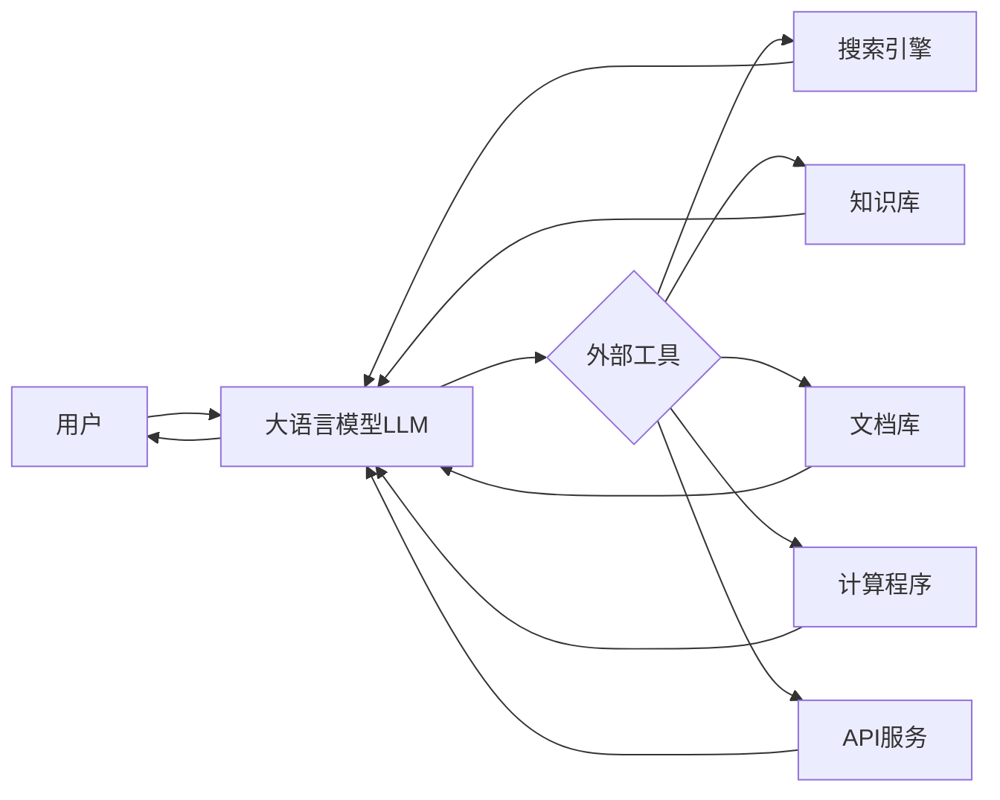
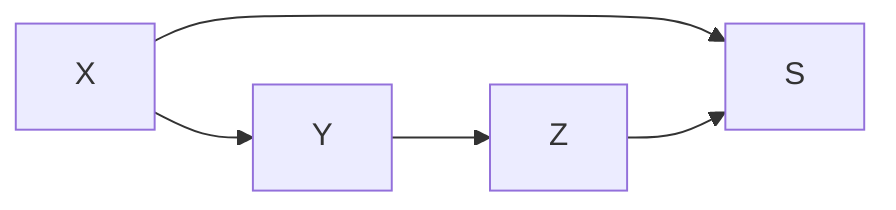

# 大语言模型应用指南：使用外部工具的基本原理

关键词：大语言模型、外部工具、API集成、知识库扩展、多模态交互、安全隐私

## 1. 背景介绍
### 1.1 问题的由来
随着大语言模型(Large Language Model, LLM)的快速发展,其在自然语言处理、对话系统、知识问答等领域展现出了巨大的潜力。然而,LLM在实际应用中仍面临着知识获取有限、推理能力不足、缺乏多模态感知等挑战。为了进一步提升LLM的性能和适用范围,研究者们提出了利用外部工具来扩展LLM能力的思路。

### 1.2 研究现状
目前,利用外部工具增强LLM的研究主要集中在以下几个方面:

1. API集成:通过调用外部API接口,如搜索引擎、知识库、计算服务等,为LLM提供额外的信息和计算能力。代表性工作如GPT-3的插件机制。

2. 知识库扩展:构建领域知识库,将结构化或非结构化的外部知识引入LLM的训练和推理过程。如ERNIE 3.0利用百科知识增强语言模型。

3. 多模态融合:将视觉、语音等其他模态的信息与LLM结合,实现多模态理解和生成。如DALL·E、Flamingo等视觉语言模型。

4. 安全隐私保护:在利用外部数据和服务的同时,需要重点关注数据隐私和模型安全问题。如对敏感数据进行脱敏,防止模型泄露用户隐私。

### 1.3 研究意义
利用外部工具扩展LLM的研究意义重大:

1. 突破LLM的知识瓶颈,提供更广泛、更及时的信息来源。

2. 引入外部计算能力,提升LLM在数值计算、逻辑推理等方面的表现。

3. 实现多模态感知和交互,拓展LLM的应用场景,如智能客服、虚拟助手等。

4. 探索安全隐私保护机制,促进LLM的可信可控发展。

### 1.4 本文结构
本文将重点介绍利用外部工具增强大语言模型的基本原理和关键技术,内容组织如下:

第2部分介绍LLM与外部工具的核心概念和二者的关系;
第3部分重点阐述外部工具集成的算法原理和具体操作步骤;
第4部分从数学角度对外部工具增强LLM的建模和公式推导进行讲解;
第5部分给出外部工具应用的代码实例和详细解释;
第6部分讨论外部工具在实际场景中的应用现状和未来展望;
第7部分推荐相关的学习资源、开发工具和研究论文;
第8部分总结全文,分析未来发展趋势和面临的挑战;
第9部分列举常见问题并给出解答。

## 2. 核心概念与联系
大语言模型(LLM)是一类基于海量文本数据训练的神经网络模型,通过自监督学习掌握了丰富的语言知识和生成能力。但LLM本身是一个封闭的系统,其知识来源局限于有限的训练语料,对于训练数据覆盖不足或者最新信息,LLM难以给出理想的响应。

外部工具是指独立于LLM的各类信息源、知识库、软件接口和硬件设施,能够为LLM提供额外的数据输入或计算能力输出。常见的外部工具包括搜索引擎、百科知识库、文档数据库、数值计算程序、第三方API服务等。这些工具可以弥补LLM在知识广度、信息时效性、计算精度等方面的不足。

LLM与外部工具的关系可以概括为"扩展"和"互补"。一方面,外部工具为LLM的知识获取和能力拓展提供了新的途径,使其突破原有的数据和模型限制;另一方面,LLM可以作为人机交互的自然语言接口,将用户需求转化为对外部工具的调用和结果解释,简化了复杂工具的使用。二者相互配合,优势互补。

下图展示了LLM与外部工具的基本架构和工作流程:



用户通过自然语言与LLM交互,LLM根据用户意图分析确定需要调用的外部工具,并将结构化的请求发送给相应的工具。外部工具执行请求任务后,将结果返回给LLM。LLM对返回的信息进行解析、过滤、整合,最终以自然语言的形式呈现给用户。整个过程中LLM起到了任务分解、流程编排、结果解释的枢纽作用。

## 3. 核心算法原理 & 具体操作步骤
### 3.1 算法原理概述
利用外部工具增强LLM的核心是将外部知识和计算能力与LLM的推理生成过程进行有机融合。一般采用基于提示(Prompt)的方法,通过设计适当的提示模板,引导LLM生成外部工具调用的指令,并对返回结果进行解析和整合。同时,将外部获取的信息以文本形式添加到LLM的输入中,增强其感知和理解能力。

该方法可以形式化地表示为:

$$
\begin{aligned}
\text{Prompt} &= \text{Template}(x, k) \\
\text{Action} &= \text{LLM}(\text{Prompt}) \\
r &= \text{Tool}(\text{Action}) \\
\text{Result} &= \text{LLM}(\text{Prompt}, r)
\end{aligned}
$$

其中,$x$为用户输入,$k$为需要用到的外部知识,$\text{Template}$将二者组合成提示文本$\text{Prompt}$。LLM根据$\text{Prompt}$生成对外部工具的调用指令$\text{Action}$。外部工具$\text{Tool}$根据$\text{Action}$执行任务,返回结果$r$。最后,LLM根据原始提示和外部结果$r$,生成最终答案$\text{Result}$。

### 3.2 算法步骤详解
基于外部工具的LLM增强可以分为以下几个关键步骤:

**步骤1:提示模板设计。** 根据任务类型和外部工具的特点,设计合适的提示模板。提示内容包括用户原始输入、所需外部知识的描述、期望的结果格式等。一个典型的提示模板如下:

```
用户输入:{{user_input}}
所需知识:{{knowledge_desc}}
外部工具指令:
```

**步骤2:外部工具选择。** 根据提示中的知识描述,选择合适的外部工具。可以基于关键词匹配、语义相似度等方法,从候选工具集合中找出最相关的工具。例如:

```python
def select_tool(knowledge_desc, tool_list):
  # 计算knowledge_desc与每个tool的相关性得分
  scores = [similarity(knowledge_desc, tool.description) for tool in tool_list]
  # 选择得分最高的tool
  return tool_list[np.argmax(scores)]
```

**步骤3:生成调用指令。** 利用LLM根据提示生成对外部工具的调用指令。可以使用few-shot方式提供指令示例,引导LLM生成符合格式要求的指令文本。例如:

```python
prompt = f"""
用户输入:{user_input}
所需知识:{knowledge_desc}
外部工具指令:
"""

# 使用few-shot prompting生成指令
instruction = generate_with_examples(model, prompt, examples)
```

**步骤4:外部工具调用。** 将LLM生成的指令发送给选定的外部工具执行。需要对指令进行必要的参数解析和调用格式转换。执行完成后,将结果以文本形式返回。例如:

```python
# 解析instruction,提取参数
params = extract_params(instruction)

# 调用外部工具API
result = call_api(selected_tool, params)

# 将结果转换为文本
result_text = format_result(result)
```

**步骤5:结果整合生成。** 将外部工具返回的结果与原始提示一起输入给LLM,生成最终的自然语言答案。LLM在生成过程中可以对外部信息进行筛选、总结、改写等,以得到连贯易懂的结果。例如:

```python
# 将外部结果添加到提示中
prompt_with_result = f"""
用户输入:{user_input}
所需知识:{knowledge_desc}
外部工具指令:{instruction}
外部结果:{result_text}
最终答案:
"""

# 生成最终答案
final_result = generate(model, prompt_with_result)
```

以上步骤可以根据实际需求进行调整和扩展,形成完整的LLM外部工具增强流程。通过反复执行上述步骤,LLM可以与多个外部工具进行交互,实现多轮对话和渐进式问题求解。

### 3.3 算法优缺点
基于提示的LLM外部工具增强方法具有以下优点:

1. 实现简单:只需设计提示模板,无需对LLM内部结构进行修改,易于应用和迁移。

2. 扩展灵活:支持接入各种类型的外部工具,可以灵活组合和更新,适应不同任务需求。

3. 效果显著:通过引入外部知识和计算能力,可以显著提升LLM在知识密集型任务上的表现。

同时,该方法也存在一些局限性:

1. 依赖外部工具的质量和可靠性,受限于第三方接口的性能和稳定性。

2. 对LLM的生成能力要求较高,需要保证生成的调用指令准确、完整,对部分LLM模型有挑战。

3. 缺乏显式的工具选择和组合策略,难以应对复杂的多步骤任务。

4. 在数据隐私和模型安全方面缺乏系统的保护机制,需要重点关注。

### 3.4 算法应用领域
利用外部工具增强LLM可以应用于多个自然语言处理领域,包括但不限于:

1. 知识问答:通过访问外部知识库,扩充LLM的知识覆盖面,提升问答准确性和信息时效性。

2. 任务型对话:通过调用外部任务服务API,如订餐、导航、购票等,实现功能丰富的任务型对话助手。

3. 数据分析:通过连接外部数据处理和可视化工具,LLM可以根据用户需求自动执行数据分析任务。

4. 代码生成:通过访问编程相关的文档和开发工具,LLM可以辅助完成代码编写、调试、优化等任务。

5. 多模态交互:通过调用语音识别、图像处理等外部模态工具,实现多模态的智能交互和内容生成。

## 4. 数学模型和公式 & 详细讲解 & 举例说明
### 4.1 数学模型构建
我们可以使用概率图模型来描述LLM与外部工具交互的过程。设$X$为用户输入,$Y$为LLM生成的外部工具调用指令,$Z$为外部工具的结果,$S$为最终的自然语言答案。整个过程可以表示为如下的有向图模型:



其中,各变量的生成过程可以用条件概率分布表示:

$$
\begin{aligned}
P(Y|X) &= \text{LLM}_{\text{instruct}}(X) \\
P(Z|Y) &= \text{Tool}(Y) \\ 
P(S|X,Z) &= \text{LLM}_{\text{integrate}}(X,Z)
\end{aligned}
$$

$\text{LLM}_{\text{instruct}}$表示LLM根据输入$X$生成指令$Y$的过程,$\text{Tool}$表示外部工具根据指令$Y$生成结果$Z$的过程,$\text{LLM}_{\text{integrate}}$表示LLM根据原始输入$X$和外部结果$Z$生成最终答案$S$的过程。

### 4.2 公式推导过程
基于上述概率图模型,我们可以推导出生