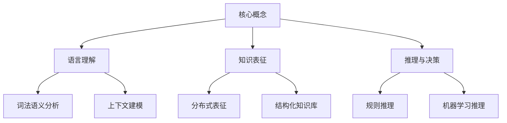
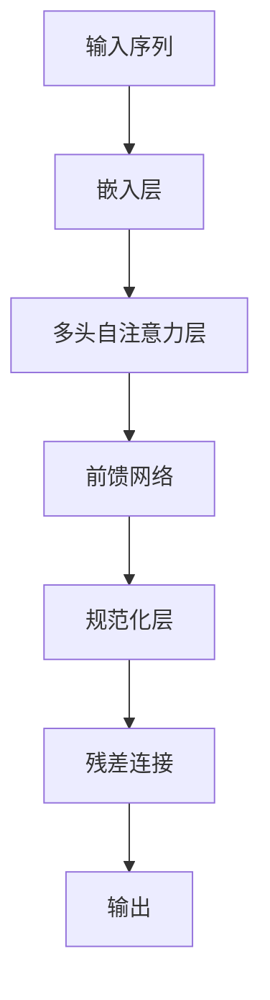

好的,我会严格遵循约束条件,以专业的技术语言写一篇深入探讨大语言模型思考能力的博客文章。

# 大语言模型应用指南:关于大语言模型的思考能力

## 1. 背景介绍

### 1.1 问题的由来

近年来,自然语言处理(NLP)领域取得了长足的进步,很大程度上归功于大型语言模型(Large Language Models,LLMs)的兴起。这些模型通过在大规模语料库上进行预训练,学习了丰富的语言知识和上下文信息,展现出惊人的文本生成、理解和推理能力。

然而,随着模型规模和复杂性不断增加,人们开始质疑这些模型是否真正"理解"语言,以及它们的思考能力有多深。毕竟,即使是最先进的LLM,其内部机制仍然是一个高度复杂的黑箱,我们很难解释它们是如何产生看似"智能"的输出的。

### 1.2 研究现状  

对于大语言模型的思考能力,目前存在着两种主要观点:

1. **表象论观点**: 认为LLM只是在模拟人类语言,并没有真正的理解和思考能力。它们只是通过统计模式匹配和关联,生成看似合理的输出,但缺乏深层次的推理和认知过程。

2. **认知论观点**: 主张LLM确实具备一定程度的思考和理解能力。虽然它们的思维方式与人类不同,但通过学习大量数据,模型内部形成了某种程度的"知识表征",能够进行复杂的语义推理和概念建模。

### 1.3 研究意义

探索大语言模型的思考能力,不仅有助于我们更好地理解这一新兴技术的本质,还对于指导模型的设计、训练和应用具有重要意义。如果LLM确实具备一定的认知和推理能力,那么我们就可以期望它们在更多复杂任务中发挥作用,如决策支持、智能辅助等。反之,如果它们只是在模拟语言表象,那就需要更加审慎地评估它们的局限性,防止过度依赖和滥用。

### 1.4 本文结构

本文将从多个角度深入探讨大语言模型的思考能力问题。我们将首先介绍相关的核心概念和理论基础,然后分析模型内部的算法原理和数学模型,并通过实际案例说明其思考过程。接下来,我们将探讨LLM在实际应用中的表现,以及未来的发展趋势和挑战。最后,我们将总结研究成果,并对常见问题给出解答。

## 2. 核心概念与联系

探讨大语言模型的思考能力,需要理解以下几个核心概念及其相互关系:

1. **语言理解**:指模型对自然语言的理解能力,包括词法语义分析和上下文建模等方面。这是思考能力的基础。

2. **知识表征**:指模型内部对现实世界知识的表征方式,可以是分布式表征(如词向量)或结构化知识库。知识表征决定了模型的思考深度。

3. **推理与决策**:指模型进行逻辑推理和决策的能力,可以基于规则系统或机器学习方法。这体现了模型的高级认知能力。

上述三个方面相互影响、相辅相成。语言理解为知识表征和推理奠定基础;知识表征决定了推理的质量;而推理反过来也会促进语言理解和知识获取的能力。只有三者协同发展,大语言模型才能展现出真正的"思考"能力。

## 3. 核心算法原理与具体操作步骤

### 3.1 算法原理概述

大语言模型的核心算法通常基于**自注意力机制(Self-Attention)**和**转换器(Transformer)**架构。自注意力机制允许模型捕捉输入序列中任意距离的依赖关系,而转换器则通过多层自注意力和前馈神经网络,对输入进行编码和解码。

该算法的关键在于,通过在大规模语料库上的预训练,模型可以自主学习语言的统计规律和语义关联,形成内部的"知识表征"。在下游任务中,只需要对预训练的模型进行少量的微调(fine-tuning),即可完成各种语言理解和生成任务。

上图展示了转换器模型的基本结构。输入序列首先经过嵌入层,将词元映射为向量表示。然后是多个编码器层,每层包含多头自注意力机制和前馈网络,通过残差连接和层归一化来整合信息。最终,模型输出一个上下文化的序列表示,可用于各种下游任务。

### 3.2 算法步骤详解

1. **嵌入层**:将输入的词元(如单词或子词)映射为对应的向量表示,即嵌入向量。这一步通过查询嵌入矩阵实现。

2. **多头自注意力**:对输入序列中的每个位置,计算其与所有位置的关联权重,并将加权求和作为该位置的新表示。通过多个"注意力头"来捕捉不同的关系模式。

   - 计算查询(Query)、键(Key)和值(Value)向量
   - 计算注意力权重:$\text{Attention}(Q, K, V) = \text{softmax}(\frac{QK^T}{\sqrt{d_k}})V$
   - 对多头注意力的结果进行拼接

3. **前馈网络**:对自注意力的输出进行进一步的非线性变换,产生新的表示向量。

4. **残差连接与层归一化**:将上一层的输入与当前层的输出相加,并进行归一化,以缓解梯度消失问题。

5. **编码器层堆叠**:重复上述步骤,构建多层编码器,每层输出都作为下一层的输入。

6. **掩码机制**:在预训练阶段,通过掩码部分输入,促使模型学习上下文推理能力。

7. **微调**:在下游任务上,对预训练模型的部分参数进行微调,使其适应特定任务。

通过上述步骤,大语言模型可以从大规模语料中学习语义和上下文知识,形成内部的"知识表征",并在下游任务中展现出强大的理解、生成和推理能力。

### 3.3 算法优缺点

**优点**:

- 通用性强,可应用于多种自然语言处理任务
- 无需手工设计特征,可自主学习语言知识
- 利用大规模语料,捕捉丰富的语义和上下文信息
- 编码解码过程高度并行化,计算效率较高

**缺点**:

- 训练代价昂贵,需要大量计算资源和数据
- 存在观察难以解释的"奇怪"行为
- 对长距离依赖关系的建模能力有限
- 缺乏对因果关系和物理常识的建模
- 存在安全隐患,如生成有害或虚假内容

### 3.4 算法应用领域

大语言模型及其变体已广泛应用于自然语言处理的各个领域,包括但不限于:

- 机器翻译
- 文本摘要
- 问答系统
- 情感分析
- 代码生成
- 对话系统
- 写作辅助
- 知识图谱构建
- 决策支持系统

## 4. 数学模型和公式详细讲解与举例说明

### 4.1 数学模型构建

大语言模型的数学基础主要来自于**概率图模型**和**神经网络**。我们可以将语言序列$X=\{x_1,x_2,...,x_n\}$看作是一个马尔可夫随机场,其联合概率分布为:

$$P(X) = \prod_{i=1}^n P(x_i|x_1,...,x_{i-1})$$

我们的目标是学习一个模型$\theta$,使得$P_\theta(X)$尽可能接近真实的数据分布。传统的n-gram语言模型由于马尔可夫假设的限制,只能捕捉有限的上下文信息。而神经网络语言模型则通过参数共享的方式,对任意长度的上下文进行建模:

$$P_\theta(x_i|x_1,...,x_{i-1}) = \text{Neural}(x_1,...,x_{i-1};\theta)$$

其中$\text{Neural}(\cdot)$表示一个神经网络模型,如RNN或Transformer,将历史词元$x_1,...,x_{i-1}$映射为当前词元$x_i$的概率分布。

在训练过程中,我们最小化模型在训练语料$\mathcal{D}$上的负对数似然损失:

$$\mathcal{L}(\theta) = -\frac{1}{|\mathcal{D}|}\sum_{X\in\mathcal{D}}\log P_\theta(X)$$

通过梯度下降等优化算法,迭代更新模型参数$\theta$,使损失函数最小化。训练完成后,模型可用于各种语言生成任务。

### 4.2 公式推导过程

我们以**自注意力机制**为例,推导其数学表达式。自注意力的目标是计算一个加权和,对输入序列中的每个位置,权重来自于该位置与所有位置的相关性打分。

首先,我们将输入$X$映射为三个向量组:查询(Query)向量$Q$、键(Key)向量$K$和值(Value)向量$V$,通过线性投影实现:

$$\begin{aligned}
Q &= XW_Q \\
K &= XW_K \\
V &= XW_V
\end{aligned}$$

其中,$W_Q,W_K,W_V$是可学习的投影矩阵。

接下来,计算查询$Q$与所有键$K$的点积,得到相关性分数矩阵$S$:

$$S = QK^T$$

为了获得更稳定的梯度,我们会对分数矩阵进行缩放:

$$S' = \frac{S}{\sqrt{d_k}}$$

其中$d_k$是键向量的维度。

然后,通过softmax函数将分数矩阵转化为概率分布,得到注意力权重矩阵$A$:

$$A = \text{softmax}(S')$$

最后,将注意力权重与值向量$V$相乘,得到加权和表示:

$$\text{Attention}(Q,K,V) = AV$$

上述过程可以并行计算,是自注意力机制的核心数学表达式。通过多头注意力(multi-head attention),模型可以从不同的子空间捕捉不同的关系模式,进一步提高表示能力。

### 4.3 案例分析与讲解  

我们通过一个例子,直观地解释自注意力机制是如何工作的。假设输入序列为"The dog chased the cat"。

1. 嵌入层将每个词元映射为向量,如"The"映射为$\begin{bmatrix}0.1&-0.2&0.3\end{bmatrix}$。

2. 计算查询$Q$、键$K$和值$V$矩阵,每个位置对应一个查询向量$q_i$、键向量$k_i$和值向量$v_i$。

3. 对每个查询向量$q_i$,计算其与所有键向量的相关性分数:
   $$\begin{bmatrix}
   q_i \cdot k_1 & q_i \cdot k_2 & \cdots & q_i \cdot k_n
   \end{bmatrix}$$

4. 通过softmax函数,将相关性分数转换为概率分布,得到注意力权重向量$\alpha_i$。

5. 将注意力权重向量$\alpha_i$与值向量$V$相乘,得到加权和表示$o_i$:
   $$o_i = \sum_{j=1}^n \alpha_{ij}v_j$$

直观上,注意力机制允许模型在生成某个词元的表示时,关注到整个输入序列中的不同位置,