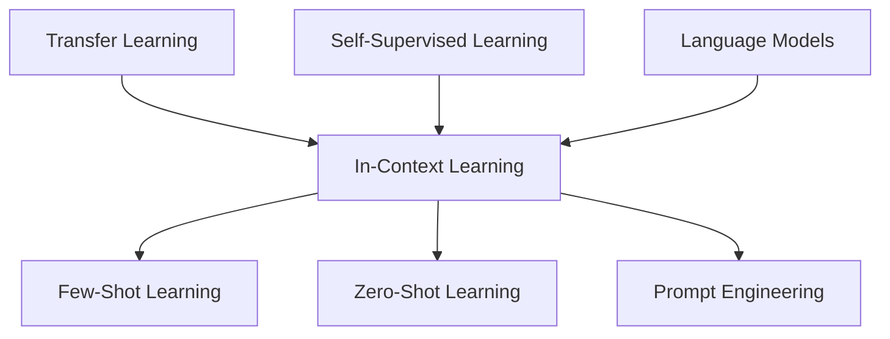

# 大语言模型的in-context学习原理与代码实例讲解

## 1. 背景介绍

### 1.1 问题的由来

随着人工智能技术的不断发展,大型语言模型(Large Language Models, LLMs)已经成为自然语言处理领域的关键技术之一。传统的语言模型通常采用监督学习的方式,需要大量标注数据集进行训练,但标注数据的获取成本高昂且效率低下。相比之下,LLMs采用自监督学习的方式,利用大量未标注的文本数据进行预训练,从而获得丰富的语言知识和上下文理解能力。

然而,LLMs在实际应用中仍然面临一些挑战。其中一个重要问题是如何利用少量的任务相关数据,快速调整预训练模型以适应特定任务,这就引出了in-context学习(In-Context Learning, ICL)的概念。

### 1.2 研究现状

In-context学习是一种新兴的少样本学习范式,旨在通过向预训练模型提供少量任务相关的示例,使模型能够快速适应新任务。与传统的微调(fine-tuning)方法不同,ICL不需要对模型进行梯度更新,而是利用预训练模型本身的生成能力,通过提示(prompt)的方式将任务相关信息注入模型。

目前,ICL在自然语言处理领域已经取得了一些进展,如GPT-3等大型语言模型就展现出了强大的in-context学习能力。但是,ICL的理论基础和机制仍然存在许多未解之谜,如何设计高效的提示策略、如何量化和评估in-context学习能力等问题都有待进一步探索。

### 1.3 研究意义

深入研究in-context学习的原理和方法,对于充分发挥LLMs的潜力、提高自然语言处理系统的泛化能力和可解释性具有重要意义。通过揭示ICL的内在机制,我们可以更好地理解LLMs的工作原理,并设计出更加高效和可靠的提示策略。同时,ICL也为少样本学习和零样本学习提供了新的思路和方法,有助于推动人工智能技术在各个领域的应用。

### 1.4 本文结构

本文将全面介绍in-context学习的理论基础、核心算法原理、数学模型以及实际应用。具体来说,第2节将阐述in-context学习的核心概念和与其他学习范式的联系;第3节将详细讲解in-context学习的核心算法原理和具体操作步骤;第4节将构建数学模型并推导相关公式,并通过案例分析加深理解;第5节将提供代码实例并进行详细解释;第6节将介绍in-context学习在实际应用中的场景;第7节将推荐相关工具和学习资源;第8节将总结研究成果并展望未来发展趋势和挑战;最后,第9节将列出常见问题并给出解答。

## 2. 核心概念与联系

In-context学习(In-Context Learning, ICL)是一种新兴的少样本学习范式,旨在通过向预训练模型提供少量任务相关的示例,使模型能够快速适应新任务。ICL与其他一些相关概念有着密切联系:

1. **Few-Shot Learning**:少样本学习旨在利用少量标注数据对模型进行训练或调整,使其能够泛化到新的任务或数据上。ICL可以看作是一种特殊的少样本学习方法,通过提示的形式将任务相关信息注入预训练模型,从而实现快速适应。

2. **Zero-Shot Learning**:零样本学习旨在让模型在没有任何任务相关数据的情况下,就能够完成新任务。ICL可以看作是一种介于少样本学习和零样本学习之间的范式,通过提供少量示例来引导模型理解任务,从而提高零样本学习的性能。

3. **Prompt Engineering**:提示工程是指设计高效的提示策略,以最大限度地利用预训练模型的知识和能力。ICL与提示工程密切相关,因为提示的设计直接影响了模型的in-context学习能力。

4. **Transfer Learning**:迁移学习旨在利用在源域学习到的知识,帮助模型在目标域上获得更好的性能。ICL可以看作是一种特殊的迁移学习方法,通过提示将任务相关信息注入预训练模型,实现了知识的迁移和快速适应。

5. **Self-Supervised Learning**:自监督学习是指利用大量未标注数据进行预训练,获得通用的表示能力。大型语言模型通常采用自监督学习的方式进行预训练,为in-context学习奠定了基础。

6. **Language Models**:语言模型是自然语言处理领域的核心技术,旨在捕捉语言的统计规律。大型语言模型由于其强大的生成能力和上下文理解能力,为in-context学习提供了有力支持。

总的来说,in-context学习融合了少样本学习、零样本学习、提示工程、迁移学习、自监督学习和语言模型等多个概念,是一种新颖且具有广阔前景的学习范式。

## 3. 核心算法原理与具体操作步骤

### 3.1 算法原理概述

In-context学习的核心思想是利用预训练模型本身的生成能力,通过提示的方式将任务相关信息注入模型,从而使模型能够快速适应新任务。具体来说,ICL的算法原理可以概括为以下三个关键步骤:

1. **构建提示(Prompt Construction)**:首先,需要设计一个合适的提示,将任务相关的示例和指令编码成模型可以理解的格式。提示的设计直接影响了模型的in-context学习能力,因此需要采用有效的提示工程技术。

2. **上下文注入(Context Injection)**:将构建好的提示输入到预训练模型中,模型会根据提示中的示例和指令,自动捕获任务相关的上下文信息,从而理解任务的要求。

3. **生成输出(Output Generation)**:模型利用捕获到的上下文信息,结合自身的语言生成能力,输出符合任务要求的结果。这一步骤实现了模型对新任务的快速适应和泛化。

### 3.2 算法步骤详解

下面我们将详细介绍in-context学习算法的具体步骤:

1. **数据准备**:首先需要准备一些任务相关的示例数据,这些数据将作为提示的一部分。示例数据应该能够反映任务的本质,并且数量应该适中(通常为几个到几十个)。

2. **提示模板设计**:设计一个合适的提示模板,用于将示例数据和任务指令编码成模型可以理解的格式。提示模板的设计需要考虑多个因素,如语义一致性、任务复杂度、上下文长度等。

3. **提示构建**:根据提示模板,将示例数据和任务指令组合成完整的提示。这一步骤需要注意示例与指令的排列顺序、分隔符的使用等细节,以确保提示的有效性。

4. **模型选择**:选择一个合适的预训练语言模型,如GPT-3、BERT等。不同的模型在in-context学习能力上可能存在差异,需要根据具体任务和资源约束进行选择。

5. **上下文注入**:将构建好的提示输入到预训练模型中,模型会自动捕获提示中蕴含的任务相关上下文信息。

6. **生成输出**:模型利用捕获到的上下文信息,结合自身的语言生成能力,输出符合任务要求的结果。

7. **结果评估**:对模型生成的输出进行评估,判断是否满足任务要求。如果结果不理想,可以尝试调整提示或选择不同的模型。

8. **迭代优化**:根据评估结果,对提示模板、示例数据、模型选择等进行迭代优化,不断提高in-context学习的效果。

### 3.3 算法优缺点

In-context学习算法相对于传统的微调(fine-tuning)方法,具有以下优势:

1. **高效性**:ICL不需要对模型进行梯度更新,只需要构建合适的提示即可实现快速适应,从而大大提高了效率。

2. **灵活性**:ICL可以快速切换任务,只需要更改提示即可,而无需重新训练模型,具有很强的灵活性。

3. **可解释性**:ICL通过提示的方式将任务相关信息注入模型,使得模型的决策过程更加可解释。

4. **数据效率**:ICL只需要少量示例数据,就能够实现较好的泛化能力,具有较高的数据效率。

然而,ICL算法也存在一些缺陷和挑战:

1. **提示设计困难**:设计高效的提示策略是一个挑战,需要结合具体任务和领域知识进行探索。

2. **上下文长度限制**:由于模型的计算能力限制,提示的长度通常受到一定限制,可能影响模型捕获上下文信息的能力。

3. **任务复杂度限制**:对于一些复杂的任务,单纯依赖提示可能无法获得理想的性能,需要与其他方法(如微调)结合使用。

4. **评估标准缺乏**:目前还缺乏统一的评估标准和基准测试,难以对不同模型和提示策略的in-context学习能力进行公平比较。

### 3.4 算法应用领域

In-context学习算法由于其高效性和灵活性,在自然语言处理领域具有广泛的应用前景:

1. **文本生成**:利用ICL可以快速构建各种文本生成模型,如新闻摘要、故事创作、对话系统等。

2. **文本分类**:通过设计合适的提示,ICL可以实现各种文本分类任务,如情感分析、主题识别、垃圾邮件过滤等。

3. **问答系统**:ICL可以用于构建各种问答系统,如常见问题解答、知识问答、对话式问答等。

4. **机器翻译**:利用ICL可以快速适应不同语言对的翻译任务,提高机器翻译系统的性能和灵活性。

5. **数据增强**:ICL可以用于生成合成数据,为其他任务(如分类、检测等)提供额外的训练数据,从而提高模型的泛化能力。

6. **零样本学习**:ICL为零样本学习提供了新的思路和方法,可以用于构建各种零样本学习系统。

除了自然语言处理领域,ICL也有望在其他领域发挥作用,如计算机视觉、推荐系统、知识图谱等,为人工智能技术的发展带来新的机遇。

## 4. 数学模型和公式详细讲解举例说明

### 4.1 数学模型构建

为了更好地理解和量化in-context学习的过程,我们可以构建一个简化的数学模型。假设我们有一个预训练语言模型 $M$,其参数为 $\theta$,输入为 $x$,输出为 $y$。我们的目标是通过提供少量示例 $\mathcal{D} = \{(x_i, y_i)\}_{i=1}^N$,使得模型能够学习到任务相关的知识,从而在新的输入 $x^*$ 上生成正确的输出 $y^*$。

我们可以将in-context学习过程建模为一个条件概率分布:

$$P(y^* | x^*, \mathcal{D}, M_\theta)$$

其中,我们希望最大化该条件概率,即找到最可能的输出 $y^*$。根据贝叶斯公式,我们可以将其分解为:

$$P(y^* | x^*, \mathcal{D}, M_\theta) = \frac{P(x^*, y^* | \mathcal{D}, M_\theta)}{P(x^* | \mathcal{D}, M_\theta)}$$

由于分母 $P(x^* | \mathcal{D}, M_\theta)$ 对于给定的输入 $x^*$ 是常数,因此我们只需要最大化分子 $P(x^*, y^* | \mathcal{D}, M_\theta)$。

进一步地,我们可以假设预训练模型 $