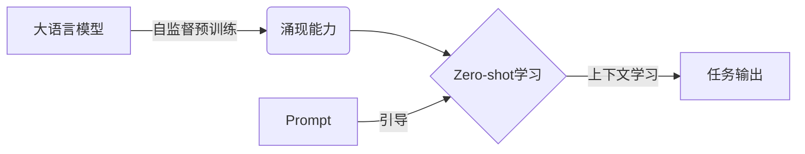

# 大语言模型的zero-shot学习原理与代码实例讲解

## 1. 背景介绍
### 1.1 问题的由来
近年来,随着人工智能技术的飞速发展,大语言模型(Large Language Models, LLMs)在自然语言处理(Natural Language Processing, NLP)领域取得了突破性的进展。这些模型通过在海量文本数据上进行预训练,能够学习到丰富的语言知识和常识,在多种NLP任务上展现出了强大的性能,如机器翻译、文本摘要、问答系统等。然而,传统的监督学习范式要求模型在特定任务上使用标注数据进行微调(fine-tuning),这限制了模型的泛化能力和实际应用价值。为了突破这一瓶颈,zero-shot学习(zero-shot learning)应运而生,旨在让模型无需训练即可应对全新的任务,大大拓展了语言模型的应用场景。

### 1.2 研究现状 
目前,zero-shot学习已经成为大语言模型领域的研究热点。GPT-3、PaLM、FLAN等代表性模型相继问世,在标准数据集上取得了优异的zero-shot性能,甚至在某些任务上超越了人类水平。学术界对zero-shot学习的内在机制和影响因素展开了深入探索,提出了prompt engineering、instruction tuning等一系列优化方法。业界也开始将zero-shot技术应用到智能客服、内容生成、代码开发等实际场景中,极大地提升了语言模型的实用价值。

### 1.3 研究意义
Zero-shot学习代表了语言模型的新发展方向,对学术研究和工业应用都具有重要意义:

1. 拓展模型能力:zero-shot学习让模型具备了应对未知任务的能力,大大拓展了其适用范围,为通用人工智能迈出了关键一步。  

2. 降低应用成本:zero-shot消除了针对每个任务收集标注数据的巨大开销,使得语言模型的实际部署更加高效和经济。

3. 促进技术创新:zero-shot为NLP领域带来了新的研究视角和思路,有望催生出更多突破性的算法和模型。

4. 推动产业升级:zero-shot使得语言模型能够快速适配各行各业的应用需求,为人工智能赋能传统产业提供了新的途径。

### 1.4 本文结构
本文将全面阐述大语言模型zero-shot学习的原理和实践。第2部分介绍相关的核心概念;第3部分详细讲解zero-shot的算法原理和关键步骤;第4部分建立数学模型并推导核心公式;第5部分给出代码实例和详尽的注释说明;第6部分讨论zero-shot在实际场景中的应用;第7部分推荐相关的学习资源和开发工具;第8部分总结全文并展望未来;第9部分列举常见问题解答。

## 2. 核心概念与联系
要理解大语言模型的zero-shot学习,首先需要明确以下核心概念:

- 大语言模型(Large Language Models):指参数量巨大(一般在数十亿到上万亿)的语言模型,通过自监督学习从海量无标注文本语料中学习通用语言知识,代表模型有BERT、GPT、T5等。

- Zero-shot学习:又称零样本学习,指让模型在不经过特定任务训练的情况下,直接应用到新任务中,即"一次学习,到处使用"。与few-shot学习、supervised fine-tuning相对。

- Prompt(提示):指输入给语言模型的上下文信息,引导模型进行特定任务。自然语言prompt可以是问题、指令、示例等形式,编程语言prompt可以是函数名、注释、代码片段等。设计优质的prompt是实现zero-shot的关键。

- In-context learning(上下文学习):指语言模型通过阅读输入的prompt中蕴含的任务信息,在无监督情况下产生与任务相关的输出。它是zero-shot的核心机制。

- Emergent abilities(涌现能力):指语言模型通过自监督预训练获得的一些超出预期的高阶技能,如数学运算、常识推理、代码生成等。这些能力使zero-shot成为可能。

下图展示了这些概念之间的关系:



可以看出,大语言模型通过自监督预训练获得了涌现能力,使其具备了zero-shot学习的潜力;当输入恰当的prompt时,模型可以通过上下文学习,在无需训练的情况下生成与任务相关的输出。理解了这些概念的内涵和联系,就可以进一步探讨zero-shot的算法原理了。

## 3. 核心算法原理 & 具体操作步骤
### 3.1 算法原理概述
大语言模型的zero-shot学习本质上是一种基于prompt的上下文学习过程。其核心思想是:将任务相关信息编码为自然语言prompt,输入给预训练好的语言模型,引导其在上下文中进行任务推理和生成。这个过程不需要针对特定任务的训练数据和参数更新,而是充分利用了模型在预训练阶段习得的通用语言知识。

形式化地,可以将zero-shot过程表示为:

$$y=\arg\max_y P(y|x,p_\tau;\theta)$$

其中$x$表示任务输入,$y$表示任务输出,$p_\tau$表示任务描述prompt,$\theta$表示预训练语言模型的参数。zero-shot的目标是找到在给定输入和prompt的情况下,条件概率$P(y|x,p_\tau;\theta)$最大的输出$y$。这个概率由语言模型的参数$\theta$决定,而$\theta$是通过自监督预训练学习到的,与具体任务无关。

### 3.2 算法步骤详解
基于上述原理,大语言模型zero-shot学习的主要步骤如下:

1. 任务定义:明确待执行的任务类型和输入输出格式,如分类、生成、问答等。

2. Prompt构建:将任务目标转化为自然语言描述,并设计输入输出示例,形成完整的prompt。prompt要遵循语言模型的输入格式,并体现任务的关键信息。例如:
   
   ```
   任务:情感分类
   Prompt:
   请判断以下文本的情感倾向(积极/消极):
   文本:"这部电影太棒了,我强烈推荐大家去看。"
   情感:
   ```

3. 模型推理:将prompt作为输入,喂给预训练的语言模型,让其基于上下文进行任务推理,生成相应的输出。以上例为例,模型输出可能是:
   
   ```
   积极
   ```

4. 结果解析:将模型输出解析为任务要求的格式,如提取标签、数值等。必要时还需要对输出进行后处理,如过滤、纠错等。

5. 评估优化:在开发集或测试集上评估模型的zero-shot性能,分析错误样例,并据此优化prompt的设计。常见的优化手段有:
   - 改进示例的选择和排列
   - 调整描述的措辞和语气
   - 增加辅助说明和约束条件
   - 引入少量训练样本(few-shot)

通过迭代执行以上步骤,可以不断提升语言模型在特定任务上的zero-shot表现,实现"一次学习,多次应用"的目标。

### 3.3 算法优缺点
Zero-shot学习相比传统的监督学习范式,主要有以下优点:

- 节约成本:不需要耗时费力地标注大量训练数据,显著降低了任务开发成本。
- 提高效率:可以快速适配和执行新任务,大大缩短了任务上线时间。
- 扩展能力:使语言模型具备了泛化和迁移的能力,拓宽了其应用领域。

同时,zero-shot也存在一些局限性:

- 依赖prompt:任务表现很大程度上取决于prompt设计的好坏,需要专业人士的领域知识和经验。
- 不确定性:推理结果具有一定的随机性和不可控性,在高风险任务中使用需谨慎。 
- 数据偏差:语言模型从网络文本中习得的知识可能存在偏差和错误,影响任务客观性。
- 资源消耗:执行推理需要大量的算力和内存,对计算资源提出了很高要求。

因此,在实践中需要根据具体任务的特点和要求,权衡zero-shot的利弊,必要时结合少量监督数据进行改进。

### 3.4 算法应用领域
得益于其灵活性和通用性,大语言模型的zero-shot学习在以下领域得到了广泛应用:

- 智能问答:通过prompt引导,语言模型可以根据海量知识对用户问题进行解答,实现高效的知识服务。如Alexa、Siri等智能助手。

- 内容生成:zero-shot可以根据用户输入的主题、关键词、体裁等要求,自动生成相关的文本内容,如新闻、评论、脚本等。如GPT-3的写作助手应用。

- 信息抽取:通过设计合适的prompt,语言模型可以从非结构化文本中抽取结构化信息,如实体、关系、事件等。如从新闻中提取关键事实。

- 代码开发:将编程任务描述为自然语言prompt,语言模型可以根据需求自动生成对应的代码片段,提高开发效率。如GitHub Copilot等AI编程助手。

- 多语言处理:利用多语言预训练模型的zero-shot能力,可以实现机器翻译、跨语言文本分类等任务,无需平行语料。如mBART、XLM等模型。

除了上述典型应用,zero-shot在智能教育、医疗健康、金融投资等领域也有广阔的应用前景。随着大语言模型的不断发展,zero-shot必将成为人工智能落地的重要途径。

## 4. 数学模型和公式 & 详细讲解 & 举例说明
### 4.1 数学模型构建
大语言模型的zero-shot学习可以用概率图模型来形式化描述。假设$X$表示任务的输入空间,$Y$表示输出空间,$T$表示任务的描述空间,$D_\tau=\{(x_i,y_i)\}_{i=1}^N$表示任务$\tau$的示例数据集。语言模型的参数为$\theta$,服从先验分布$p(\theta)$。zero-shot的目标是学习一个条件概率分布$P(Y|X,T;\theta)$,使得对于任意新任务$\tau' \notin T$,模型能够根据其描述$t'$和输入$x'$,预测正确的输出$y'$。

用贝叶斯公式可以将条件概率$P(Y|X,T;\theta)$分解为:

$$P(Y|X,T;\theta) = \frac{P(X,Y,T|\theta)}{P(X,T|\theta)} = \frac{P(Y|X,T,\theta)P(X,T|\theta)}{\sum_{Y}P(Y|X,T,\theta)P(X,T|\theta)}$$

其中$P(Y|X,T,\theta)$表示语言模型在给定参数$\theta$下,根据输入$X$和任务描述$T$生成输出$Y$的概率。$P(X,T|\theta)$表示输入$X$和任务描述$T$的联合概率。由于分母$P(X,T|\theta)$与$Y$无关,因此零样本学习的优化目标可以简化为:

$$\arg\max_{\theta} P(Y|X,T,\theta)P(X,T|\theta)$$

即最大化语言模型在给定输入和任务描述下,生成正确输出的概率。这个概率可以通过语言模型的预训练对数似然函数来近似:

$$\log P(Y|X,T,\theta) \approx \sum_{i=1}^{|Y|} \log P(y_i|y_{<i},X,T,\theta)$$

其中$y_i$表示输出序列$Y$的第$i$个token,$y_{<i}$表示$y_i$之前的所有token。这个近似把生成输出序列的概率分解为生成每个token的条件概率之积,与语言模型的因式分解形式一致。

### 4.2 公式推导过程
为了优化上述目标函数,需要对语言模型的参数$\theta$进行估计。传统的有监督学习通过最大