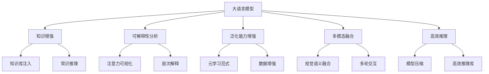

以下是《大语言模型进阶原理与代码实战案例讲解》一文的正文内容：

# 大语言模型进阶原理与代码实战案例讲解

## 1. 背景介绍

### 1.1 问题的由来

在过去的几年里,自然语言处理(NLP)领域取得了长足的进步,很大程度上归功于大型预训练语言模型(Large Pre-trained Language Models,PLMs)的兴起。这些模型通过在大规模文本语料库上进行自监督预训练,学习到了丰富的语义和语法知识,为下游NLP任务提供了强大的语义表示能力。

然而,尽管取得了巨大成功,现有的PLMs在实际应用中仍然面临诸多挑战,例如:

1. **可解释性不足**: 大型语言模型通常是黑盒模型,缺乏对其内部工作机制的透明度和可解释性。这不利于模型的可靠性和可信赖性。

2. **知识一致性差**: 模型学习到的知识存在矛盾和不一致的情况,且缺乏对知识的主动推理和迁移能力。

3. **泛化能力有限**: 模型在看似简单但实际上需要复杂推理的情况下,泛化能力较差。

4. **对话交互能力弱**: 现有模型难以支持高质量的多轮交互式对话。

5. **效率和可扩展性问题**: 大型模型在推理时的计算效率和内存占用较高,不利于部署和扩展。

为了解决这些问题,研究人员提出了诸多改进大语言模型的新方法,本文将围绕这些方法展开深入探讨。

### 1.2 研究现状

近年来,改进大语言模型的研究主要集中在以下几个方面:

1. **注入结构化知识和常识推理能力**
2. **提高模型的可解释性和可信赖性**  
3. **增强模型的泛化能力**
4. **支持多模态输入和多轮交互**
5. **提高模型的计算效率和可扩展性**

具体的研究方法包括:知识增强预训练、因果推理建模、注意力可解释性分析、元学习范式、高效参数压缩、多模态融合等。本文将对这些方法的原理、实现和效果进行全面的阐述和分析。

### 1.3 研究意义

改进大语言模型的研究,有助于解决现有模型面临的诸多挑战,提升其性能表现。具体来说,其意义主要体现在:

1. **提高语言模型的可解释性和可信赖性**,增强人工智能系统的透明度和可控性。
2. **增强模型的泛化能力和常识推理能力**,使其能够更好地处理复杂的语义推理任务。
3. **支持多模态输入和交互式对话**,拓展语言模型在多媒体和人机交互领域的应用前景。  
4. **提高模型的计算效率和可扩展性**,降低部署和推理的成本,推动大模型在实际场景的落地应用。

总的来说,这一研究方向对于构建更加智能、可靠和高效的人工智能系统,具有重要的理论意义和应用价值。

### 1.4 本文结构

本文将按照以下结构展开论述:

1. 背景介绍
2. 核心概念与联系
3. 核心算法原理与具体操作步骤
4. 数学模型和公式详细讲解与举例
5. 项目实践:代码实例和详细解释
6. 实际应用场景
7. 工具和资源推荐
8. 总结:未来发展趋势与挑战
9. 附录:常见问题与解答

其中,第3-5节将重点介绍改进大语言模型的核心算法、模型和实现方法。第6节将列举该领域的实际应用案例。第7节推荐相关的学习资源和开发工具。最后总结该领域的发展趋势、面临的挑战及未来展望。

## 2. 核心概念与联系

在深入探讨改进大语言模型的具体方法之前,我们先介绍几个核心概念及它们之间的关联。

1. **大语言模型(Large Language Models, LLMs)**: 指通过在大规模文本语料库上进行自监督预训练而获得的大型神经网络模型,如BERT、GPT、T5等。这是本文研究的核心对象。

2. **知识增强(Knowledge Enhancement)**: 通过注入结构化知识或增强常识推理能力,提高LLMs对知识的理解和推理能力。主要方法包括知识库注入和常识推理建模。

3. **可解释性分析(Interpretability Analysis)**: 探索LLMs内部的注意力机制,提高模型的可解释性和可信赖性。常用方法有注意力可视化和层次化模型解释等。

4. **泛化能力增强(Generalization Enhancement)**: 通过元学习范式、数据增强等技术,增强LLMs在看似简单但实际需要复杂推理的情况下的泛化能力。

5. **多模态融合(Multimodal Fusion)**: 使LLMs能够同时处理文本、图像、视频等多种模态输入,并支持多轮交互式对话等任务。涉及视觉语义融合和多轮交互建模等技术。

6. **高效推理(Efficient Inference)**: 通过模型压缩、优化推理库等手段,提高LLMs在推理阶段的计算效率和内存占用,促进大模型的实际部署和应用。

上述各个概念相互关联、环环相扣,共同推动着大语言模型的持续进化和完善。接下来,我们将对其中的核心算法原理和实现方法进行详细阐述。

## 3. 核心算法原理与具体操作步骤

### 3.1 算法原理概述

改进大语言模型的核心算法主要包括以下几类:

1. **知识增强算法**: 通过知识库注入、常识推理建模等方法,赋予LLMs结构化知识和常识推理能力。

2. **可解释性分析算法**: 借助注意力可视化、层次化模型解释等技术,提高LLMs的可解释性和可信赖性。

3. **泛化能力增强算法**: 采用元学习范式、数据增强等策略,增强LLMs在看似简单但实际需要复杂推理的情况下的泛化能力。

4. **多模态融合算法**: 将视觉语义融合、多轮交互建模等技术引入LLMs,实现对多模态输入和多轮交互的支持。

5. **高效推理算法**: 通过模型压缩、优化推理库等手段,降低LLMs在推理阶段的计算开销和内存占用。

这些算法的核心思想是在保留LLMs强大的语义表示能力的同时,针对性地解决其存在的可解释性、知识一致性、泛化能力、多模态支持和计算效率等方面的挑战。下面将对这些算法的具体原理和实现步骤进行逐一介绍。

### 3.2 算法步骤详解

#### 3.2.1 知识增强算法

**1) 知识库注入**

知识库注入的目标是将结构化的知识库信息注入到LLMs中,使其能够获取和利用这些知识进行推理。主要步骤包括:

1. 构建结构化知识库
2. 设计知识表示方法
3. 在预训练阶段注入知识
4. 在微调阶段融合知识

其中,第1步需要从各种来源(如维基百科、知识图谱等)收集并构建结构化知识库。第2步设计合理的知识表示方式,如知识嵌入向量、知识triplet等。第3步在LLMs的预训练过程中注入知识表示。第4步在针对特定任务进行微调时,融合相关知识进行联合学习。

**2) 常识推理建模**

常识推理建模旨在赋予LLMs常识推理的能力,使其能够更好地理解和推理日常生活中的常识性知识。主要步骤包括:

1. 构建常识推理数据集
2. 设计常识推理模型
3. 在预训练阶段学习常识
4. 在微调阶段融合常识推理

首先需要构建覆盖各种常识的大规模数据集,如物理常识、社会常识等。然后设计能够学习常识推理能力的模型结构,例如引入外部常识记忆模块、注意力路径等。在预训练阶段让LLMs学习这些常识知识,并在微调阶段将常识推理能力融入到特定任务中。

#### 3.2.2 可解释性分析算法

**1) 注意力可视化**

注意力可视化技术通过可视化LLMs中的注意力分布,帮助理解模型内部的注意力机制,提高模型的可解释性。主要步骤包括:

1. 提取注意力分数矩阵
2. 设计可视化策略
3. 生成注意力可视化图
4. 分析注意力模式

在模型推理时,提取每一层注意力头的注意力分数矩阵。然后设计合理的可视化策略,如热力图、注意力流图等。根据策略生成注意力可视化图,并结合输入和输出,分析注意力模式以理解模型内部机制。

**2) 层次化模型解释**

层次化模型解释技术旨在从多个层次上解释LLMs的内部工作原理,包括词级、句级和语义级别的解释,以提高模型的可解释性和可信赖性。主要步骤包括:

1. 提取词级和句级特征
2. 构建语义级别解释
3. 层次化组合多级解释
4. 生成可视化解释报告

首先提取词级特征(如词嵌入)和句级特征(如句子表示)。然后基于这些底层特征,构建更高级别的语义解释,如主题提取、情感分析等。接下来将不同层次的解释进行层次化组合,最终生成完整的、多层次的可视化模型解释报告。

#### 3.2.3 泛化能力增强算法  

**1) 元学习范式**

元学习范式旨在提高LLMs在看似简单但实际需要复杂推理的情况下的泛化能力。其核心思想是在元学习过程中学习一个高效的学习策略,以便在新的任务上快速适应。主要步骤包括:

1. 构建元学习任务集
2. 设计元学习器模型
3. 元训练阶段
4. 元测试和微调阶段

首先构建一个包含多个不同任务的元学习任务集,每个任务都需要复杂的语义推理能力。然后设计元学习器模型结构,例如基于优化器的元学习器或基于梯度descent的元学习器等。在元训练阶段,元学习器从多个任务中学习一个通用的学习策略。在元测试和微调阶段,将学习到的策略应用到新的任务上,快速适应并提高泛化性能。

**2) 数据增强**

数据增强技术通过对原始数据进行变换、扩充等操作,产生新的训练样本,从而增强LLMs在看似简单的情况下的泛化能力。主要步骤包括:

1. 设计数据增强策略
2. 生成新的训练样本
3. 结合原始数据训练
4. 在测试集上评估

首先设计合理的数据增强策略,如同义词替换、语句混淆、语义扰动等。然后根据这些策略,对原始训练数据进行变换和扩充,生成新的训练样本。接下来将新老训练样本结合,用于训练LLMs模型。最后在测试集上评估模型的泛化性能。

#### 3.2.4 多模态融合算法

**1) 视觉语义融合**

视觉语义融合技术使LLMs能够同时处理文本和图像等视觉模态输入,实现跨模态的语义理解和表示。主要步