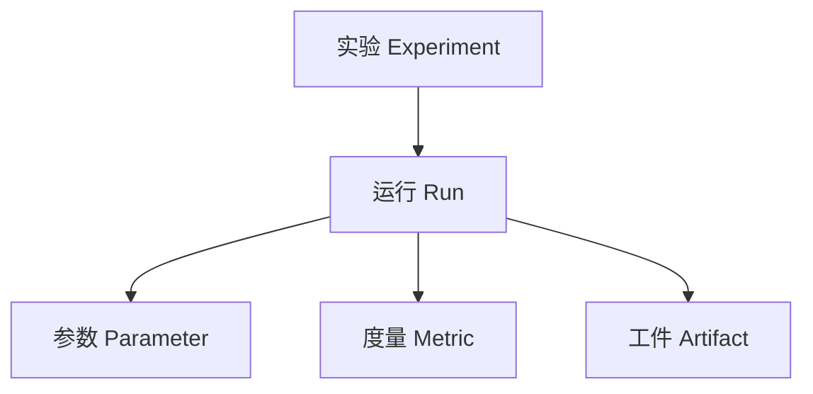

# 实验跟踪与实验管理原理与代码实战案例讲解

关键词：实验跟踪、实验管理、机器学习、数据科学、代码实践

## 1. 背景介绍
### 1.1 问题的由来
随着人工智能和大数据技术的飞速发展,越来越多的研究人员和工程师投身于机器学习和数据科学领域。在这个过程中,如何有效地管理和跟踪大量的实验,成为一个亟待解决的问题。传统的实验记录方式,如Excel表格、文本文档等,已经无法满足日益增长的实验管理需求。因此,开发一套功能完善、易于使用的实验跟踪与管理系统势在必行。

### 1.2 研究现状
目前,已经有一些实验管理工具和平台出现,如MLflow、Sacred、Weights and Biases等。这些工具提供了实验跟踪、参数管理、结果可视化等功能,极大地提高了实验管理的效率。然而,这些工具的使用门槛较高,需要一定的编程基础和学习成本。此外,它们通常侧重于特定的机器学习框架,如PyTorch或TensorFlow,对于其他领域的实验管理支持有限。

### 1.3 研究意义
开发一个通用的、易用的实验跟踪与管理系统,对于提高科研效率、促进学术交流具有重要意义。这样的系统不仅能够帮助研究人员更好地组织和管理实验,还能够促进不同领域、不同团队之间的合作与知识共享。通过系统记录的实验数据和结果,研究人员可以快速复现实验、对比不同方案的性能,从而加速科研进展。此外,这样的系统还可以为机器学习模型的部署和应用提供支持,推动人工智能技术的落地。

### 1.4 本文结构
本文将从以下几个方面对实验跟踪与管理进行深入探讨：
- 第2部分介绍实验跟踪与管理的核心概念和关键组件。
- 第3部分详细阐述实验跟踪与管理的核心算法原理和具体操作步骤。
- 第4部分建立实验跟踪与管理的数学模型,并给出详细的公式推导和案例分析。
- 第5部分通过代码实例,演示如何实现一个简单的实验跟踪与管理系统。
- 第6部分讨论实验跟踪与管理在实际应用中的场景和未来发展趋势。
- 第7部分推荐实验跟踪与管理相关的工具、资源和学习材料。
- 第8部分总结全文,并展望实验跟踪与管理未来的发展方向和挑战。
- 第9部分附录,解答实验跟踪与管理的常见问题。

## 2. 核心概念与联系

实验跟踪与管理涉及以下几个核心概念：

- **实验(Experiment)**：一次完整的模型训练过程,包括数据准备、模型定义、超参数设置、训练、评估等步骤。
- **运行(Run)**：一次实验的具体执行记录,包含代码版本、依赖环境、超参数、度量指标等元数据信息。
- **参数(Parameter)**：模型训练中的超参数和配置选项,如学习率、批量大小、正则化系数等。
- **度量(Metric)**：评估模型性能的指标,如准确率、损失函数值、F1分数等。
- **工件(Artifact)**：实验过程中产生的数据文件,如训练集、测试集、模型权重、日志文件等。

这些概念之间的关系如下图所示：

实验跟踪系统的核心功能是记录和管理实验运行的各种元数据和产物,以便研究人员能够方便地查询、比较和复现实验结果。通过分析实验历史数据,研究人员可以发现模型优化的方向,进而提高实验效率和模型性能。

## 3. 核心算法原理 & 具体操作步骤

### 3.1 算法原理概述

实验跟踪与管理的核心算法可以分为以下几个部分：

1. **元数据记录算法**：将实验运行的各种元数据(如代码版本、超参数、环境依赖等)记录下来,以便后续查询和分析。常见的元数据记录方式有日志文件、关系型数据库、NoSQL数据库等。
2. **度量指标记录算法**：在模型训练过程中,周期性地记录各种度量指标(如损失函数值、准确率等),用于监控训练进度和评估模型性能。常见的度量指标记录方式有日志文件、时间序列数据库等。
3. **工件管理算法**：将实验过程中产生的各种数据文件(如训练集、测试集、模型权重等)进行组织和管理,以便后续访问和复用。常见的工件管理方式有文件系统、对象存储、版本控制系统等。
4. **实验分析算法**：对实验历史数据进行分析和可视化,帮助研究人员发现模型优化方向,指导后续实验。常见的实验分析方法有参数重要性分析、度量指标趋势分析、实验对比分析等。

### 3.2 算法步骤详解

以下是实验跟踪与管理的具体操作步骤:

1. 定义实验元数据 schema,包括实验名称、描述、创建时间、标签等字段。
2. 在实验运行前,记录下代码版本、依赖环境、超参数等元数据信息。
3. 在模型训练过程中,周期性地记录各种度量指标,如每个 epoch 的损失函数值和准确率。
4. 将训练过程中产生的数据文件,如模型权重、日志文件等,以工件的形式保存下来。
5. 实验运行完成后,更新实验状态,并记录最终的度量指标和工件信息。
6. 对实验历史数据进行分析和可视化,如绘制度量指标随时间变化的曲线图,对比不同实验的性能差异等。
7. 基于实验分析结果,调整超参数和模型结构,启动新的实验迭代。

### 3.3 算法优缺点

实验跟踪与管理算法的优点包括：

- 自动化记录实验元数据和度量指标,减少了手工记录的工作量。
- 统一管理实验工件,方便后续访问和复用。
- 通过实验分析和可视化,帮助研究人员快速发现模型优化方向。
- 促进实验结果的复现和共享,提高研究的可重复性。

同时,实验跟踪与管理算法也存在一些局限性：

- 引入实验管理系统,会增加一定的开发和维护成本。
- 实验元数据 schema 的设计需要权衡通用性和灵活性,过于复杂的 schema 可能带来使用上的不便。
- 实验管理系统的性能和可扩展性,需要应对大规模实验数据的存储和分析需求。

### 3.4 算法应用领域

实验跟踪与管理算法主要应用于以下领域：

- 机器学习和深度学习研究
- 数据科学和大数据分析
- 科学计算和仿真实验
- A/B 测试和在线实验
- 自动化机器学习(AutoML)

## 4. 数学模型和公式 & 详细讲解 & 举例说明

### 4.1 数学模型构建

实验跟踪与管理可以用以下数学模型来描述：

- 实验元数据：用一个元组 $E=(id,name,description,created\_at,tags)$ 表示一个实验,其中 $id$ 为实验唯一标识,$name$ 为实验名称,$description$ 为实验描述,$created\_at$ 为实验创建时间,$tags$ 为实验标签集合。
- 运行元数据：用一个元组 $R=(id,experiment\_id,code\_version,params,metrics,artifacts,status)$ 表示一次实验运行,其中 $id$ 为运行唯一标识,$experiment\_id$ 为所属实验的标识,$code\_version$ 为代码版本,$params$ 为超参数,$metrics$ 为度量指标,$artifacts$ 为工件集合,$status$ 为运行状态。
- 参数：用一个字典 $P=\{p_1:v_1,p_2:v_2,...,p_n:v_n\}$ 表示一组超参数,其中 $p_i$ 为参数名称,$v_i$ 为参数值。
- 度量指标：用一个时间序列 $M=\{(t_1,v_1),(t_2,v_2),...,(t_n,v_n)\}$ 表示一个度量指标,其中 $t_i$ 为记录时间,$v_i$ 为指标值。

### 4.2 公式推导过程

基于上述数学模型,我们可以定义一些实验分析的公式。

- 实验数量:给定一个时间区间 $[t_1,t_2]$,实验数量 $N$ 可以表示为:

$$N=\sum_{e \in E} \mathbb{I}(t_1 \leq e.created\_at \leq t_2)$$

其中 $\mathbb{I}$ 为指示函数,当条件满足时取值为1,否则为0。

- 参数重要性:给定一组实验运行 $R=\{r_1,r_2,...,r_n\}$ 和一个度量指标 $m$,参数 $p$ 的重要性 $I_p$ 可以用皮尔逊相关系数来衡量:

$$I_p=\frac{\sum_{i=1}^n (r_i.params[p]-\bar{p})(r_i.metrics[m]-\bar{m})}{\sqrt{\sum_{i=1}^n (r_i.params[p]-\bar{p})^2}\sqrt{\sum_{i=1}^n (r_i.metrics[m]-\bar{m})^2}}$$

其中 $\bar{p}$ 和 $\bar{m}$ 分别为参数值和指标值的平均值。$I_p$ 的取值范围为 $[-1,1]$,绝对值越大表示参数与指标的相关性越强。

- 实验对比:给定两组实验运行 $R_1=\{r_{11},r_{12},...,r_{1n}\}$ 和 $R_2=\{r_{21},r_{22},...,r_{2m}\}$,以及一个度量指标 $m$,我们可以用 t 检验来比较两组实验的性能差异:

$$t=\frac{\bar{m}_1-\bar{m}_2}{\sqrt{\frac{s_1^2}{n}+\frac{s_2^2}{m}}}$$

其中 $\bar{m}_1$ 和 $\bar{m}_2$ 分别为两组实验的指标均值,$s_1^2$ 和 $s_2^2$ 为指标值的样本方差,$n$ 和 $m$ 为两组实验的样本数。通过计算 t 值和 p 值,可以判断两组实验的性能是否有显著差异。

### 4.3 案例分析与讲解

下面以一个图像分类任务为例,演示实验跟踪与管理的应用。

假设我们要比较不同的卷积神经网络架构在 CIFAR-10 数据集上的性能。我们设计了以下三组实验:

- 实验1:使用 LeNet 架构,学习率为 0.01,批量大小为 128,训练 50 个 epoch。
- 实验2:使用 AlexNet 架构,学习率为 0.001,批量大小为 256,训练 100 个 epoch。
- 实验3:使用 ResNet 架构,学习率为 0.0001,批量大小为 512,训练 200 个 epoch。

我们使用实验跟踪系统记录下每个实验的超参数、训练过程中的损失函数值和准确率,以及最终的测试集准确率。通过实验管理系统,我们可以方便地对比不同实验的性能:

| 实验 ID | 模型架构 | 学习率 | 批量大小 | Epoch 数 | 测试集准确率 |
|--------|---------|--------|----------|----------|-------------|
| 1      | LeNet   | 0.01   | 128      | 50       | 72.3%       |
| 2      | AlexNet | 0.001  | 256      | 100      | 81.5%       |
| 3      | ResNet  | 0.0001 | 512      | 200      | 93.7%       |

从实验结果可以看出,ResNet 架构在 CIFAR-10 数据集上取得了最佳性能,测试集准确率达到 93.7%