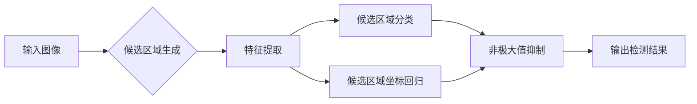
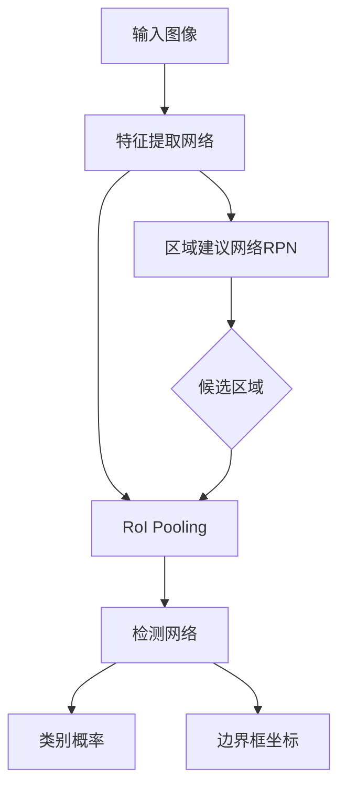

# 对象检测 (Object Detection) 原理与代码实例讲解

关键词：对象检测、深度学习、卷积神经网络、YOLO、R-CNN、Faster R-CNN

## 1. 背景介绍
### 1.1 问题的由来  
在计算机视觉领域,对象检测是一个基础性且极具挑战的任务。它旨在从图像或视频中识别和定位感兴趣的目标对象。随着人工智能技术的飞速发展,尤其是深度学习的兴起,对象检测取得了突破性的进展。
### 1.2 研究现状
目前主流的对象检测算法大多基于深度学习,特别是卷积神经网络(CNN)。从2012年AlexNet在ImageNet竞赛中的惊艳表现,到R-CNN、Fast R-CNN、Faster R-CNN、YOLO、SSD等算法的提出,对象检测的精度和速度不断刷新纪录。
### 1.3 研究意义 
高效准确的对象检测算法在诸多领域有广泛应用,如无人驾驶、智慧安防、医学影像分析、工业视觉检测等。这些应用对算法的实时性和鲁棒性提出了更高要求。对象检测的研究推动了人工智能在现实世界中的落地。
### 1.4 本文结构
本文将全面讲解对象检测的原理,重点介绍几种经典算法。内容涵盖算法理论基础、网络结构设计、损失函数构建、训练优化策略、代码实践等方面。通过本文,读者可以深入理解对象检测的核心思想,并掌握动手实现的方法。

## 2. 核心概念与联系
对象检测的目标是在给定图像中找出所有感兴趣的目标,并给出它们的类别和位置。涉及的核心概念包括:

- 候选区域(Region Proposal):从图像中选取可能包含目标的区域。
- 特征提取:用卷积神经网络提取候选区域或整图的特征。
- 分类器:判断候选区域所属的类别。
- 边界框回归(Bounding Box Regression):修正候选区域的位置坐标。
- 非极大值抑制(Non-Maximum Suppression):去除重叠度高的冗余检测结果。

对象检测算法的发展大致经历了两个阶段:两阶段检测器(如R-CNN系列)和单阶段检测器(如YOLO、SSD)。两阶段检测器先产生候选区域,再对候选区域进行分类和回归;单阶段检测器直接在整图上预测目标的类别和位置。



## 3. 核心算法原理 & 具体操作步骤
### 3.1 算法原理概述
对象检测算法的核心是如何有效地从图像中提取目标的特征,并准确地预测目标的类别和位置。下面以经典的两阶段检测器Faster R-CNN为例,说明其基本原理。

Faster R-CNN由4个主要部分组成:
1. 特征提取网络:用于提取图像特征,一般采用预训练的CNN网络如ResNet、VGGNet等。
2. 区域建议网络(Region Proposal Network,RPN):在特征图上滑动窗口,对每个位置生成多个不同大小和宽高比的候选区域。
3. 兴趣区域池化(Region of Interest Pooling,RoI Pooling):将候选区域投影到特征图上,并池化为固定大小的特征。
4. 检测网络:对RoI Pooling后的特征进行分类和边界框回归,得到最终的检测结果。



### 3.2 算法步骤详解
1. 特征提取:将输入图像送入CNN网络,得到特征图。特征图尺寸一般是输入图像的1/16。

2. 区域建议:在特征图上使用一个小型的卷积网络,对每个位置生成k个候选区域。候选区域用4个坐标表示:$(x,y,w,h)$,其中$(x,y)$是中心点坐标,$w$和$h$分别是宽度和高度。同时预测该候选区域是前景(含目标)的概率。

3. 兴趣区域池化:根据候选区域的坐标,将其映射回原图像,并将对应的特征图区域池化为固定大小(如7x7)。

4. 分类和回归:将RoI Pooling后的特征送入全连接层,输出该区域所属类别的概率向量和修正后的边界框坐标。

5. 后处理:对所有候选区域的预测结果进行非极大值抑制,去除重叠度高的冗余框,得到最终的检测结果。

### 3.3 算法优缺点
Faster R-CNN的优点是:
- 准确率高:采用两阶段检测,候选区域定位和分类回归分别优化,可以达到很高的准确率。
- 可扩展性强:特征提取网络和检测网络可以灵活替换,适应不同任务需求。
- 端到端训练:候选区域生成和检测网络可以一起端到端训练,减少流程复杂度。

缺点包括:  
- 速度慢:两阶段检测占用较多计算资源,实时性不够好。
- 训练复杂:需要逐步训练RPN和检测网络,流程繁琐。

### 3.4 算法应用领域
对象检测算法已经在多个领域得到应用,例如:

- 自动驾驶:检测车辆、行人、交通标志等目标,辅助决策和控制。
- 安防监控:检测异常行为、追踪特定目标。
- 医疗影像:定位病灶区域,辅助诊断。  
- 工业视觉:工件缺陷检测,提高生产效率。
- 无人机:航拍图像分析,灾害监测等。

随着算法的不断进步,对象检测将在更广阔的领域发挥作用。

## 4. 数学模型和公式 & 详细讲解 & 举例说明
### 4.1 数学模型构建
对象检测可以看作一个多任务学习问题,需要同时完成分类和位置回归。以Faster R-CNN为例,其数学模型可以表示为:

$$L(p,u,t^u,v) = L_{cls}(p,u) + \lambda[u \geq 1]L_{loc}(t^u,v)$$

其中:
- $p=(p_0,p_1,...,p_K)$是一个$K+1$维向量,表示候选区域属于每一类的概率。$p_0$表示背景。
- $u$是真实类别标签,取值范围$[0,K]$。
- $t^u=(t_x^u,t_y^u,t_w^u,t_h^u)$是预测的边界框坐标。
- $v=(v_x,v_y,v_w,v_h)$是真实的边界框坐标。
- $L_{cls}$是分类损失,一般用交叉熵损失函数。
- $L_{loc}$是位置回归损失,一般用Smooth L1损失函数。
- $\lambda$是平衡系数,控制分类损失和回归损失的权重。
- $[u \geq 1]$表示只有正样本($u \geq 1$)参与位置回归损失计算。

### 4.2 公式推导过程
分类损失$L_{cls}$采用交叉熵函数:

$$L_{cls}(p,u)=-\log p_u$$

位置损失$L_{loc}$采用Smooth L1函数:

$$L_{loc}(t^u,v)=\sum_{i \in {x,y,w,h}} \text{Smooth}_{L1}(t_i^u-v_i)$$

$$\text{Smooth}_{L1}(x)=\begin{cases}
0.5x^2 & \text{if } |x|<1 \\
|x|-0.5 & \text{otherwise}
\end{cases}$$

其中,$t_i^u$和$v_i$分别表示第$i$个坐标的预测值和真实值。Smooth L1函数在误差较小时是平方损失,误差较大时是线性损失,相比L2损失对异常值更鲁棒。

### 4.3 案例分析与讲解
假设一张图像中有2个目标:一个人和一只狗。Faster R-CNN在RPN阶段产生了5个候选区域,其中2个包含人,1个包含狗,2个为背景。那么这5个候选区域的真实标签$u$分别为:

$$u_1=1(\text{人}), u_2=1(\text{人}), u_3=2(\text{狗}), u_4=0(\text{背景}), u_5=0(\text{背景})$$

假设模型预测的类别概率向量$p$和边界框坐标$t$分别为:

$$p_1=(0.1,0.8,0.1), t_1=(0.2,0.3,0.5,0.6)$$
$$p_2=(0.2,0.7,0.1), t_2=(0.1,0.4,0.4,0.7)$$  
$$p_3=(0.1,0.2,0.7), t_3=(0.6,0.5,0.3,0.4)$$
$$p_4=(0.9,0.05,0.05), t_4=(0.7,0.8,0.2,0.1)$$
$$p_5=(0.95,0.03,0.02), t_5=(0.5,0.6,0.3,0.2)$$

真实的边界框坐标$v$为:

$$v_1=(0.25,0.35,0.55,0.65)$$
$$v_2=(0.15,0.45,0.45,0.75)$$
$$v_3=(0.65,0.55,0.35,0.45)$$

则总的损失函数为:

$$\begin{aligned}
L &= -\log 0.8 - \log 0.7 - \log 0.7 - \log 0.9 - \log 0.95 \\
&+ \lambda(\text{Smooth}_{L1}(0.2-0.25)+\text{Smooth}_{L1}(0.3-0.35)+\text{Smooth}_{L1}(0.5-0.55)+\text{Smooth}_{L1}(0.6-0.65)) \\
&+ \lambda(\text{Smooth}_{L1}(0.1-0.15)+\text{Smooth}_{L1}(0.4-0.45)+\text{Smooth}_{L1}(0.4-0.45)+\text{Smooth}_{L1}(0.7-0.75)) \\ 
&+ \lambda(\text{Smooth}_{L1}(0.6-0.65)+\text{Smooth}_{L1}(0.5-0.55)+\text{Smooth}_{L1}(0.3-0.35)+\text{Smooth}_{L1}(0.4-0.45))
\end{aligned}$$

通过梯度下降法最小化损失函数,可以学习到最优的分类和回归参数。

### 4.4 常见问题解答
问:Faster R-CNN的RPN网络是如何工作的?

答:RPN网络在特征图上滑动一个$n\times n$的窗口,对每个位置生成$k$个候选区域。这$k$个候选区域称为锚框(Anchor),有不同的尺度和宽高比,覆盖不同的目标大小。RPN对每个锚框预测其是前景的概率以及边界框坐标的修正量。修正量是相对锚框的,因此先验知识可以引导候选区域的生成。通过设置阈值,保留概率较高的前景锚框作为候选区域输出。

问:Faster R-CNN的损失函数为什么要将分类和回归分开?

答:对象检测需要同时预测目标的类别和位置。如果用一个损失函数同时优化,容易出现分类和定位精度的权衡。分开定义分类损失和回归损失,可以更灵活地平衡两者,通过调节$\lambda$来控制定位精度。另外分类是一个多类别问题,需要用交叉熵损失;而位置回归是一个连续值预测问题,用Smooth L1损失更合适。

## 5. 项目实践：代码实例和详细解释说明
下面以PyTorch为例,演示如何用代码实现Faster R-CNN的关键步骤。
### 5.1 开发环境搭建
首先安装必要的库:
```bash
pip install