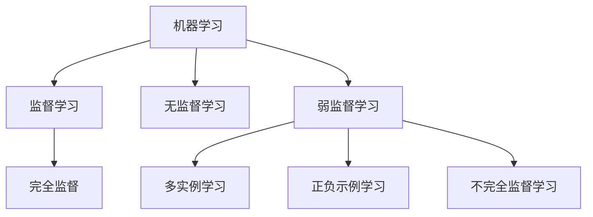
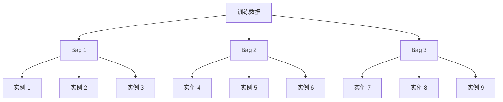
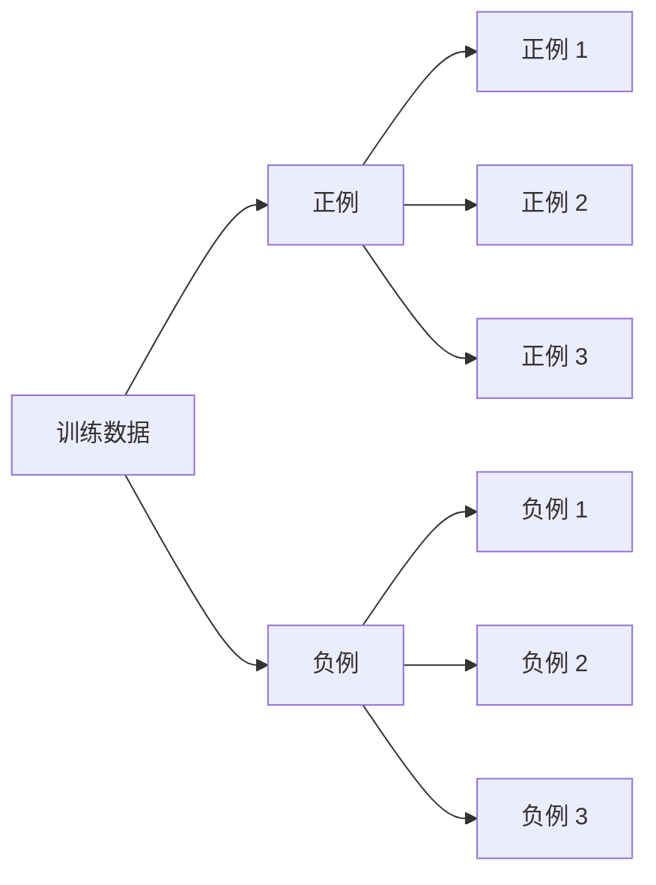
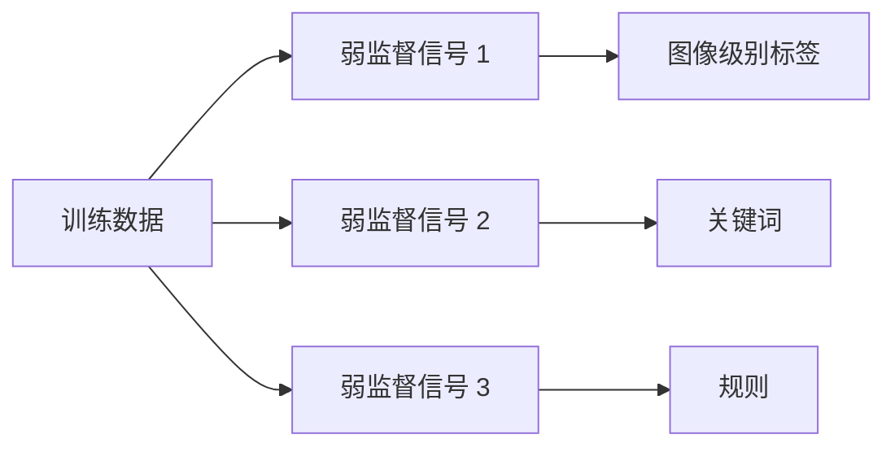

# 弱监督学习 原理与代码实例讲解

## 1. 背景介绍

### 1.1 问题的由来

在现代数据时代,我们面临着海量的数据需要处理和分析。然而,获取高质量的标注数据是一个巨大的挑战,因为人工标注数据的过程通常是昂贵、耗时且容易出错的。这就催生了弱监督学习(Weakly Supervised Learning)的兴起,作为一种在标注数据缺乏或成本高昂的情况下,利用现有的弱监督信号(Weak Supervision Signals)来训练模型的学习范式。

### 1.2 研究现状

近年来,随着深度学习技术的快速发展,弱监督学习在计算机视觉、自然语言处理等领域取得了令人瞩目的成就。研究人员提出了多种弱监督学习框架,如多实例学习(Multiple Instance Learning)、正负示例学习(Positive and Negative Learning)、不完全监督学习(Incomplete Supervision)等,并在图像分类、目标检测、关系抽取等任务中取得了不俗的表现。

### 1.3 研究意义

弱监督学习的核心思想是利用现有的弱监督信号,如图像级别的标签、关键词、规则等,来指导模型学习,从而减少对大量标注数据的依赖。这不仅能够降低数据标注的成本,而且还能够扩展模型的应用范围,使其能够处理那些难以获取完全标注数据的领域。因此,弱监督学习具有重要的理论价值和应用前景。

### 1.4 本文结构

本文将首先介绍弱监督学习的核心概念和基本原理,然后详细阐述几种典型的弱监督学习算法,包括多实例学习、正负示例学习和不完全监督学习。接下来,我们将深入探讨这些算法的数学模型和公式推导,并通过实际案例进行详细讲解。此外,本文还将提供代码实例和实际应用场景,以帮助读者更好地理解和掌握弱监督学习技术。最后,我们将总结弱监督学习的未来发展趋势和面临的挑战,并推荐相关的学习资源和工具。

## 2. 核心概念与联系

弱监督学习(Weakly Supervised Learning)是一种利用现有的弱监督信号(Weak Supervision Signals)来训练模型的学习范式。它与传统的监督学习和无监督学习形成鲜明对比。

- **监督学习**(Supervised Learning)需要大量的完全标注数据,如图像的像素级别标注、文本的实体级别标注等。这种方式虽然能够获得高质量的模型,但标注数据的成本通常很高。

- **无监督学习**(Unsupervised Learning)则完全不需要任何标注数据,而是直接从原始数据中自动发现模式和规律。这种方式虽然节省了标注成本,但模型的性能通常较差,且缺乏可解释性。

- **弱监督学习**(Weakly Supervised Learning)则介于两者之间,它利用现有的弱监督信号(如图像级别的标签、关键词、规则等)来指导模型学习,从而减少对大量标注数据的依赖。这种方式能够在一定程度上保证模型的性能,同时也降低了标注成本。

弱监督学习包括多种不同的算法和框架,如**多实例学习**(Multiple Instance Learning)、**正负示例学习**(Positive and Negative Learning)和**不完全监督学习**(Incomplete Supervision)等。这些算法虽然在具体实现上有所不同,但都遵循了利用弱监督信号来训练模型的核心思想。

## 3. 核心算法原理 & 具体操作步骤

在这一部分,我们将详细介绍几种典型的弱监督学习算法,包括多实例学习、正负示例学习和不完全监督学习。对于每种算法,我们将阐述其核心原理、具体操作步骤,并分析其优缺点和应用领域。

### 3.1 算法原理概述

#### 3.1.1 多实例学习(Multiple Instance Learning)

多实例学习是弱监督学习中最早提出的一种算法。它的核心思想是将每个训练样本视为一个"袋"(Bag),而每个"袋"中包含多个实例(Instance)。在训练过程中,我们只知道每个"袋"的标签,而不知道每个实例的具体标签。

多实例学习算法的目标是从这些"袋"中学习出一个能够正确预测新"袋"标签的模型。常见的多实例学习算法包括支持向量数据描述(SVDD)、多实例核(MI-Kernel)等。

#### 3.1.2 正负示例学习(Positive and Negative Learning)

正负示例学习是另一种常见的弱监督学习算法。它的核心思想是利用已知的正例(Positive Examples)和负例(Negative Examples)来训练模型,而不需要完全标注的数据。

在正负示例学习中,我们通常会先收集一些已知的正例和负例,然后使用这些示例来训练模型。常见的正负示例学习算法包括正负示例学习(PN-Learning)、正例驱动学习(Positive Unlabeled Learning)等。

#### 3.1.3 不完全监督学习(Incomplete Supervision)

不完全监督学习是一种更加通用的弱监督学习框架。它的核心思想是利用各种形式的弱监督信号(如图像级别的标签、关键词、规则等)来指导模型学习,而不局限于特定的算法。

不完全监督学习通常会将这些弱监督信号转化为一种损失函数或正则项,并将其与模型的原始损失函数相结合,从而实现利用弱监督信号来指导模型学习的目标。常见的不完全监督学习算法包括约束驱动学习(Constraint-Driven Learning)、正则化学习(Regularized Learning)等。

### 3.2 算法步骤详解

在这一部分,我们将详细介绍上述三种算法的具体操作步骤。

#### 3.2.1 多实例学习算法步骤

1. **数据预处理**:将训练数据划分为多个"袋",每个"袋"中包含多个实例。同时,为每个"袋"指定一个标签(正例或负例)。

2. **特征提取**:对每个实例进行特征提取,获得其特征向量表示。

3. **模型初始化**:初始化多实例学习模型的参数,如支持向量数据描述(SVDD)模型中的球心和半径。

4. **模型训练**:利用"袋"级别的标签来训练多实例学习模型,目标是使模型能够正确预测新"袋"的标签。常见的训练方法包括最大化"袋"内实例与球心的距离差异、最小化正负"袋"之间的边界等。

5. **模型评估**:在测试集上评估训练好的模型的性能,如准确率、召回率等指标。

6. **模型调优**:根据评估结果,调整模型的超参数或训练策略,以获得更好的性能。

7. **模型应用**:将训练好的模型应用于实际任务,如图像分类、目标检测等。

#### 3.2.2 正负示例学习算法步骤

1. **数据收集**:收集一些已知的正例和负例数据。

2. **特征提取**:对正例和负例进行特征提取,获得其特征向量表示。

3. **模型初始化**:初始化正负示例学习模型的参数,如决策树、支持向量机等模型的初始参数。

4. **模型训练**:利用已知的正例和负例来训练模型,目标是使模型能够正确区分新的正负实例。常见的训练方法包括最小化正负实例之间的边界、最大化正负实例的分数差异等。

5. **模型评估**:在测试集上评估训练好的模型的性能,如准确率、F1分数等指标。

6. **模型调优**:根据评估结果,调整模型的超参数或训练策略,以获得更好的性能。

7. **模型应用**:将训练好的模型应用于实际任务,如文本分类、异常检测等。

#### 3.2.3 不完全监督学习算法步骤

1. **数据收集**:收集训练数据和相应的弱监督信号,如图像级别的标签、关键词、规则等。

2. **特征提取**:对训练数据进行特征提取,获得其特征向量表示。

3. **模型初始化**:初始化不完全监督学习模型的参数,如神经网络、决策树等模型的初始参数。

4. **损失函数构建**:将弱监督信号转化为一种损失函数或正则项,并将其与模型的原始损失函数相结合,构建新的损失函数。

5. **模型训练**:利用构建好的损失函数来训练模型,目标是使模型能够同时满足原始任务和弱监督信号的要求。常见的训练方法包括梯度下降、随机梯度下降等优化算法。

6. **模型评估**:在测试集上评估训练好的模型的性能,如准确率、F1分数等指标。

7. **模型调优**:根据评估结果,调整模型的超参数或训练策略,以获得更好的性能。

8. **模型应用**:将训练好的模型应用于实际任务,如图像分类、关系抽取等。

### 3.3 算法优缺点

每种弱监督学习算法都有其独特的优缺点,我们需要根据具体的任务和数据特征来选择合适的算法。

#### 3.3.1 多实例学习

**优点**:

- 能够利用"袋"级别的标签来训练模型,减少了对完全标注数据的依赖。
- 适用于许多实际任务,如图像分类、目标检测等。
- 具有较好的理论基础和可解释性。

**缺点**:

- 假设每个"袋"中至少存在一个正例实例,这可能在某些情况下不成立。
- 对于高维数据和大规模数据集,算法的计算复杂度较高。
- 算法的性能受到"袋"构建策略的影响较大。

#### 3.3.2 正负示例学习

**优点**:

- 只需要收集一些已知的正例和负例,标注成本较低。
- 算法原理简单,易于理解和实现。
- 适用于许多二分类任务,如文本分类、异常检测等。

**缺点**:

- 需要收集足够多的正负示例,否则模型的性能可能较差。
- 对于高维数据和复杂任务,算法的表现可能不尽人意。
- 缺乏理论基础和可解释性。

#### 3.3.3 不完全监督学习

**优点**:

- 能够利用各种形式的弱监督信号,如图像级别的标签、关键词、规则等,具有较强的通用性。
- 可以与现有的监督学习模型相结合,提高模型的性能。
- 具有较好的理论基础和可解释性。

**缺点**:

- 需要将弱监督信号转化为损失函数或正则项,这可能会增加算法的复杂度