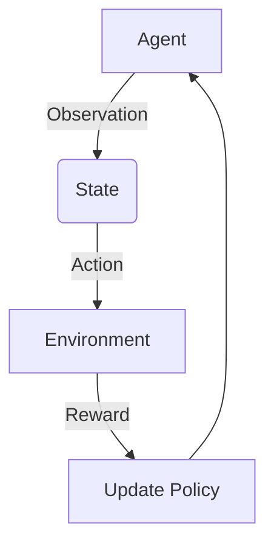
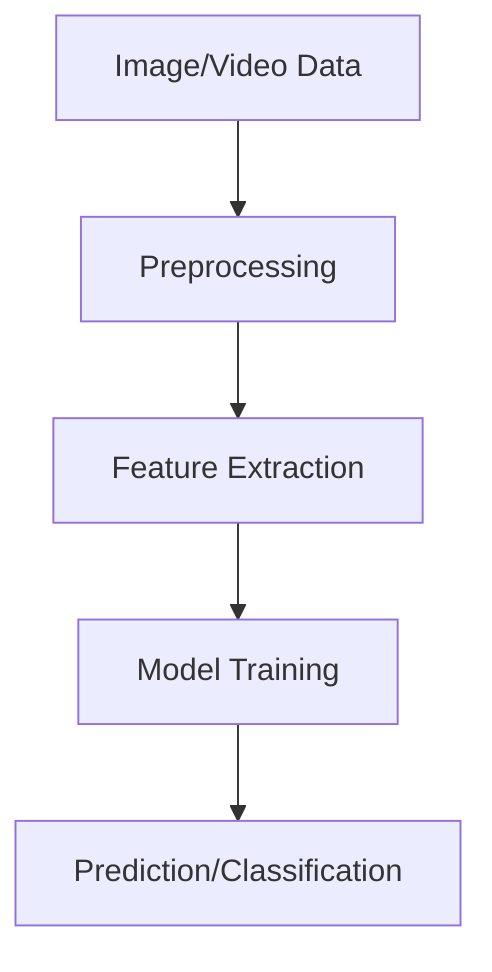

# 强化学习Reinforcement Learning与计算机视觉结合的趋势分析

## 1. 背景介绍

### 1.1 问题的由来

在过去几十年中，机器学习和人工智能领域取得了长足的进步。其中,强化学习(Reinforcement Learning)和计算机视觉(Computer Vision)是两个备受关注的热门研究方向。强化学习关注于如何通过与环境的交互来学习获取最优策略,而计算机视觉则专注于从图像或视频数据中获取有价值的信息。

随着技术的不断发展,研究人员开始尝试将这两个领域结合起来,以解决更加复杂和具有挑战性的问题。将强化学习与计算机视觉相结合,不仅可以利用强化学习的决策优化能力,还能够充分利用计算机视觉提供的丰富视觉信息,从而开发出更加智能、更加robust的系统。

### 1.2 研究现状

目前,强化学习与计算机视觉的结合已经在多个领域取得了一些成果,例如机器人控制、自动驾驶、视频游戏等。其中,DeepMind公司的AlphaGo系统就是一个典型的例子,它将深度神经网络与蒙特卡罗树搜索相结合,在计算机视觉和强化学习的帮助下,成功战胜了人类顶尖的围棋高手。

然而,尽管取得了一些进展,但是将强化学习与计算机视觉有效结合仍然面临着诸多挑战,例如高维观测空间、sparse reward、视觉数据的复杂性等。因此,如何更好地解决这些挑战,成为了当前研究的重点。

### 1.3 研究意义

将强化学习与计算机视觉相结合,可以为解决复杂的现实世界问题提供新的思路和方法。例如,在自动驾驶领域,通过计算机视觉获取道路和环境信息,并利用强化学习进行决策和控制,可以大大提高自动驾驶系统的智能性和安全性。

此外,这种结合还可以推动人工智能技术在更多领域的应用,例如机器人控制、视频分析、医疗影像诊断等。通过不断探索和创新,我们有望开发出更加智能、更加robust的系统,为人类社会带来巨大的价值。

### 1.4 本文结构

本文将全面介绍强化学习与计算机视觉结合的相关理论、方法和应用。首先,我们将介绍两个领域的核心概念及其联系;然后,详细阐述核心算法原理和数学模型;接着,通过实际项目实践,展示代码实现和运行结果;最后,分析实际应用场景,介绍相关工具和资源,并对未来发展趋势和挑战进行总结和展望。

## 2. 核心概念与联系

强化学习(Reinforcement Learning)和计算机视觉(Computer Vision)虽然属于不同的研究领域,但是它们之间存在着密切的联系。

强化学习是一种基于奖赏或惩罚的机器学习范式,其目标是通过与环境的交互,学习到一个可以最大化累积奖赏的最优策略。在强化学习中,智能体(Agent)通过观测当前状态,选择一个动作,然后根据环境的反馈(奖赏或惩罚)来更新策略。这种基于试错的学习方式,使得强化学习在处理序列决策问题时具有独特的优势。

计算机视觉则是一个研究如何使计算机能够获取、处理和理解数字图像或视频数据的领域。它涉及图像处理、模式识别、机器学习等多个方面,旨在从视觉数据中提取有用的信息,并将其应用于各种任务,如目标检测、图像分类、语义分割等。

将强化学习与计算机视觉相结合,可以充分利用两者的优势。一方面,计算机视觉可以为强化学习提供丰富的视觉观测信息,使得智能体能够更好地感知环境状态;另一方面,强化学习则可以帮助计算机视觉系统进行决策和控制,使其具备更强的自主性和适应性。

这种结合不仅可以解决一些传统方法难以解决的问题,还能够开辟全新的应用领域。例如,在自动驾驶领域,计算机视觉可以检测道路信息和障碍物,而强化学习则可以根据这些信息进行决策和控制,从而实现更加智能和安全的自动驾驶系统。

## 3. 核心算法原理 & 具体操作步骤

### 3.1 算法原理概述

将强化学习与计算机视觉相结合,主要采用了深度强化学习(Deep Reinforcement Learning)的方法。深度强化学习是将深度学习(Deep Learning)技术引入到强化学习中,使用深度神经网络来近似值函数或策略函数,从而解决高维观测空间和动作空间的问题。

在深度强化学习中,常见的算法包括深度Q网络(Deep Q-Network, DQN)、策略梯度(Policy Gradient)、Actor-Critic等。这些算法通过利用深度神经网络的强大表示能力,可以直接从原始输入(如图像或视频帧)中学习策略或值函数,而无需手工设计特征。

以DQN为例,其核心思想是使用一个深度卷积神经网络来近似Q值函数,并通过经验回放(Experience Replay)和目标网络(Target Network)等技术来提高训练的稳定性和效率。具体来说,DQN算法的步骤如下:

1. 初始化一个带有随机权重的Q网络和一个目标Q网络(初始化为与Q网络相同)。
2. 对于每个时间步:
    a. 从环境中获取当前状态$s_t$。
    b. 使用Q网络计算所有可能动作的Q值,并选择Q值最大的动作$a_t$。
    c. 执行动作$a_t$,观测到下一个状态$s_{t+1}$和奖励$r_t$。
    d. 将转移$(s_t, a_t, r_t, s_{t+1})$存储到经验回放池中。
    e. 从经验回放池中随机采样一个小批量的转移。
    f. 计算目标Q值,并使用它们作为监督信号更新Q网络的权重。
    g. 每隔一定步数,将Q网络的权重复制到目标Q网络。

3. 重复步骤2,直到收敛。

在将DQN应用于计算机视觉问题时,我们只需将原始图像或视频帧作为输入,送入卷积神经网络即可。网络会自动从这些原始数据中提取特征,并学习出最优的Q值函数,从而实现端到端的强化学习。

### 3.2 算法步骤详解

我们以一个简化的视觉强化学习问题为例,详细说明DQN算法的实现步骤。假设我们有一个简单的网格世界,智能体的目标是从起点移动到终点。智能体只能观测到当前位置的局部视图,需要根据这些视觉信息来选择移动方向。

1. **环境和奖励设置**

我们首先定义环境的状态空间、动作空间和奖励函数。状态空间是所有可能的局部视图图像,动作空间包括上、下、左、右四个移动方向。当智能体到达终点时,给予一个大的正奖励;否则,每一步给予一个小的负奖励,以鼓励智能体尽快到达目标。

2. **深度Q网络架构**

接下来,我们构建一个深度卷积神经网络作为Q网络。该网络的输入是当前局部视图图像,输出是四个Q值,分别对应四个移动方向的长期累积奖励。网络架构可以采用类似于图像分类任务中常用的结构,例如几个卷积层加上全连接层。

3. **经验回放和目标网络初始化**

我们初始化一个经验回放池,用于存储智能体与环境交互过程中产生的转移样本。同时,我们还初始化一个目标Q网络,其权重在一定步数后从Q网络复制过来,以提高训练稳定性。

4. **交互过程**

进入训练阶段,智能体开始与环境进行交互。在每一个时间步:

a. 观测当前局部视图图像$s_t$,将其输入到Q网络中,获得四个Q值。
b. 根据$\epsilon$-greedy策略,选择Q值最大的动作$a_t$,或以$\epsilon$的概率随机选择一个动作(探索)。
c. 执行动作$a_t$,获得下一个状态$s_{t+1}$和奖励$r_t$。
d. 将转移$(s_t, a_t, r_t, s_{t+1})$存储到经验回放池中。
e. 从经验回放池中随机采样一个小批量的转移样本。
f. 计算这些样本的目标Q值,作为监督信号更新Q网络的权重。
g. 每隔一定步数,将Q网络的权重复制到目标Q网络。

5. **训练过程**

重复上述交互过程,直到智能体的策略收敛。在计算目标Q值时,我们采用以下公式:

$$
y_t = r_t + \gamma \max_{a'} Q(s_{t+1}, a'; \theta^-)
$$

其中,$\gamma$是折现因子,用于权衡即时奖励和长期奖励;$\theta^-$表示目标Q网络的权重。我们使用均方误差损失函数,并采用优化算法(如Adam)来更新Q网络的权重$\theta$,使得Q网络的输出Q值尽可能接近目标Q值。

通过上述步骤,Q网络将逐渐学习到一个最优的Q值函数,使得在给定当前局部视图时,选择对应的最大Q值动作就可以获得最大的长期累积奖励,从而实现了从视觉输入到动作输出的端到端强化学习。

### 3.3 算法优缺点

深度强化学习算法(如DQN)在将强化学习与计算机视觉相结合时,具有以下优点:

1. **端到端学习**:无需手工设计特征提取器,算法可以直接从原始图像或视频数据中学习策略或值函数,实现了真正的端到端学习。
2. **泛化能力强**:深度神经网络具有强大的特征表示能力,可以很好地泛化到新的、未见过的视觉场景。
3. **决策和控制一体化**:将视觉感知和决策控制模块集成到一个统一的框架中,使得系统更加紧凑和高效。

然而,这些算法也存在一些缺点和挑战:

1. **样本效率低下**:深度强化学习算法通常需要大量的交互数据来进行训练,这在一些实际场景中可能是不可行的。
2. **奖励稀疏问题**:在一些任务中,奖励信号可能非常稀疏,导致算法收敛缓慢或无法收敛。
3. **视觉数据复杂性**:真实世界的视觉数据往往具有高度的复杂性和多样性,给算法的泛化能力带来了挑战。
4. **探索与利用权衡**:算法需要在探索新的状态动作对和利用已学习的知识之间进行权衡,以实现最优化。

为了解决这些问题,研究人员提出了多种改进方法,如引入层次结构强化学习、元学习、多任务学习等,以提高算法的样本效率、泛化能力和鲁棒性。

### 3.4 算法应用领域

将强化学习与计算机视觉相结合,可以应用于多个领域,解决一些具有挑战性的实际问题。下面列举了一些典型的应用领域:

1. **机器人控制**:利用视觉输入和强化学习,可以训练出具有一定自主性的机器人系统,实现各种复杂的操作任务,如抓取、操作、导航等。
2. **自动驾驶**:通过计算机视觉感知道路和环境信息,结合强化学习进行决策和控制,可以提高自动驾驶系统的智能