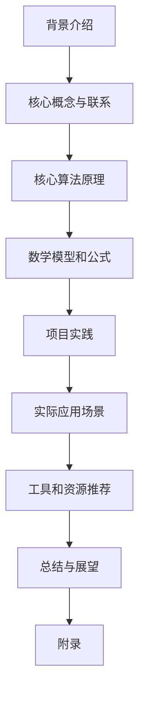
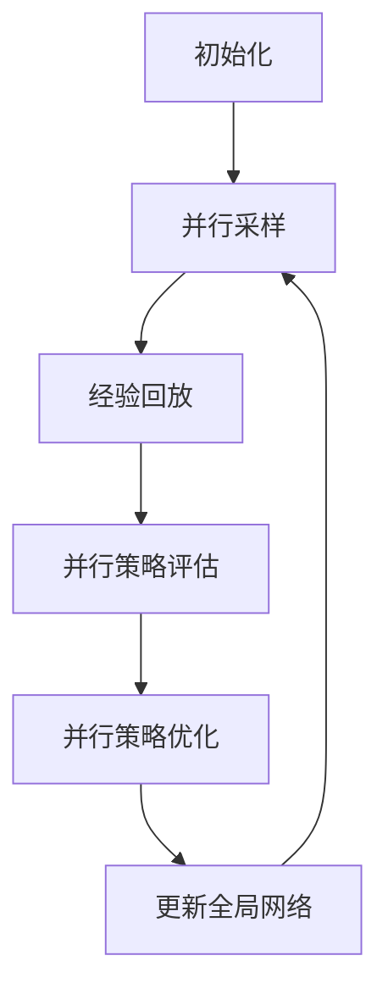

# 强化学习Reinforcement Learning的并行与分布式实现方案

## 1. 背景介绍

### 1.1 问题的由来

随着人工智能技术的不断发展,强化学习(Reinforcement Learning,RL)作为一种重要的机器学习范式,在诸多领域展现出了巨大的潜力。与监督学习和无监督学习不同,强化学习的目标是通过与环境的交互,学习一种策略,使得智能体(Agent)在该环境中获得最大的累积奖励。

然而,传统的强化学习算法在处理大规模、复杂问题时,往往会遇到计算效率低下、收敛缓慢等瓶颈。这主要是由于以下几个原因:

1. **状态空间和动作空间的维度灾难**: 对于复杂环境,状态空间和动作空间的维度往往非常高,导致策略评估和优化的计算复杂度急剧增加。
2. **样本利用效率低下**: 传统的强化学习算法通常需要大量的环境交互数据,才能学习到一个有效的策略,这在现实世界中往往代价昂贵。
3. **收敛速度缓慢**: 由于需要不断地与环境交互并更新策略参数,传统算法的收敛速度较慢,难以满足实时决策的需求。

为了解决上述问题,研究人员提出了并行与分布式强化学习(Parallel and Distributed Reinforcement Learning)的概念,旨在利用多核CPU、GPU和分布式集群等并行计算资源,提高强化学习算法的计算效率和收敛速度。

### 1.2 研究现状  

近年来,并行与分布式强化学习受到了广泛关注,取得了一些重要进展:

1. **经验回放(Experience Replay)**: 通过存储历史交互数据,可以有效提高样本利用效率,加速策略的收敛。
2. **异步优势演员评论家(Asynchronous Advantage Actor-Critic,A3C)**: 在多个并行执行器之间共享策略网络参数,实现了有效的多线程强化学习。
3. **分布式深度决策网络(Distributed Distributional Deep Deterministic Policy Gradient,D4PG)**: 在多个GPU上并行训练,显著提高了算法的训练速度。
4. **射影分布式并行算法(Projected Distributed Parallel Algorithm,PDPA)**: 通过分解状态空间,将问题划分为多个子问题,并行求解。

尽管取得了一些进展,但当前的并行与分布式强化学习方法仍然存在一些不足,如通信开销大、负载不均衡、收敛性能差等,还有待进一步改进和优化。

### 1.3 研究意义

并行与分布式强化学习是解决大规模复杂强化学习问题的关键技术,具有重要的理论意义和应用价值:

1. **理论意义**: 并行与分布式强化学习融合了并行计算、分布式系统和强化学习等多个领域的理论和方法,对于推动这些领域的交叉融合具有重要意义。
2. **应用价值**: 有效的并行与分布式强化学习算法可以显著提高强化学习在复杂问题上的计算效率和收敛速度,为强化学习在实际应用中的落地奠定基础。
3. **推动人工智能发展**: 强化学习被认为是通向通用人工智能(Artificial General Intelligence,AGI)的一条重要途径,并行与分布式强化学习的突破将有助于推动人工智能技术的发展。

因此,研究高效、可扩展的并行与分布式强化学习实现方案,对于推动强化学习理论发展和工程应用具有重要意义。

### 1.4 本文结构

本文将系统地介绍强化学习的并行与分布式实现方案。文章首先阐述了并行与分布式强化学习的背景和研究意义,然后重点介绍了核心概念、算法原理和数学模型,并通过实例对关键技术进行了详细分析。此外,还探讨了实际应用场景、工具资源,以及未来发展趋势和挑战。文章结构安排如下:

## 2. 核心概念与联系

并行与分布式强化学习涉及多个领域的核心概念,包括强化学习、并行计算、分布式系统等,这些概念之间存在紧密联系。

### 2.1 强化学习

强化学习(Reinforcement Learning)是一种基于奖赏机制的机器学习范式,其目标是学习一种策略,使得智能体在与环境交互的过程中获得最大的累积奖励。强化学习主要包括以下核心要素:

- **环境(Environment)**: 智能体所处的外部世界,可以被描述为一个马尔可夫决策过程(Markov Decision Process,MDP)。
- **状态(State)**: 描述环境的当前状况。
- **动作(Action)**: 智能体可以在当前状态下采取的行为。
- **奖赏(Reward)**: 环境对智能体当前行为的反馈,用于指导智能体优化策略。
- **策略(Policy)**: 智能体在每个状态下选择动作的规则或函数映射。
- **价值函数(Value Function)**: 评估一个状态或状态-动作对的长期累积奖赏。

强化学习算法通过与环境交互,不断优化策略,使得智能体获得最大的累积奖赏。常见的强化学习算法包括Q-Learning、Sarsa、策略梯度(Policy Gradient)等。

### 2.2 并行计算

并行计算(Parallel Computing)是指同时利用多个计算资源(如CPU核心、GPU等)来执行多个任务或指令,以提高计算效率。在强化学习中,并行计算主要应用于以下几个方面:

1. **并行采样(Parallel Sampling)**: 利用多个执行器同时与环境交互,收集更多的经验数据,提高样本利用效率。
2. **并行策略评估(Parallel Policy Evaluation)**: 在多个计算单元上并行计算价值函数或策略梯度,加速策略评估过程。
3. **并行策略优化(Parallel Policy Optimization)**: 利用多个计算单元并行执行策略优化算法(如梯度下降),加快策略收敛速度。

常见的并行计算架构包括多核CPU、GPU、集群等。在强化学习中,GPU由于其强大的并行计算能力,被广泛应用于深度强化学习算法的训练过程。

### 2.3 分布式系统

分布式系统(Distributed System)是指由多个独立的计算机通过网络连接而构成的系统,这些计算机协同工作以完成某个复杂的任务。在强化学习中,分布式系统主要应用于以下场景:

1. **分布式采样(Distributed Sampling)**: 在多个节点上并行执行多个智能体,收集更多的经验数据。
2. **分布式训练(Distributed Training)**: 将训练过程分散到多个节点上并行执行,加速策略的收敛。
3. **分布式决策(Distributed Decision Making)**: 在分布式环境中,多个智能体协同作出决策。

分布式强化学习算法需要解决诸如通信开销、负载均衡、容错性等分布式系统中的典型挑战。常见的分布式架构包括主从架构(Master-Worker)、参数服务器(Parameter Server)等。

### 2.4 核心概念之间的联系

并行与分布式强化学习是将强化学习、并行计算和分布式系统等概念有机结合的产物,旨在解决传统强化学习算法在处理大规模复杂问题时面临的计算效率和收敛速度瓶颈。具体来说:

1. **并行计算为强化学习提供了加速手段**: 通过利用多核CPU、GPU等并行计算资源,可以加速强化学习算法的采样、策略评估和策略优化等关键步骤。
2. **分布式系统为强化学习提供了扩展能力**: 借助分布式系统,可以将强化学习任务分散到多个节点上并行执行,从而支持更大规模的问题。
3. **强化学习为并行与分布式计算提供了新的应用场景**: 强化学习算法对计算资源的需求为并行与分布式计算技术提供了新的应用场景,推动了相关技术的发展。

总的来说,并行与分布式强化学习将这三个领域的核心概念和技术有机结合,形成了一种新的范式,旨在解决传统强化学习算法面临的挑战,推动强化学习技术在更多复杂问题上的应用。

## 3. 核心算法原理 & 具体操作步骤

### 3.1 算法原理概述

并行与分布式强化学习的核心思想是利用多个计算资源(如CPU核心、GPU、集群节点等)同时执行强化学习任务的不同部分,从而提高整体的计算效率和收敛速度。根据并行和分布式的粒度不同,可以将算法分为以下几种类型:

1. **并行采样(Parallel Sampling)**: 利用多个执行器同时与环境交互,收集更多的经验数据,提高样本利用效率。常见的算法包括异步优势演员评论家(A3C)、分布式深度决策网络(D4PG)等。

2. **并行策略评估(Parallel Policy Evaluation)**: 在多个计算单元上并行计算价值函数或策略梯度,加速策略评估过程。常见的算法包括并行价值迭代(Parallel Value Iteration)、并行策略迭代(Parallel Policy Iteration)等。

3. **并行策略优化(Parallel Policy Optimization)**: 利用多个计算单元并行执行策略优化算法(如梯度下降),加快策略收敛速度。常见的算法包括并行策略梯度(Parallel Policy Gradient)、并行Q-Learning等。

4. **分布式强化学习(Distributed Reinforcement Learning)**: 将强化学习任务分散到多个节点上并行执行,支持更大规模的问题。常见的算法包括分布式Q-Learning、分布式策略梯度等。

5. **多智能体强化学习(Multi-Agent Reinforcement Learning)**: 在分布式环境中,多个智能体协同作出决策,常见于多智能体系统(Multi-Agent System)中。

这些算法通常结合了经验回放(Experience Replay)、异步更新(Asynchronous Update)、参数服务器(Parameter Server)等技术,以提高算法的效率和稳定性。

### 3.2 算法步骤详解

以异步优势演员评论家(A3C)算法为例,我们详细介绍并行与分布式强化学习算法的具体步骤:

1. **初始化**:
    - 初始化全局策略网络(Global Policy Network)和全局价值网络(Global Value Network)的参数。
    - 创建多个并行执行器(Worker),每个执行器维护一个本地策略网络和本地价值网络,参数从全局网络复制而来。

2. **并行采样**:
    - 每个执行器根据本地策略网络与环境交互,收集一段轨迹(Trajectory)数据,包括状态(State)、动作(Action)、奖赏(Reward)等。

3. **经验回放**:
    - 将收集到的轨迹数据存入经验回放池(Experience Replay Buffer)。
    - 从经验回放池中采样出一批数据,用于策略评估和优化。

4. **并行策略评估**:
    - 每个执行器根据采样数据,并行计算策略梯度(Policy Gradient)和价值函数损失(Value Function Loss)。

5. **并行策略优化**:
    - 每个执行器根据计算出的策略梯度和价值函数损失,并行执行梯度下降,更新本地策略网络和本地价值网络的参数。

6. **更新全局网络**:
    - 将所有执行器的本地策略网络和本地价值网络参数按一定规则(如平均或最优)合并,更新全局网络参数。
    - 所有执行器从更新后的全局网络复制参数,进入下一轮迭代。

通过上述步骤,A3C算法实现了强化学习任务