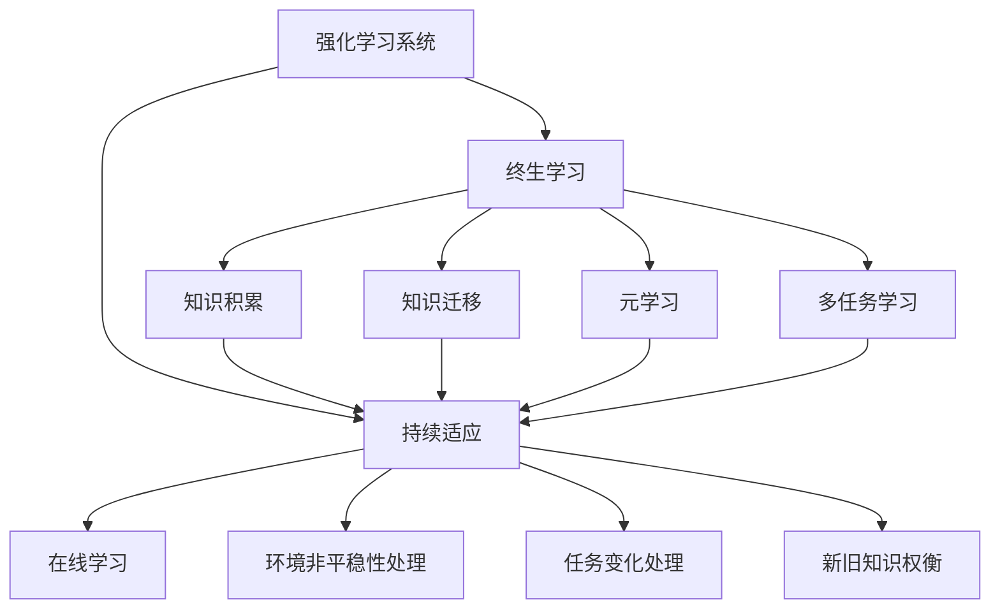
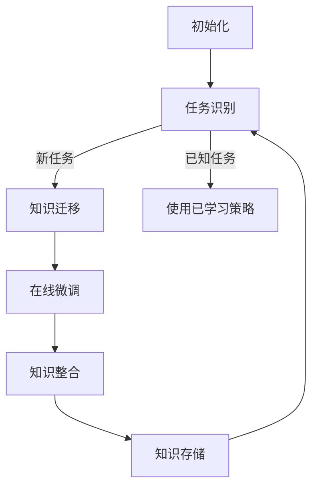

以下是关于"强化学习Reinforcement Learning的终生学习与持续适应能力"的技术博客文章正文内容：

# 强化学习Reinforcement Learning的终生学习与持续适应能力

## 1. 背景介绍

### 1.1 问题的由来

在当今快速变化的环境中,智能系统需要具备持续学习和适应的能力,以应对复杂动态环境的挑战。传统的机器学习方法通常假设训练和测试数据来自相同的固定分布,这使得模型在面临新的环境时表现不佳。因此,需要一种能够在线学习和持续适应的范式,以提高智能系统的鲁棒性和泛化能力。

### 1.2 研究现状  

近年来,强化学习(Reinforcement Learning,RL)作为一种有前景的机器学习范式,已经取得了长足的进步。RL系统通过与环境的交互来学习,能够在没有明确监督的情况下优化决策序列,从而获得最大化的长期回报。然而,大多数现有的RL算法假设环境是静态的,无法应对动态变化的情况。

### 1.3 研究意义

终生学习(Lifelong Learning)和持续适应(Continual Adaptation)是RL系统应对动态环境变化的关键。通过在线学习和知识迁移,RL系统可以持续更新其策略,从而适应新的环境条件和任务需求。这不仅提高了系统的泛化能力,还增强了其在复杂动态环境中的鲁棒性和适应性。

### 1.4 本文结构

本文首先介绍终生学习和持续适应在强化学习中的核心概念和挑战,然后详细阐述相关算法原理和数学模型。接下来,我们将通过实际项目实践和应用场景,深入探讨如何在实践中应用这些技术。最后,我们将总结未来发展趋势和面临的挑战,并推荐相关资源。

## 2. 核心概念与联系

终生学习(Lifelong Learning)和持续适应(Continual Adaptation)是强化学习中的两个关键概念,它们密切相关,但又有所区别。

**终生学习**指的是智能系统在整个生命周期内持续学习新知识和技能的能力。这种能力使系统能够从过去的经验中积累知识,并将其应用于新的任务和环境中。终生学习涉及知识迁移、元学习和多任务学习等技术。

**持续适应**则关注智能系统在动态环境中快速调整和适应的能力。当环境发生变化时,系统需要在线学习新的策略,同时保留之前学习到的有用知识。持续适应需要处理环境的非平稳性、任务的变化以及新旧知识之间的权衡。

在强化学习中,终生学习和持续适应是相辅相成的。终生学习为持续适应提供了知识基础,而持续适应则确保了系统在动态环境中的高效运行。通过结合这两种能力,RL系统可以实现真正的智能,适应复杂多变的环境。

## 3. 核心算法原理 & 具体操作步骤

### 3.1 算法原理概述

终生学习和持续适应在强化学习中的核心算法原理包括:

1. **渐进式知识传递(Progressive Knowledge Transfer)**:在学习新任务时,利用之前学习到的知识作为先验,加速新任务的学习过程。这种知识传递可以发生在不同层次,如低层次的特征提取或高层次的策略级别。

2. **元学习(Meta-Learning)**:通过在一系列相关任务上进行训练,学习一种通用的学习策略,从而加快在新任务上的适应速度。这种方法通常基于优化算法或神经网络的设计。

3. **在线学习和增量学习(Online and Incremental Learning)**:持续从新数据中学习,同时保留之前学习到的知识。这需要平衡稳定性和塑性,防止灾难性遗忘(Catastrophic Forgetting)。

4. **多任务学习(Multi-Task Learning)**:同时学习多个相关任务,利用任务之间的相关性提高学习效率和泛化能力。这种方法可以促进知识共享和迁移。

5. **层次化和模块化架构(Hierarchical and Modular Architectures)**:将知识组织成层次化和模块化的结构,有助于知识重用和组合,提高系统的可扩展性和适应性。

### 3.2 算法步骤详解

以下是一种典型的终生学习和持续适应算法的步骤:

1. **初始化**:使用少量初始数据训练一个基础模型,作为知识的起点。

2. **任务识别**:当遇到新的任务或环境时,需要识别它是否属于已知的任务类型。如果是新任务,则进入下一步;否则,直接使用相应的已学习策略。

3. **知识迁移**:从之前学习到的相关知识中,选择合适的部分作为新任务的初始化。这可以是低层次的特征提取器、高层次的策略等。

4. **在线微调**:使用新任务的数据,对迁移过来的知识进行在线微调和增量学习,以适应新环境。

5. **知识整合**:将新学习到的知识与现有知识库整合,形成更全面的知识表示。这可能需要处理新旧知识之间的冲突和权衡。

6. **知识存储**:将整合后的知识存储到知识库中,为未来的任务和环境做好准备。

7. **回到步骤2**:当遇到新的任务或环境变化时,重复上述过程。

该算法通过持续学习和知识积累,实现了终生学习和持续适应的目标。

### 3.3 算法优缺点

**优点**:

- 提高了系统的泛化能力和适应性,能够应对动态环境的变化
- 通过知识迁移和累积,提高了学习效率
- 具有可扩展性,可以持续学习新的任务和知识

**缺点**:

- 需要合理处理新旧知识之间的权衡,防止灾难性遗忘
- 知识整合过程可能会引入噪声和不一致性
- 对于完全陌生的任务,可能缺乏合适的先验知识进行迁移

### 3.4 算法应用领域

终生学习和持续适应算法在以下领域具有广泛的应用前景:

- **机器人技术**:机器人需要在动态环境中持续学习和适应,以完成各种任务。
- **自动驾驶**:自动驾驶系统需要适应不断变化的道路条件和交通情况。
- **对话系统**:对话代理需要持续学习新的知识和对话模式,以提供更自然的交互体验。
- **推荐系统**:推荐系统需要适应用户偏好的变化,提供个性化的推荐。
- **游戏AI**:游戏AI需要不断学习新的策略,以应对玩家的行为变化。

## 4. 数学模型和公式 & 详细讲解 & 举例说明

### 4.1 数学模型构建

我们可以将终生学习和持续适应问题建模为一系列相关的马尔可夫决策过程(Markov Decision Processes, MDPs)。每个MDP $\mathcal{M}_i = (\mathcal{S}_i, \mathcal{A}_i, \mathcal{P}_i, \mathcal{R}_i, \gamma_i)$ 表示一个任务或环境,其中:

- $\mathcal{S}_i$ 是状态空间
- $\mathcal{A}_i$ 是动作空间
- $\mathcal{P}_i(s'|s,a)$ 是状态转移概率
- $\mathcal{R}_i(s,a)$ 是即时回报函数
- $\gamma_i$ 是折现因子

我们的目标是学习一个策略 $\pi_i(a|s)$,使得在 $\mathcal{M}_i$ 中的期望回报 $\mathbb{E}_{\pi_i}[\sum_{t=0}^{\infty} \gamma_i^t r_t]$ 最大化。

在终生学习和持续适应的框架下,我们需要在一系列相关的MDPs $\{\mathcal{M}_i\}_{i=1}^N$ 上学习策略。我们可以利用先前任务中学习到的知识,如特征提取器 $\phi(s)$ 或策略 $\pi_j(a|s)$,作为新任务 $\mathcal{M}_i$ 的初始化,加速学习过程。

### 4.2 公式推导过程

假设我们已经在任务 $\mathcal{M}_j$ 上学习到了一个策略 $\pi_j(a|s)$,现在需要在新任务 $\mathcal{M}_i$ 上学习策略 $\pi_i(a|s)$。我们可以使用策略迁移(Policy Transfer)的方法,将 $\pi_j$ 作为 $\pi_i$ 的初始化,然后进行微调。

具体来说,我们可以定义一个损失函数:

$$\mathcal{L}(\pi_i) = \mathbb{E}_{\pi_i}\left[\sum_{t=0}^{\infty} \gamma_i^t \left(r_t - Q^{\pi_i}(s_t,a_t)\right)^2\right]$$

其中 $Q^{\pi_i}(s,a)$ 是在策略 $\pi_i$ 下的状态-动作值函数。我们的目标是最小化这个损失函数,即找到一个 $\pi_i$ 使得其行为与最优行为之间的差异最小。

为了加速学习过程,我们可以利用 $\pi_j$ 作为 $\pi_i$ 的初始化,即:

$$\pi_i(a|s) = \pi_j(a|s) + \Delta(a|s,\phi(s))$$

其中 $\Delta(a|s,\phi(s))$ 是一个需要学习的残差函数,用于微调策略以适应新任务。$\phi(s)$ 是一个状态特征提取器,可以从先前任务中迁移过来。

通过优化上述损失函数,我们可以学习到 $\Delta(a|s,\phi(s))$,从而获得适应新任务的策略 $\pi_i$。这种方法利用了先前任务的知识,加速了新任务的学习过程。

### 4.3 案例分析与讲解

考虑一个机器人控制的例子。假设我们已经在一个简单的环境中训练了一个机器人策略 $\pi_1$,用于导航和物体操作。现在,我们需要让机器人在一个新的复杂环境中工作,例如一个工厂车间。

我们可以将之前学习到的策略 $\pi_1$ 作为初始化,并使用上述方法进行微调,得到适应新环境的策略 $\pi_2$。具体来说:

1. 从 $\pi_1$ 中提取出底层的状态特征提取器 $\phi(s)$,如用于检测障碍物和目标物体的视觉特征。

2. 在新环境中收集少量数据,用于微调策略。

3. 定义一个残差函数 $\Delta(a|s,\phi(s))$,它将状态特征 $\phi(s)$ 作为输入,输出动作的残差。

4. 优化损失函数 $\mathcal{L}(\pi_2)$,学习残差函数 $\Delta(a|s,\phi(s))$,从而获得新策略 $\pi_2 = \pi_1 + \Delta(a|s,\phi(s))$。

通过这种方式,机器人可以快速适应新的工厂环境,同时保留了之前学习到的基本导航和操作能力。这种终生学习和持续适应的方法大大提高了机器人的灵活性和适应性。

### 4.4 常见问题解答

**Q: 如何防止灾难性遗忘(Catastrophic Forgetting)的发生