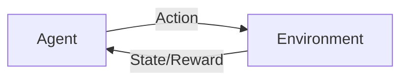

# 强化学习：DL、ML和AI的交集

关键词：强化学习、深度学习、机器学习、人工智能、Markov决策过程、Q-learning、策略梯度、DQN、AlphaGo

## 1. 背景介绍
### 1.1 问题的由来
近年来，随着人工智能(AI)技术的飞速发展，机器学习(ML)和深度学习(DL)已经在许多领域取得了突破性的进展。而强化学习(RL)作为机器学习的一个重要分支，正在成为人工智能领域的研究热点。强化学习试图让智能体(Agent)通过与环境的交互来学习最优策略，以获得最大的累积奖励。它综合了机器学习和最优控制理论，为智能体的自主学习和决策提供了一种通用框架。

### 1.2 研究现状
近年来，强化学习在许多领域都取得了显著的成果，尤其是与深度学习相结合后，更是在多个领域实现了超越人类的表现。2015年，DeepMind的DQN[1]在Atari游戏中超越了人类玩家。2016年，AlphaGo[2]击败了世界围棋冠军李世石。2017年，OpenAI Five[3]在Dota 2游戏中击败了职业选手组成的团队。这些里程碑式的成就充分展示了强化学习的巨大潜力。

### 1.3 研究意义
强化学习作为机器学习和人工智能的重要分支，其研究对于实现通用人工智能(AGI)具有重要意义。通过研究强化学习，我们可以让智能体学会在复杂环境中自主学习和决策，这对于解决现实世界中的许多问题(如自动驾驶、智能推荐、机器人控制等)都具有重要价值。此外，强化学习与深度学习、迁移学习等技术的结合，将进一步拓展其应用范围，为人工智能的发展注入新的活力。

### 1.4 本文结构
本文将全面介绍强化学习的核心概念、基本原理和经典算法。第2部分介绍强化学习的核心概念及其与机器学习和人工智能的关系。第3部分详细讲解强化学习的理论基础和几种经典算法。第4部分介绍强化学习中的数学模型和公式推导。第5部分通过代码实例演示强化学习算法的实现。第6部分讨论强化学习的实际应用场景。第7部分推荐相关的学习资源和开发工具。第8部分总结全文并展望强化学习的未来发展方向。

## 2. 核心概念与联系
强化学习的目标是让智能体学习一个最优策略，使其在与环境交互的过程中获得最大的累积奖励。这里涉及几个核心概念：
- 智能体(Agent)：可以感知环境状态并作出动作的实体，如机器人、软件程序等。
- 环境(Environment)：智能体所处的世界，会对智能体的动作做出反馈(下一个状态和即时奖励)。
- 状态(State)：环境在某一时刻的表征。
- 动作(Action)：智能体根据策略选择的与环境交互的行为。
- 策略(Policy)：将状态映射到动作的函数，决定智能体在某状态下应该采取的动作。
- 奖励(Reward)：环境对智能体动作的即时反馈，用数值表示行为的好坏。
- 价值(Value)：状态或动作的长期期望回报，考虑了即时奖励和未来奖励。

强化学习可以看作是机器学习的一个分支。传统的机器学习主要分为监督学习和无监督学习，前者通过带标签的样本来学习输入到输出的映射，后者通过无标签样本学习数据的内在结构和规律。而强化学习则是让智能体通过主动探索和试错来学习最优策略，并不需要预先准备好训练样本，而是通过即时反馈来不断优化策略。

从更广泛的视角来看，强化学习是实现人工智能的一个重要途径。人工智能的目标是创造能够模拟甚至超越人类智能的机器。而强化学习通过环境交互学习的方式，让机器具备了自主学习和决策的能力，是迈向通用人工智能的关键一步。

下图展示了强化学习中智能体与环境交互的示意图：

## 3. 核心算法原理 & 具体操作步骤
### 3.1 算法原理概述
强化学习的理论基础是马尔可夫决策过程(Markov Decision Process, MDP)。MDP由状态集合S、动作集合A、状态转移概率P和奖励函数R构成。在MDP中，环境的下一个状态只取决于当前状态和智能体采取的动作，这被称为马尔可夫性质。强化学习的目标就是在MDP框架下，寻找一个最优策略π*，使得智能体能获得最大的期望累积奖励。

求解MDP的经典算法主要有动态规划、蒙特卡洛方法和时序差分学习。动态规划适用于环境模型已知的情况，通过迭代计算值函数来寻找最优策略。蒙特卡洛方法通过采样的方式估计值函数，不需要知道环境模型，但是方差较大。时序差分学习结合了动态规划和蒙特卡洛方法的优点，通过自举(Bootstrap)的方式更新值函数，能在未知环境中在线学习。

### 3.2 算法步骤详解
接下来我们以时序差分学习中的Q-learning算法为例，详细讲解其具体步骤。

Q-learning算法[4]是一种值迭代算法，通过迭代更新动作-值函数Q(s,a)来逼近最优策略。Q函数表示在状态s下采取动作a的期望回报。Q-learning的更新公式为：

$$Q(s_t,a_t) \leftarrow Q(s_t,a_t) + \alpha[r_{t+1} + \gamma \max_{a}Q(s_{t+1},a) - Q(s_t,a_t)]$$

其中，$s_t$和$a_t$分别是t时刻的状态和动作，$r_{t+1}$是t+1时刻获得的即时奖励，α是学习率，γ是折扣因子。

Q-learning算法的具体步骤如下：
1. 初始化Q(s,a)，对所有s∈S,a∈A，令Q(s,a)=0
2. 重复以下步骤，直到收敛：
   1) 根据ε-greedy策略选择动作a，即以ε的概率随机选择动作，否则选择Q值最大的动作
   2) 执行动作a，观察奖励r和下一个状态s'
   3) 根据Q-learning的更新公式更新Q(s,a)
   4) s←s'
3. 输出最优策略π*，对任意s∈S，π*(s)=argmax_a Q(s,a)

### 3.3 算法优缺点
Q-learning算法的优点是简单易实现，对环境模型没有要求，能够在线学习。但其缺点是需要存储大量的Q值，不适合状态和动作空间很大的问题。此外，它也容易陷入局部最优，收敛速度较慢。

为了克服Q-learning的局限性，研究者提出了一系列改进算法，如DQN[1]将Q函数用深度神经网络来表示，大大提高了处理高维状态空间的能力。DDPG[5]将DQN扩展到连续动作空间，使得强化学习能应用于更广泛的控制任务。此外还有A3C[6]、TRPO[7]、PPO[8]等基于策略梯度的算法，它们直接学习策略函数，不需要存储Q值，更适合大规模并行训练。

### 3.4 算法应用领域
强化学习算法已经在许多领域得到了成功应用，如游戏AI、机器人控制、自动驾驶、推荐系统等。

在游戏AI方面，前面提到的DQN和AlphaGo都是典型代表。DQN在Atari游戏中达到了超人类的水平，而AlphaGo则击败了世界顶尖围棋选手。这些成就展示了深度强化学习在复杂博弈问题上的优势。

在机器人控制领域，强化学习为机器人的自主决策提供了有效途径。例如，DDPG算法被用于机械臂的抓取[9]和机器人的运动控制[10]任务。通过不断与环境交互，机器人能学会复杂的控制策略，大大提高了自主性和鲁棒性。

在自动驾驶领域，强化学习可以让车辆学习在复杂交通环境中的决策和规划能力。Waymo和特斯拉等公司都将强化学习应用于自动驾驶系统中[11]，通过海量的模拟数据训练，使得车辆能更安全高效地行驶。

在推荐系统领域，强化学习可以根据用户的长期反馈动态调整推荐策略。例如，阿里巴巴的算法工程师将基于DQN的推荐算法应用于淘宝App[12]，通过用户的点击和购买行为来优化商品推荐，提高了用户的参与度和转化率。

## 4. 数学模型和公式 & 详细讲解 & 举例说明
### 4.1 数学模型构建
前面提到，强化学习的理论基础是马尔可夫决策过程(MDP)。这里我们详细介绍MDP的数学模型。

一个MDP由四元组<S,A,P,R>构成：
- 状态集合S：有限的状态集合，s∈S表示智能体所处的环境状态
- 动作集合A：有限的动作集合，a∈A表示智能体可以采取的动作
- 状态转移概率P：$P(s'|s,a)$表示在状态s下采取动作a后转移到状态s'的概率
- 奖励函数R：$R(s,a)$表示在状态s下采取动作a后获得的即时奖励

MDP满足马尔可夫性质，即下一个状态s'只取决于当前状态s和动作a，与之前的状态和动作无关：

$$P(s_{t+1}|s_t,a_t,s_{t-1},a_{t-1},...) = P(s_{t+1}|s_t,a_t)$$

在MDP中，策略π定义为在状态s下选择动作a的概率分布：π(a|s)。我们的目标是寻找一个最优策略π*，使得智能体能获得最大的期望累积奖励。

定义状态价值函数$V^{\pi}(s)$为从状态s开始，遵循策略π能获得的期望回报：

$$V^{\pi}(s) = E_{\pi}[\sum_{k=0}^{\infty}\gamma^k r_{t+k+1} | s_t=s]$$

其中，γ∈[0,1]为折扣因子，用于平衡即时奖励和长期奖励。

类似地，定义动作价值函数$Q^{\pi}(s,a)$为在状态s下采取动作a，遵循策略π能获得的期望回报：

$$Q^{\pi}(s,a) = E_{\pi}[\sum_{k=0}^{\infty}\gamma^k r_{t+k+1} | s_t=s, a_t=a]$$

最优价值函数$V^*(s)$和$Q^*(s,a)$分别表示从状态s开始、在状态s下采取动作a能获得的最大期望回报：

$$V^*(s) = \max_{\pi} V^{\pi}(s)$$

$$Q^*(s,a) = \max_{\pi} Q^{\pi}(s,a)$$

最优策略π*定义为在每个状态下选择使Q*最大化的动作：

$$\pi^*(s) = \arg\max_{a} Q^*(s,a)$$

### 4.2 公式推导过程
接下来我们推导Q-learning算法中的核心公式。

根据Q函数的定义，我们有：

$$Q^{\pi}(s,a) = E_{\pi}[r_{t+1} + \gamma V^{\pi}(s_{t+1}) | s_t=s, a_t=a]$$

$$             = \sum_{s'} P(s'|s,a) [R(s,a) + \gamma V^{\pi}(s')]$$

对于最优策略π*，有：

$$Q^*(s,a) = \sum_{s'} P(s'|s,a) [R(s,a) + \gamma \max_{a'} Q^*(s',a')]$$

这就是著名的Bellman最优方程