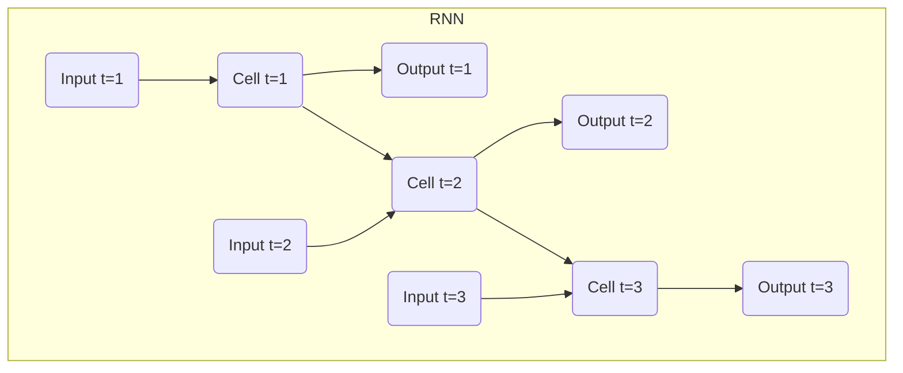
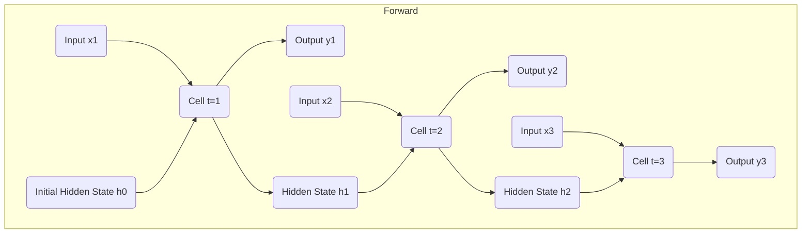

# 循环神经网络 (Recurrent Neural Networks, RNN) 原理与代码实例讲解

## 1. 背景介绍

### 1.1 问题的由来

在传统的神经网络模型中,如前馈神经网络(Feed-forward Neural Networks),输入数据是独立且无序的。然而,在现实世界中,大量的数据都是有序列的,比如语音、文本、视频等。这些序列数据存在着时间或空间上的依赖关系,前一时刻的输出会影响后一时刻的输入。传统的神经网络无法很好地处理这种序列数据。

为了解决这个问题,循环神经网络(Recurrent Neural Networks, RNN)应运而生。RNN是一种特殊的人工神经网络,它能够处理序列数据,并且在处理数据序列时,能够利用序列之前的信息。RNN在保留前一时刻的状态信息的同时,对当前输入序列数据进行处理,并将输出作为下一时刻的输入,从而实现对序列数据的建模。

### 1.2 研究现状

近年来,随着深度学习的快速发展,RNN在自然语言处理、语音识别、机器翻译等领域取得了巨大的成功。著名的RNN变体,如长短期记忆网络(Long Short-Term Memory, LSTM)和门控循环单元(Gated Recurrent Unit, GRU),能够更好地捕捉长期依赖关系,有效解决了传统RNN存在的梯度消失和梯度爆炸问题。

此外,RNN还被广泛应用于时间序列预测、手写识别、情感分析、机器人控制等领域。随着计算能力的提高和数据量的增加,RNN的性能不断提升,成为序列建模的核心技术之一。

### 1.3 研究意义

研究RNN具有重要的理论和实践意义:

1. **理论意义**:RNN为处理序列数据提供了一种新的思路和框架,扩展了神经网络的应用范围。研究RNN有助于深入理解序列数据的内在规律,促进机器学习和人工智能理论的发展。

2. **实践意义**:RNN在自然语言处理、语音识别、时间序列预测等领域取得了卓越的成绩,为解决实际问题提供了有力的工具。研究RNN有助于提高这些应用领域的性能,推动相关技术的发展和应用。

### 1.4 本文结构

本文将全面介绍RNN的原理、算法和实践应用。主要内容包括:

1. RNN的基本概念和原理,与传统神经网络的区别。
2. RNN的核心算法,如前向传播、反向传播等,以及优化算法。
3. RNN的数学模型和公式推导,帮助读者深入理解其内在机制。
4. 基于Python的RNN代码实例,包括环境搭建、模型构建和训练等。
5. RNN在自然语言处理、时间序列预测等领域的实际应用场景。
6. RNN的发展趋势、挑战和未来展望。

## 2. 核心概念与联系

循环神经网络(Recurrent Neural Networks, RNN)是一种特殊的人工神经网络,它具有循环连接,能够处理序列数据。RNN的核心概念包括:

1. **序列数据**:RNN专门设计用于处理序列数据,如文本、语音、视频等。这些数据具有时间或空间上的依赖关系。

2. **循环连接**:RNN中的神经元之间存在循环连接,使得网络能够将前一时刻的状态信息传递到当前时刻,从而捕捉序列数据的动态特征。

3. **隐藏状态**:RNN在每个时刻都会计算一个隐藏状态,该隐藏状态综合了当前输入和前一时刻的隐藏状态,用于计算当前时刻的输出。

4. **参数共享**:RNN在处理序列数据时,对于每个时刻,使用相同的权重参数进行计算,实现了参数共享,降低了模型的复杂度。

RNN与传统的前馈神经网络有着本质的区别。前馈神经网络将输入数据视为独立的样本,无法捕捉数据之间的依赖关系。而RNN通过引入循环连接和隐藏状态,能够有效地处理序列数据,并捕捉数据之间的动态变化。

RNN的核心思想是将序列数据逐个时刻地输入到网络中,在每个时刻,网络会根据当前输入和前一时刻的隐藏状态计算出当前时刻的输出和新的隐藏状态。通过这种递归的方式,RNN能够学习到序列数据的内在规律和动态特征。

下面是RNN的基本结构示意图:



在上图中,每个时刻的输入都会被送入RNN单元(Cell),同时也会接收到前一时刻的隐藏状态作为输入。RNN单元会根据当前输入和前一时刻的隐藏状态计算出当前时刻的输出和新的隐藏状态,并将新的隐藏状态传递给下一时刻的RNN单元。

通过这种循环的方式,RNN能够捕捉序列数据中的长期依赖关系,并且在处理每个时刻的数据时,都能够利用之前时刻的信息,从而更好地建模序列数据。

## 3. 核心算法原理 & 具体操作步骤

### 3.1 算法原理概述

RNN的核心算法包括前向传播(Forward Propagation)和反向传播(Backward Propagation)两个阶段。

**前向传播**:在前向传播阶段,RNN会逐个时刻地处理输入序列,并计算每个时刻的输出和隐藏状态。具体过程如下:

1. 初始化隐藏状态,通常将其设置为全0向量。
2. 对于每个时刻t:
   - 将当前输入$x_t$和前一时刻的隐藏状态$h_{t-1}$作为输入,计算当前时刻的隐藏状态$h_t$。
   - 根据当前隐藏状态$h_t$,计算当前时刻的输出$y_t$。
   - 将当前隐藏状态$h_t$传递给下一时刻。

**反向传播**:在反向传播阶段,RNN会根据输出和目标值计算损失函数,并通过反向传播算法更新网络权重,以最小化损失函数。具体过程如下:

1. 计算最后一个时刻的损失函数。
2. 对于每个时刻t,从最后一个时刻开始:
   - 计算当前时刻的梯度,包括输出梯度和隐藏状态梯度。
   - 利用链式法则,将梯度传递给前一时刻。
3. 更新网络权重,使用优化算法(如梯度下降)最小化损失函数。

需要注意的是,由于RNN存在循环连接,在反向传播过程中,梯度会通过时间步长进行传递,这可能导致梯度消失或梯度爆炸问题。为了解决这个问题,通常采用一些技术,如梯度剪裁(Gradient Clipping)、LSTM和GRU等改进的RNN变体。

### 3.2 算法步骤详解

接下来,我们将详细介绍RNN的前向传播和反向传播算法步骤。

#### 3.2.1 前向传播

假设输入序列为$X = (x_1, x_2, \dots, x_T)$,目标输出序列为$Y = (y_1, y_2, \dots, y_T)$,其中T是序列长度。RNN的前向传播过程如下:

1. 初始化隐藏状态$h_0$,通常将其设置为全0向量。
2. 对于每个时刻t (t = 1, 2, ..., T):
   - 计算当前时刻的隐藏状态$h_t$:
     $$h_t = \tanh(W_{hx}x_t + W_{hh}h_{t-1} + b_h)$$
     其中$W_{hx}$是输入到隐藏层的权重矩阵,$W_{hh}$是隐藏层到隐藏层的权重矩阵,$b_h$是隐藏层的偏置向量,tanh是激活函数。
   - 计算当前时刻的输出$y_t$:
     $$y_t = W_{yh}h_t + b_y$$
     其中$W_{yh}$是隐藏层到输出层的权重矩阵,$b_y$是输出层的偏置向量。

上述过程可以用下面的流程图表示:



在上图中,每个时刻的输入$x_t$和前一时刻的隐藏状态$h_{t-1}$作为输入,通过RNN单元计算得到当前时刻的输出$y_t$和隐藏状态$h_t$。隐藏状态$h_t$会被传递给下一时刻,用于计算下一时刻的输出和隐藏状态。

#### 3.2.2 反向传播

在前向传播完成后,我们需要计算损失函数,并通过反向传播算法更新网络权重。假设损失函数为$L$,反向传播过程如下:

1. 计算最后一个时刻T的损失函数$L_T$。
2. 对于每个时刻t (t = T, T-1, ..., 1):
   - 计算当前时刻的输出梯度:
     $$\frac{\partial L_t}{\partial y_t} = \frac{\partial L_t}{\partial y_t} + \frac{\partial L_{t+1}}{\partial h_t}W_{hh}^T$$
   - 计算当前时刻的隐藏状态梯度:
     $$\frac{\partial L_t}{\partial h_t} = \frac{\partial L_t}{\partial y_t}W_{yh}^T + \frac{\partial L_{t+1}}{\partial h_t} \odot (1 - h_t^2)$$
   - 计算当前时刻的权重梯度:
     $$\frac{\partial L_t}{\partial W_{hx}} = \frac{\partial L_t}{\partial h_t}x_t^T$$
     $$\frac{\partial L_t}{\partial W_{hh}} = \frac{\partial L_t}{\partial h_t}h_{t-1}^T$$
     $$\frac{\partial L_t}{\partial W_{yh}} = \frac{\partial L_t}{\partial y_t}h_t^T$$
   - 计算当前时刻的偏置梯度:
     $$\frac{\partial L_t}{\partial b_h} = \frac{\partial L_t}{\partial h_t}$$
     $$\frac{\partial L_t}{\partial b_y} = \frac{\partial L_t}{\partial y_t}$$
3. 更新网络权重,使用优化算法(如梯度下降)最小化损失函数:
   $$W_{hx} \leftarrow W_{hx} - \alpha \frac{\partial L}{\partial W_{hx}}$$
   $$W_{hh} \leftarrow W_{hh} - \alpha \frac{\partial L}{\partial W_{hh}}$$
   $$W_{yh} \leftarrow W_{yh} - \alpha \frac{\partial L}{\partial W_{yh}}$$
   $$b_h \leftarrow b_h - \alpha \frac{\partial L}{\partial b_h}$$
   $$b_y \leftarrow b_y - \alpha \frac{\partial L}{\partial b_y}$$
   其中$\alpha$是学习率。

上述过程可以用下面的流程图表示:

```mermaid
graph TD
    subgraph Backward
        output3(Output y3) --> loss3(Loss L3)
        loss3 --> dh3(dL3/dh3)
        dh3 --> dW3(dL3/dW)
        dh3 --> db3(dL3/db)
        dh3 --> dh2(dL2/dh2)
        output2(Output y2) --> loss2(Loss L2)
        loss2 --> 