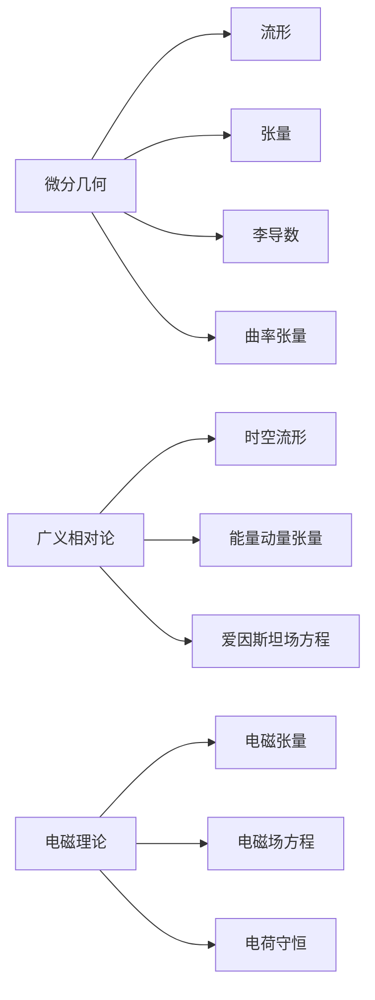

# 微分几何入门与广义相对论：电荷与电荷守恒

## 1. 背景介绍

### 1.1 问题的由来

在经典物理学中，电荷守恒定律是一个基本原理。它规定电荷不能被创造或消灭，只能在物质系统之间转移。然而,在相对论框架下,这一定律需要重新审视。爱因斯坦的广义相对论将时空描述为一个弯曲的流形,物质和辐射的存在会使时空产生弯曲。因此,电荷可能会影响时空几何,而时空几何的变化又可能影响电荷的运动和守恒性。

为了研究这一问题,我们需要将电磁理论与广义相对论相结合,建立一个统一的理论框架。这就需要借助微分几何的工具和方法,将电磁场方程式推广到曲率时空中。

### 1.2 研究现状

目前,已有一些工作致力于将电磁理论推广到曲率时空中。最著名的是爱因斯坦与英年早逝的助手罗森菲尔德(Rosenfeld)合作的尝试。他们提出了一种新的张量表示电磁场,并推导出了相应的场方程式。不过,这种方法存在一些缺陷,例如无法满足电荷守恒定律。

另一种尝试是采用纤维丛(fiber bundle)的数学工具,将电磁场描述为一个几何对象,定义在时空流形上的一个特殊的纤维丛上。这种方法更加自然和优雅,但数学上也更加复杂。

### 1.3 研究意义

将电磁理论推广到曲率时空中,不仅有助于我们更深入地理解电磁现象的本质,还可能为探索量子引力理论提供一些线索。毕竟,量子引力理论的一个核心目标,就是将电磁力、强力、弱力和引力统一起来。

此外,在极端的强引力场环境中,如黑洞和奇异点附近,电磁场可能会表现出一些新奇的行为,值得我们深入探讨。

### 1.4 本文结构

本文将首先介绍一些微分几何和广义相对论的基本概念,为后面的讨论打下基础。然后,我们将详细推导出电磁场在曲率时空中的运动方程,并探讨电荷守恒定律在这种情况下是否仍然成立。接下来,我们将给出一些具体的应用场景和数值计算实例,帮助读者更好地理解理论。最后,我们将讨论这一领域的未来发展方向和挑战。

## 2. 核心概念与联系

在探讨电磁场在曲率时空中的行为之前,我们需要先了解一些基本的微分几何和广义相对论概念。

微分几何为我们提供了在曲面和高维流形上进行几何研究的数学工具,包括:

- **流形(Manifold)**: 局部可以等同于欧几里得空间,但整体可能是弯曲的拓扑空间。时空在广义相对论中就被描述为一个4维流形。

- **张量(Tensor)**: 在流形上定义的多线性函数,可以描述各种物理量,如标量场、矢量场、张量场等。电磁场就可以用一种特殊的张量来描述。

- **李导数(Lie Derivative)**: 沿着向量场的方向求导,用于定义张量场在流形上的并行传输。

- **曲率张量(Riemann Curvature Tensor)**: 描述流形内曲率大小和分布的关键量,与引力场有着内在的几何关联。

广义相对论则将万有引力现象解释为时空几何的弯曲,其核心概念包括:

- **时空流形(Spacetime Manifold)**: 描述时空的4维流形,由物质和能量的存在而产生弯曲。

- **能量动量张量(Energy-Momentum Tensor)**: 描述物质和辐射的能量和动量分布。

- **爱因斯坦场方程(Einstein Field Equations)**: 将时空曲率与物质能量动量联系起来的张量方程。

至于电磁理论,其核心概念有:

- **电磁张量(Electromagnetic Tensor)**: 用于描述电磁场的张量量。

- **电磁场方程(Maxwell's Equations)**: 描述电磁场在平直时空中的运动规律。

- **电荷守恒(Charge Conservation)**: 电荷不能被创造或消灭,只能在物质系统之间转移。

我们的目标就是将这些概念联系起来,建立一个统一的理论框架,描述电磁场在曲率时空中的行为,并探讨电荷守恒定律在这种情况下是否仍然成立。

## 3. 核心算法原理与具体操作步骤

### 3.1 算法原理概述

为了在曲率时空中描述电磁场的运动,我们需要将电磁场方程推广到流形上。这可以通过将电磁场用一种特殊的张量来表示,然后在流形上对这个张量进行运算来实现。

具体来说,我们定义一个反对称的张量场$F_{\mu\nu}$来描述电磁场,其中$\mu,\nu=0,1,2,3$分别对应时间和三个空间坐标。这个张量场满足以下方程:

$$
\nabla_\mu F^{\mu\nu} = J^\nu
$$

其中$\nabla_\mu$是在曲率时空中的协变导数,$J^\nu$是电流四矢量。这个方程与平直时空中的Maxwell方程形式相似,只是用协变导数取代了普通导数。

为了保证电荷守恒,我们还需要电流四矢量满足:

$$
\nabla_\mu J^\mu = 0
$$

也就是说,电流必须是无divergence的。

接下来的关键问题是,如何在曲率时空中明确定义协变导数$\nabla_\mu$?这就需要借助微分几何中的一些工具,如李导数、仿射连接等。

### 3.2 算法步骤详解

现在,我们来具体看一下在曲率时空中推导电磁场方程的步骤:

1. **定义电磁张量场**

我们首先在时空流形$\mathcal{M}$上定义一个反对称的张量场$F_{\mu\nu}$,它的分量就描述了电场$\vec{E}$和磁场$\vec{B}$:

$$
F_{\mu\nu}=\begin{pmatrix}
0 & E_1/c & E_2/c & E_3/c\\
-E_1/c & 0 & -B_3 & B_2\\
-E_2/c & B_3 & 0 & -B_1\\
-E_3/c & -B_2 & B_1 & 0
\end{pmatrix}
$$

其中$c$是光速。

2. **定义电流四矢量**

我们还需要定义电流四矢量$J^\mu$,它的时间分量是电荷密度$\rho$,空间分量是电流密度$\vec{j}$:

$$
J^\mu = (\rho c, \vec{j})
$$

3. **推导电磁张量场方程**

我们希望在曲率时空中也能写出类似Maxwell方程的张量方程,所以考虑对$F_{\mu\nu}$做协变导数:

$$
\nabla_\lambda F_{\mu\nu} + \nabla_\mu F_{\nu\lambda} + \nabla_\nu F_{\lambda\mu} = 0
$$

上式中的$\nabla_\mu$是在曲率时空中的协变导数,它的定义需要借助仿射连接(affine connection)。

4. **施加电荷守恒条件**

为了保证电荷守恒,我们要求电流四矢量$J^\mu$是无散度的,即:

$$
\nabla_\mu J^\mu = 0
$$

将这个条件代入前面的张量方程,我们可以得到最终的电磁场方程:

$$
\nabla_\mu F^{\mu\nu} = J^\nu
$$

这就是我们想要的电磁场在曲率时空中的运动方程。

5. **分析方程的性质**

我们可以进一步分析这个方程的一些性质:

- 当时空是平直的时候,协变导数就等于普通导数,方程就退化为经典的Maxwell方程。
- 方程的左边包含了时空曲率的信息,说明电磁场的传播会受到时空弯曲的影响。
- 如果电流四矢量$J^\mu$满足连续性方程$\nabla_\mu J^\mu=0$,那么我们可以证明电荷守恒定律在曲率时空中仍然成立。
- 这个方程只是一种可能的推广方式,我们还可以考虑其他形式,如利用纤维丛的数学工具。

### 3.3 算法优缺点

上述算法的一个主要优点是,它保持了与经典Maxwell理论在数学形式上的一致性,使得推广到曲率时空时更加自然。同时,它也保证了电荷守恒定律的成立。

但是,这种方法也存在一些缺陷和局限性:

- 它依赖于特定的张量表示,而张量的选择并不是唯一的,不同的选择可能导致不同的理论。
- 推导过程使用了一些近似和简化,如忽略了电磁场自身对时空曲率的影响。
- 在极端的强引力场环境下,这种近似可能失效,需要考虑更精确的理论。
- 从数学上看,这种方法缺乏深层的几何理解,无法揭示电磁场与时空几何之间的内在联系。

因此,虽然这种算法可以作为一种有用的近似,但从根本上来说,我们仍需要一个更加完备和自洽的理论框架,能够自然地将电磁现象与广义相对论融合。

### 3.4 算法应用领域

尽管存在上述局限性,但这种将电磁场方程推广到曲率时空的算法,在一些特定的应用领域仍然是有用的。例如:

- **天体物理学**:在研究中子星、黑洞等天体时,需要考虑强引力场对电磁辐射的影响。
- **早期宇宙模型**:在研究大爆炸初期的宇宙演化时,需要将电磁场纳入广义相对论的框架。
- **实验和观测检验**:通过对这种推广理论的实验和观测检验,可以进一步验证广义相对论的有效性。
- **理论探索**:作为一种简化模型,它可以为发展更精确的量子引力理论提供一些线索和启发。

当然,在这些应用中,我们也需要时刻警惕算法的局限性,并根据具体情况作出必要的修正和改进。

## 4. 数学模型和公式详细讲解与举例说明

在前面的章节中,我们已经给出了在曲率时空中描述电磁场运动的核心算法和方程。现在,我们将更加详细地讲解其中涉及的数学模型和公式,并通过具体例子加深理解。

### 4.1 数学模型构建

为了在曲率时空中描述电磁场,我们需要将其建模为一种几何对象。最自然的选择是将其表示为一个反对称的张量场$F_{\mu\nu}$,定义在时空流形$\mathcal{M}$上。

这种张量场的分量可以很自然地对应经典电磁理论中的电场$\vec{E}$和磁场$\vec{B}$:

$$
F_{\mu\nu}=\begin{pmatrix}
0 & E_1/c & E_2/c & E_3/c\\
-E_1/c & 0 & -B_3 & B_2\\
-E_2/c & B_3 & 0 & -B_1\\
-E_3/c & -B_2 & B_1 & 0
\end{pmatrix}
$$

其中$c$是光速,希腊字母指标$\mu,\nu=0,1,2,3$分别对应时间和三个空间坐标。

在这种表示下,我们可以定义电磁场的场强$F=\sqrt{-F_{\mu\nu}F^{\mu\nu}}$,其中$F^{\mu\nu}$是$F_{\mu\nu}$的逆张量。

为了描述电磁场