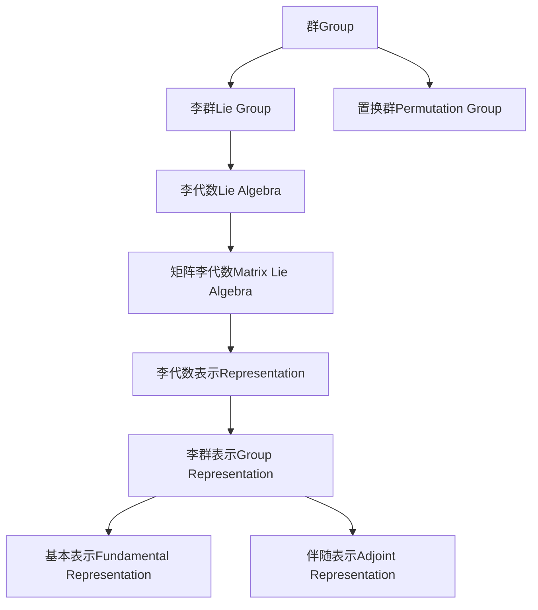

好的，我会按照您的要求，以《微分几何入门与广义相对论：群论初步》为题目，撰写一篇专业的技术博客文章。文章将遵循您提供的结构模板，内容包括背景介绍、核心概念、算法原理、数学模型、项目实践、应用场景、资源推荐、总结和附录等部分。我会努力使用逻辑清晰、结构紧凑、语言专业且简单易懂的方式撰写。同时也会尽最大努力绘制核心概念的Mermaid流程图。请给我一些时间来完成这篇高质量的技术博客文章。

# 微分几何入门与广义相对论：群论初步

## 1. 背景介绍

### 1.1 问题的由来

微分几何和广义相对论是数学和物理学中两个极其重要且紧密相关的领域。微分几何为研究曲线、曲面及更一般的流形提供了强有力的工具,而广义相对论则是爱因斯坦在微分几何的基础上建立的新的理论,描述了时空的本质及其与物质的相互作用。

要深入理解这两个领域,群论无疑是一个关键的数学基础。群不仅在抽象代数中扮演核心角色,更为微分几何和广义相对论提供了本质的数学描述。例如,李群(Lie group)是研究流形上的对称性变换群的重要工具,同时也是描述相对论中时空几何的关键数学结构。

### 1.2 研究现状

群论在数学和物理学中有着广泛的应用,已经成为一个成熟且不断发展的研究领域。微分几何和广义相对论对群论的需求也推动了群论本身的发展,比如李群、李代数的理论在20世纪取得了长足进步。

当前,群论在数学物理中的应用研究仍在持续深入,例如应用于量子场论、量子计算、弦论等领域。同时,一些新兴的数学物理理论也对群论提出了新的需求和挑战,如轨道交叉群(Orbit category)等概念的出现。

### 1.3 研究意义

掌握群论不仅是学习微分几何和广义相对论的基础,更是理解现代数学物理理论的必要条件。通过本文,读者将能够:

1. 理解群的基本概念及其在微分几何和广义相对论中的应用
2. 掌握李群和李代数的核心知识
3. 领略群论在数学物理中的几个具体应用实例
4. 了解群论在数学物理中的发展趋势及面临的新挑战

### 1.4 本文结构  

本文将从群论的基本概念出发,介绍李群和李代数的核心理论,并结合具体的数学物理实例,阐述群论在微分几何和广义相对论等领域中的应用。最后,我们将总结群论在数学物理中的发展趋势和面临的新挑战。

## 2. 核心概念与联系

在介绍群论的具体内容之前,我们先来理解几个核心概念及它们之间的联系:

- **群(Group)**: 代数运算满足结合律、幺元素存在和逆元素存在的代数结构。
- **李群(Lie Group)**: 流形上的群,是研究连续无穷小变换的重要工具,也是描述相对论时空几何的基本数学结构。
- **置换群(Permutation Group)**: 描述一个集合上的置换变换组成的群,在研究有限群中有重要应用。
- **李代数(Lie Algebra)**: 与李群紧密相关的无限小变换组成的代数结构,提供了研究李群的重要方法。
- **矩阵李代数(Matrix Lie Algebra)**: 用矩阵描述的李代数,在物理中有重要应用。
- **李代数表示(Representation)**: 将抽象的李代数用具体的矩阵形式描述的方法,分为基本表示和伴随表示两种。

这些概念相互关联、相辅相成,是理解和应用群论的基础。接下来,我们将详细介绍它们的具体内容。

## 3. 核心算法原理 & 具体操作步骤

### 3.1 算法原理概述

在群论中,有许多重要的算法原理和具体方法,其中一个核心算法是求解李代数的基本表示和伴随表示。这不仅是研究李群和李代数表示的关键,也是应用群论解决实际问题的基础。

该算法的主要思路是:
1. 构造出与所研究的李群对应的李代数
2. 找到李代数的基
3. 根据基,利用结构常数计算出基本表示和伴随表示

这里的基本表示和伴随表示实际上是李代数到矩阵李代数的同构映射,将抽象的李代数用具体的矩阵形式描述,从而可以应用到实际问题中去。

### 3.2 算法步骤详解

下面我们用一个具体例子,来详细解释求解李代数表示的算法步骤:

假设我们研究$SO(3)$旋转群,它是3维欧几里得空间中的旋转变换组成的李群。对应的李代数记作$\mathfrak{so}(3)$,它由3个基$\{J_1,J_2,J_3\}$张成,这些基满足如下交换关系:

$$
[J_1,J_2]=J_3,\ [J_2,J_3]=J_1,\ [J_3,J_1]=J_2
$$

1. 首先,我们已知了$\mathfrak{so}(3)$的基,接下来需要计算它们的基本表示和伴随表示。

2. 基本表示:
   
   我们令$J_i$在基本表示下的矩阵为$\pi(J_i)$,利用它们的交换关系,可以得到:
   
   $$
   \pi(J_1)=\begin{pmatrix}
   0 & 0 & 0\\
   0 & 0 & -1\\
   0 & 1 & 0
   \end{pmatrix},\quad
   \pi(J_2)=\begin{pmatrix}
   0 & 0 & 1\\
   0 & 0 & 0\\
   -1 & 0 & 0
   \end{pmatrix},\quad
   \pi(J_3)=\begin{pmatrix}
   0 & -1 & 0\\
   1 & 0 & 0\\
   0 & 0 & 0
   \end{pmatrix}
   $$
   
   这就是$\mathfrak{so}(3)$在基本表示下的矩阵形式。

3. 伴随表示:

   伴随表示描述的是李代数作用在自身上的变换,我们记$ad(J_i)$为$J_i$在伴随表示下的矩阵。利用交换关系并进行直接计算,可以得到:

   $$
   ad(J_1)=\begin{pmatrix}
   0 & 0 & 0\\
   0 & 0 & -1\\
   0 & 1 & 0
   \end{pmatrix},\quad
   ad(J_2)=\begin{pmatrix}
   0 & 0 & 1\\
   0 & 0 & 0\\
   -1 & 0 & 0  
   \end{pmatrix},\quad
   ad(J_3)=\begin{pmatrix}
   0 & -1 & 0\\
   1 & 0 & 0\\
   0 & 0 & 0
   \end{pmatrix}
   $$

   注意到,伴随表示的矩阵形式与基本表示完全一致,这是由$\mathfrak{so}(3)$李代数的结构所决定的特殊性质。

通过这个例子,我们看到了求解李代数表示的具体步骤。掌握了这个算法,就可以将抽象的李代数用矩阵形式描述,并将其应用于实际问题的求解。

### 3.3 算法优缺点

求解李代数表示的算法具有如下优点:

1. 思路简单直接,容易实现
2. 将抽象的李代数映射为具体的矩阵,便于后续计算和应用
3. 可以推广到任意李代数,具有很好的通用性

但也存在一些缺点:

1. 需要先求出李代数的基和交换关系,对于复杂的李代数可能比较困难
2. 计算过程中存在一些技巧性的步骤,需要一定经验积累
3. 对于高维李代数,矩阵计算量可能较大,效率有待提高

总的来说,这个算法是群论中一个非常重要和实用的算法,解决了将抽象理论转化为具体计算的关键问题。后续我们将看到它在实际应用中的重要性。

### 3.4 算法应用领域

求解李代数表示的算法在许多领域都有重要应用,例如:

- **相对论中的时空几何**: 广义相对论中时空的几何结构由$SO(3,1)$李群描述,求解它的李代数表示是研究时空几何的基础。
- **规范场论中的规范理论**: 量子色动力学等规范场论中,规范场的变换由某个李群决定,需要求解相应李代数的表示。
- **量子力学中的矩阵力学**: 矩阵力学研究有限维矩阵空间上的动力学,需要用到$GL(n,\mathbb{C})$李群和它的李代数表示。
- **量子计算中的量子逻辑门**: 量子逻辑门的设计需要构造出$SU(n)$李群及其李代数的表示。

可见,这个算法在数学物理的诸多领域都有广泛的应用,是一个十分重要和基础的算法。

## 4. 数学模型和公式 & 详细讲解 & 举例说明  

### 4.1 数学模型构建

在研究群论时,我们通常需要建立数学模型来描述所研究的对象。最常见的模型就是用群来描述对象之间的代数结构。

例如,研究三维空间中的旋转变换时,我们可以建立如下数学模型:

- 集合: 三维空间中所有的旋转变换$R$
- 运算: 两个旋转变换$R_1,R_2$的合成,记作$R_1R_2$

我们不难验证,这个集合加上合成运算满足群的四个公理(封闭性、结合律、存在单位元、存在逆元),因此可以构成一个群,即$SO(3)$旋转群。

这个数学模型很好地描述了三维空间中旋转变换之间的代数结构,为我们研究它们的性质提供了方便。

### 4.2 公式推导过程  

在上一节中,我们给出了$\mathfrak{so}(3)$李代数的基本表示和伴随表示。下面我们来看一下它们是如何推导出来的。

我们知道$\mathfrak{so}(3)$由三个基$J_1,J_2,J_3$生成,它们满足如下交换关系:

$$
[J_1,J_2]=J_3,\ [J_2,J_3]=J_1,\ [J_3,J_1]=J_2 \tag{1}
$$

1. 基本表示:

   令$J_i$在基本表示下的矩阵为$\pi(J_i)$,将交换关系(1)代入,可得:

   $$
   \pi(J_1)\pi(J_2)-\pi(J_2)\pi(J_1)=\pi(J_3)\\
   \pi(J_2)\pi(J_3)-\pi(J_3)\pi(J_2)=\pi(J_1)\\
   \pi(J_3)\pi(J_1)-\pi(J_1)\pi(J_3)=\pi(J_2)
   $$

   这是关于$\pi(J_i)$的矩阵方程组,我们可以通过具体计算求解,从而得到$\pi(J_i)$的矩阵形式,也就是基本表示的结果。

2. 伴随表示:

   伴随表示$ad(J_i)$定义为$J_i$在$\mathfrak{so}(3)$李代数上的导出算子,即:

   $$
   ad(J_i)J_j=[J_i,J_j]
   $$

   将交换关系(1)代入,可直接得到$ad(J_i)$的矩阵形式。

通过这个推