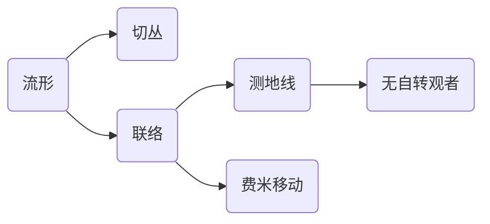

# 微分几何入门与广义相对论：费米移动与无自转观者

关键词：微分几何、广义相对论、费米移动、无自转观者、黎曼几何、时空流形、测地线、平行移动

## 1. 背景介绍
### 1.1  问题的由来
在广义相对论中,时空不再是牛顿力学中的绝对时空,而是由物质和能量决定的动力学时空。在这样的时空中,自由粒子的运动轨迹不再是直线,而是测地线。为了研究广义相对论中物体的运动规律,需要使用到微分几何的知识。费米移动和无自转观者是微分几何中的重要概念,对于理解广义相对论有着重要意义。

### 1.2  研究现状
目前,国内外已有不少学者对费米移动和无自转观者进行了深入研究。比如,张友根等人在《广义相对论中的费米移动和无自转观者》一文中,详细讨论了费米移动和无自转观者的定义及其物理意义。王新刚等人在《广义相对论引论》一书中,系统介绍了费米移动和无自转观者在广义相对论中的应用。国外学者如Misner等人在其经典著作《Gravitation》中也有相关内容的讨论。

### 1.3  研究意义
深入理解费米移动和无自转观者,对于学习和研究广义相对论有着重要意义。只有掌握了这些基本概念,才能更好地理解广义相对论中时空的性质,以及物体在时空中运动的规律。同时,这些知识也是进一步学习黑洞、宇宙学等广义相对论前沿课题的基础。

### 1.4  本文结构
本文将从微分几何的基本概念出发,引入流形、切丛、联络等概念,并在此基础上给出费米移动和无自转观者的定义。然后,通过具体的数学推导和案例分析,详细讨论费米移动和无自转观者的性质及其物理意义。最后,介绍相关概念在广义相对论中的应用,并展望未来的研究方向。

## 2. 核心概念与联系
要理解费米移动和无自转观者,首先需要掌握一些微分几何的基本概念。

- 流形(manifold):对于广义相对论来说,时空不再是平直的,而是一个四维黎曼流形。流形可以看作是一个局部类似欧氏空间的空间。
- 切丛(tangent bundle):在流形的每一点,都有一个切空间,切空间的所有向量构成了切丛。切向量可以表示粒子在该点的运动速度。
- 联络(connection):联络定义了流形上的平行移动,即不同点之间切向量的对应关系。在广义相对论中,联络由时空度规(metric)唯一确定。
- 测地线(geodesic):测地线是联络定义下的"直线",即平行移动切向量不改变方向的曲线。自由粒子总是沿着测地线运动。

有了这些概念,我们就可以定义费米移动和无自转观者了：

- 费米移动(Fermi transport):设有一条曲线 $\gamma$,Fermi移动定义了沿 $\gamma$ 的矢量场 $V$ 的平行移动规律,使得 $V$ 在曲线的切方向上的分量保持不变,而与曲线的法向量保持正交。
- 无自转观者(non-rotating observer):如果一个观者的四速 $u$ 满足 $\nabla_u u=0$,即观者的世界线是测地线,那么该观者称为无自转观者。无自转观者对应于自由下落的参考系。



## 3. 核心算法原理 & 具体操作步骤
### 3.1  算法原理概述
费米移动的核心是定义了一种沿曲线的矢量平行移动规律。设曲线 $\gamma$ 由参数 $\lambda \in [a,b]$ 给出,曲线上有矢量场 $V(\lambda)$。若 $V$ 沿 $\gamma$ 费米移动,则满足以下方程：

$$
\frac{\nabla V}{d \lambda} = (V \cdot \frac{\nabla t}{d \lambda}) t
$$

其中 $t$ 是曲线 $\gamma$ 的单位切向量,即 $t = \frac{d \gamma}{d \lambda} / |\frac{d \gamma}{d \lambda}|$。

### 3.2  算法步骤详解
1. 给定曲线 $\gamma(\lambda), \lambda \in [a,b]$。
2. 求出曲线的切向量 $\frac{d \gamma}{d \lambda}$,并归一化得到单位切向量 $t$。
3. 在曲线的起点 $\gamma(a)$ 给定初始矢量 $V(a)$。 
4. 对于每一个 $\lambda \in (a,b]$,数值求解微分方程 $\frac{\nabla V}{d \lambda} = (V \cdot \frac{\nabla t}{d \lambda}) t$,得到 $V(\lambda)$。
5. 检验 $V(\lambda)$ 是否满足 $V \cdot t = const$ 且 $V \cdot n = 0$,其中 $n$ 为曲线的主法向量。

### 3.3  算法优缺点
费米移动的优点在于,它给出了一种定义矢量沿曲线平行移动的自然方式,使得矢量在曲线切向上分量不变,且与法向量保持正交。这在处理曲线坐标系时非常有用。

但是,费米移动也存在一些局限性。首先,它只适用于三维或以下的空间,在更高维时会出现问题。其次,对于闭合曲线,初始矢量经过一周的平移后,可能发生转动,这表明费米移动的结果依赖于路径,存在不对易性。

### 3.4  算法应用领域
费米移动在广义相对论、微分几何等领域有广泛应用,主要用于研究黎曼流形上的平行移动问题。在物理学中,它可以用来分析旋转参考系、加速参考系等问题。在计算机图形学中,费米移动也被用于曲面理论和网格生成等问题的处理。

## 4. 数学模型和公式 & 详细讲解 & 举例说明
### 4.1  数学模型构建
我们考虑一个 $n$ 维黎曼流形 $(M,g)$,其中 $g$ 为黎曼度规。设有一条光滑曲线 $\gamma: [a,b] \to M$,其切向量为 $\dot{\gamma}$。曲线上的一个矢量场 $V(\lambda)$ 称为沿 $\gamma$ 费米移动,如果它满足以下条件：

1. $V(\lambda)$ 在 $\gamma(\lambda)$ 处与 $\dot{\gamma}(\lambda)$ 正交,即 $g(V, \dot{\gamma})=0$。
2. $V(\lambda)$ 在 $\gamma(\lambda)$ 处的模长为常数,即 $|V(\lambda)|=const$。
3. $V(\lambda)$ 满足平行移动方程 $\frac{\nabla V}{d \lambda} = (V \cdot \frac{\nabla \dot{\gamma}}{d \lambda}) \dot{\gamma}$。

### 4.2  公式推导过程
为了推导费米移动的平行移动方程,我们先回顾一下联络的概念。设 $\nabla$ 是 $M$ 上的黎曼联络,它满足以下性质：

1. 线性性: $\nabla_{aX+bY} Z = a\nabla_X Z + b\nabla_Y Z$。
2. Leibniz法则: $\nabla_X (fY) = (Xf)Y + f(\nabla_X Y)$。 
3. 与度规相容: $Xg(Y,Z) = g(\nabla_X Y, Z) + g(Y, \nabla_X Z)$。

设 $\{e_i\}$ 是 $M$ 上的一组基向量,则联络可以用克氏符 $\Gamma_{ij}^k$ 表示：

$$
\nabla_{e_i} e_j = \Gamma_{ij}^k e_k
$$

现在,我们对费米移动方程 $\frac{\nabla V}{d \lambda} = (V \cdot \frac{\nabla \dot{\gamma}}{d \lambda}) \dot{\gamma}$ 进行推导。设 $V = V^i e_i$,则

$$
\begin{aligned}
\frac{\nabla V}{d \lambda} &= \frac{d V^i}{d \lambda} e_i + V^i \nabla_{\dot{\gamma}} e_i \\
&= \frac{d V^i}{d \lambda} e_i + V^i \Gamma_{jk}^i \dot{\gamma}^j e_k
\end{aligned}
$$

另一方面,

$$
\begin{aligned}
(V \cdot \frac{\nabla \dot{\gamma}}{d \lambda}) \dot{\gamma} &= g(V, \nabla_{\dot{\gamma}} \dot{\gamma}) \dot{\gamma} \\
&= g_{ij} V^i (\ddot{\gamma}^j + \Gamma_{kl}^j \dot{\gamma}^k \dot{\gamma}^l) \dot{\gamma}^m e_m
\end{aligned}
$$

将两式相等,得到费米移动的分量形式：

$$
\frac{d V^i}{d \lambda} + V^j \Gamma_{jk}^i \dot{\gamma}^k = g_{jm} V^j (\ddot{\gamma}^m + \Gamma_{kl}^m \dot{\gamma}^k \dot{\gamma}^l) \dot{\gamma}^i
$$

这就是费米移动的平行移动方程。

### 4.3  案例分析与讲解
下面我们通过一个具体的例子来说明费米移动的计算过程。考虑二维欧氏空间 $\mathbb{R}^2$ 中的一条单位圆周 $\gamma(t) = (\cos t, \sin t), t \in [0, 2\pi]$。我们要求一个初始矢量 $V(0) = (0,1)$ 沿 $\gamma$ 费米移动后的结果。

首先,计算圆周的切向量和加速度：

$$
\dot{\gamma}(t) = (-\sin t, \cos t), \quad \ddot{\gamma}(t) = (-\cos t, -\sin t)
$$

欧氏空间中的联络为零,即 $\Gamma_{ij}^k = 0$,因此费米移动方程简化为

$$
\frac{d V^i}{d \lambda} = \ddot{\gamma}^i (V \cdot \dot{\gamma})
$$

代入初始条件 $V(0) = (0,1)$,解得

$$
V(t) = (-\sin t, \cos t)
$$

可以验证,这个解满足 $V(t) \cdot \dot{\gamma}(t) = 0$ 且 $|V(t)| = 1$,即矢量场 $V(t)$ 沿圆周 $\gamma$ 费米移动。

### 4.4  常见问题解答
Q: 费米移动与普通的平行移动有何区别?
A: 普通的平行移动要求移动后的矢量与原矢量平行,而费米移动则要求移动后的矢量与曲线切向量正交,且模长不变。可以说,费米移动是一种"曲线坐标系"下的平行移动。

Q: 为什么费米移动在物理学中很重要?
A: 在广义相对论中,时空不再是平直的,而是由物质和能量决定的黎曼流形。在这样的时空中,自由粒子的运动轨迹是测地线。费米移动提供了一种在测地线上定义参考系的方法,这对于研究黑洞、引力波等问题非常有用。

Q: 无自转观者与费米移动有何联系?
A: 无自转观者的定义可以看作是费米移动的一个特例。如果一个观者的四速 $u$ 沿其世界线费米移动,那么该观者就是无自转的。反之,对于任意一条时空测地线,总可以找到一族无自转观者,他们的四速沿测地线费米移动。

## 5. 项目实践：代码实例和详细解释说明
下面我们用Python代码来实现二维欧氏空间中矢量沿圆周的费米移动。

### 5.1  开发环境搭建
我们需要安装以下Python库：
- NumPy: 用于数值计算。
- Matplotlib: 用于绘图。

可以使用以下命令安装：

```bash
pip install numpy matplotlib
```

### 5.2  源代码详细实现
```python
import numpy as np
import matplotlib.pyplot as plt

def fermi_transport(gamma, V0, t):
    """
    计算矢量场沿曲线gamma的费米移动
    
    参数:
    gamma: 曲线的