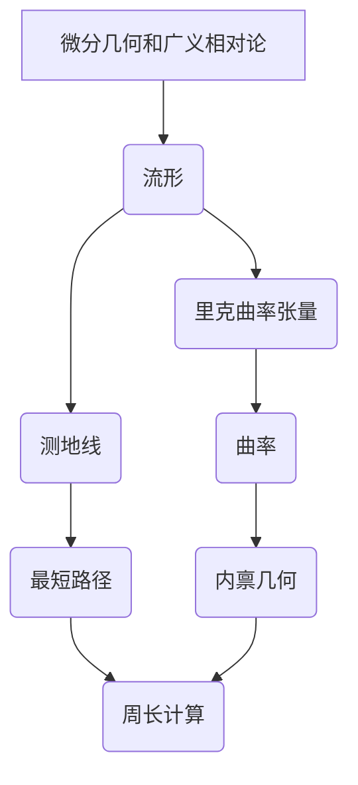

# 微分几何入门与广义相对论：转盘周长

## 1. 背景介绍

### 1.1 问题的由来

在日常生活中,我们经常会遇到一些看似简单的几何问题,但当涉及到曲面或者非欧几里德空间时,问题就变得复杂了。比如,如何精确计算一个圆盘表面的周长?这个问题虽然简单,但揭示了微分几何和广义相对论在解决实际问题中的重要性。

### 1.2 研究现状  

在经典的欧几里德几何中,圆的周长可以很容易地用 $2\pi r$ 来计算,其中 $r$ 是圆的半径。然而,当我们把圆放在一个曲面上时,情况就变得复杂了。例如,把一个圆放在一个球面上,它的周长就不再遵循 $2\pi r$ 的简单公式。

为了解决这个问题,我们需要借助微分几何和广义相对论的理论和方法。微分几何提供了研究曲面几何性质的数学工具,而广义相对论则给出了在曲面上进行测量的规则。

### 1.3 研究意义

精确计算曲面上的周长不仅具有理论意义,也有重要的实际应用价值。例如,在航空航天领域,计算飞机机翼表面的准确面积对于减小空气阻力至关重要。在地理信息系统中,准确测量地球曲面上的距离是制作精确地图的基础。因此,研究微分几何和广义相对论,并将它们应用于解决实际问题,是非常有价值的。

### 1.4 本文结构

本文将首先介绍微分几何和广义相对论的基本概念,然后详细阐述如何利用这些理论计算曲面上的周长。我们将推导出适用于任意曲面的一般公式,并对其进行详细的数学证明。最后,我们将通过一些具体的例子,说明如何应用这些理论解决实际问题。

## 2. 核心概念与联系

要理解如何计算曲面上的周长,我们首先需要了解一些微分几何和广义相对论的核心概念。

1. **流形(Manifold)**: 在微分几何中,流形是一种拓扑空间,可以在每一点都赋予一个坐标系。曲面就是一个二维流形的例子。

2. **里克曲率张量(Ricci Curvature Tensor)**: 这是一个描述流形曲率的张量,它反映了流形在每一点的内禀几何性质。

3. **测地线(Geodesic)**: 在一个曲面上,测地线是局部最短路径,类似于平面上的直线。

4. **曲率(Curvature)**: 曲率描述了一个流形与欧几里德空间的偏离程度。曲率越大,流形越"弯曲"。

5. **内禀几何(Intrinsic Geometry)**: 内禀几何研究流形自身的几何性质,而不依赖于它是如何嵌入到更高维空间中的。

6. **周长计算**: 利用上述概念,我们可以推导出一个公式,用于精确计算任意曲面上的周长。

微分几何和广义相对论为我们提供了一个统一的理论框架,使我们能够研究任意维度的流形,并计算其内禀几何量,如曲率和测地线长度。这为解决实际问题奠定了理论基础。

## 3. 核心算法原理 & 具体操作步骤

### 3.1 算法原理概述

要计算一个曲面上的周长,我们需要利用广义相对论中的一个重要概念:测地线。在一个曲面上,测地线是局部最短路径,类似于平面上的直线。

我们可以将要计算周长的曲线看作是由无数个小的测地线线段组成的折线。通过求和这些测地线线段的长度,就可以得到曲线的总长度,即周长。

算法的核心思想是:将曲线离散成足够多的小段,每一小段近似看作是测地线,然后计算每个测地线段的长度,最后将它们相加即可得到曲线的总长度。

这个算法的优点是,它可以适用于任意曲面,只要我们知道该曲面的度规张量(metric tensor),就可以计算出任意一点处的测地线长度。

### 3.2 算法步骤详解

1. **确定曲面**: 首先,我们需要确定要计算周长的曲线位于哪个曲面上。这个曲面可以用一个嵌入于欧几里得空间的参数方程来描述。

2. **计算度规张量**: 已知曲面的参数方程,我们可以计算出该曲面在每一点处的度规张量 $g_{\mu\nu}$。度规张量描述了该点的局部几何性质。

3. **离散曲线**: 将要计算周长的曲线离散成 $N$ 个小段,每一小段用它的起点 $P_i$ 和终点 $P_{i+1}$ 来表示。

4. **计算每段测地线长度**: 对于每一小段 $[P_i, P_{i+1}]$,我们可以利用度规张量计算出它所对应的测地线长度 $l_i$。具体做法是:

    a. 在起点 $P_i$ 处计算切向量 $\vec{t}_i$;
    
    b. 将切向量 $\vec{t}_i$ 代入测地线方程,求解出测地线方程的系数;
    
    c. 将终点 $P_{i+1}$ 代入测地线方程,求出该段测地线的仿射参数间隔 $\Delta \lambda_i$;
    
    d. 根据公式 $l_i = \int_0^{\Delta\lambda_i} \sqrt{g_{\mu\nu} \frac{dx^\mu}{d\lambda} \frac{dx^\nu}{d\lambda}} d\lambda$ 计算出该段测地线长度 $l_i$。

5. **求和得到总长度**: 将所有小段测地线长度相加,即 $L = \sum_{i=1}^{N-1} l_i$,就可以得到整条曲线的总长度,即周长。

算法的精度取决于离散段数 $N$ 的大小。当 $N$ 越大时,精度就越高,但计算量也越大。在实际应用中,需要权衡精度和效率,选择一个合适的 $N$ 值。

### 3.3 算法优缺点

**优点**:

1. 通用性强,可以适用于任意曲面,只要知道曲面的度规张量;
2. 精度可控,通过调整离散段数可以获得任意精度;
3. 算法原理清晰,容易理解和实现。

**缺点**:

1. 当曲面过于弯曲或者曲线过于弯曲时,需要非常大的离散段数才能获得足够精度,计算量会急剧增加;
2. 对于一些特殊曲面(如球面),存在更简单高效的解析公式,此时使用该算法就显得低效;
3. 算法需要计算复杂的测地线方程和仿射参数间隔,对于高维流形会变得非常困难。

### 3.4 算法应用领域

该算法可以应用于任何需要计算曲面上曲线长度的领域,包括但不限于:

- 航空航天领域,计算机翼表面积; 
- 地理信息系统,测量地球曲面上的距离;
- 计算机图形学,渲染曲面模型;
- 理论物理,研究时空几何;
- 生物医学,分析蛋白质等生物大分子的几何结构。

总的来说,随着科学技术的发展,越来越多的领域需要对曲面上的几何量进行精确计算,因此这一算法具有广阔的应用前景。

## 4. 数学模型和公式 & 详细讲解 & 举例说明

### 4.1 数学模型构建

为了精确计算曲面上的周长,我们需要建立一个合适的数学模型。在广义相对论中,我们使用 **流形(Manifold)** 和 **测地线(Geodesic)** 的概念来描述时空的几何性质。

流形是一种拓扑空间,可以在每一点都赋予一个坐标系。曲面就是一个二维流形的例子。在流形上,测地线是局部最短路径,类似于平面上的直线。

我们将要计算周长的曲线看作是由无数个小的测地线线段组成的折线。通过求和这些测地线线段的长度,就可以得到曲线的总长度,即周长。

为了计算测地线长度,我们需要引入 **度规张量(Metric Tensor)** 的概念。度规张量 $g_{\mu\nu}$ 描述了流形在每一点的局部几何性质,它决定了该点处测地线的长度。

在已知曲面的参数方程和度规张量的情况下,我们可以利用 **测地线方程** 来计算任意两点之间的测地线长度。测地线方程是一个二阶常微分方程组,它的解描述了测地线在流形上的运动轨迹。

### 4.2 公式推导过程

现在,我们来推导计算曲面上周长的具体公式。假设要计算的曲线位于一个 $n$ 维流形 $\mathcal{M}$ 上,参数方程为 $x^\mu = x^\mu(\lambda)$,其中 $\lambda$ 是曲线的仿射参数。

我们将曲线离散成 $N$ 个小段,每一小段用它的起点 $P_i$ 和终点 $P_{i+1}$ 来表示,即 $P_i = (x_i^1, x_i^2, \ldots, x_i^n)$ 和 $P_{i+1} = (x_{i+1}^1, x_{i+1}^2, \ldots, x_{i+1}^n)$。

对于第 $i$ 个小段 $[P_i, P_{i+1}]$,我们可以计算出它所对应的测地线长度 $l_i$ 如下:

1. 在起点 $P_i$ 处计算切向量:

$$\vec{t}_i = \left(\frac{dx^1}{d\lambda}\Bigg|_{P_i}, \frac{dx^2}{d\lambda}\Bigg|_{P_i}, \ldots, \frac{dx^n}{d\lambda}\Bigg|_{P_i}\right)$$

2. 将切向量 $\vec{t}_i$ 代入测地线方程,求解出测地线方程的系数;

3. 将终点 $P_{i+1}$ 代入测地线方程,求出该段测地线的仿射参数间隔 $\Delta \lambda_i$;

4. 根据公式计算该段测地线长度:

$$l_i = \int_0^{\Delta\lambda_i} \sqrt{g_{\mu\nu} \frac{dx^\mu}{d\lambda} \frac{dx^\nu}{d\lambda}} d\lambda$$

5. 将所有小段测地线长度相加,即:

$$L = \sum_{i=1}^{N-1} l_i$$

就可以得到整条曲线的总长度,即周长。

需要注意的是,上述公式只是一个一般形式,具体计算时还需要substitute实际的度规张量 $g_{\mu\nu}$ 和曲线参数方程 $x^\mu(\lambda)$。

### 4.3 案例分析与讲解

为了更好地理解上述公式,让我们来看一个具体的例子。假设我们要计算一个单位球面上的大圆周长。

单位球面的参数方程可以写为:

$$\begin{align*}
x &= \cos\phi\cos\theta\\
y &= \cos\phi\sin\theta\\
z &= \sin\phi
\end{align*}$$

其中 $\phi \in [0, \pi]$ 是纬度, $\theta \in [0, 2\pi)$ 是经度。

我们可以计算出球面的度规张量为:

$$g_{\mu\nu} = \begin{pmatrix}
1 & 0 & 0\\
0 & \cos^2\phi & 0\\
0 & 0 & 1
\end{pmatrix}$$

假设我们要计算赤道 $\phi = \pi/2$ 处的大圆周长,则曲线的参数方程为 $x = \cos\theta, y = \sin\theta, z = 0$,切向量为 $\vec{t} = (-\sin\theta, \cos\theta, 0)$。

将切向量代入测地线方程,可以求解