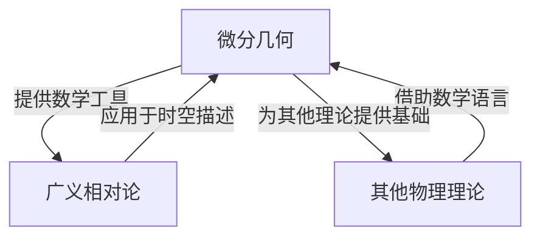

# 微分几何入门与广义相对论：过去和未来

## 1. 背景介绍

### 1.1 问题的由来

微分几何和广义相对论是现代物理学和数学的两个核心支柱,它们的发展源于对时空本质的探索和对引力现象的解释。微分几何为广义相对论提供了必要的数学工具,而广义相对论则将微分几何的概念应用于时空的描述。这两个领域的交汇催生了对宇宙起源、黑洞、引力波等前沿课题的深入研究。

### 1.2 研究现状

近年来,微分几何和广义相对论的研究取得了长足进展。微分几何在流形、李群、射影几何等方向不断推进,为相对论、量子场论等提供了强有力的数学基础。广义相对论的观测证据不断增多,包括引力波的首次直接探测、黑洞影像的成功拍摄等,这些发现验证了广义相对论的准确性,同时也暴露出其在极端条件下的局限性。

### 1.3 研究意义

深入理解微分几何和广义相对论,对于揭示宇宙本质、统一四种基本作用力具有重要意义。它们不仅是现代物理学的理论基础,也为探索量子引力、暗物质、暗能量等前沿问题提供了必要的数学框架。此外,这两个领域的发展也推动了相关学科的进步,如计算机图形学、计算机视觉等。

### 1.4 本文结构

本文将全面介绍微分几何和广义相对论的基础知识、核心概念、数学模型、算法原理、实际应用等内容。首先阐述两个领域的背景和联系,然后深入探讨核心算法原理、数学模型及公式推导,并通过代码实例展示具体实现。最后分析实际应用场景,总结未来发展趋势和面临的挑战。

## 2. 核心概念与联系

微分几何和广义相对论虽然分属数学和物理学领域,但两者存在着紧密的联系。微分几何为广义相对论提供了必要的数学语言和工具,而广义相对论则将微分几何的概念应用于时空的描述。

微分几何研究流形、张量场、李群等概念,为描述时空的曲率和引力场奠定了基础。广义相对论则将这些概念应用于时空的几何描述,揭示了引力与时空曲率之间的内在联系。同时,微分几何也为其他物理理论如量子场论、规范场论等提供了必要的数学语言。

以下是两个领域的核心概念及其联系:

### 2.1 流形(Manifold)

流形是微分几何的基本研究对象,用于描述具有一定拓扑结构的空间。在广义相对论中,时空被描述为一个四维流形,其曲率反映了引力场的存在。

### 2.2 张量(Tensor)

张量是微分几何中的基本数学对象,用于描述流形上的向量场、标量场等物理量。在广义相对论中,引力场被描述为一个曲率张量,而物质和能量的分布则由能量-动量张量表示。

### 2.3 李群(Lie Group)

李群是一种连续变换群,在微分几何中用于研究流形的对称性。在广义相对论中,洛伦兹变换群描述了时空的局部对称性,而广义协变原理要求物理定律对任意坐标变换都保持不变。

### 2.4 射影几何(Projective Geometry)

射影几何是微分几何的一个分支,研究投影变换下的不变量。在广义相对论中,光锥在不同参考系下的投影关系与光线的传播路径密切相关。

这些核心概念不仅揭示了微分几何和广义相对论之间的内在联系,也为探索更深层次的物理规律奠定了坚实的数学基础。

## 3. 核心算法原理 & 具体操作步骤

### 3.1 算法原理概述

微分几何和广义相对论中的核心算法主要包括:

1. **测地线方程求解算法**: 用于求解流形上的最短曲线,在广义相对论中对应求解自由粒子在时空中的运动轨迹。

2. **Einstein 场方程数值求解算法**: 用于求解描述引力场的 Einstein 张量方程,得到时空的曲率分布。

3. **Riemann 张量计算算法**: 用于计算描述时空曲率的 Riemann 曲率张量,是广义相对论的核心数学工具。

4. **Geodesic deviation 方程求解算法**: 用于描述邻近测地线之间的相对运动,对应引力场中粒子的相对加速度。

5. **Regge Calculus 算法**: 一种离散化的方法,将时空离散为简单的几何形状,用于研究量子引力等问题。

这些算法的核心思想是将微分几何的概念应用于广义相对论的时空描述,并结合数值计算、微分方程求解等数学工具,对引力场和时空结构进行精确描述和计算。

### 3.2 算法步骤详解

以 Einstein 场方程数值求解算法为例,具体步骤如下:

1. **构建时空流形**: 根据具体问题,选择合适的时空流形模型,如静态球对称、轴对称或完全动态情况。

2. **设置边界条件和初始条件**: 根据物理场景,设置合适的时空边界条件和初始条件,如黑洞、星系等。

3. **离散化 Einstein 方程**: 将 Einstein 张量方程离散化为有限差分或有限元形式,以便数值求解。

4. **迭代求解**: 采用如牛顿迭代、релаxation 等数值方法,迭代求解离散化的 Einstein 方程,得到时空的度规张量分布。

5. **后处理**: 根据求解结果,计算时空的曲率分量、测地线、光锥等物理量,用于进一步分析和可视化。

该算法的关键在于将 Einstein 方程有效离散化,并采用高效的迭代求解方法,从而得到时空的数值解。算法的精度和效率取决于离散化格式、迭代方法的选择,以及计算资源的限制。

### 3.3 算法优缺点

上述算法具有以下优缺点:

**优点**:

- 能够精确求解 Einstein 方程,得到时空的曲率分布和引力场信息。
- 可以处理各种复杂的物理场景,如旋转黑洞、时空奇点等。
- 算法思路清晰,易于并行化和优化,可以利用高性能计算资源。

**缺点**:

- 计算量较大,对于动态时空情况,求解精度和效率都具有一定挑战。
- 需要合理的离散化格式和边界条件,否则可能导致数值不稳定性。
- 无法处理量子引力等极端情况,需要结合其他理论和算法。

### 3.4 算法应用领域

上述算法在以下领域具有广泛应用:

- **相对论天体物理学**: 研究黑洞、中子星等致密天体的时空结构和引力场。
- **早期宇宙模型**: 构建和模拟宇宙大爆炸后的时空演化过程。
- **数值相对论**: 利用数值方法研究广义相对论中的各种物理现象。
- **引力波探测**: 模拟和分析双黑洞并合等引力波源的时空演化。
- **量子引力**: 结合其他算法,探索量子引力理论的数值实现。

这些应用促进了人类对时空本质和宇宙起源的深入理解,也推动了相关计算技术的发展。

## 4. 数学模型和公式 & 详细讲解 & 举例说明

### 4.1 数学模型构建

微分几何和广义相对论的数学模型主要基于流形、张量场和 Riemann 几何等概念。以四维时空为例,我们可以构建如下数学模型:

1. **时空流形 $\mathcal{M}$**: 一个四维流形,表示时空的基本结构。
2. **度规张量 $g_{\mu\nu}$**: 定义在流形上的对称张量场,描述时空的度规关系。
3. **Riemann 曲率张量 $R_{\mu\nu\rho\sigma}$**: 描述时空曲率的张量场,由度规张量导出。
4. **Einstein 张量 $G_{\mu\nu}$**: 由 Riemann 张量计算得到,描述时空的曲率和引力场。
5. **能量-动量张量 $T_{\mu\nu}$**: 描述物质和能量的分布和运动状态。

这些数学对象通过 Einstein 方程联系起来:

$$
G_{\mu\nu} = \kappa T_{\mu\nu}
$$

其中 $\kappa$ 是与牛顿常数相关的常数。Einstein 方程建立了时空曲率和物质能量分布之间的关系,是广义相对论的核心方程。

### 4.2 公式推导过程

Einstein 方程的推导过程体现了微分几何在广义相对论中的应用。以下是主要步骤:

1. **定义 Riemann 曲率张量**:

$$
R^\rho_{\sigma\mu\nu} = \partial_\mu \Gamma^\rho_{\nu\sigma} - \partial_\nu \Gamma^\rho_{\mu\sigma} + \Gamma^\rho_{\mu\lambda}\Gamma^\lambda_{\nu\sigma} - \Gamma^\rho_{\nu\lambda}\Gamma^\lambda_{\mu\sigma}
$$

其中 $\Gamma^\rho_{\mu\nu}$ 是 Christoffel 符号,由度规张量导出,描述了流形的affine 连接。

2. **构造 Ricci 张量和曲率标量**:

$$
R_{\mu\nu} = R^\rho_{\mu\rho\nu}, \quad R = g^{\mu\nu}R_{\mu\nu}
$$

3. **通过变分原理导出 Einstein 张量**:

$$
G_{\mu\nu} = R_{\mu\nu} - \frac{1}{2}g_{\mu\nu}R
$$

4. **引入能量-动量张量,得到 Einstein 方程**:

$$
G_{\mu\nu} = \kappa T_{\mu\nu}
$$

这个推导过程体现了微分几何在广义相对论中的应用,如流形、张量场、变分原理等概念。

### 4.3 案例分析与讲解

以静态球对称黑洞为例,我们可以分析 Einstein 方程的具体解。

1. **Schwarzschild 度规**:

$$
ds^2 = -\left(1-\frac{2M}{r}\right)dt^2 + \left(1-\frac{2M}{r}\right)^{-1}dr^2 + r^2d\Omega^2
$$

这是一个满足 Einstein 方程的球对称解,描述了一个质量为 $M$ 的静止黑洞周围的时空结构。

2. **光锥结构**:

$$
\frac{dt}{dr} = \pm\left(1-\frac{2M}{r}\right)^{-1}
$$

光锥的形状由上式给出,反映了光线在黑洞附近的偏转现象。

3. **测地线方程**:

$$
\frac{d^2x^\mu}{d\tau^2} + \Gamma^\mu_{\rho\sigma}\frac{dx^\rho}{d\tau}\frac{dx^\sigma}{d\tau} = 0
$$

通过求解该方程,可以得到自由粒子在黑洞时空中的运动轨迹。

这些具体例子展示了微分几何和广义相对论数学模型在实际问题中的应用,有助于加深对核心概念和公式的理解。

### 4.4 常见问题解答

**Q1: 为什么需要引入曲率张量来描述时空?**

A1: 在牛顿力学中,时空被视为平直的,引力是一种作用在物体上的力。但在广义相对论中,引力被解释为时空本身的曲率,物体沿着时空的测地线运动。曲率张量能够精确描述时空的弯曲程度,是描述引力场的关键数学工具。

**Q2: 为什么 Einstein 方程的左右两边是张量?**

A2: 为了满足广义相对论的基本原理——广义协变性,Einstein 方程必须对任意坐标变换保持不变形式。张量场具有这一不变性,因此 Einstein 