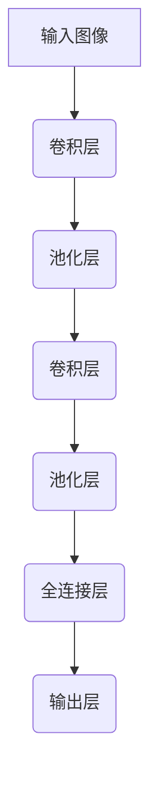
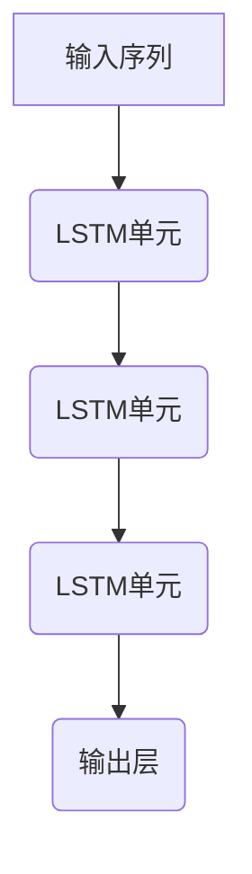
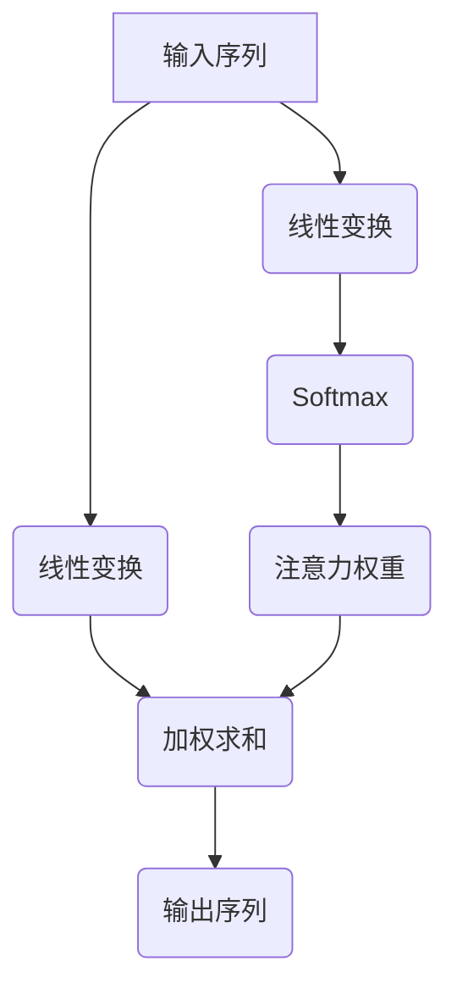

# 感知 (Perception)

## 1. 背景介绍

### 1.1 问题的由来

在人工智能领域,感知是一个基础且关键的任务。感知技术旨在使机器能够像人类一样感知和理解周围环境,包括视觉、听觉、触觉等多种感官输入。这对于机器人、自动驾驶汽车、智能家居等应用至关重要。然而,实现真正的感知并非易事,需要解决诸多挑战。

### 1.2 研究现状  

目前,感知技术主要集中在计算机视觉和自然语言处理领域。在计算机视觉方面,深度学习算法在图像分类、目标检测、语义分割等任务上取得了长足进展。而在自然语言处理领域,transformer等模型在机器翻译、问答系统、文本生成等任务上也有出色表现。但这些技术仍然存在一些局限性,如对复杂场景的理解能力有限、缺乏多模态融合能力等。

### 1.3 研究意义

全面的感知能力对于人工智能系统的发展至关重要。只有当机器能够真正理解周围环境,才能做出合理的决策和行为。因此,提升感知技术的性能和鲁棒性,实现多模态感知融合,是人工智能领域的一个重要目标。这不仅能推动智能系统在各种应用场景中的落地,也将为实现通用人工智能奠定基础。

### 1.4 本文结构

本文将从以下几个方面全面介绍感知技术:
1) 核心概念与感知任务之间的联系
2) 感知任务的核心算法原理及具体操作步骤  
3) 相关数学模型及公式推导
4) 代码实现实例及详细解释
5) 实际应用场景
6) 工具和学习资源推荐
7) 总结感知技术的发展趋势和面临的挑战

## 2. 核心概念与联系

感知技术涉及多个核心概念,包括:

1. **特征提取(Feature Extraction)**: 从原始数据(如图像、语音等)中提取出对任务有意义的特征,是感知任务的基础步骤。常用的特征提取方法有卷积神经网络、SIFT、MFCC等。

2. **模式识别(Pattern Recognition)**: 基于提取的特征,对输入数据进行分类或识别,得到对应的标签或类别。如图像分类、目标检测、语音识别等。

3. **上下文理解(Context Understanding)**: 除了识别单个对象,还需要理解对象之间的关系、场景语义等上下文信息,以获得更全面的理解。这对于复杂场景的感知至关重要。

4. **多模态融合(Multimodal Fusion)**: 真实世界中的信息通常来自多种模态,如视觉、听觉、语义等。将不同模态的信息融合能够提高感知的准确性和鲁棒性。

5. **决策与控制(Decision and Control)**: 基于对环境的感知,智能系统需要做出相应的决策和行为控制,如机器人运动规划、自动驾驶决策等。

这些核心概念相互关联、环环相扣,共同构建了完整的感知系统。下面将详细介绍其中的算法原理和数学模型。

## 3. 核心算法原理 & 具体操作步骤

### 3.1 算法原理概述

感知任务的核心算法主要包括:

1. **卷积神经网络(Convolutional Neural Networks, CNNs)**: 在计算机视觉任务中发挥关键作用,能自动学习视觉特征。
2. **循环神经网络(Recurrent Neural Networks, RNNs)**: 适用于处理序列数据,如语音、文本等,在语音识别和自然语言处理任务中被广泛使用。
3. **注意力机制(Attention Mechanism)**: 通过自适应地分配不同区域的权重,提高模型对重要特征的关注,在各种任务中都有应用。
4. **生成对抗网络(Generative Adversarial Networks, GANs)**: 通过生成器和判别器的对抗训练,能够生成逼真的图像、语音等数据,在数据增强、图像翻译等任务中有应用。
5. **图神经网络(Graph Neural Networks, GNNs)**: 能够直接处理图结构数据,在场景图理解、分子建模等任务中表现出色。

这些算法通常会结合多种技术手段,如注意力机制、迁移学习、数据增强等,以提升感知性能。下面将详细介绍其中的具体操作步骤。

### 3.2 算法步骤详解

以卷积神经网络为例,其主要步骤包括:

1. **数据预处理**: 对输入数据(如图像)进行标准化、数据增强等预处理,以提高模型的泛化能力。

2. **卷积层**: 通过滑动卷积核在输入特征图上进行卷积操作,提取局部特征。卷积层的参数包括卷积核大小、步长、填充等。

3. **池化层**: 对卷积层的输出进行下采样,减小特征图的空间维度,提高模型的计算效率。常用的池化方式有最大池化和平均池化。

4. **全连接层**: 将前面卷积层和池化层提取的特征展平,输入到全连接层进行特征整合和分类预测。

5. **损失函数**: 根据任务类型选择合适的损失函数,如交叉熵损失用于分类任务。

6. **优化器**: 使用优化算法(如SGD、Adam等)根据损失函数的梯度,更新网络的可训练参数。

7. **模型评估**: 在验证集或测试集上评估模型的性能,如准确率、精确率、召回率等指标。

上述步骤通过迭代训练得到最终的感知模型。对于其他算法,如RNNs、GANs等,其步骤也有所不同,但总体思路是类似的。

### 3.3 算法优缺点

每种算法都有其优缺点:

- **卷积神经网络**:
    - 优点:能自动学习视觉特征,在计算机视觉任务上表现出色。
    - 缺点:对形变、尺度、遮挡等变化不够鲁棒,难以捕捉长程依赖关系。

- **循环神经网络**:
    - 优点:能够处理序列数据,在语音识别和自然语言处理任务中表现良好。
    - 缺点:存在梯度消失/爆炸问题,难以捕捉长期依赖关系,并行计算效率低下。

- **注意力机制**:
    - 优点:能自适应地关注输入的不同部分,提高模型对重要特征的关注度。
    - 缺点:增加了模型的计算复杂度,对超长序列的处理效果不佳。

- **生成对抗网络**:
    - 优点:能够生成逼真的数据,在数据增强、图像翻译等任务中有应用。
    - 缺点:训练过程不稳定,生成结果难以控制,存在模式崩溃等问题。

- **图神经网络**:
    - 优点:能够直接处理图结构数据,在场景图理解、分子建模等任务中表现出色。
    - 缺点:对图的大小和结构敏感,难以处理大规模复杂图结构。

因此,在实际应用中需要根据具体任务的特点选择合适的算法,或者将多种算法相结合以发挥各自的优势。

### 3.4 算法应用领域

感知算法在多个领域都有广泛应用:

1. **计算机视觉**: 图像分类、目标检测、语义分割、实例分割、人脸识别等。
2. **自然语言处理**: 机器翻译、文本分类、情感分析、问答系统、文本生成等。
3. **语音识别**: 自动语音识别、说话人识别、语音合成等。
4. **机器人**: 视觉导航、运动规划、物体抓取、人机交互等。
5. **自动驾驶**: 车道线检测、目标检测与跟踪、决策规划等。
6. **医疗健康**: 医学图像分析、疾病诊断、药物发现等。
7. **安防监控**: 人脸识别、行为检测、异常检测等。

总的来说,感知技术是人工智能系统能够理解外部世界的基础,在各种智能应用中发挥着关键作用。

## 4. 数学模型和公式 & 详细讲解 & 举例说明

感知任务中常用的数学模型和公式包括:

### 4.1 数学模型构建

1. **卷积神经网络模型**

卷积神经网络的基本结构如下所示:

其中卷积层和池化层用于提取特征,全连接层用于特征整合和分类预测。

2. **循环神经网络模型**

以长短期记忆网络(LSTM)为例,其基本结构如下:

LSTM单元通过门控机制来解决梯度消失/爆炸问题,能够捕捉长期依赖关系。

3. **注意力机制模型**

注意力机制的基本思想是对不同位置的输入特征赋予不同的权重,例如自注意力机制:

通过自注意力机制,模型能够自适应地关注输入序列中的重要部分。

### 4.2 公式推导过程

1. **卷积运算**

卷积运算是卷积神经网络的核心,其数学表达式为:

$$
(I * K)(i,j) = \sum_{m}\sum_{n}I(i+m,j+n)K(m,n)
$$

其中 $I$ 为输入特征图, $K$ 为卷积核, $i,j$ 为输出特征图的位置坐标。通过在输入特征图上滑动卷积核并进行点积运算,可以提取出局部特征。

2. **池化运算**

池化运算用于下采样特征图,常用的有最大池化和平均池化:

最大池化:
$$
\operatorname{max\_pool}(X)_{i,j} = \max_{(i',j')\in R_{i,j}}X_{i',j'}
$$

平均池化:
$$
\operatorname{avg\_pool}(X)_{i,j} = \frac{1}{|R_{i,j}|}\sum_{(i',j')\in R_{i,j}}X_{i',j'}
$$

其中 $R_{i,j}$ 表示以 $(i,j)$ 为中心的池化区域。

3. **softmax函数**

softmax函数常用于多分类任务的输出层,将输出映射到 $(0,1)$ 区间,并满足所有输出之和为1:

$$
\operatorname{softmax}(x_i) = \frac{e^{x_i}}{\sum_{j}e^{x_j}}
$$

其中 $x_i$ 为第 $i$ 个输出的logit值。

### 4.3 案例分析与讲解

以图像分类任务为例,我们将使用卷积神经网络模型进行分析。假设输入为 $32\times 32\times 3$ 的RGB图像,我们设计了如下网络结构:

1. 卷积层: 卷积核大小 $5\times 5$,输出通道数 $32$,步长 $1$,使用ReLU激活函数。
2. 最大池化层: 池化核大小 $2\times 2$,步长 $2$。
3. 卷积层: 卷积核大小 $5\times 5$,输出通道数 $64$,步长 $1$,使用ReLU激活函数。
4. 最大池化层: 池化核大小 $2\times 2$,步长 $2$。
5. 全连接层: 输出维度 $1024$,使用ReLU激活函数。
6. 全连接层: 输出维度 $10$(对应10个类别),使用softmax激活函数。

我们将输入图像 $X$ 传入网络,在第一个卷积层中,卷积核 $K$ 在输入