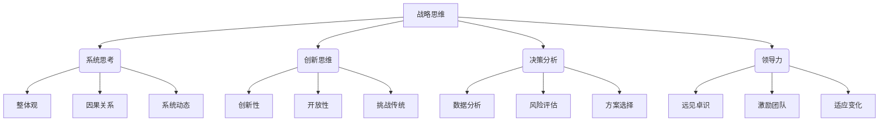

# 战略思维能力培养：具有战略思维、解决问题能力和持续适应变化的能力

## 1. 背景介绍

### 1.1 问题的由来

在当今瞬息万变的商业环境中，组织和个人都面临着前所未有的挑战和不确定性。全球化、技术创新和市场变革等因素使得企业需要具备敏捷性和适应力,以保持竞争优势。在这种动态环境下,培养战略思维能力变得至关重要。

战略思维是一种认知过程,涉及分析环境、识别趋势、评估风险和机遇,并制定相应的行动计划。它超越了短期思维,关注组织的长期目标和可持续发展。然而,许多组织和个人仍然停留在传统的思维模式中,缺乏战略视角,难以应对不断变化的挑战。

### 1.2 研究现状

战略思维能力的培养一直是学术界和实践界关注的热点话题。许多研究表明,战略思维能力与组织的绩效和创新能力密切相关。具有战略思维能力的个人和团队能够更好地预测未来趋势,制定有效的战略规划,并灵活应对不确定性。

然而,培养战略思维能力并非一蹴而就。它需要系统的学习和实践,涉及多方面的知识和技能,包括系统思考、创新思维、决策分析、领导力等。目前,许多组织已经开始重视战略思维培训,但往往缺乏系统性和持续性。

### 1.3 研究意义

培养战略思维能力对于组织和个人的发展都具有重要意义:

- 对于组织而言,战略思维能力可以提高决策质量,增强竞争优势,促进创新,实现可持续发展。
- 对于个人而言,战略思维能力是职业发展的关键能力之一,有助于提高解决复杂问题的能力,增强适应变化的能力,实现个人价值最大化。

因此,深入研究战略思维能力的培养途径和方法,对于提高组织绩效和个人发展都具有重要意义。

### 1.4 本文结构

本文将全面探讨战略思维能力的培养,包括以下几个方面:

1. 阐释战略思维的核心概念和重要性。
2. 分析战略思维能力的关键要素和培养方法。
3. 介绍战略思维培养的实践案例和经验总结。
4. 探讨战略思维能力培养面临的挑战和未来发展趋势。

## 2. 核心概念与联系

战略思维是一种综合性的认知能力,涉及多个核心概念和相互关联的要素。下面将详细阐述这些核心概念及其联系。

1. **系统思考**:系统思考是战略思维的基础,它要求我们从整体的角度看问题,而不是局限于局部视角。它包括三个关键要素:
   - 整体观:能够看到事物之间的相互关系和影响。
   - 因果关系:能够识别事物之间的因果联系,并预测可能的结果。
   - 系统动态:能够理解系统的动态变化,并预测未来趋势。

2. **创新思维**:创新思维是战略思维的重要组成部分,它能够帮助我们打破常规思维模式,发现新的机遇和解决方案。它包括三个关键要素:
   - 创新性:能够产生新颖、独特的想法和解决方案。
   - 开放性:能够接受不同的观点和反馈,并保持开放的心态。
   - 挑战传统:能够质疑现有的做法和假设,寻求更好的方式。

3. **决策分析**:决策分析是战略思维的核心环节,它需要我们收集和分析相关数据,评估风险和机遇,并做出明智的决策。它包括三个关键要素:
   - 数据分析:能够收集和处理相关数据,发现隐藏的模式和趋势。
   - 风险评估:能够识别潜在的风险,并制定应对措施。
   - 方案选择:能够权衡不同方案的优缺点,并选择最佳方案。

4. **领导力**:领导力是战略思维的关键支撑,它能够激励和引导团队朝着共同目标努力。它包括三个关键要素:
   - 远见卓识:能够洞察未来趋势,制定前瞻性的战略规划。
   - 激励团队:能够激发团队的热情和潜能,促进协作和创新。
   - 适应变化:能够灵活应对环境变化,及时调整战略方向。

这些核心概念相互关联、相辅相成,共同构成了战略思维能力的基础框架。培养战略思维能力需要全面掌握和运用这些概念,并将它们融会贯通。

## 3. 核心算法原理 & 具体操作步骤

### 3.1 算法原理概述

培养战略思维能力并非一蹴而就,需要系统的学习和实践。本节将介绍一种基于认知心理学和教育学理论的算法原理,旨在有效培养个人和组织的战略思维能力。

该算法原理基于以下几个关键理论:

1. **情景学习理论**:通过置身于真实或模拟的情景中,学习者能够更好地理解和掌握所需的知识和技能。
2. **元认知理论**:通过培养自我监控和调节认知过程的能力,学习者能够更有效地管理和优化自己的学习过程。
3. **多元智能理论**:认识到每个个体都具有不同的智力类型和学习偏好,需要采用多种教学方式来满足不同学习者的需求。

基于这些理论,该算法原理采用了以下几个关键步骤:

1. **情景构建**:设计真实或模拟的情景,让学习者置身其中,体验实际问题和挑战。
2. **知识输入**:提供相关的理论知识和实践技巧,帮助学习者理解和掌握战略思维的核心概念和方法。
3. **实践演练**:让学习者在情景中实践所学的知识和技能,并进行反思和讨论。
4. **个性化指导**:根据学习者的个性特征和学习偏好,提供个性化的指导和反馈。
5. **持续迭代**:通过不断地实践、反思和调整,持续优化和提升学习者的战略思维能力。

该算法原理强调情景化学习、元认知培养和个性化指导,旨在提高学习的效率和效果,帮助学习者真正掌握并内化战略思维的核心理念和方法。

### 3.2 算法步骤详解

基于上述算法原理,我们可以设计出一套具体的操作步骤,用于培养个人和组织的战略思维能力。这些步骤如下:

1. **确定目标和需求**:首先需要明确培养战略思维能力的目标和需求,包括预期的能力水平、应用场景等。
2. **设计情景案例**:根据目标和需求,设计真实或模拟的情景案例,这些案例应该具有一定的复杂性和挑战性,能够激发学习者的思考和探索。
3. **准备学习资源**:收集和准备相关的理论知识、实践技巧、案例分析等学习资源,确保内容的全面性和实用性。
4. **组织学习活动**:组织各种形式的学习活动,如讲座、研讨会、模拟练习等,让学习者在情景中实践所学的知识和技能。
5. **提供个性化指导**:通过观察和评估,了解学习者的个性特征和学习偏好,并提供相应的个性化指导和反馈。
6. **促进反思和讨论**:鼓励学习者反思自己的学习过程和体验,并与他人进行讨论和交流,分享经验和见解。
7. **持续优化和迭代**:根据学习者的反馈和评估结果,不断优化和调整学习资源、活动设计和指导方式,形成持续改进的闭环。
8. **评估和认证**:设计合理的评估标准和认证机制,对学习者的战略思维能力进行客观评估,并颁发相应的认证。

这些步骤形成了一个完整的培养过程,涵盖了目标确定、情景设计、资源准备、活动组织、个性化指导、反思讨论、持续优化和评估认证等多个环节。通过循环迭代,学习者能够不断提高自己的战略思维能力,并将其内化为一种思维习惯和行为方式。

### 3.3 算法优缺点

上述算法原理和操作步骤在培养战略思维能力方面具有以下优点:

1. **情景化学习**:通过真实或模拟的情景,学习者能够更好地理解和掌握所需的知识和技能,提高学习的效率和效果。
2. **个性化指导**:算法考虑了学习者的个性差异,提供了个性化的指导和反馈,有助于满足不同学习者的需求。
3. **持续优化**:算法采用了持续优化和迭代的方式,确保了学习过程的动态性和适应性,能够不断提高学习效果。
4. **全面性**:算法涵盖了目标确定、资源准备、活动组织、反思讨论和评估认证等多个环节,确保了培养过程的完整性和系统性。

然而,该算法也存在一些潜在的缺点和挑战:

1. **资源投入**:设计情景案例、准备学习资源、组织活动等环节需要大量的人力和财力投入,对组织的资源要求较高。
2. **个性化难度**:提供真正个性化的指导和反馈需要对学习者进行深入了解和评估,这对教师和导师的专业能力要求较高。
3. **评估困难**:战略思维能力是一种复杂的认知能力,很难用简单的标准和测试来准确评估,需要设计更加科学和全面的评估体系。
4. **持续性挑战**:保持学习者的持续参与和积极性是一个挑战,需要不断调整和优化激励机制,以维持学习的动力。

因此,在实施该算法时,需要权衡投入与收益,并根据具体情况进行优化和调整,以最大限度发挥算法的优势,并有效应对潜在的挑战。

### 3.4 算法应用领域

培养战略思维能力对于各行各业都具有重要意义,因此上述算法原理和操作步骤可以广泛应用于以下领域:

1. **企业培训**:帮助企业培养员工的战略思维能力,提高决策水平和应对变化的能力,增强企业的竞争优势。
2. **高等教育**:将战略思维能力培养纳入大学课程体系,为学生未来的职业发展做好准备。
3. **政府机构**:培养政府官员和决策者的战略思维能力,提高政策制定和执行的水平,更好地服务于公众利益。
4. **非营利组织**:帮助非营利组织的管理者和志愿者培养战略思维能力,更有效地规划和实施各项活动和项目。
5. **个人发展**:个人可以通过学习和实践,培养自己的战略思维能力,提高解决复杂问题的能力,实现个人价值的最大化。

无论是在企业、教育、政府还是个人发展领域,战略思维能力都是一种关键的核心竞争力。通过应用上述算法原理和操作步骤,各个领域都可以有效培养相关人员的战略思维能力,从而提高整体的决策水平和适应能力,更好地应对未来的挑战和机遇。

## 4. 数学模型和公式 & 详细讲解 & 举例说明

### 4.1 数学模型构建

为了更好地量化