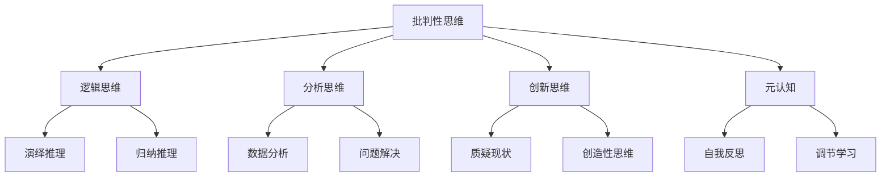
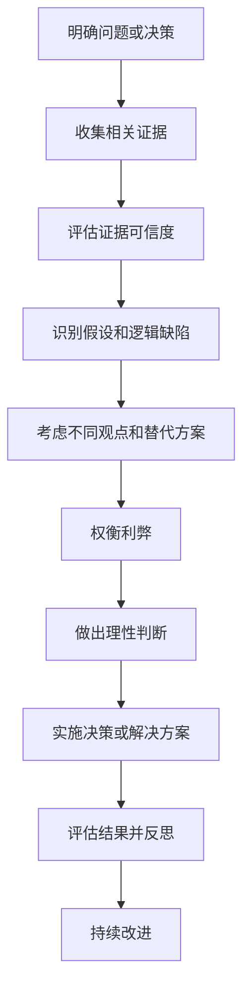

# 批判性思维：基于事实来分析，做出更优的决定或解决问题

## 1. 背景介绍

### 1.1 问题的由来

在当今快节奏的生活和工作环境中，我们每天都需要做出各种各样的决定和解决各种问题。无论是个人生活还是职业发展,都需要我们具备批判性思维的能力,以确保我们做出明智的选择,并有效解决问题。

批判性思维是一种分析和评估信息的过程,它需要我们客观地收集相关证据,仔细思考不同的观点和可能的结果,并基于理性和事实做出判断。缺乏批判性思维可能会导致我们被主观偏见、情绪或不完整信息所影响,从而做出不当的决定或无法有效解决问题。

### 1.2 研究现状

尽管批判性思维的重要性已被广泛认识,但在现实生活中,许多人仍然缺乏这种能力。一些研究表明,大多数人在做决定或解决问题时,往往依赖于直觉和情绪,而不是基于事实和逻辑推理。

此外,在当前信息过载的时代,我们面临着大量的数据和观点,很容易被错误或有偏差的信息所误导。因此,培养批判性思维能力变得更加重要,以帮助我们有效地筛选和评估信息,做出明智的决策。

### 1.3 研究意义

掌握批判性思维技能对于个人发展和职业成功至关重要。它可以帮助我们:

1. **做出更明智的决策**: 通过客观分析证据和考虑不同观点,我们可以做出更加明智和符合实际情况的决定。

2. **解决复杂问题**: 批判性思维能力可以帮助我们有效地识别问题的根源,评估不同的解决方案,并选择最佳的行动方案。

3. **提高创新能力**: 批判性思维鼓励我们质疑现有的假设和做法,从而激发创新思维,发现新的解决方案。

4. **增强沟通能力**: 通过清晰地表达自己的观点和论证过程,我们可以更好地与他人交流和说服他人。

5. **促进终身学习**: 批判性思维培养了我们持续学习和适应变化的能力,这对于在快速变化的环境中保持竞争力至关重要。

### 1.4 本文结构

本文将全面探讨批判性思维的概念、重要性和培养方法。我们将首先介绍批判性思维的核心概念和与其他思维模式的关系。接下来,我们将详细阐述批判性思维的核心算法原理和具体操作步骤。然后,我们将探讨批判性思维背后的数学模型和公式,并通过案例分析加深理解。此外,我们还将提供实际的项目实践和代码示例,帮助读者更好地掌握批判性思维技能。最后,我们将讨论批判性思维在不同领域的应用场景,分享相关的学习资源和工具,并对未来的发展趋势和挑战进行展望。

## 2. 核心概念与联系

批判性思维是一种高级认知技能,它涉及多个相关概念和思维模式。理解这些概念及其相互关系对于掌握批判性思维至关重要。

1. **逻辑思维**: 批判性思维需要遵循逻辑规则和推理过程。它包括演绎推理(从一般原理推导出特定结论)和归纳推理(从具体事例归纳出一般原理)。

2. **分析思维**: 批判性思维需要对信息进行深入分析,包括数据分析和问题解决技能。它需要我们能够识别关键信息、发现模式和关系,并提出合理的解决方案。

3. **创新思维**: 批判性思维鼓励我们质疑现有的假设和做法,激发创造性思维,从而发现新的解决方案和见解。

4. **元认知**: 元认知是指对自己的思维过程和学习策略的认识和调节。它是批判性思维的核心组成部分,包括自我反思和调节学习的能力。

通过掌握这些相关概念及其联系,我们可以更好地理解和运用批判性思维。

## 3. 核心算法原理 & 具体操作步骤

批判性思维可以被视为一种算法,它包含一系列有序的步骤,用于分析信息、评估证据和做出合理的判断。这个算法的核心原理是基于逻辑推理和客观证据,而不是主观偏见或直觉。

### 3.1 算法原理概述

批判性思维算法的核心原理可以概括为以下几个方面:

1. **收集相关证据**: 首先,我们需要收集与所讨论的问题或决策相关的所有信息和证据。这包括事实、数据、观点和背景信息。

2. **评估证据的可信度**: 接下来,我们需要评估所收集的证据的可信度和相关性。这包括考虑信息来源的可靠性、数据的准确性和观点的偏差。

3. **识别假设和逻辑缺陷**: 在分析过程中,我们需要识别潜在的假设和逻辑缺陷,例如过度概括、因果混淆或自我证实偏差。

4. **考虑不同观点和替代方案**: 批判性思维需要我们考虑不同的观点和可能的替代方案,而不是仅关注单一的观点或解决方案。

5. **权衡利弊**: 在评估不同的观点和方案时,我们需要权衡它们的优缺点,考虑潜在的风险和收益。

6. **做出理性判断**: 最后,基于对证据的全面评估和分析,我们需要做出理性的判断或决定,并能够用事实和逻辑来支持我们的结论。

### 3.2 算法步骤详解

基于上述核心原理,我们可以将批判性思维算法具体分解为以下步骤:

1. **明确问题或决策**: 首先,我们需要清楚地定义所面临的问题或需要做出的决策。这有助于我们集中注意力并确保收集相关证据。

2. **收集相关证据**: 从各种可靠的来源收集与问题或决策相关的信息、数据、观点和背景信息。

3. **评估证据可信度**: 仔细评估所收集的证据的可信度和相关性,考虑信息来源的可靠性、数据的准确性和观点的偏差。

4. **识别假设和逻辑缺陷**: 在分析过程中,识别潜在的假设和逻辑缺陷,例如过度概括、因果混淆或自我证实偏差。

5. **考虑不同观点和替代方案**: 考虑不同的观点和可能的替代解决方案,而不是仅关注单一的观点或解决方案。

6. **权衡利弊**: 评估不同观点和方案的优缺点,考虑潜在的风险和收益。

7. **做出理性判断**: 基于对证据的全面评估和分析,做出理性的判断或决定,并能够用事实和逻辑来支持结论。

8. **实施决策或解决方案**: 根据所做的判断或决定,实施相应的行动计划或解决方案。

9. **评估结果并反思**: 评估实施后的结果,并反思整个过程中的经验教训。

10. **持续改进**: 根据反思和评估,持续改进批判性思维技能,以便在未来做出更好的决策或解决更复杂的问题。

### 3.3 算法优缺点

批判性思维算法的优点包括:

- 客观性和理性性,基于事实和逻辑推理,而不是主观偏见或直觉。
- 全面性,考虑了不同的观点和替代方案,权衡了利弊。
- 可追溯性,整个过程和判断依据都可以被追溯和解释。
- 持续改进,通过反思和评估来不断提高批判性思维能力。

然而,该算法也存在一些潜在的缺点:

- 需要投入大量时间和精力收集和评估证据。
- 在某些情况下,可能难以获得足够的信息或证据。
- 过于强调理性和逻辑,可能忽视了直觉和创造力的作用。
- 需要一定的训练和经验才能熟练运用该算法。

### 3.4 算法应用领域

批判性思维算法可以应用于各种领域,包括但不限于:

- **决策制定**: 在做出重大决策时,批判性思维可以帮助我们全面考虑各种因素,做出明智的选择。
- **问题解决**: 面对复杂的问题时,批判性思维可以帮助我们识别根源、评估不同的解决方案,并选择最佳的行动方案。
- **科学研究**: 在科学研究中,批判性思维是必不可少的,它可以帮助研究人员评估现有理论和证据,提出新的假设并进行验证。
- **信息评估**: 在当今信息过载的时代,批判性思维可以帮助我们筛选和评估信息的可信度,避免被错误信息所误导。
- **教育和学习**: 培养学生的批判性思维能力是教育的重要目标之一,有助于他们在未来更好地解决问题和做出决策。

总的来说,批判性思维算法为我们提供了一种系统化的方法,帮助我们基于事实和逻辑做出更优的决定或解决问题。

## 4. 数学模型和公式 & 详细讲解 & 举例说明

批判性思维过程中涉及一些数学模型和公式,可以帮助我们更好地量化和分析相关因素。本节将介绍一些常见的数学模型和公式,并通过案例分析加深理解。

### 4.1 数学模型构建

在批判性思维过程中,我们可以构建数学模型来表示和分析相关因素之间的关系。一个常见的模型是决策树模型,它可以用来评估不同决策路径的概率和结果。

决策树模型可以用以下公式表示:

$$
\text{Expected Value}(D) = \sum_{i=1}^{n} P(O_i|D) \times U(O_i)
$$

其中:

- $D$ 表示决策
- $O_i$ 表示可能的结果 $i$
- $P(O_i|D)$ 表示在做出决策 $D$ 的情况下,结果 $O_i$ 发生的概率
- $U(O_i)$ 表示结果 $O_i$ 的效用值(正值表示收益,负值表示损失)

通过计算每个决策路径的期望值,我们可以选择具有最大期望值的决策,从而做出最优的选择。

### 4.2 公式推导过程

在批判性思维过程中,我们还可能需要推导一些公式来量化和分析相关因素。以下是一个示例公式推导过程:

假设我们需要评估一个项目的风险水平,并将其量化为一个风险分数。我们可以考虑以下几个因素:

- 项目复杂度 $C$
- 技术难度 $T$
- 资源限制 $R$
- 时间压力 $P$

我们可以将风险分数 $R_s$ 定义为这些因素的加权和:

$$
R_s = w_1 \times C + w_2 \times T + w_3 \times R + w_4 \times P
$$

其中 $w_1$, $w_2$, $w_3$, $w_4$ 是各个因素的权重,反映了它们对