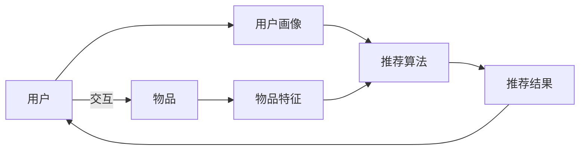

# 推荐系统与用户画像原理与代码实战案例讲解

关键词：推荐系统、用户画像、协同过滤、矩阵分解、深度学习、知识图谱

## 1. 背景介绍
### 1.1  问题的由来
在互联网信息爆炸的时代,人们面临着信息过载的问题。推荐系统应运而生,旨在从海量信息中为用户找到感兴趣的内容,提升用户体验。而用户画像则是推荐系统的核心,通过对用户行为数据的分析,构建用户特征,为个性化推荐提供支持。

### 1.2  研究现状
目前,推荐系统和用户画像已成为学术界和工业界的研究热点。从早期的协同过滤到矩阵分解,再到如今的深度学习和知识图谱,推荐算法不断演进。工业界巨头如亚马逊、Netflix、YouTube等也都构建了成熟的推荐系统,为用户提供个性化服务。

### 1.3  研究意义
推荐系统的研究具有重要的理论和实践意义。一方面,它涉及机器学习、数据挖掘、用户行为分析等多个学科,是一个富有挑战性的研究课题。另一方面,个性化推荐已成为各大互联网平台的标配,直接影响着企业的用户粘性和营收。因此,推荐系统的研究成果可以直接应用于实践,产生巨大的商业价值。

### 1.4  本文结构
本文将从以下几个方面对推荐系统和用户画像进行深入探讨：
- 第2部分介绍推荐系统和用户画像的核心概念及二者之间的关系。
- 第3部分详细阐述几种主流的推荐算法原理和具体步骤。
- 第4部分从数学角度对推荐模型进行建模,并举例说明。
- 第5部分给出推荐系统的代码实现,并对关键部分进行解释。
- 第6部分讨论推荐系统和用户画像在实际场景中的应用。
- 第7部分推荐相关的学习资源、开发工具和文献。
- 第8部分总结全文,展望推荐系统的发展趋势和挑战。
- 第9部分列举推荐系统和用户画像中的常见问题,并给出解答。

## 2. 核心概念与联系
推荐系统是一种信息过滤系统,它可以从海量数据中发掘用户感兴趣的信息,并将其推荐给用户。推荐系统主要包括三个核心要素:用户、物品和用户-物品交互。其中,用户和物品都有自己的特征属性,而用户-物品交互则反映了用户对物品的喜好程度。

用户画像是推荐系统的重要组成部分,它通过收集和分析用户在平台上的各种行为数据(如浏览、点击、收藏、评分等),构建用户的特征标签,刻画用户的兴趣偏好。用户画像可以从人口统计学、地理位置、行为偏好、社交关系等多个维度来描述用户。

推荐系统利用用户画像,结合物品特征和用户-物品交互数据,通过一定的算法和策略,生成个性化的推荐列表。因此,用户画像是连接用户和推荐结果的纽带,直接影响着推荐的精准度。

下图展示了推荐系统的基本架构和数据流:



## 3. 核心算法原理 & 具体操作步骤
### 3.1  算法原理概述
推荐系统的算法主要分为三大类:基于协同过滤的算法、基于内容的算法和组合算法。

协同过滤算法基于用户之间的相似性,利用用户对物品的历史偏好,为用户推荐相似用户喜欢的物品。它分为基于用户的协同过滤和基于物品的协同过滤。前者通过计算用户之间的相似度,找到与目标用户最相似的邻域用户,将邻域用户喜欢的物品推荐给目标用户。后者通过计算物品之间的相似度,找到与用户已经喜欢的物品最相似的物品进行推荐。

基于内容的算法利用物品的内容特征,为用户推荐与其历史偏好物品内容相似的物品。它通过分析物品的属性标签,构建物品画像,然后将用户画像与物品画像进行匹配,生成推荐列表。

组合算法则是将协同过滤和基于内容的方法进行组合,取二者之长,克服各自的缺点。常见的组合策略有加权组合、分层组合和基于模型的组合等。

### 3.2  算法步骤详解
以下以基于用户的协同过滤算法为例,详细说明其步骤:
1. 收集用户对物品的偏好数据,构建用户-物品评分矩阵。
2. 计算用户之间的相似度。常用的相似度度量有欧几里得距离、皮尔逊相关系数、余弦相似度等。
3. 选取与目标用户最相似的K个用户作为其邻域。
4. 对邻域用户对各物品的评分进行加权求和,得到目标用户对每个物品的预测评分。
5. 选取预测评分最高的N个物品作为推荐结果。

其中,用户u对物品i的预测评分$\hat{r}_{ui}$的计算公式为:

$$
\hat{r}_{ui} = \bar{r}_u + \frac{\sum_{v \in N_u} sim(u,v) \cdot (r_{vi} - \bar{r}_v)}{\sum_{v \in N_u} |sim(u,v)|}
$$

其中,$\bar{r}_u$和$\bar{r}_v$分别为用户u和v的平均评分,$N_u$为用户u的邻域用户集合,$sim(u,v)$为用户u和v的相似度。

### 3.3  算法优缺点
协同过滤算法的优点是:
- 不需要对物品进行内容分析,适用于各种类型的物品。
- 可以发掘用户的隐式偏好,挖掘长尾物品。
- 算法简单,易于实现。

其缺点包括:
- 冷启动问题:对于新用户和新物品,由于缺乏足够的交互数据,难以给出准确的推荐。
- 稀疏性问题:现实中的用户-物品评分矩阵往往非常稀疏,导致算法难以计算用户或物品之间的相似度。
- 可扩展性问题:当用户和物品数量很大时,计算用户或物品相似度矩阵的开销很大。

### 3.4  算法应用领域 
协同过滤算法广泛应用于各个领域,如:
- 电子商务:亚马逊、淘宝等购物网站利用协同过滤算法为用户推荐商品。
- 社交网络:Facebook、微博等社交平台利用协同过滤算法为用户推荐好友、话题等。
- 在线教育:学习平台利用协同过滤算法为学生推荐课程、学习资料等。
- 新闻媒体:新闻App利用协同过滤算法为用户推荐文章、视频等。

## 4. 数学模型和公式 & 详细讲解 & 举例说明
### 4.1  数学模型构建
推荐系统可以用矩阵分解模型来表示。假设有m个用户和n个物品,用户-物品评分矩阵为$R \in \mathbb{R}^{m \times n}$,其中$r_{ui}$表示用户u对物品i的评分。矩阵分解的目标是将R分解为两个低秩矩阵的乘积:$R \approx P^TQ$,其中$P \in \mathbb{R}^{d \times m}, Q \in \mathbb{R}^{d \times n}$,d为隐向量的维度,通常远小于m和n。

矩阵P和Q分别表示用户和物品在d维隐空间中的表示向量。用户u对物品i的预测评分$\hat{r}_{ui}$可以通过用户u的隐向量$p_u$和物品i的隐向量$q_i$的内积来计算:

$$
\hat{r}_{ui} = p_u^Tq_i = \sum_{k=1}^d p_{uk}q_{ki}
$$

为了学习隐向量矩阵P和Q,我们最小化预测评分与真实评分之间的平方误差,并加入L2正则化项防止过拟合:

$$
\min_{P,Q} \sum_{(u,i) \in K} (r_{ui} - p_u^Tq_i)^2 + \lambda (||P||^2 + ||Q||^2)
$$

其中,K为已知的评分集合,$\lambda$为正则化系数。

### 4.2  公式推导过程
上述优化问题可以用随机梯度下降法求解。对于每个已知的评分$r_{ui}$,我们计算预测评分$\hat{r}_{ui}$与真实评分的误差:

$$
e_{ui} = r_{ui} - \hat{r}_{ui} = r_{ui} - p_u^Tq_i
$$

然后,我们按照以下公式更新隐向量$p_u$和$q_i$:

$$
p_u \leftarrow p_u + \eta (e_{ui} \cdot q_i - \lambda \cdot p_u) \\
q_i \leftarrow q_i + \eta (e_{ui} \cdot p_u - \lambda \cdot q_i)
$$

其中,$\eta$为学习率。重复以上步骤,直到收敛或达到最大迭代次数。

### 4.3  案例分析与讲解
下面以一个简单的例子来说明矩阵分解的过程。假设有3个用户和4个物品,用户-物品评分矩阵为:

$$
R = 
\begin{bmatrix}
4 & ? & 3 & 5 \\
? & 2 & ? & ? \\
1 & 3 & ? & 4
\end{bmatrix}
$$

其中,?表示未知评分。我们将R分解为两个2维矩阵的乘积:

$$
P = 
\begin{bmatrix}
p_{11} & p_{12} & p_{13} \\
p_{21} & p_{22} & p_{23}
\end{bmatrix},
Q = 
\begin{bmatrix}
q_{11} & q_{12} & q_{13} & q_{14} \\
q_{21} & q_{22} & q_{23} & q_{24}
\end{bmatrix}
$$

初始化P和Q为随机值,然后通过梯度下降法不断更新,直到收敛。最终得到的P和Q可以用于预测未知评分,比如用户2对物品1的评分为$p_{12}q_{11} + p_{22}q_{21}$。

### 4.4  常见问题解答
1. 问:矩阵分解模型如何处理新用户和新物品的冷启动问题?
答:可以为新用户和新物品引入附加的偏置项,或利用用户和物品的内容信息为其构建初始隐向量。

2. 问:矩阵分解的隐向量具有什么物理意义?
答:隐向量可以看作是用户和物品在某些隐含特征上的权重分布。这些隐含特征可能对应用户的兴趣、物品的主题等。

3. 问:矩阵分解的超参数如何选择?
答:隐向量维度d可以通过交叉验证来选择,正则化系数$\lambda$可以控制模型复杂度,防止过拟合。此外,还需要调节学习率、迭代次数等参数。

## 5. 项目实践：代码实例和详细解释说明
### 5.1  开发环境搭建
本项目使用Python语言,主要依赖以下库:
- NumPy:数值计算库,用于矩阵运算。
- Pandas:数据分析库,用于数据读取和处理。
- SciPy:科学计算库,用于相似度计算。

可以通过以下命令安装这些库:
```
pip install numpy pandas scipy
```

### 5.2  源代码详细实现
以下是基于用户的协同过滤算法的Python实现:

```python
import numpy as np
import pandas as pd
from scipy.spatial.distance import cosine

class UserCF:
    def __init__(self, data, k=3):
        self.data = data
        self.k = k
        self.user_mean = data.mean(axis=1)
        self.user_similarity = self.calc_user_similarity()

    def calc_user_similarity