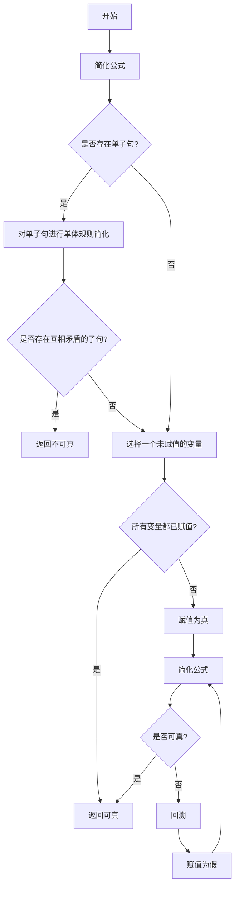

# 数理逻辑：恒真性和可真性

## 1. 背景介绍

### 1.1 问题的由来

在计算机科学和数学领域中,逻辑推理是一个基础性且重要的研究课题。数理逻辑作为形式化的推理体系,为计算机程序的正确性和可靠性提供了理论基础。其中,恒真性(validity)和可真性(satisfiability)是数理逻辑中两个核心概念,广泛应用于程序验证、自动定理证明、人工智能推理等诸多领域。

### 1.2 研究现状

传统的数理逻辑研究主要集中在命题逻辑和谓词逻辑等经典逻辑系统上,并已取得了丰硕的理论成果。然而,随着计算机科学的发展,人们对更加复杂和强大的逻辑系统的需求日益增长。近年来,模态逻辑、时态逻辑、描述逻辑等新兴逻辑系统受到了广泛关注,为解决实际问题提供了新的思路和方法。

### 1.3 研究意义

研究恒真性和可真性问题对于保证计算机程序的正确性和可靠性具有重要意义。通过对逻辑公式进行恒真性和可真性分析,我们可以验证程序的正确性,检测潜在的错误和漏洞,从而提高软件质量和安全性。此外,恒真性和可真性问题也广泛应用于人工智能推理、自动定理证明、知识表示和推理等领域,是计算机科学和数学的重要基础理论。

### 1.4 本文结构

本文将全面系统地介绍数理逻辑中的恒真性和可真性问题。首先,我们将阐述核心概念及其相互关系;然后详细探讨核心算法原理和具体操作步骤;接着,构建数学模型并推导相关公式,并通过案例分析进行详细讲解;随后,我们将提供代码实例并进行详细解释说明;最后,探讨实际应用场景、工具和资源推荐,总结未来发展趋势与挑战,并回答常见问题。

## 2. 核心概念与联系

在数理逻辑中,恒真性(validity)和可真性(satisfiability)是两个密切相关的核心概念。

**恒真性(Validity)** 指的是一个逻辑公式在任何可能的情况下都为真。换句话说,如果一个公式在所有可能的解释下都为真,那么这个公式就是恒真的。例如,命题逻辑公式 $p \vee \neg p$ 在任何情况下都为真,因此它是一个恒真公式。

**可真性(Satisfiability)** 指的是一个逻辑公式在至少一种情况下为真。如果一个公式存在至少一种解释使其为真,那么这个公式就是可真的。例如,命题逻辑公式 $p \wedge q$ 在某些情况下为真(当 $p$ 和 $q$ 都为真时),因此它是一个可真公式。

恒真性和可真性问题是密切相关的。一个公式是恒真的,当且仅当它的否定式不是可真的。同样,一个公式是可真的,当且仅当它的否定式不是恒真的。因此,判断一个公式的恒真性等价于判断它的否定式的不可真性,反之亦然。

这种等价关系为解决恒真性和可真性问题提供了一种思路:我们可以通过求解一个问题的补集来解决另一个问题。例如,如果我们想判断一个公式是否恒真,我们可以构造它的否定式,并检查这个否定式是否不可真。如果否定式不可真,那么原公式就是恒真的。

此外,恒真性和可真性问题还与逻辑推理密切相关。在自动定理证明和人工智能推理中,我们常常需要判断一个公式是否可以从一组前提中推导出来。这个问题可以转化为判断前提的合取式蕴含目标公式的恒真性问题,或者判断前提的合取式与目标公式的否定式的合取式是否不可真。

总之,恒真性和可真性是数理逻辑中两个基础且密切相关的概念,它们不仅在理论上具有重要意义,而且在实际应用中也扮演着关键角色。

## 3. 核心算法原理 & 具体操作步骤

### 3.1 算法原理概述

判断一个逻辑公式的恒真性和可真性是数理逻辑中的两个核心问题。传统上,我们可以使用真值表(truth table)或语义树(semantic tree)等方法来解决这些问题。然而,随着公式规模的增大,这些方法的计算复杂度会快速增长,导致计算效率低下。

为了更有效地解决恒真性和可真性问题,研究人员提出了一系列基于搜索的算法,其中最著名的是 **Davis-Putnam-Logemann-Loveland (DPLL)** 算法及其改进版本。DPLL算法是一种基于回溯搜索的算法,它通过系统地探索可能的真值赋值来判断一个公式是否可真。

DPLL算法的核心思想是:

1. 选择一个未赋值的变量,并尝试将其赋予真值和假值。
2. 根据当前的赋值,简化原公式,得到一个更简单的公式。
3. 如果简化后的公式为恒真,则原公式可真;如果简化后的公式为恒假,则回溯到上一步,尝试另一种赋值。
4. 重复上述步骤,直到找到一个可真的赋值或者穷尽所有可能的赋值。

DPLL算法的优势在于它采用了一种智能化的变量选择和简化策略,可以有效地剪枝搜索空间,从而提高算法效率。此外,DPLL算法还可以通过引入各种启发式和优化技术来进一步提升性能。

除了DPLL算法,还有一些其他著名的算法,如基于分解(decomposition)的算法、基于规则(rule-based)的算法等,它们各有优缺点,适用于不同的场景和问题类型。

### 3.2 算法步骤详解

下面我们将详细介绍DPLL算法的具体步骤:

1. **简化公式**:首先,我们对输入的公式进行预处理和简化,去除冗余子句和文字,将公式转换为合取范式(Conjunctive Normal Form, CNF)。

2. **单体规则简化**:检查是否存在单子句(只包含一个文字的子句)。如果存在,则根据单体规则对公式进行简化。单体规则指的是,如果一个子句只包含一个文字,那么这个文字必须为真,否则整个公式就会为假。因此,我们可以将这个文字赋为真,并从公式中删除包含这个文字或其否定的所有子句。

3. **检测矛盾**:检查是否存在互相矛盾的子句,即同时包含一个文字和它的否定。如果存在,则说明公式不可真,算法终止并返回不可真。

4. **变量选择**:如果没有矛盾,则选择一个未赋值的变量。变量选择策略对算法效率有重要影响,通常采用一些启发式策略,如最大出现次数(Most Frequent)、最小出现次数(Least Frequent)、最大增长度(Maximum Growth)等。

5. **赋值并简化**:将选择的变量赋予真值,并根据这个赋值对公式进行简化。简化过程包括单体规则简化和消去规则简化(删除包含已赋值文字的子句,并从剩余子句中删除已赋值文字的否定)。

6. **判断可真性**:检查简化后的公式是否为恒真或恒假。如果为恒真,则说明原公式可真,算法终止并返回可真。如果为恒假,则回溯到上一步,将当前变量赋予假值,并继续搜索。

7. **回溯**:如果当前赋值导致公式为恒假,则回溯到上一步,将当前变量赋予假值,并继续搜索。如果所有变量都已赋值且公式仍为恒假,则说明原公式不可真,算法终止并返回不可真。

DPLL算法通过上述步骤系统地探索所有可能的真值赋值,从而判断一个公式是否可真。算法的关键在于变量选择策略、简化策略和回溯机制,它们共同决定了算法的效率和性能。

### 3.3 算法优缺点

DPLL算法及其改进版本具有以下优点:

1. **完备性(Completeness)**:DPLL算法是一种完备算法,即对于任何输入公式,它都能正确地判断其是否可真。

2. **高效性(Efficiency)**:通过引入各种启发式和优化技术,DPLL算法在实践中表现出了良好的性能,可以有效地解决大规模的实例。

3. **易于理解和实现**:DPLL算法的基本思想简单明了,易于理解和实现。

4. **可扩展性(Extensibility)**:DPLL算法可以通过引入新的规则和策略来进一步优化和扩展,以适应不同的应用场景。

然而,DPLL算法也存在一些缺点和局限性:

1. **最坏情况指数复杂度**:尽管在实践中表现良好,但DPLL算法在最坏情况下的时间复杂度仍然是指数级别的,这意味着对于某些特殊实例,算法的运行时间会快速增长。

2. **对于某些实例效率较低**:虽然DPLL算法在大多数情况下表现出色,但对于某些特殊结构的实例,它的效率可能会大幅下降。

3. **需要合取范式转换**:DPLL算法要求输入公式必须转换为合取范式,而这个转换过程本身可能会导致指数级别的空间和时间开销。

4. **缺乏并行性**:DPLL算法本质上是一种序列算法,难以充分利用现代计算机的并行计算能力。

为了克服这些缺点,研究人员提出了许多改进版本和新算法,如基于冲突驱动的算法、基于查找的算法、并行算法等,以期进一步提高算法的效率和可扩展性。

### 3.4 算法应用领域

DPLL算法及其变体广泛应用于以下领域:

1. **程序验证(Program Verification)**:在程序验证中,我们需要判断一个程序是否满足某些期望的性质。这可以转化为判断一个逻辑公式的可真性问题,DPLL算法可以用于解决这个问题。

2. **自动定理证明(Automated Theorem Proving)**:在自动定理证明中,我们需要判断一个定理是否可以从一组前提中推导出来。这个问题可以转化为判断前提的合取式蕴含定理的恒真性问题,或者判断前提的合取式与定理否定式的合取式是否不可真,DPLL算法可以用于解决这些问题。

3. **约束满足问题(Constraint Satisfaction Problems, CSP)**:许多实际问题可以建模为约束满足问题,如规划、调度、配置等。DPLL算法可以用于求解这些CSP问题。

4. **布尔函数简化(Boolean Function Simplification)**:在数字电路设计和优化中,我们需要简化复杂的布尔函数。DPLL算法可以用于判断一个布尔函数是否等价于另一个更简单的函数,从而实现函数简化。

5. **人工智能推理(AI Reasoning)**:在人工智能推理中,我们需要从已知的事实和规则中推导出新的结论。DPLL算法可以用于推理过程中的逻辑推导和知识表示。

6. **组合优化(