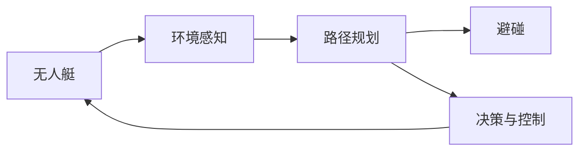

# 无人艇的避碰规划原理与方法

关键词：无人艇、避碰规划、人工势场法、RRT算法、A*算法、深度强化学习

## 1. 背景介绍
### 1.1  问题的由来
随着无人艇技术的快速发展,无人艇在海洋探测、海上巡逻、搜救等领域发挥着越来越重要的作用。然而,在复杂的海上环境中,无人艇面临着诸多挑战,其中避碰规划是一个关键问题。无人艇需要在动态变化的海洋环境中实时规划安全、高效的航行路径,避免与障碍物发生碰撞。

### 1.2  研究现状 
目前,国内外学者针对无人艇避碰规划问题开展了大量研究。传统方法主要包括人工势场法、RRT算法、A*算法等。近年来,随着人工智能技术的发展,基于深度强化学习的避碰规划方法受到广泛关注。尽管取得了一定进展,但现有方法在实时性、鲁棒性等方面仍存在不足,难以满足无人艇在复杂海洋环境下的避碰需求。

### 1.3  研究意义
针对无人艇避碰规划这一关键问题开展深入研究,对于提升无人艇的自主航行能力、保障海上作业安全具有重要意义。通过探索高效、鲁棒的避碰规划算法,可以增强无人艇面对复杂动态环境的适应能力,拓展其应用范围。同时,相关研究成果也可为其他自主航行器的避碰规划提供有益参考。

### 1.4  本文结构
本文将围绕无人艇避碰规划这一主题展开深入探讨。第2章介绍避碰规划涉及的核心概念及其联系。第3章重点阐述几种主流避碰规划算法的原理和步骤。第4章建立避碰规划问题的数学模型,并给出详细的公式推导与案例分析。第5章通过代码实例,展示避碰规划算法的具体实现。第6章分析无人艇避碰规划的实际应用场景。第7章推荐相关工具和学习资源。第8章总结全文,展望无人艇避碰规划的未来发展趋势与挑战。第9章列举常见问题解答。

## 2. 核心概念与联系

在无人艇避碰规划中,涉及以下几个核心概念:

- 无人艇(Unmanned Surface Vehicle, USV):一种无人驾驶的水面航行器,可自主执行各类海上任务。
- 避碰(Collision Avoidance):无人艇通过合理的路径规划,避免与障碍物发生碰撞。 
- 路径规划(Path Planning):根据环境信息和任务需求,为无人艇生成一条从起点到目标点的无碰撞路径。
- 环境感知(Environment Perception):无人艇通过各类传感器获取周围环境的信息,包括障碍物位置、海流、风速等。
- 决策与控制(Decision and Control):根据路径规划的结果,无人艇做出相应的决策,并通过控制系统执行规划路径。

下图展示了无人艇避碰规划涉及的核心概念及其联系:



无人艇通过环境感知获取周围信息,再由路径规划模块生成避碰路径,决策与控制模块根据路径执行相应操作,最终实现无人艇的避碰。

## 3. 核心算法原理 & 具体操作步骤
### 3.1  算法原理概述
无人艇避碰规划的核心是寻找一条从起点到目标点的无碰撞路径。常用的避碰规划算法包括:

1. 人工势场法(Artificial Potential Field, APF):将无人艇视为一个点,障碍物产生排斥力,目标点产生引力,无人艇在合力作用下运动。
2. 快速随机树(Rapidly-exploring Random Tree, RRT):在状态空间中随机采样,生成一棵从起点到目标点的树,寻找无碰撞路径。
3. A*算法:一种启发式搜索算法,通过评估节点到目标的代价,寻找代价最小的路径。
4. 深度强化学习(Deep Reinforcement Learning, DRL):通过神经网络逼近最优策略,使无人艇学习到避碰策略。

### 3.2  算法步骤详解
以人工势场法为例,其避碰规划的具体步骤如下:

1. 构建人工势场
   - 引力势场:目标点产生引力,引导无人艇向目标点运动。
   - 斥力势场:障碍物产生斥力,驱使无人艇远离障碍物。
2. 计算合力
   - 引力和斥力相叠加,得到作用于无人艇的合力。
   - 合力的方向指示无人艇下一步运动方向。
3. 无人艇运动
   - 无人艇沿合力方向运动一小段距离。
   - 更新无人艇位置。
4. 重复上述步骤
   - 重复计算势场、合力并更新位置,直到无人艇到达目标点。

### 3.3  算法优缺点
人工势场法的优点是:
- 原理简单,计算效率高。
- 能够生成平滑的避碰路径。

缺点包括:
- 容易陷入局部最优,即无人艇可能在复杂环境下停留在局部区域。
- 难以处理动态障碍物。

其他算法也有各自的优缺点,需要根据具体应用场景选择合适的避碰规划算法。

### 3.4  算法应用领域
无人艇避碰规划算法不仅可用于无人艇系统,在其他自主移动平台如无人车、无人机中也有广泛应用。此外,这些算法思想对于一般的路径规划问题,如机器人路径规划也有借鉴意义。

## 4. 数学模型和公式 & 详细讲解 & 举例说明
### 4.1  数学模型构建
为了对无人艇避碰规划问题进行数学建模,首先给出以下定义:

- 无人艇状态空间:$\mathcal{X} \subseteq \mathbb{R}^n$,表示无人艇所有可能的位置和姿态。
- 障碍物:$\mathcal{O} \subseteq \mathcal{X}$,表示环境中的障碍物区域。
- 无碰撞路径:$\sigma:[0,1] \to \mathcal{X} \backslash \mathcal{O}$,表示无人艇从起点到目标点的无碰撞轨迹。

无人艇避碰规划问题可描述为:给定起点$x_{start} \in \mathcal{X} \backslash \mathcal{O}$和目标点$x_{goal} \in \mathcal{X} \backslash \mathcal{O}$,寻找一条无碰撞路径$\sigma$,使得$\sigma(0)=x_{start}, \sigma(1)=x_{goal}$。

### 4.2  公式推导过程
以人工势场法为例,推导无人艇受到的引力和斥力。

引力势场定义为:

$$U_{att}(x) = \frac{1}{2} k_{att} \rho_{goal}^2(x)$$

其中,$k_{att}$为引力增益系数,$\rho_{goal}(x)$为无人艇当前位置$x$到目标点的距离。

引力为:

$$F_{att}(x) = - \nabla U_{att}(x) = - k_{att} \rho_{goal}(x) \nabla \rho_{goal}(x)$$

斥力势场定义为:

$$U_{rep}(x) = \begin{cases}
\frac{1}{2} k_{rep} (\frac{1}{\rho(x)}-\frac{1}{\rho_0})^2 & \rho(x) \leq \rho_0 \\
0 & \rho(x) > \rho_0
\end{cases}$$

其中,$k_{rep}$为斥力增益系数,$\rho(x)$为无人艇到最近障碍物的距离,$\rho_0$为斥力作用距离阈值。

斥力为:

$$F_{rep}(x) = \begin{cases}
k_{rep} (\frac{1}{\rho(x)}-\frac{1}{\rho_0}) \frac{1}{\rho^2(x)} \nabla \rho(x) & \rho(x) \leq \rho_0 \\
0 & \rho(x) > \rho_0
\end{cases}$$

无人艇受到的合力为引力和斥力之和:

$$F(x) = F_{att}(x) + F_{rep}(x)$$

### 4.3  案例分析与讲解
考虑一个简单的二维平面避碰规划问题。设无人艇状态空间为$\mathcal{X} = \mathbb{R}^2$,障碍物为一个圆形区域$\mathcal{O} = \{x \in \mathbb{R}^2 | \|x-x_{obs}\| \leq r_{obs}\}$,其中$x_{obs}$为障碍物中心,$r_{obs}$为障碍物半径。

给定起点$x_{start}=(0,0)$,目标点$x_{goal}=(10,10)$,障碍物$x_{obs}=(5,5), r_{obs}=2$,引力增益$k_{att}=1$,斥力增益$k_{rep}=10$,斥力作用距离阈值$\rho_0=3$。

根据上述公式,可计算无人艇在任意位置$x$受到的引力和斥力,进而得到合力。无人艇将沿合力方向运动,最终到达目标点,同时避开障碍物。

### 4.4  常见问题解答
1. Q:人工势场法的引力和斥力增益如何选取?
   A:增益选取需要平衡引力和斥力的相对大小。引力增益过大,无人艇可能直接穿过障碍物;斥力增益过大,无人艇可能难以到达目标点。一般通过反复试验,选取合适的增益值。

2. Q:如何处理多个障碍物的情况?
   A:可以将每个障碍物产生的斥力叠加,得到无人艇受到的总斥力。但需要注意斥力的合理性,避免过大的斥力导致无人艇振荡或停滞。

3. Q:无人艇速度如何控制?
   A:可以根据合力大小设置无人艇速度,合力越大,速度越快。但同时需要考虑无人艇的动力学约束,避免超出无人艇的速度和加速度限制。

## 5. 项目实践：代码实例和详细解释说明
### 5.1  开发环境搭建
本项目使用Python语言实现无人艇避碰规划算法。需要安装以下库:
- NumPy:数值计算库,用于矩阵运算。
- Matplotlib:绘图库,用于可视化无人艇轨迹。

可通过以下命令安装:
```
pip install numpy matplotlib
```

### 5.2  源代码详细实现
下面给出人工势场法避碰规划的Python实现:

```python
import numpy as np
import matplotlib.pyplot as plt

class APF:
    def __init__(self, start, goal, obstacles, k_att, k_rep, rho_0):
        self.start = np.array(start)
        self.goal = np.array(goal)
        self.obstacles = obstacles
        self.k_att = k_att
        self.k_rep = k_rep
        self.rho_0 = rho_0
    
    def attractive_force(self, x):
        return self.k_att * (self.goal - x)
    
    def repulsive_force(self, x):
        f_rep = np.zeros_like(x)
        for obs in self.obstacles:
            rho = np.linalg.norm(x - obs[:2])
            if rho <= self.rho_0:
                f_rep += self.k_rep * (1/rho - 1/self.rho_0) / rho**2 * (x - obs[:2])
        return f_rep
    
    def plan(self, step_size=0.1, max_iters=500):
        x = self.start
        path = [x]
        for i in range(max_iters):
            f_att = self.attractive_force(x)
            f_rep = self.repulsive_force(x)
            f_total = f_att + f_rep
            x = x + step_size * f_total / np.linalg.norm(f_total)
            path.append(x)
            if np.linalg.norm(x - self.goal) < step_size:
                break
        return np.array(path)

if __name__ == "__main__":
    start = (0, 0)
    goal = (10,