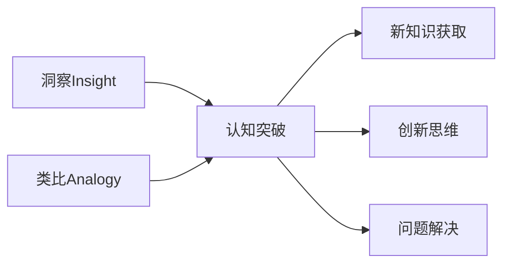

以下是根据你提供的要求和模板撰写的技术博客文章正文部分：

# 洞察与类比：突破知识限制的工具

## 1. 背景介绍

### 1.1 问题的由来

在这个日新月异的时代,知识的更新速度前所未有。我们被期望不断学习新的概念、技能和思维模式,以跟上科技的飞速发展步伐。然而,人类大脑的认知能力是有限的,我们很容易受到已有知识结构的束缚,难以突破固有思维模式。这种认知局限性阻碍了我们获取和理解新知识的能力,成为了学习和创新的绊脚石。

### 1.2 研究现状 

为了帮助人们克服认知局限,研究人员一直在探索各种认知工具和技术。其中,洞察(Insight)和类比(Analogy)被认为是两种强大的认知策略,可以帮助我们突破知识的界限,获得新的见解和创新思维。

洞察是指突然领悟问题的解决方案或获得新的认识,往往伴随着"恍然大悟"的感觉。类比则是通过将新概念与已知概念建立联系,从而理解和学习新知识的过程。这两种策略都可以帮助我们重新组织和重新理解信息,从而获得新的见解和创新思路。

### 1.3 研究意义

掌握并有效运用洞察和类比策略,对于个人学习、创新思维和解决复杂问题至关重要。在当今知识爆炸的时代,这些认知工具可以帮助我们更好地理解和掌握新知识,提高学习效率,激发创新潜能。

此外,洞察和类比策略在人工智能领域也有广泛的应用前景。通过模拟人类的认知过程,我们可以设计出更智能、更有创造力的人工智能系统,推动人工智能技术的发展和应用。

### 1.4 本文结构

本文将从以下几个方面深入探讨洞察和类比作为认知工具的作用:

1. 阐述洞察和类比的核心概念及其相互关系
2. 剖析洞察和类比的算法原理及具体操作步骤
3. 建立相关的数学模型,并通过公式和案例进行详细讲解
4. 介绍在实际项目中应用洞察和类比策略的代码实现
5. 分析洞察和类比在不同领域的实际应用场景
6. 推荐相关的学习资源、开发工具和研究论文
7. 总结洞察和类比在认知科学和人工智能领域的发展趋势和挑战
8. 解答常见问题,帮助读者更好地掌握和运用这些策略

## 2. 核心概念与联系

洞察(Insight)和类比(Analogy)是两个密切相关的认知过程,都可以帮助我们突破知识的局限,获取新知识、激发创新思维并解决复杂问题。

**洞察**指的是突然领悟问题的解决方案或获得新的认识,往往伴随着"恍然大悟"的感觉。它是一种重组已有知识结构的过程,通过重新组合和关联信息,产生全新的见解和理解。

**类比**则是将新概念与已知概念建立联系的过程。通过发现两个看似不同的事物之间的相似性,我们可以将已掌握的知识迁移到新领域,从而理解和学习新知识。

这两个过程相辅相成,相互促进。洞察可以帮助我们发现新的类比关系,而类比则为洞察提供了素材和基础。通过有效结合洞察和类比,我们可以突破认知局限,获取新知识,激发创新思维,并解决复杂的问题。

## 3. 核心算法原理与具体操作步骤

### 3.1 算法原理概述

洞察和类比作为认知策略,其背后都有一些共同的算法原理:

1. **表征学习(Representation Learning)**: 通过机器学习技术从数据中自动学习特征表示,捕捉问题的本质特征和模式。

2. **结构映射(Structure Mapping)**: 在不同领域之间建立结构上的对应关系,发现隐藏的相似性和规律性。

3. **概念组合(Conceptual Combination)**: 将已有的概念进行重新组合,产生新的概念表征和见解。

4. **约束满足(Constraint Satisfaction)**: 在满足一定约束条件的前提下,寻找最优解决方案。

5. **启发式搜索(Heuristic Search)**: 基于经验法则和规则,高效地在解空间中搜索潜在的解决方案。

这些原理为洞察和类比的算法实现奠定了基础。下面我们将详细介绍具体的算法步骤。

### 3.2 算法步骤详解

#### 洞察算法步骤

1. **表征学习**:使用深度学习模型(如自编码器、生成对抗网络等)从大量数据中自动学习问题的特征表示。

2. **结构分析**:对学习到的特征表示进行结构分析,发现潜在的模式和规律。

3. **概念组合**:将发现的模式和规律进行重新组合,产生新的概念表示。

4. **约束优化**:在满足一定约束(如相关性、一致性等)的前提下,优化新的概念表示。

5. **解空间搜索**:使用启发式搜索算法(如蒙特卡罗树搜索、模拟退火等)在解空间中搜索最优解决方案。

6. **解的评估**:对搜索到的潜在解决方案进行评估,选择最优解作为洞察的结果。

#### 类比算法步骤

1. **表象提取**:从源领域和目标领域分别提取实体、关系和语义特征作为表象表示。

2. **结构映射**:在源领域和目标领域之间建立结构映射关系,发现隐藏的相似性。

3. **推理传递**:根据源领域和目标领域之间的结构映射关系,将源领域的已知知识传递到目标领域。

4. **约束规则**:在传递过程中,应用一定的语义和结构约束规则,确保推理的一致性和合理性。

5. **解空间搜索**:使用启发式搜索算法在目标领域的解空间中搜索最佳解决方案。

6. **解的评估**:对搜索到的潜在解决方案进行评估,选择最优解作为类比的结果。

通过上述步骤,洞察算法可以发现新的见解和解决方案,而类比算法则可以将已有知识迁移到新领域,帮助我们获取新知识。

### 3.3 算法优缺点

#### 优点

- **认知突破**:洞察和类比算法可以帮助我们突破固有的思维模式,获得新的见解和创新思路。

- **知识迁移**:类比算法实现了跨领域知识的迁移,提高了学习新知识的效率。

- **高效解决问题**:通过结构映射和概念组合,这些算法可以高效地在复杂的解空间中搜索最优解决方案。

- **可解释性**:相比于黑盒模型,洞察和类比算法的解决过程具有较好的可解释性,有利于人类理解和信任。

#### 缺点

- **计算复杂度高**:特别是在处理大规模数据和复杂结构时,算法的计算复杂度可能会急剧增加。

- **领域知识依赖**:算法的性能在很大程度上依赖于领域知识的质量和覆盖面。

- **评估困难**:很难定量评估洞察和类比的效果,缺乏统一的评价标准。

- **数据稀疏问题**:在一些领域,可用的结构化数据可能较为稀疏,影响算法的性能。

### 3.4 算法应用领域

洞察和类比算法在多个领域都有广泛的应用前景:

- **创新设计**:通过洞察和类比,可以帮助设计师发现新的设计理念和解决方案。

- **科学发现**:这些算法可以用于发现新的科学定律、理论和规律。

- **教育智能辅助**:为学习者提供个性化的洞见和类比示例,提高学习效率。

- **问题求解**:在复杂的决策和优化问题中,可以利用洞察和类比算法寻找创新的解决方案。

- **认知计算**:模拟人类的认知过程,构建具有洞见和类比能力的智能系统。

- **自然语言处理**:通过建立语义类比关系,提高自然语言理解和生成的质量。

总的来说,洞察和类比算法为人工智能系统赋予了更强的认知能力,有助于推动人工智能技术的发展和应用。

## 4. 数学模型和公式 & 详细讲解 & 举例说明

### 4.1 数学模型构建

为了形式化描述洞察和类比的过程,我们需要建立相应的数学模型。这些模型不仅有助于深入理解算法原理,也为算法的实现和优化提供了理论基础。

#### 洞察模型

我们可以将洞察过程建模为一个优化问题,目标是在满足一定约束条件的前提下,寻找最优的概念组合,产生新的见解。

设 $\mathcal{C}$ 为概念空间, $\mathbf{c} \in \mathcal{C}$ 表示一个概念。我们定义一个评分函数 $f(\mathbf{c})$,用于衡量概念 $\mathbf{c}$ 的洞见程度。洞察问题可以形式化为:

$$\max_{\mathbf{c} \in \mathcal{C}} f(\mathbf{c})$$
$$\text{s.t.} \quad g_i(\mathbf{c}) \leq 0, \quad i = 1, 2, \ldots, m$$

其中 $g_i(\mathbf{c})$ 表示概念 $\mathbf{c}$ 需要满足的第 $i$ 个约束条件,如相关性、一致性等。通过优化该目标函数,我们可以获得产生最大洞见的概念组合。

#### 类比模型

类比过程可以建模为一个结构映射问题。给定源领域 $\mathcal{S}$ 和目标领域 $\mathcal{T}$,我们需要找到一个最优的结构映射 $\phi: \mathcal{S} \rightarrow \mathcal{T}$,将源领域的知识传递到目标领域。

设 $\mathbf{s} \in \mathcal{S}$ 和 $\mathbf{t} \in \mathcal{T}$ 分别表示源领域和目标领域中的实体,我们定义一个相似度函数 $\text{sim}(\mathbf{s}, \mathbf{t})$ 衡量实体 $\mathbf{s}$ 和 $\mathbf{t}$ 之间的相似程度。类比问题可以形式化为:

$$\max_{\phi} \sum_{\mathbf{s} \in \mathcal{S}} \sum_{\mathbf{t} \in \mathcal{T}} \text{sim}(\mathbf{s}, \phi(\mathbf{s}))$$
$$\text{s.t.} \quad h_j(\phi) = 0, \quad j = 1, 2, \ldots, n$$

其中 $h_j(\phi)$ 表示结构映射 $\phi$ 需要满足的第 $j$ 个约束条件,如一对一映射、同构保持等。通过优化该目标函数,我们可以获得源领域和目标领域之间最优的结构映射关系。

### 4.2 公式推导过程

#### 洞察模型公式推导

我们首先定义评分函数 $f(\mathbf{c})$ 来衡量概念 $\mathbf{c}$ 的洞见程度。一个合理的选择是将其建模为概念的新颖性和相关性的加权组合:

$$f(\mathbf{c}) = \alpha \cdot \text{novelty}(\mathbf{c}) + \beta \cdot \text{relevance}(\mathbf{c})$$

其中 $\alpha$ 和 $\beta$ 是权重系数,分别控制新颖性和相关性对总体评分的贡献。

新颖性 $\text{novelty}(\mathbf{c})$ 可以定义为概念 $\mathbf{c}