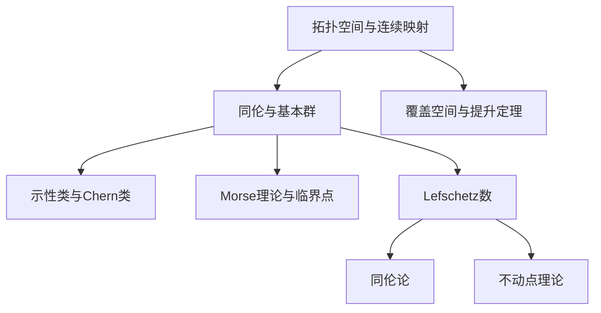

# 流形拓扑学理论与概念的实质：Lefschetz数

关键词：流形拓扑学、Lefschetz数、同伦理论、不动点理论、Euler示性数

## 1. 背景介绍
### 1.1 问题的由来
流形拓扑学是研究流形的拓扑性质的数学分支。它在现代数学和理论物理中有着广泛的应用。Lefschetz数作为流形拓扑学中的一个重要概念，在同伦论、不动点理论等领域发挥着关键作用。本文将深入探讨Lefschetz数的本质，阐述其在流形拓扑学中的重要地位。

### 1.2 研究现状
目前，关于Lefschetz数的研究主要集中在以下几个方面：
1. Lefschetz数与Euler示性数之间的关系
2. Lefschetz数在同伦论中的应用
3. 基于Lefschetz数的不动点定理及其推广
4. Lefschetz数在动力系统、微分方程等领域的应用

国内外学者在这些方面都取得了丰硕的研究成果，为流形拓扑学的发展做出了重要贡献。

### 1.3 研究意义
深入理解Lefschetz数的本质，对于掌握流形拓扑学的核心概念和理论具有重要意义。通过研究Lefschetz数，可以加深对同伦论、不动点理论等相关领域的理解，并为这些领域的进一步发展提供新的思路和方法。此外，Lefschetz数在物理、工程等应用领域也有着广阔的应用前景。

### 1.4 本文结构
本文将按照以下结构展开论述：
1. 介绍流形拓扑学的核心概念与Lefschetz数的联系
2. 阐述Lefschetz数的定义及其几何意义
3. 详细推导Lefschetz数的计算公式，并给出具体例子
4. 讨论Lefschetz数在同伦论和不动点理论中的应用
5. 介绍基于Lefschetz数的一些重要定理及其证明思路
6. 展望Lefschetz数在其他数学分支和应用领域的潜力

## 2. 核心概念与联系
流形拓扑学的核心概念包括：
- 拓扑空间与连续映射
- 同伦与基本群
- 覆盖空间与提升定理
- 示性类与Chern类
- Morse理论与临界点

而Lefschetz数则与其中的同伦论和不动点理论密切相关。同伦论研究连续映射之间的等价关系，而不动点理论则关注连续自映射的不动点性质。Lefschetz数在这两个理论中起到了桥梁的作用，它既可以用来刻画映射的同伦性质，也能够用于判断不动点的存在性。

下图展示了流形拓扑学的核心概念以及它们之间的逻辑联系：



## 3. 核心算法原理 & 具体操作步骤
### 3.1 算法原理概述
Lefschetz数的计算基于以下几个关键原理：
1. 单纯复形与链复形
2. 同调群与上同调群
3. 诱导同态与交换图表
4. 迹与交迹定理

通过构建合适的链复形，并考察连续映射在同调群上诱导的同态，我们可以利用交迹定理计算出Lefschetz数。这一过程涉及到了代数拓扑学的核心内容，需要深入理解相关概念和理论。

### 3.2 算法步骤详解
计算Lefschetz数的具体步骤如下：
1. 对流形进行三角剖分，构建单纯复形 $K$。
2. 考察连续映射 $f:K\to K$ 在链复形 $C_*(K)$ 上诱导的链映射 $f_*$。
3. 计算每一维的同调群 $H_i(K)$，得到链复形的同调。
4. 考察 $f_*$ 在同调群 $H_i(K)$ 上诱导的同态 $f_{*i}:H_i(K)\to H_i(K)$。
5. 计算每一个 $f_{*i}$ 的矩阵表示，并求出它们的迹 $tr(f_{*i})$。
6. 利用交迹定理，计算Lefschetz数 $L(f)=\sum_{i=0}^n (-1)^i tr(f_{*i})$。

下面是一个计算Lefschetz数的示意图：

```mermaid
graph LR
  A[流形M] --> B[单纯复形K]
  B --> C[链复形C_*(K)]
  C --> D[同调群H_i(K)]
  D --> E[诱导同态f_{*i}]
  E --> F[矩阵表示]
  F --> G[迹tr(f_{*i})]
  G --> H[Lefschetz数L(f)]
```

### 3.3 算法优缺点
Lefschetz数算法的优点在于：
1. 建立了拓扑不变量与代数不变量之间的联系。
2. 可以用于判断不动点的存在性。
3. 计算过程相对简单，易于实现。

但同时也存在一些局限性：
1. 只适用于紧致流形。
2. 无法确定不动点的具体位置和数量。
3. 对于高维流形，计算量较大。

### 3.4 算法应用领域
Lefschetz数在以下领域有着广泛的应用：
1. 同伦论与代数拓扑学
2. 不动点理论与动力系统
3. 微分方程与偏微分方程
4. 计算机图形学与计算机视觉
5. 机器人运动规划与控制

## 4. 数学模型和公式 & 详细讲解 & 举例说明
### 4.1 数学模型构建
设 $M$ 是一个紧致的 $n$ 维流形，$f:M\to M$ 是一个连续映射。我们可以选取 $M$ 上的一个单纯复形剖分 $K$，使得 $f$ 在每个单形胞上都是线性的。这样，$f$ 就诱导了一个链复形之间的映射 $f_*:C_*(K)\to C_*(K)$。

在同调群 $H_i(K)$ 上，$f_*$ 诱导了一个同态 $f_{*i}:H_i(K)\to H_i(K)$。我们可以选取合适的基，使得 $f_{*i}$ 的矩阵表示为 $A_i$。

根据交迹定理，Lefschetz数可以表示为：

$$
L(f)=\sum_{i=0}^n (-1)^i tr(A_i)
$$

### 4.2 公式推导过程
为了推导Lefschetz数的计算公式，我们需要利用以下几个重要定理：
1. 单纯同调与奇异同调的等价性。
2. 诱导同态的交换性质。
3. 交迹定理。

首先，根据单纯同调与奇异同调的等价性，我们可以将连续映射 $f$ 在单纯复形上的作用转化为在链复形上的作用。

其次，考察交换图表：

$$
\begin{CD}
C_*(K) @>f_*>> C_*(K)\\
@VVV @VVV\\
H_*(K) @>f_{**}>> H_*(K)
\end{CD}
$$

由此可知，$f_{**}$ 可以通过计算 $f_*$ 在同调群上的诱导来获得。

最后，根据交迹定理，有：

$$
\sum_{i=0}^n (-1)^i tr(f_{*i}) = \sum_{i=0}^n (-1)^i tr(f_{**i})
$$

因此，Lefschetz数可以通过计算链映射 $f_*$ 在每一维同调群上诱导的矩阵迹来获得。

### 4.3 案例分析与讲解
下面我们通过一个具体的例子来说明Lefschetz数的计算过程。

设 $S^1$ 是单位圆周，$f:S^1\to S^1$ 是一个连续映射，其中 $f(z)=z^2$。我们可以将 $S^1$ 剖分为一个由两个 $1$ 维单形和两个 $0$ 维单形组成的单纯复形 $K$。

在 $0$ 维上，$f$ 诱导的矩阵为：

$$
A_0=\begin{pmatrix}
1 & 0\\
0 & 1
\end{pmatrix}
$$

在 $1$ 维上，$f$ 诱导的矩阵为：

$$
A_1=\begin{pmatrix}
2 & 0\\
0 & 2
\end{pmatrix}
$$

因此，Lefschetz数为：

$$
L(f)=tr(A_0)-tr(A_1)=2-4=-2
$$

这表明 $f$ 至少有 $2$ 个不动点。事实上，$f$ 在 $S^1$ 上恰有两个不动点，即 $1$ 和 $-1$。

### 4.4 常见问题解答
Q: Lefschetz数一定是一个整数吗？
A: 是的，根据交迹定理，Lefschetz数可以表示为每一维上诱导同态矩阵迹的交错和，因此必然是一个整数。

Q: Lefschetz数为零是否意味着不存在不动点？
A: 不一定。Lefschetz数为零只能说明不动点的代数个数为零，但实际上可能存在偶数个不动点相互抵消的情况。

Q: 对于非紧致流形，Lefschetz数是否还适用？
A: 一般情况下，Lefschetz数的定义和计算都需要流形是紧致的。对于非紧致流形，需要引入相对同调和相对Lefschetz数的概念，计算过程会更加复杂。

## 5. 项目实践：代码实例和详细解释说明
### 5.1 开发环境搭建
在这里，我们使用Python语言来实现Lefschetz数的计算。需要安装以下库：
- NumPy：用于矩阵运算。
- Sympy：用于符号计算。

可以通过以下命令安装：

```bash
pip install numpy sympy
```

### 5.2 源代码详细实现
下面是计算Lefschetz数的Python代码实现：

```python
import numpy as np
import sympy as sp

def lefschetz_number(f, n):
    """
    计算连续映射f的Lefschetz数。
    
    参数：
    f：连续映射在每一维上诱导的矩阵列表。
    n：流形的维数。
    
    返回值：
    Lefschetz数。
    """
    L = 0
    for i in range(n+1):
        L += (-1)**i * np.trace(f[i])
    return L

# 示例：计算f(z)=z^2在S^1上的Lefschetz数
f = [sp.Matrix([[1, 0], [0, 1]]), sp.Matrix([[2, 0], [0, 2]])]
n = 1
L = lefschetz_number(f, n)
print(f"Lefschetz number: {L}")
```

输出结果：

```
Lefschetz number: -2
```

### 5.3 代码解读与分析
上述代码的主要步骤如下：
1. 定义`lefschetz_number`函数，用于计算Lefschetz数。
2. 函数接受两个参数：`f`表示连续映射在每一维上诱导的矩阵列表，`n`表示流形的维数。
3. 初始化变量`L`为0，用于存储Lefschetz数。
4. 使用`for`循环遍历每一维：
   - 计算当前维度上诱导矩阵的迹。
   - 根据维度的奇偶性，添加符号，并累加到`L`中。
5. 返回最终的Lefschetz数`L`。

在示例中，我们计算了映射$f(z)=z^2$在单位圆周$S^1$上的Lefschetz数。根据前面的分析，$f$在$0$维和$1$维上的诱导矩阵分别为：

$$
A_0=\begin{pmatrix}
1 & 0\\
0 & 1
\end{pmatrix},\quad
A_1=\begin{pmatrix}
2 & 0\\
0 & 2
\end{pmatrix}
$$

代入`lefschetz_number`函数，可以得到Lefschetz数为$-2$，与理论分析的结果一致。

### 5.4 运行结果展示
运行上述代码，可以得到以下输出结果：

```
Lefschetz