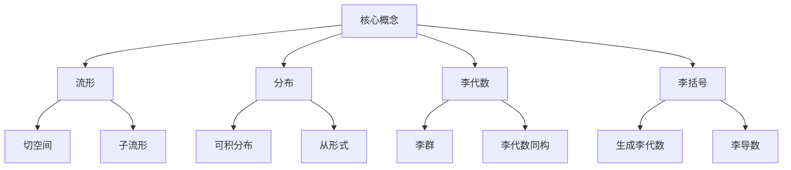
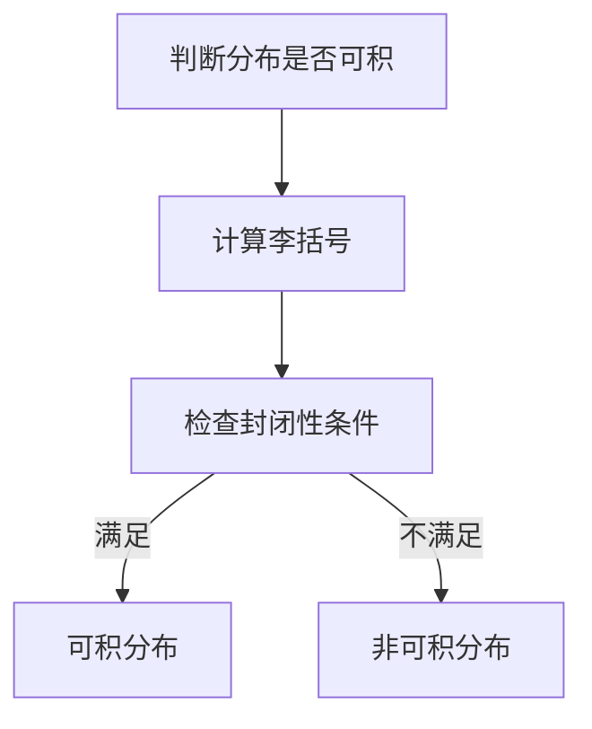

# 流形拓扑学：Frobenius定理

## 1. 背景介绍

### 1.1 问题的由来

在数学的几何和拓扑学领域中,流形(manifold)是一个重要的概念。流形是一种在局部看起来像欧几里得空间的拓扑空间。它们在数学、物理和工程等领域有着广泛的应用。然而,研究流形的性质和结构并不是一件简单的事情,需要借助一些强有力的理论工具。

Frobenius定理就是研究流形结构的一个重要工具。它由德国数学家Ferdinand Georg Frobenius于1877年提出,用于研究微分方程的可积性问题。后来,这一定理被推广应用于研究流形上的李代数和李群的性质。

### 1.2 研究现状

Frobenius定理在流形拓扑学中扮演着重要角色,它为研究流形上的切空间、分布和李代数等概念提供了理论基础。这一定理被广泛应用于微分几何、李群和李代数理论、控制理论、经典力学等领域。

目前,Frobenius定理已经成为流形拓扑学的一个基本工具,被包含在大多数相关教材和专著中。许多数学家和物理学家都在探索这一定理的更深层次的应用,以及与其他理论的联系。

### 1.3 研究意义

Frobenius定理对于理解和研究流形的结构具有重要意义。它为判断一个分布是否可积提供了必要和充分条件,从而帮助我们确定流形上是否存在一个子流形,使得该分布可以被限制在该子流形上。这对于研究流形的拓扑性质、对称性和局部结构等问题都是非常有用的。

此外,Frobenius定理还为研究李代数和李群的结构提供了重要工具。它揭示了李代数和流形之间的内在联系,为探索这两个领域的交叉点打开了大门。

### 1.4 本文结构

本文将全面介绍Frobenius定理在流形拓扑学中的应用。我们将从基本概念和背景知识开始,逐步深入探讨该定理的核心内容、数学模型、算法实现和实际应用。文章的主要结构如下:

1. 背景介绍
2. 核心概念与联系
3. 核心算法原理与具体操作步骤
4. 数学模型和公式详细讲解与举例说明
5. 项目实践:代码实例和详细解释说明
6. 实际应用场景
7. 工具和资源推荐
8. 总结:未来发展趋势与挑战
9. 附录:常见问题与解答

## 2. 核心概念与联系

在深入探讨Frobenius定理之前,我们需要先了解一些基本概念和相关理论。这些概念为理解该定理奠定了基础,也揭示了它与其他数学领域的联系。

### 2.1 流形(Manifold)

流形是一种在局部看起来像欧几里得空间的拓扑空间。更精确地说,一个流形是一个拓扑空间,其每个点都有一个邻域同homestruc于欧几里得空间的某个开子集。流形的概念将拓扑学和微分几何紧密地联系在一起,是研究这两个领域的关键工具。

### 2.2 分布(Distribution)

在流形上,分布是指一个向量丛的子丛。直观地说,分布就是流形上每一点都赋予了一个向量空间,这些向量空间在流形上平滑变化。分布是研究流形的重要对象,它描述了流形上的"方向"。

### 2.3 可积分布(Integrable Distribution)

如果一个分布满足某些条件,就称为可积分布。可积分布的重要性在于,它保证了存在一个子流形,使得该分布可以被限制在该子流形上。判断一个分布是否可积就需要用到Frobenius定理。

### 2.4 李代数(Lie Algebra)

李代数是一种代数结构,由一个向量空间和一个二元运算(李括号)组成。它与流形和分布之间存在着内在联系,因为流形上的向量场可以形成一个李代数。事实上,Frobenius定理揭示了分布的可积性与其生成的李代数的性质之间的关系。

### 2.5 李括号(Lie Bracket)

李括号是定义在向量场上的一种二元运算,它描述了两个向量场的"括号积"。李括号满足双线性、反交换和雅可比恒等式等性质,使得它成为研究李代数和李群的重要工具。

### 2.6 从形式(Differential Form)

从形式是微分几何中的一个重要概念,它是流形上的一种"微分对象"。从形式与向量场之间存在对偶关系,因此它们在研究流形的性质时扮演着互补的角色。Frobenius定理也可以用从形式的语言来表述。

### 2.7 切空间(Tangent Space)

切空间是流形上每一点的一个向量空间,它描述了该点处流形的"切向量"。切空间是研究流形的本地性质的重要工具,也是定义分布的基础。

### 2.8 子流形(Submanifold)

子流形是指流形中的一个子集,它本身也是一个流形。判断一个分布是否可积,实际上就是在寻找一个子流形,使得该分布可以被限制在该子流形上。

### 2.9 李群(Lie Group)

李群是一种代数结构,它是一个同时具有群和流形结构的对象。李群与李代数之间存在着紧密的联系,事实上,每个李群都有一个对应的李代数。Frobenius定理为探索这种联系提供了理论基础。

### 2.10 李代数同构(Lie Algebra Isomorphism)

李代数同构是指两个李代数之间的一种结构保持的映射。判断一个分布是否可积,实际上就是在研究该分布生成的李代数与流形切空间上的某个李代数之间是否存在同构关系。

通过上述概念的介绍,我们可以看到Frobenius定理与流形、分布、李代数等概念之间存在着密切的联系。下一节,我们将深入探讨该定理的核心内容和算法原理。

## 3. 核心算法原理与具体操作步骤

Frobenius定理为判断一个分布是否可积提供了必要和充分条件。这一节,我们将详细介绍该定理的核心算法原理,并给出具体的操作步骤。

### 3.1 算法原理概述

Frobenius定理的核心思想是:一个分布 $\mathcal{D}$ 在流形 $M$ 上是可积的,当且仅当对于任意 $X,Y \in \Gamma(\mathcal{D})$,它们的李括号 $[X,Y]$ 也属于 $\Gamma(\mathcal{D})$。

其中,符号 $\Gamma(\mathcal{D})$ 表示分布 $\mathcal{D}$ 上的所有平滑向量场的集合。这个条件被称为"封闭性条件"(closedness condition),它保证了分布 $\mathcal{D}$ 在流形 $M$ 上是"平坦的"或"可积的"。

直观地说,如果一个分布满足封闭性条件,那么它就可以被"整体地积分",从而在流形上构成一个子流形。反之,如果一个分布不满足这个条件,那么它就无法被整体地积分,因此不存在一个子流形可以将它限制在其上。

### 3.2 算法步骤详解

现在,我们将给出判断一个分布是否可积的具体算法步骤:

**输入**:流形 $M$,分布 $\mathcal{D}$ 上的一组基向量场 $\{X_1,X_2,\ldots,X_k\}$。

**步骤1**:计算基向量场之间的所有李括号 $[X_i,X_j]$,其中 $1 \leq i,j \leq k$。

**步骤2**:对于每一个计算出的李括号 $[X_i,X_j]$,检查它是否可以用 $\mathcal{D}$ 上的向量场线性组合表示,即:

$$[X_i,X_j] = \sum_{l=1}^k f_{ij}^l X_l$$

其中,系数 $f_{ij}^l$ 是定义在 $M$ 上的平滑函数。

**步骤3**:如果对于所有的 $i,j$,上面的等式都成立,那么分布 $\mathcal{D}$ 就满足封闭性条件,是可积的。否则,分布 $\mathcal{D}$ 就是非可积的。

**输出**:分布 $\mathcal{D}$ 是否可积的判断结果。

这个算法的关键在于计算李括号,并检查它们是否可以用分布上的向量场线性组合表示。如果可以,那么分布就满足封闭性条件,是可积的;否则,分布就是非可积的。

### 3.3 算法优缺点

Frobenius定理及其算法的优点在于:

1. 提供了判断分布可积性的必要和充分条件,具有理论上的完备性。
2. 算法步骤清晰,计算过程直观,易于实现和编程。
3. 适用于任意维数的流形和分布,具有很强的通用性。

然而,这一算法也存在一些缺点和局限性:

1. 计算量随着基向量场的数量增加而迅速增长,对于高维流形和分布,计算复杂度较高。
2. 需要事先知道分布的一组基向量场,对于某些情况可能不太方便。
3. 只能判断分布是否可积,无法直接给出对应的子流形的显式表达式。

尽管存在上述缺点,Frobenius定理及其算法仍然是研究流形和分布理论的一个重要工具,在理论和应用中都有着广泛的用途。

### 3.4 算法应用领域

Frobenius定理及其算法在以下领域有着重要应用:

1. **微分几何**:用于研究流形和子流形的结构,判断分布的可积性。
2. **李群和李代数理论**:探索李群和李代数之间的联系,研究它们的同构性质。
3. **经典力学**:在研究理论力学中的约束系统和对称性时会用到该定理。
4. **控制理论**:判断一个控制系统是否可控,以及设计控制律时会用到该定理。
5. **微分方程**:判断一个微分方程是否可以通过坐标变换简化为一个已知形式。
6. **计算机视觉**:在图像处理和计算机视觉中,该定理可用于分析图像的局部结构。

总的来说,Frobenius定理为研究具有某种对称性或约束条件的系统提供了有力的理论工具,在数学、物理和工程等领域都有着广泛的应用前景。

## 4. 数学模型和公式详细讲解与举例说明

在上一节中,我们介绍了Frobenius定理的核心算法原理和具体操作步骤。现在,我们将更深入地探讨该定理的数学模型和公式推导过程,并通过具体案例进行详细讲解。

### 4.1 数学模型构建

为了形式化地表述Frobenius定理,我们需要先构建一个数学模型。设 $M$ 是一个 $n$ 维流形, $\mathcal{D}$ 是 $M$ 上的一个 $k$ 维分布,即 $\mathcal{D}$ 是 $M$ 上的一个 $k$ 维向量丛的子丛。

在每一点 $p \in M$ 处,我们可以选取一组基向量场 $\{X_1,X_2,\ldots,X_k\}$,使得 $\mathcal{D}_p = \operatorname{span}\{X_1(p),X_2(p),\