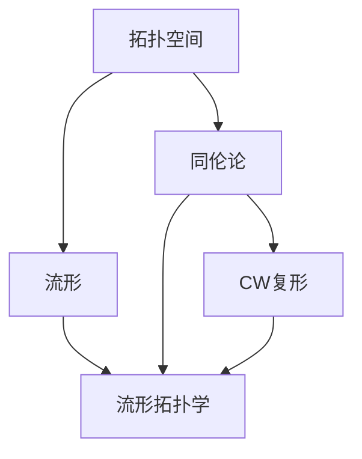

# 流形拓扑学：Whitehead乘积

关键词：流形、拓扑学、Whitehead乘积、同伦论、CW复形

## 1. 背景介绍
### 1.1  问题的由来
流形拓扑学是现代数学和物理学中一个重要的研究领域,它研究流形这种特殊的拓扑空间的性质。而Whitehead乘积作为流形拓扑学中的一个重要工具,在同伦论和CW复形理论中有着广泛的应用。本文将深入探讨Whitehead乘积的定义、性质以及在流形拓扑学中的应用。

### 1.2  研究现状
目前关于Whitehead乘积的研究主要集中在以下几个方面：

1. Whitehead乘积的定义和基本性质的研究。
2. Whitehead乘积在同伦论中的应用,特别是在高阶连通性的研究中的应用。 
3. Whitehead乘积在CW复形理论中的应用,用于研究CW复形的同伦不变量。
4. Whitehead乘积在流形分类问题中的应用。

### 1.3  研究意义
Whitehead乘积作为流形拓扑学和代数拓扑中的重要工具,其研究对于深入理解流形的拓扑性质、同伦群的结构以及CW复形的构造等问题都有重要意义。同时Whitehead乘积也为进一步研究高维流形分类提供了有力工具。

### 1.4  本文结构
本文将按照以下结构展开论述：

1. 介绍流形、拓扑学等相关背景知识和Whitehead乘积的研究现状及意义。 
2. 给出Whitehead乘积的形式化定义,并阐述其基本性质。
3. 详细介绍Whitehead乘积在同伦论中的应用,特别是高阶连通性的研究。
4. 探讨Whitehead乘积在CW复形理论中的作用,如何用其刻画CW复形的同伦不变量。
5. 分析Whitehead乘积在流形分类问题中的应用,为研究高维流形提供思路。
6. 总结Whitehead乘积的研究现状,并对其在流形拓扑学中的发展前景作出展望。

## 2. 核心概念与联系
在正式介绍Whitehead乘积之前,我们首先回顾一下流形拓扑学中的一些核心概念：

- 拓扑空间：对集合赋予某种"邻近"结构的数学对象,是研究连续性的基础。
- 流形：局部同胚于欧氏空间$R^n$的拓扑空间,可看作是"连续变形"后的欧氏空间。
- 同伦：两个连续映射之间存在连续变形的关系,反映了拓扑空间之间的"连续变形等价性"。
- CW复形：由胞腔通过连续映射粘合而成的拓扑空间,是研究同伦论的重要工具。

下图给出了这些概念之间的逻辑联系：

而Whitehead乘积就是建立在这些概念之上,将同伦论与CW复形理论联系起来的重要工具。它反映了拓扑空间的同伦不变量与其CW复形结构之间的深刻联系。

## 3. 核心算法原理 & 具体操作步骤
### 3.1  算法原理概述
Whitehead乘积的核心思想是将两个拓扑空间的同伦群"相乘",得到一个新的群,作为原空间乘积空间的同伦不变量。其基本原理可总结如下：

1. 给定两个拓扑空间$X$和$Y$,分别考虑其第$n$维和第$m$维同伦群$\pi_n(X)$和$\pi_m(Y)$。
2. 构造$X$和$Y$的乘积空间$X\times Y$,研究其第$n+m$维同伦群$\pi_{n+m}(X\times Y)$。
3. 定义$\pi_n(X)$与$\pi_m(Y)$的Whitehead乘积映射$\omega:\pi_n(X)\times \pi_m(Y)\to \pi_{n+m}(X\times Y)$。
4. 研究映射$\omega$的性质,将其与乘积空间$X\times Y$的CW复形结构相联系,得到同伦不变量。

### 3.2  算法步骤详解
下面我们详细介绍Whitehead乘积的构造步骤：

步骤1：给定拓扑空间$X$和$Y$,分别取其第$n$维和第$m$维同伦群$\pi_n(X)$和$\pi_m(Y)$的元素$\alpha\in \pi_n(X)$和$\beta\in \pi_m(Y)$。

步骤2：取$n$维球面$S^n$和$m$维球面$S^m$,分别构造映射$f:S^n\to X$和$g:S^m\to Y$,使得$[f]=\alpha$和$[g]=\beta$。

步骤3：考虑$S^n$与$S^m$的乘积空间$S^n\times S^m$,构造映射$h:S^n\times S^m\to X\times Y$,其中$h(x,y)=(f(x),g(y))$。

步骤4：取$S^n\times S^m$的商空间$(S^n\times S^m)/(S^n\vee S^m)$,其中$S^n\vee S^m$表示$S^n$和$S^m$的楔积。商映射$q:(S^n\times S^m)\to (S^n\times S^m)/(S^n\vee S^m)$诱导同伦群之间的映射$q_*:\pi_{n+m}(S^n\times S^m)\to \pi_{n+m}((S^n\times S^m)/(S^n\vee S^m))$。

步骤5：定义$\alpha$与$\beta$的Whitehead乘积为$\omega(\alpha,\beta)=h_*q_*^{-1}(id)\in \pi_{n+m}(X\times Y)$,其中$id$为商空间$(S^n\times S^m)/(S^n\vee S^m)$的恒等映射。

### 3.3  算法优缺点
Whitehead乘积算法的主要优点有：

- 建立了拓扑空间的同伦群与其乘积空间同伦群之间的联系。
- 将同伦论与CW复形理论有机结合,为研究拓扑空间的代数不变量提供了有力工具。
- 计算相对简单,适用于各种拓扑空间。

但同时该算法也存在一些局限性：

- 仅适用于球面的乘积空间,对一般的拓扑空间需要进一步推广。
- 计算结果依赖于空间的CW复形结构,对复杂空间的计算较为困难。

### 3.4  算法应用领域 
Whitehead乘积算法主要应用于以下领域：

- 同伦论：用于研究拓扑空间的高阶连通性质及其同伦群结构。
- CW复形理论：用于构造CW复形的同伦不变量,刻画其拓扑性质。
- 流形分类：通过计算流形的Whitehead乘积不变量,为流形分类提供新的思路和方法。

## 4. 数学模型和公式 & 详细讲解 & 举例说明
### 4.1  数学模型构建
为了形式化地描述Whitehead乘积,我们引入以下数学模型：

设$X$和$Y$是两个拓扑空间,分别取其第$n$维和第$m$维同伦群$\pi_n(X)$和$\pi_m(Y)$。定义乘积映射
$$\omega:\pi_n(X)\times \pi_m(Y)\to \pi_{n+m}(X\times Y)$$
其中对于$\alpha\in \pi_n(X)$和$\beta\in \pi_m(Y)$,取映射$f:S^n\to X$和$g:S^m\to Y$使得$[f]=\alpha$和$[g]=\beta$,则
$$\omega(\alpha,\beta)=h_*q_*^{-1}(id)$$
其中$h:S^n\times S^m\to X\times Y$满足$h(x,y)=(f(x),g(y))$,$q:S^n\times S^m\to (S^n\times S^m)/(S^n\vee S^m)$为商映射。

### 4.2  公式推导过程
为了推导出Whitehead乘积的具体计算公式,我们考虑$S^n\times S^m$的CW复形结构。事实上,$(S^n\times S^m)/(S^n\vee S^m)$同胚于$S^{n+m}$,因此商映射$q$诱导了同伦群之间的同构
$$q_*:\pi_{n+m}(S^n\times S^m)\cong \pi_{n+m}((S^n\times S^m)/(S^n\vee S^m))\cong \pi_{n+m}(S^{n+m})\cong \mathbb{Z}$$
从而$\omega(\alpha,\beta)$可以表示为映射$h:(S^n\times S^m)/(S^n\vee S^m)\to X\times Y$在同伦群$\pi_{n+m}(X\times Y)$中的像。

进一步地,利用同伦群的suspension同构,可以将$\omega(\alpha,\beta)$表示为$\alpha$和$\beta$在$X$和$Y$上的suspension的乘积：
$$\omega(\alpha,\beta)=\Sigma^m\alpha \cdot \Sigma^n\beta$$
其中$\Sigma$表示suspension算子,$\cdot$表示同伦群中的乘法。

### 4.3  案例分析与讲解
下面我们通过一个具体的例子来说明Whitehead乘积的计算过程。

考虑$X=S^2$和$Y=S^4$,分别取$\alpha\in \pi_2(S^2)\cong \mathbb{Z}$和$\beta\in \pi_4(S^4)\cong \mathbb{Z}$为生成元。我们要计算$\omega(\alpha,\beta)\in \pi_6(S^2\times S^4)$。

首先构造映射$f:S^2\to S^2$和$g:S^4\to S^4$,使得$[f]=\alpha$和$[g]=\beta$。例如可以取$f$和$g$都为恒等映射。

然后考虑乘积映射$h:S^2\times S^4\to S^2\times S^4$,其中$h(x,y)=(f(x),g(y))=(x,y)$。容易看出$h$诱导了同伦群之间的同态：
$$h_*:\pi_6(S^2\times S^4)\to \pi_6(S^2\times S^4)$$

另一方面,商映射$q:S^2\times S^4\to (S^2\times S^4)/(S^2\vee S^4)\cong S^6$诱导了同构：
$$q_*:\pi_6(S^2\times S^4)\cong \pi_6(S^6)\cong \mathbb{Z}$$

因此$\omega(\alpha,\beta)=h_*q_*^{-1}(id)$事实上就是$\pi_6(S^2\times S^4)\cong \mathbb{Z}$的生成元。换句话说,我们有：
$$\omega(\alpha,\beta)=\Sigma^4\alpha \cdot \Sigma^2\beta=\pm 1\in \pi_6(S^2\times S^4)$$

这个结果表明,球面$S^2$和$S^4$的乘积空间$S^2\times S^4$的第6维同伦群$\pi_6(S^2\times S^4)$由$S^2$和$S^4$的suspension的乘积生成。

### 4.4  常见问题解答
问题1：Whitehead乘积映射$\omega$是否满射？

答：一般来说,$\omega$不一定是满射。例如当$X$和$Y$都是单点空间时,乘积空间$X\times Y$也是单点,其同伦群均为平凡群,此时$\omega$显然不是满射。但在某些特殊情况下,$\omega$可以是满射,例如上述$S^2$与$S^4$的例子。

问题2：Whitehead乘积与同伦群之间有何联系？ 

答：Whitehead乘积实际上建立了拓扑空间的同伦群与其乘积空间同伦群之间的联系。特别地,对于球面$S^n$和$S^m$,Whitehead乘积给出了$\pi_{n+m}(S^n\times S^m)$与$\pi_n(S^n)$和$\pi_m(S^m)$之间的关系。更一般地,对于任意CW复形$X$和$Y$,Whitehead乘积将它们的同伦群与乘积空间$X\