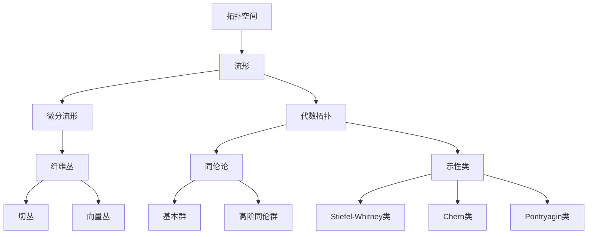

# 流形拓扑学：相关代数理论

关键词：流形、拓扑学、代数拓扑、微分流形、纤维丛、同伦论、示性类、de Rham上同调、Morse理论

## 1. 背景介绍

### 1.1 问题的由来
流形拓扑学是现代数学的重要分支,它研究具有局部性质类似于欧氏空间的拓扑空间,即流形。流形拓扑学不仅在纯数学领域有重要地位,在理论物理、机器人运动规划、计算机图形学等应用领域也有广泛应用。流形上的许多几何和分析问题,都需要用到流形拓扑学的方法。因此,深入研究流形拓扑学具有重要的理论意义和应用价值。

### 1.2 研究现状
流形拓扑学经过一个多世纪的发展,已经形成了一套比较完善的理论体系。从点集拓扑到代数拓扑,从微分流形到纤维丛,各个分支都有了长足的进步。近年来,流形拓扑学与物理学、计算机科学等学科的交叉融合日益加深,涌现出许多新的研究方向和课题,如拓扑绝缘体、拓扑量子计算、计算拓扑学等。同时,传统的一些问题如Poincaré猜想等也得到了解决。可以说,流形拓扑学正处于一个蓬勃发展的时期。

### 1.3 研究意义
流形拓扑学作为现代数学的核心分支之一,其研究成果对数学发展具有重要的推动作用。流形拓扑学为研究物理学、计算机科学等领域的许多问题提供了新的思路和方法。深入研究流形拓扑学,对于促进数学与其他学科的交叉融合,推动科学的发展具有重要意义。此外,流形拓扑学的一些理论和方法,如纤维丛、特征类等,在数据分析、机器学习等领域也有潜在的应用前景。

### 1.4 本文结构
本文将主要介绍流形拓扑学中的代数拓扑方法。第二节介绍流形拓扑学的一些核心概念。第三节介绍同伦论的基本原理和计算方法。第四节介绍示性类理论及其在流形分类中的应用。第五节通过实例讲解如何用代数拓扑方法求解流形上的积分。第六节讨论代数拓扑方法在物理学和计算机科学中的一些应用。第七节介绍学习流形拓扑学的相关资源。第八节对全文进行总结,并对流形拓扑学的发展前景进行展望。

## 2. 核心概念与联系

流形拓扑学中有几个核心概念：拓扑空间、流形、同伦、纤维丛等。它们之间的逻辑关系如下图所示：

拓扑空间是流形拓扑学的研究对象,流形是一类特殊的拓扑空间。流形可以从微分结构和代数拓扑两个角度来研究。微分流形理论研究流形上的光滑结构和微分形式,是流形上分析的基础。代数拓扑则利用代数结构如群、环等来研究流形的拓扑性质。

同伦论和示性类是代数拓扑的两大支柱。同伦论利用连续映射的变形研究拓扑空间的性质,基本群刻画了拓扑空间的连通性,高阶同伦群则反映了空间的高维连通性。示性类将流形上的几何结构与代数结构联系起来,Stiefel-Whitney类、Chern类、Pontryagin类等分别刻画了不同的几何结构。

纤维丛理论在流形拓扑学中也有重要地位,它是研究流形局部和整体性质的有力工具。切丛刻画了流形上的微分结构,向量丛则与示性类理论密切相关。

总之,以上这些概念构成了流形拓扑学的核心,它们相互交织,构成了一个有机的整体。

## 3. 核心算法原理 & 具体操作步骤

### 3.1 算法原理概述
同调群是代数拓扑中的一个重要工具,它反映了拓扑空间的"洞"的信息。德拉姆(de Rham)上同调将微分形式引入同调论,建立了微分形式与同调群之间的同构。下面以德拉姆上同调为例,说明其计算流形上同调群的原理。

### 3.2 算法步骤详解
设M为n维紧致定向流形,Ωk(M)为M上k次微分形式构成的向量空间。德拉姆上同调的计算步骤如下:

1. 定义外微分算子d:Ωk(M)→Ωk+1(M),满足d²=0。

2. 定义k次闭形式group Zk(M)和k次恰当形式group Bk(M)：
$$
\begin{aligned}
Z^k(M) &= \ker(d:\Omega^k(M) \to \Omega^{k+1}(M)) \\
B^k(M) &= \mathrm{im}(d:\Omega^{k-1}(M) \to \Omega^k(M))
\end{aligned}
$$

3. 定义第k个德拉姆上同调group Hk(M)为商group：
$$H^k(M) = Z^k(M) / B^k(M)$$

4. 利用Stokes定理证明Hk(M)是良定的,即与选取的具体微分形式无关,只与M的拓扑结构有关。

5. 计算Hk(M)的生成元和关系式,得到Hk(M)的群结构。常用的计算技巧包括Mayer-Vietoris序列、Künneth公式等。

### 3.3 算法优缺点
德拉姆上同调的优点是将微分形式引入同调论,使得同调群的计算更加直观和便利。利用分割单位、有限元等技术,可以将德拉姆上同调的计算转化为线性代数问题。

但是德拉姆上同调也有其局限性。它只适用于光滑流形,对于更一般的拓扑空间,需要采用奇异同调等方法。此外,在计算高维流形的同调群时,直接计算微分形式会非常困难,需要借助一些间接的方法。

### 3.4 算法应用领域
德拉姆上同调在纯数学和理论物理中都有重要应用。在纯数学中,它是研究流形拓扑性质的重要工具。很多流形的分类定理,如h-cobordism定理,都是利用上同调得到的。

在理论物理中,德拉姆上同调被广泛应用于规范场论、弦理论等领域。例如,规范场的分类可以用上同调群来刻画,弦理论中的D-brane电荷也与上同调群有关。

近年来,上同调群在拓扑数据分析中也得到了应用。通过计算数据点云的上同调群,可以获得数据的拓扑结构信息,用于数据降维、特征提取等。

## 4. 数学模型和公式 & 详细讲解 & 举例说明

### 4.1 数学模型构建
示性类将流形上的几何结构与代数拓扑结构联系起来,是流形拓扑学的重要内容。下面以Chern类为例,说明其数学模型的构建过程。

设E为复向量丛,其基为流形M。E的k次Chern类ck(E)定义为：

$$c_k(E) = \frac{i}{2\pi} \mathrm{tr} \left( \frac{i}{2\pi} \mathbf{F}_E \right)^k$$

其中FE为E上的曲率形式,tr为矩阵的迹。可以证明,ck(E)是M上的一个闭的2k次微分形式,它的同调类只依赖于E的同构类,因此是E的拓扑不变量。

Chern类满足一些良好的性质,如Whitney积公式：

$$c(E \oplus F) = c(E) \smile c(F)$$

其中⊕表示Whitney和,⌣表示杯积。这些性质使得Chern类成为研究复向量丛的有力工具。

### 4.2 公式推导过程
下面我们推导Chern类的一个重要性质：Chern类与陈示性标准形式之间的关系。

设E为复向量丛,其基为流形M,秩为n。取E的一个联络∇,其曲率形式为FE。令

$$\phi(E,t) = \det \left( I + \frac{i}{2\pi} t \mathbf{F}_E \right) = \sum_{k=0}^n c_k(E) t^k$$

其中I为n×n单位矩阵,t为形式变量。可以验证,φ(E,t)是M上的闭形式,且不依赖于∇的选取。φ(E,t)被称为E的陈示性标准形式。

将φ(E,t)展开,比较tk的系数,可得：

$$c_k(E) = \frac{i}{2\pi} \mathrm{tr} \left( \frac{i}{2\pi} \mathbf{F}_E \right)^k$$

这就是Chern类的定义式。由此可见,Chern类可以看作是陈示性标准形式的系数。

### 4.3 案例分析与讲解
下面我们以复投影空间为例,计算其上的Chern类。

设CPn为n维复投影空间,它可以看作是复线性空间Cn+1中去掉原点后再按复线性等价关系分类得到的商空间。CPn上有一个自然的复线丛γn,称为Hopf丛,它的纤维是复线性空间C。

利用Euler序列,可以计算出γn的全Chern类为：

$$c(\gamma^n) = 1 + x$$

其中x∈H2(CPn)是CPn上的生成元。由此可以得到CPn上的所有Chern类：

$$c_1(\gamma^n) = x, \quad c_k(\gamma^n) = 0 \quad (k>1)$$

进一步,利用Whitney积公式,可以计算出CPn上任意复向量丛的Chern类。例如,切丛TCPn的Chern类为：

$$c(T\mathbb{C}P^n) = (1+x)^{n+1}$$

这说明TCPn的所有Chern类都可以由x表示,反映了CPn的拓扑结构的特殊性。

### 4.4 常见问题解答
Q: Chern类在流形分类中有什么作用?
A: Chern类是区分复向量丛的重要工具。例如,对于两个复向量丛E和F,如果它们的全Chern类不同,那么E和F一定不同构。利用Chern类,可以给出许多流形的分类定理和不可嵌入定理。

Q: Chern类与Euler示性类有什么关系?
A: Euler示性类可以看作是Chern类的一个特例。具体来说,设E为秩为2n的实向量丛,那么E的Euler示性类e(E)与E复化后的第n个Chern类有如下关系：

$$e(E) = c_n(E \otimes \mathbb{C})$$

因此,Chern类可以看作是Euler示性类在复向量丛上的推广。

Q: 除了Chern类,还有哪些常见的示性类?
A: 除了Chern类,常见的示性类还有Stiefel-Whitney类、Pontryagin类等。Stiefel-Whitney类用于研究实向量丛,Pontryagin类用于研究实向量丛的复化。此外,还有一些特殊的示性类如Euler类、Wu类等,它们在特定的问题中起到重要作用。

## 5. 项目实践：代码实例和详细解释说明

### 5.1 开发环境搭建
研究流形拓扑学需要用到一些数学软件和程序库。以下是一些常用的工具：

- Matlab:提供了丰富的数值计算和符号计算功能,配合一些拓扑学工具箱如JAVAPLEX,可以方便地进行同调群等的计算。  
- GAP:一个专门用于计算群论、表示论等的软件,也包含了一些拓扑学功能。