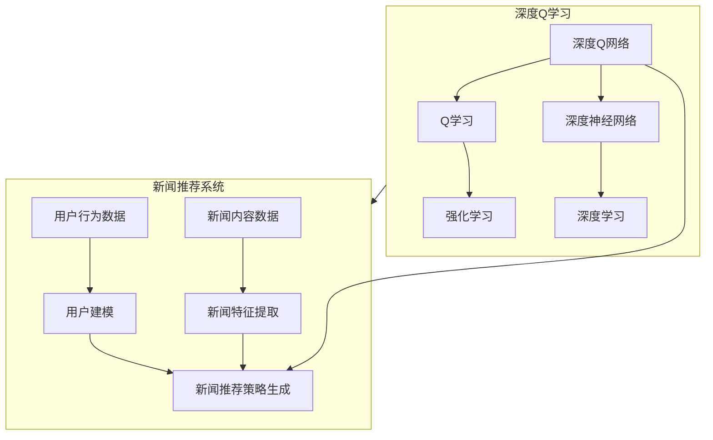

以下是标题为《深度 Q-learning：在新闻推荐中的应用》的技术博客文章正文内容：

# 深度 Q-learning：在新闻推荐中的应用

## 1. 背景介绍

### 1.1 问题的由来

在当今信息时代,新闻作为重要的信息来源,其推荐质量对用户体验至关重要。传统的新闻推荐系统主要基于协同过滤、内容过滤等方法,但这些方法往往忽视了用户的动态偏好和上下文环境。随着深度学习技术的兴起,人工智能推荐系统有了长足发展,其中深度强化学习因其在序列决策问题上的优异表现,备受关注。

### 1.2 研究现状  

深度强化学习将深度神经网络与传统强化学习有机结合,通过自我学习优化决策序列,在推荐系统、对话系统、机器人控制等领域展现出巨大潜力。其中,Q-learning算法作为强化学习的经典之作,已被广泛应用。然而,传统Q-learning在处理大规模离散状态空间时,表现不佳。深度Q网络(DQN)的提出,将Q-learning与深度神经网络相结合,有效解决了高维状态空间下的决策问题。

### 1.3 研究意义

本文探索了将深度Q-learning应用于新闻推荐场景的可行性和优势。我们设计了一种基于深度Q网络的新闻推荐框架,旨在根据用户的历史行为和上下文信息,学习最优的新闻推荐策略,提高用户体验。该框架不仅能捕捉用户的动态偏好,还能充分利用新闻的丰富特征,为用户提供个性化、多样化的新闻推荐。

### 1.4 本文结构

本文首先介绍深度Q-learning的核心概念,包括Q-learning、深度神经网络等;然后详细阐述了深度Q网络在新闻推荐中的应用原理和算法步骤;接着对算法的数学模型进行了推导和案例分析;随后通过代码实例展示了算法的具体实现;最后讨论了该方法在实际场景中的应用前景,并总结了未来的发展趋势和挑战。

## 2. 核心概念与联系

深度Q-learning是将强化学习中的Q-learning算法与深度神经网络相结合的技术。

- **Q-learning**是一种基于价值迭代的强化学习算法,通过不断更新状态-行为对的Q值表,学习到最优的决策策略。但传统Q-learning在处理大规模状态空间时,由于维数灾难而表现不佳。

- **深度神经网络**则是一种由多层神经元组成的有力的函数拟合器,能够从海量数据中自动学习特征表示,在计算机视觉、自然语言处理等领域表现出色。

- **深度Q网络(DQN)** 将Q-learning中的Q值表使用深度神经网络来拟合和逼近,从而避免了维数灾难的问题,能够在高维状态空间下学习出优秀的决策策略。

在新闻推荐系统中,我们需要根据用户的历史行为数据对用户进行建模,从新闻内容数据中提取特征,然后生成新闻推荐策略。深度Q网络能够从用户行为和新闻内容中自动学习特征表示,并通过Q-learning算法优化推荐策略序列,从而为用户提供个性化的新闻推荐服务。

## 3. 核心算法原理 & 具体操作步骤  

### 3.1 算法原理概述

深度Q网络在新闻推荐中的工作原理可概括为:

1. 构建环境状态,包括用户特征和新闻特征;
2. 对于每个状态,通过深度Q网络计算每个可选新闻的Q值;
3. 根据Q值选择推荐的新闻作为行为执行;
4. 观测到用户对推荐新闻的反馈(点击、阅读等),得到环境反馈(奖励);
5. 使用Q-learning算法,根据反馈更新Q网络的参数;
6. 重复上述过程,不断优化Q网络,学习最优推荐策略。

该算法融合了深度学习自动特征提取的优势和强化学习序列决策的优势,能够基于用户反馈持续优化推荐策略。

### 3.2 算法步骤详解

1. **初始化**
    - 初始化深度Q网络,包括输入层、隐藏层和输出层
    - 初始化经验回放池用于存储过往经验
    - 初始化 $\epsilon-greedy$ 策略的超参数 $\epsilon$ 

2. **构建状态向量**
    - 将用户特征(如年龄、位置等)和新闻特征(如标题、内容等)拼接形成状态向量 $s_t$

3. **计算Q值并选择行为**
    - 对于状态 $s_t$,通过Q网络计算每个可选新闻的Q值 $Q(s_t, a_i)$
    - 根据 $\epsilon-greedy$ 策略选择行为 $a_t$:
        - 以概率 $\epsilon$ 随机选择一个新闻
        - 以概率 $1-\epsilon$ 选择Q值最大的新闻
    - 将选择的新闻 $a_t$ 推荐给用户

4. **获取环境反馈并存储经验**
    - 观测到用户对推荐新闻的反馈(点击、阅读等),得到环境反馈(奖励) $r_t$
    - 将经验 $(s_t, a_t, r_t, s_{t+1})$ 存储到经验回放池中

5. **采样并更新Q网络**
    - 从经验回放池中采样一批经验 $(s_j, a_j, r_j, s_{j+1})$
    - 计算目标Q值:
        $$
        y_j = r_j + \gamma \max_{a'} Q(s_{j+1}, a'; \theta^-)
        $$
        其中 $\gamma$ 为折扣因子, $\theta^-$ 为目标Q网络的参数(用于稳定训练)
    - 计算损失函数:
        $$
        L = \mathbb{E}_{(s, a, r, s')\sim D}\left[(y - Q(s, a; \theta))^2\right]
        $$
        其中 $D$ 为经验回放池
    - 使用梯度下降算法更新Q网络参数 $\theta$

6. **更新目标Q网络**
    - 每隔一定步数,将Q网络的参数 $\theta$ 复制到目标Q网络 $\theta^-$

7. **回到步骤2,重复训练**

通过上述算法,深度Q网络能够从用户反馈中不断学习和优化新闻推荐策略,为用户提供个性化推荐。

### 3.3 算法优缺点

**优点:**

- 能够自动从用户行为和新闻内容中学习特征表示,无需人工设计特征
- 通过强化学习,可以根据用户反馈持续优化推荐策略序列
- 具有探索与利用的平衡机制,能够发现新的优秀推荐
- 能够处理高维状态空间,适用于大规模新闻推荐场景

**缺点:**

- 训练过程复杂,需要大量数据和计算资源
- 存在潜在的不稳定性和发散风险,需要一些技巧(如经验回放池、目标网络等)
- 算法性能依赖于奖励函数的设计,奖励函数的选择需要领域知识
- 难以解释推荐决策的内在原因,缺乏可解释性

### 3.4 算法应用领域

深度Q-learning算法不仅可以应用于新闻推荐领域,还可以推广到其他序列决策问题,如:

- 推荐系统:商品推荐、音乐推荐、视频推荐等
- 对话系统:基于对话历史生成自然语言响应
- 机器人控制:根据环境状态选择机器人的运动轨迹
- 网络路由:动态选择数据分组的传输路径
- 游戏AI:根据游戏状态选择最优行为策略
- 等等

## 4. 数学模型和公式 & 详细讲解 & 举例说明

### 4.1 数学模型构建

我们将新闻推荐问题建模为一个马尔可夫决策过程(MDP):

- **状态空间 $\mathcal{S}$**:用户特征向量和新闻特征向量的拼接,表示当前状态
- **行为空间 $\mathcal{A}$**:所有可选的新闻候选集合
- **转移概率 $\mathcal{P}$**:用户对推荐新闻的反馈(点击、阅读等),会影响下一个状态的转移
- **奖励函数 $\mathcal{R}$**:根据用户反馈,给出对应的奖励值(如点击+1,未点击0等)

在该MDP中,我们的目标是找到一个最优策略 $\pi^*$,使得在该策略下的期望总奖励最大化:

$$
\pi^* = \arg\max_\pi \mathbb{E}_\pi\left[\sum_{t=0}^\infty \gamma^t r_t\right]
$$

其中 $\gamma$ 为折扣因子,用于权衡未来奖励的重要性。

### 4.2 公式推导过程

Q-learning算法通过不断更新状态-行为对的Q值表,逼近最优Q函数 $Q^*(s, a)$,进而得到最优策略 $\pi^*$。

根据贝尔曼最优方程,最优Q函数满足:

$$
Q^*(s, a) = \mathbb{E}_{s' \sim \mathcal{P}(\cdot|s, a)}\left[r(s, a) + \gamma \max_{a'} Q^*(s', a')\right]
$$

Q-learning通过以下迭代式逼近 $Q^*$:

$$
Q(s_t, a_t) \leftarrow Q(s_t, a_t) + \alpha\left(r_t + \gamma \max_{a'}Q(s_{t+1}, a') - Q(s_t, a_t)\right)
$$

其中 $\alpha$ 为学习率。

然而,在高维状态空间下,使用表格存储Q值会遇到维数灾难的问题。深度Q网络(DQN)通过使用深度神经网络 $Q(s, a; \theta)$ 来拟合Q函数,避免了维数灾难。

在DQN中,我们优化神经网络参数 $\theta$,使得 $Q(s, a; \theta)$ 逼近真实的Q函数 $Q^*(s, a)$。具体地,我们最小化以下损失函数:

$$
L(\theta) = \mathbb{E}_{(s, a, r, s')\sim D}\left[\left(r + \gamma \max_{a'} Q(s', a'; \theta^-) - Q(s, a; \theta)\right)^2\right]
$$

其中 $D$ 为经验回放池, $\theta^-$ 为目标Q网络的参数(用于稳定训练)。

通过梯度下降算法更新 $\theta$,我们可以得到一个逼近最优Q函数的深度Q网络,从而生成最优的新闻推荐策略。

### 4.3 案例分析与讲解

假设我们有如下用户特征和新闻特征:

- 用户特征:
    - 年龄:25岁
    - 性别:男
    - 地理位置:北京
- 新闻特征:
    - 标题:《科技巨头的隐私争议》
    - 关键词:科技、隐私、争议
    - 类别:科技、新闻

我们将这些特征编码为向量,拼接为状态向量 $s_t$,输入到深度Q网络中。

假设该时刻有3个可选新闻候选集 $\mathcal{A} = \{a_1, a_2, a_3\}$,分别对应以下新闻:

- $a_1$:《人工智能的未来发展》
- $a_2$:《区块链革命的影响》  
- $