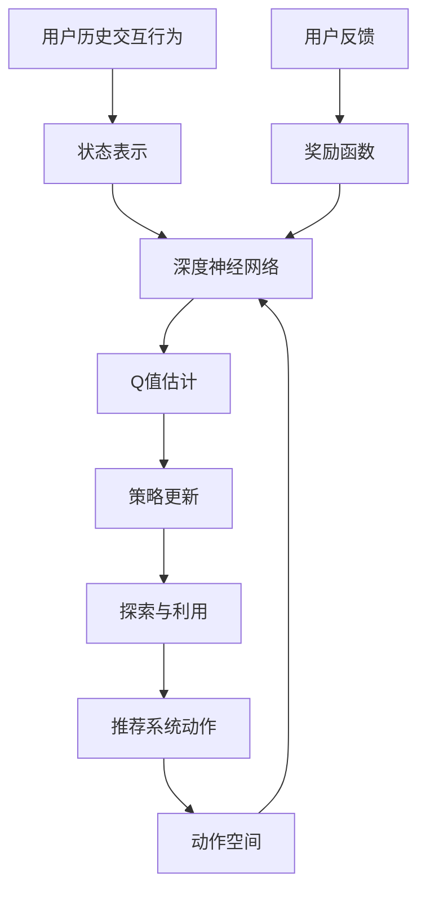

# 深度 Q-learning：在电子商务推荐系统中的应用

## 1. 背景介绍

### 1.1 问题的由来

在当今快节奏的电子商务时代，为用户提供个性化和高度相关的产品推荐已成为企业保持竞争力的关键因素。传统的协同过滤和基于内容的推荐系统虽然取得了一定成功,但它们存在一些固有的局限性,例如冷启动问题、数据稀疏性和对动态用户偏好的适应能力有限。

为了解决这些挑战,研究人员开始探索将强化学习(Reinforcement Learning)技术应用于推荐系统领域。强化学习是一种基于环境交互的机器学习范式,旨在通过试错和累积经验来学习最优策略。其中,Q-learning是强化学习中最著名和广泛使用的算法之一。然而,传统的Q-learning算法在处理大规模、高维度的推荐系统问题时,往往会遇到维数灾难和数据稀疏性等挑战。

### 1.2 研究现状

为了克服传统Q-learning算法的局限性,研究人员提出了深度Q-learning(Deep Q-Learning)算法,它将深度神经网络与Q-learning相结合,利用神经网络的强大函数逼近能力来估计Q值函数。深度Q-learning已经在多个领域取得了令人瞩目的成就,如视频游戏、机器人控制和对抗性博弈等。

在推荐系统领域,深度Q-learning也逐渐受到关注。一些先驱性的研究工作探索了将深度Q-learning应用于推荐系统的可行性,并取得了令人鼓舞的结果。然而,由于推荐系统问题的复杂性和特殊性,如何有效地设计和优化深度Q-learning算法以适应推荐系统的需求,仍然是一个具有挑战性的研究课题。

### 1.3 研究意义

深入研究深度Q-learning在推荐系统中的应用,具有重要的理论和实践意义。从理论层面上,它有助于我们更好地理解强化学习在推荐系统中的作用机制,并探索新的算法和模型来提高推荐系统的性能。从实践层面上,成功应用深度Q-learning可以为电子商务企业带来巨大的商业价值,提高用户体验和销售业绩。

### 1.4 本文结构

本文将全面探讨深度Q-learning在电子商务推荐系统中的应用。我们将首先介绍深度Q-learning的核心概念和原理,然后详细阐述其在推荐系统中的具体应用方法。接下来,我们将重点讨论深度Q-learning算法的数学模型和公式推导,并通过实际案例进行详细说明。此外,我们还将提供一个完整的项目实践,包括代码实现、运行结果展示和详细解释。最后,我们将探讨深度Q-learning在推荐系统中的实际应用场景、未来发展趋势和面临的挑战。

## 2. 核心概念与联系

深度Q-learning是一种将深度神经网络与Q-learning相结合的强化学习算法。它的核心思想是使用神经网络来近似Q值函数,从而解决传统Q-learning算法在处理高维度和连续状态空间问题时的困难。

在推荐系统中,我们可以将用户的历史交互行为视为状态,推荐系统的动作是向用户推荐特定的商品。每次用户与推荐系统交互后,系统会根据用户的反馈(如点击、购买等)获得相应的奖励。深度Q-learning算法的目标是通过不断地试错和学习,找到一个最优策略,即在给定状态下选择能够最大化累积奖励的动作序列。

深度Q-learning在推荐系统中的应用可以概括为以下几个关键步骤:

1. **状态表示**: 将用户的历史交互行为(如浏览记录、购买记录等)编码为一个高维向量,作为算法的输入状态。

2. **动作空间**: 定义推荐系统可以执行的动作,通常是向用户推荐一个或多个商品。

3. **奖励函数**: 设计一个合理的奖励函数,根据用户对推荐结果的反馈(如点击、购买等)计算相应的奖励值。

4. **深度神经网络**: 使用深度神经网络来近似Q值函数,输入为状态表示,输出为每个可能动作对应的Q值估计。

5. **策略更新**: 根据深度Q-learning算法的更新规则,不断调整神经网络的参数,使得Q值函数逼近最优策略。

6. **探索与利用**: 在训练过程中,需要权衡探索(尝试新的动作以获取更多经验)和利用(选择当前最优动作以获取最大奖励)之间的平衡。

通过上述步骤,深度Q-learning算法可以逐步学习到一个优化的推荐策略,从而提高推荐系统的性能和用户体验。

## 3. 核心算法原理 & 具体操作步骤

### 3.1 算法原理概述

深度Q-learning算法的核心原理是利用深度神经网络来近似Q值函数,从而解决传统Q-learning算法在处理高维度和连续状态空间问题时的困难。

在传统的Q-learning算法中,我们需要维护一个Q表,用于存储每个状态-动作对的Q值估计。然而,当状态空间和动作空间变得非常大时,维护和更新这个Q表就变得极其困难,这就是所谓的"维数灾难"问题。

深度Q-learning算法通过使用深度神经网络来近似Q值函数,从而避免了维护庞大的Q表。神经网络的输入是当前状态的表示,输出是每个可能动作对应的Q值估计。通过不断地与环境交互并观察反馈,算法可以逐步调整神经网络的参数,使得Q值函数逼近最优策略。

具体来说,深度Q-learning算法的核心步骤如下:

1. 初始化一个深度神经网络,用于近似Q值函数。
2. 从环境中获取初始状态,并将其输入到神经网络中,获取每个可能动作对应的Q值估计。
3. 根据一定的策略(如$\epsilon$-贪婪策略)选择一个动作执行。
4. 观察环境的反馈,获取下一个状态和相应的奖励。
5. 使用下一个状态的Q值估计和当前奖励,计算目标Q值。
6. 使用目标Q值和当前Q值估计之间的差异,通过反向传播算法更新神经网络的参数。
7. 将下一个状态作为新的当前状态,重复步骤2-6,直到达到终止条件。

通过上述迭代过程,深度Q-learning算法可以逐步学习到一个优化的Q值函数近似,从而找到最优的策略。

### 3.2 算法步骤详解

现在,让我们更详细地了解深度Q-learning算法的具体操作步骤。

1. **初始化**

   - 初始化一个深度神经网络,用于近似Q值函数。神经网络的输入是当前状态的表示,输出是每个可能动作对应的Q值估计。
   - 初始化经验回放池(Experience Replay Buffer),用于存储过去的状态-动作-奖励-下一状态转换样本。
   - 初始化其他必要的参数,如折扣因子$\gamma$、学习率$\alpha$、探索率$\epsilon$等。

2. **与环境交互**

   - 从环境中获取初始状态$s_0$。
   - 将状态$s_0$输入到神经网络中,获取每个可能动作对应的Q值估计$Q(s_0, a_i)$。
   - 根据一定的策略(如$\epsilon$-贪婪策略)选择一个动作$a_t$执行。
   - 观察环境的反馈,获取下一个状态$s_{t+1}$和相应的奖励$r_t$。
   - 将转换样本$(s_t, a_t, r_t, s_{t+1})$存储到经验回放池中。

3. **经验回放与网络更新**

   - 从经验回放池中随机采样一批转换样本$(s_j, a_j, r_j, s_{j+1})$。
   - 对于每个样本,计算目标Q值:
     $$
     y_j = r_j + \gamma \max_{a'} Q(s_{j+1}, a'; \theta^-)
     $$
     其中,$\theta^-$表示目标网络的参数(详见下文)。
   - 计算当前Q值估计与目标Q值之间的均方差损失:
     $$
     L(\theta) = \mathbb{E}_{(s_j, a_j, r_j, s_{j+1}) \sim D} \left[ \left( Q(s_j, a_j; \theta) - y_j \right)^2 \right]
     $$
     其中,$D$表示经验回放池,$\theta$表示当前网络的参数。
   - 使用反向传播算法更新当前网络的参数$\theta$,以最小化损失函数$L(\theta)$。

4. **目标网络更新**

   为了提高算法的稳定性和收敛性,我们引入了一个目标网络(Target Network)的概念。目标网络的参数$\theta^-$是当前网络参数$\theta$的复制,但会每隔一定步数才进行更新。具体来说,每隔$C$步,我们就用当前网络的参数$\theta$来更新目标网络的参数$\theta^-$:
   $$
   \theta^- \leftarrow \theta
   $$
   这种软更新机制可以增加目标Q值的稳定性,从而提高算法的收敛性能。

5. **探索与利用**

   在训练过程中,我们需要权衡探索(尝试新的动作以获取更多经验)和利用(选择当前最优动作以获取最大奖励)之间的平衡。一种常用的策略是$\epsilon$-贪婪策略,即以概率$\epsilon$随机选择一个动作(探索),以概率$1-\epsilon$选择当前Q值估计最大的动作(利用)。随着训练的进行,我们可以逐渐降低$\epsilon$的值,从而更多地利用已学习到的策略。

通过上述步骤,深度Q-learning算法可以逐步学习到一个优化的Q值函数近似,从而找到最优的推荐策略。

### 3.3 算法优缺点

**优点:**

1. **处理高维度状态空间**: 深度Q-learning算法利用深度神经网络的强大函数逼近能力,可以有效地处理高维度和连续的状态空间,避免了传统Q-learning算法中的"维数灾难"问题。

2. **端到端学习**: 深度Q-learning算法可以直接从原始数据(如用户历史交互记录)中学习最优策略,无需手工设计特征工程,实现了端到端的学习过程。

3. **在线学习**: 深度Q-learning算法可以在与环境交互的同时不断学习和更新策略,具有在线学习的能力,适应动态变化的环境。

4. **探索与利用平衡**: 深度Q-learning算法通过$\epsilon$-贪婪策略等方法,可以很好地权衡探索和利用之间的平衡,确保算法的收敛性和性能。

5. **经验回放增强数据利用率**: 通过经验回放池,深度Q-learning算法可以有效利用过去的经验数据,提高数据利用率和算法的收敛速度。

**缺点:**

1. **样本效率低下**: 深度Q-learning算法需要与环境进行大量的交互才能收敛,样本效率较低,在一些场景下可能不太实用。

2. **超参数sensitiv敏感**: 深度Q-learning算法的性能受到多个超参数(如学习率、折扣因子、探索率等)的影响,需要进行大量的调优工作。

3. **潜在不稳定性**: 由于使用了神经网络和非线性函数逼近,深度Q-learning算法可能存在一定的不稳定性和收敛困难。

4. **奖励函数设计困难**: 在复杂的推荐系统场景中,设计一个合