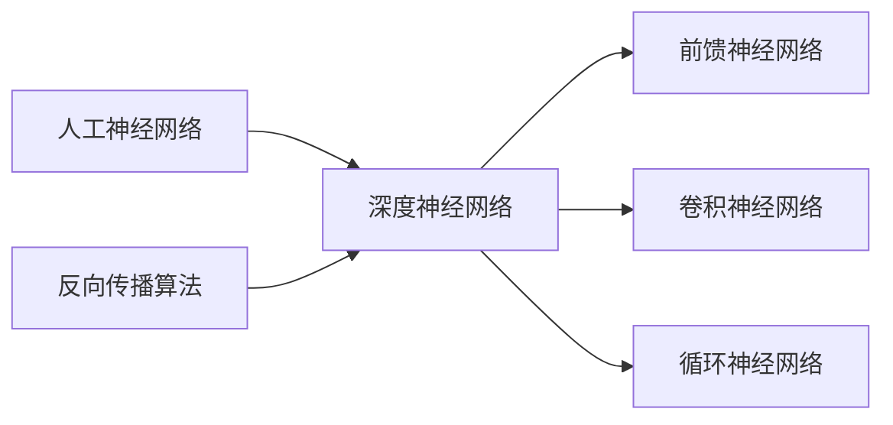

# 深度学习 原理与代码实例讲解

## 1. 背景介绍
### 1.1 问题的由来
深度学习作为人工智能领域的一个重要分支,在近年来取得了令人瞩目的成就。它通过模拟人脑的神经网络结构,构建多层次的机器学习模型,实现了图像识别、语音识别、自然语言处理等多个领域的突破性进展。深度学习的崛起,源于大数据时代海量数据的积累,以及计算机硬件性能的飞速发展。传统的机器学习方法在处理复杂问题时往往力不从心,深度学习则提供了一种全新的解决思路。

### 1.2 研究现状
目前,深度学习已经成为学术界和工业界的研究热点。谷歌、微软、百度等科技巨头都在深度学习领域投入了大量资源,并取得了一系列重要成果。例如,谷歌的AlphaGo击败了世界顶尖围棋选手,展现了深度学习在博弈领域的巨大潜力;百度的深度语音识别技术也已经达到了与人类相当的水平。在学术界,以Geoffrey Hinton、Yann LeCun、Yoshua Bengio为代表的科学家们不断推动着深度学习的理论创新和技术突破。

### 1.3 研究意义
深度学习的研究意义主要体现在以下几个方面:

1. 技术创新:深度学习是人工智能的前沿方向,其研究可以推动机器学习、模式识别等领域的理论创新和技术进步。

2. 应用价值:深度学习在图像识别、语音识别、自然语言处理、智能推荐等领域有广泛的应用前景,可以极大提升相关产品和服务的智能化水平。

3. 产业升级:深度学习技术的发展和应用,将推动人工智能产业的快速崛起,为传统产业的智能化升级提供新的技术支撑。

4. 社会影响:深度学习有望在教育、医疗、交通、金融等社会各领域发挥重要作用,为人类生活带来更多便利和福祉。

### 1.4 本文结构
本文将从以下几个方面对深度学习的原理和应用进行系统阐述:

- 第二部分介绍深度学习的核心概念和基本原理。
- 第三部分重点讲解深度学习的经典算法,包括前馈神经网络、卷积神经网络、循环神经网络等。 
- 第四部分系统阐述深度学习涉及的数学模型和公式推导过程。
- 第五部分通过代码实例,演示深度学习算法的具体实现。
- 第六部分总结深度学习的典型应用场景。
- 第七部分推荐深度学习的学习资源、开发工具和相关文献。
- 第八部分对全文进行总结,并展望深度学习未来的发展趋势和挑战。
- 第九部分列举深度学习领域一些常见问题和解答。

## 2. 核心概念与联系
深度学习的核心概念主要包括:

- 人工神经网络(Artificial Neural Network):模拟生物神经系统结构和功能,由大量神经元组成的计算模型。
- 深度神经网络(Deep Neural Network):具有多个隐藏层的人工神经网络,能够学习更加复杂的特征表示。
- 前馈神经网络(Feedforward Neural Network):信息从输入层经隐藏层传递到输出层,神经元之间不存在反馈连接。
- 卷积神经网络(Convolutional Neural Network):一种特殊的前馈神经网络,主要用于图像识别等领域。
- 循环神经网络(Recurrent Neural Network):神经元之间存在循环连接,适合处理序列数据。
- 反向传播算法(Backpropagation):用于训练深度神经网络的经典算法,通过误差反向传播来调整网络参数。

这些概念之间的联系可以用下图表示:

## 3. 核心算法原理 & 具体操作步骤
### 3.1 算法原理概述
深度学习的核心算法包括前馈神经网络、卷积神经网络和循环神经网络等。这些算法的基本原理是通过构建多层神经网络,利用大量标注数据进行训练,学习输入到输出的复杂映射关系。在训练过程中,采用反向传播算法来最小化损失函数,不断优化网络参数,提高模型的泛化能力。

### 3.2 算法步骤详解
以前馈神经网络为例,其训练过程可分为以下步骤:

1. 定义网络结构:确定输入层、隐藏层和输出层的神经元个数,以及激活函数的选择。
2. 初始化参数:随机初始化神经网络的权重和偏置参数。 
3. 前向传播:根据输入数据和网络参数,逐层计算神经元的激活值,直到获得输出层结果。
4. 计算损失:比较网络输出与真实标签,计算损失函数值。
5. 反向传播:根据损失函数,采用梯度下降法,将误差反向传播到每一层,计算各参数的梯度。
6. 更新参数:根据计算出的梯度,更新各层权重和偏置参数。
7. 迭代优化:重复步骤3~6,直到损失函数达到预设的阈值或迭代次数。

卷积神经网络和循环神经网络的训练过程与此类似,只是在网络结构和前向传播的计算方式上有所不同。

### 3.3 算法优缺点
深度学习算法的优点主要包括:

- 强大的特征学习能力,可以自动学习数据的多层次表示。
- 端到端的训练方式,避免了人工特征工程的繁琐过程。
- 在大数据场景下表现出色,训练数据越多,模型性能越好。

但同时也存在一些缺点:

- 模型训练需要大量标注数据,获取成本较高。
- 参数量巨大,训练时间长,对计算资源要求高。
- 模型的可解释性较差,存在一定的"黑盒"特性。
- 容易出现过拟合,泛化能力有待提高。

### 3.4 算法应用领域
深度学习算法在多个领域取得了广泛应用,主要包括:

- 计算机视觉:图像分类、目标检测、语义分割等。
- 语音识别:语音转文本、说话人识别等。
- 自然语言处理:机器翻译、情感分析、问答系统等。
- 推荐系统:个性化推荐、广告点击率预估等。
- 生物医疗:医学图像分析、药物发现、基因组学等。

此外,深度学习在游戏、金融、安防等领域也有广泛应用。随着技术的不断发展,深度学习的应用范围还将不断扩大。

## 4. 数学模型和公式 & 详细讲解 & 举例说明
### 4.1 数学模型构建
深度学习的数学模型主要基于人工神经网络。以最简单的前馈神经网络为例,假设输入层有$n$个神经元,隐藏层有$m$个神经元,输出层有$k$个神经元。我们用$x_i$表示输入层第$i$个神经元的值,$h_j$表示隐藏层第$j$个神经元的值,$o_t$表示输出层第$t$个神经元的值。$w_{ij}$和$b_j$分别表示输入层第$i$个神经元到隐藏层第$j$个神经元的权重和偏置,$v_{jt}$和$c_t$表示隐藏层第$j$个神经元到输出层第$t$个神经元的权重和偏置。

则隐藏层第$j$个神经元的值可以表示为:

$$h_j = f(\sum_{i=1}^{n}w_{ij}x_i + b_j)$$

其中$f$为激活函数,常见的有sigmoid、tanh、ReLU等。

输出层第$t$个神经元的值为:

$$o_t = g(\sum_{j=1}^{m}v_{jt}h_j + c_t)$$

其中$g$为输出层的激活函数,常见的有恒等函数、softmax函数等。

### 4.2 公式推导过程
在训练神经网络时,我们需要最小化损失函数。以均方误差损失函数为例,假设$y_t$为样本的真实标签,则损失函数可以定义为:

$$J = \frac{1}{2}\sum_{t=1}^{k}(o_t - y_t)^2$$

我们的目标是找到一组参数$w_{ij}$、$b_j$、$v_{jt}$、$c_t$,使得损失函数$J$最小。采用梯度下降法,参数的更新公式为:

$$w_{ij} := w_{ij} - \alpha\frac{\partial J}{\partial w_{ij}}$$

$$b_j := b_j - \alpha\frac{\partial J}{\partial b_j}$$

$$v_{jt} := v_{jt} - \alpha\frac{\partial J}{\partial v_{jt}}$$

$$c_t := c_t - \alpha\frac{\partial J}{\partial c_t}$$

其中$\alpha$为学习率。根据链式法则,可以推导出:

$$\frac{\partial J}{\partial w_{ij}} = (o_t - y_t)g'(\sum_{j=1}^{m}v_{jt}h_j + c_t)v_{jt}f'(\sum_{i=1}^{n}w_{ij}x_i + b_j)x_i$$

$$\frac{\partial J}{\partial b_j} = (o_t - y_t)g'(\sum_{j=1}^{m}v_{jt}h_j + c_t)v_{jt}f'(\sum_{i=1}^{n}w_{ij}x_i + b_j)$$

$$\frac{\partial J}{\partial v_{jt}} = (o_t - y_t)g'(\sum_{j=1}^{m}v_{jt}h_j + c_t)h_j$$

$$\frac{\partial J}{\partial c_t} = (o_t - y_t)g'(\sum_{j=1}^{m}v_{jt}h_j + c_t)$$

将这些偏导数的值代入参数更新公式,即可实现网络参数的迭代优化。

### 4.3 案例分析与讲解
下面我们以一个简单的二分类问题为例,演示神经网络的训练过程。

假设输入数据为二维向量$(x_1,x_2)$,标签$y \in \{0,1\}$。我们构建一个包含1个隐藏层的前馈神经网络,隐藏层包含4个神经元,输出层包含1个神经元。隐藏层激活函数为sigmoid函数:

$$f(x) = \frac{1}{1+e^{-x}}$$

输出层激活函数为恒等函数。

我们随机生成一批训练数据,并进行归一化处理。然后按照前面介绍的步骤,进行网络的训练:

1. 随机初始化网络参数。
2. 将训练数据输入网络,前向传播计算输出值。
3. 计算损失函数值。
4. 反向传播计算各参数的梯度。
5. 根据梯度下降公式更新参数。
6. 重复步骤2~5,直到损失函数收敛或达到预设的迭代次数。

经过训练,神经网络就可以学习到输入和输出之间的映射关系。我们可以用训练好的网络对新的数据进行预测,判断其类别。

### 4.4 常见问题解答
1. 梯度消失和梯度爆炸问题如何解决?
答:可以采用ReLU等非饱和激活函数,以及BatchNorm、梯度裁剪等技巧来缓解。此外,残差网络、LSTM等特殊的网络结构也能在一定程度上解决这一问题。

2. 如何选择网络的超参数(如隐藏层数、神经元数、学习率等)?
答:通常需要通过反复试验,不断调整超参数,选择模型性能最优的参数组合。也可以采用自动机器学习工具如AutoML来自动搜索超参数。

3. 过拟合问题如何解决?
答:可以采用L1/L2正则化、Dropout、早停法等策略来缓解过拟合。数据增强、集成学习等方法也