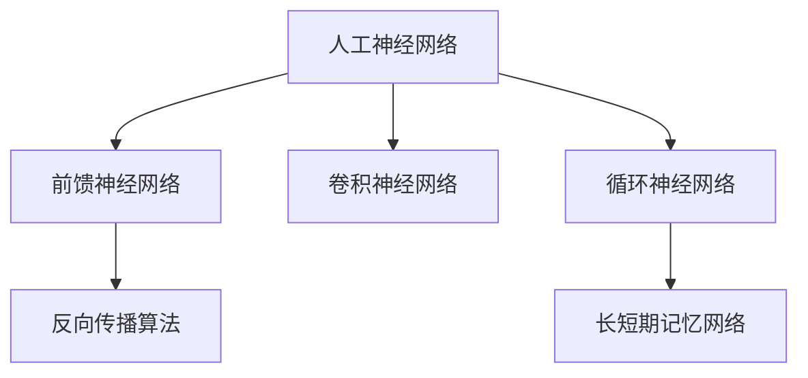

# 深度学习 原理与代码实例讲解

## 1. 背景介绍
### 1.1 问题的由来  
深度学习作为人工智能领域最前沿、最热门的研究方向之一,在计算机视觉、自然语言处理、语音识别等诸多领域取得了突破性进展。然而,对于许多初学者和非专业人士来说,深度学习的原理和实现过程仍然是一个黑箱。如何用通俗易懂的语言解释深度学习的核心概念,并给出详细的代码实例,成为了一个亟待解决的问题。

### 1.2 研究现状
近年来,深度学习相关的教程和书籍不断涌现,但大多数要么过于理论化,要么只提供简单的API调用示例,鲜有深入浅出、理论与实践相结合的教程。一些网络上的博客文章质量参差不齐,代码实现不够规范,也缺乏系统性和完整性。因此,写一篇高质量的深度学习原理与代码实例讲解的文章很有必要。

### 1.3 研究意义
通过本文的讲解,读者可以对深度学习的原理有一个系统全面的认识,了解其数学基础和核心概念。同时,文中提供的代码实例可以帮助读者快速上手实践,加深对原理的理解。这对于初学者入门深度学习,以及想要深入钻研的研究者都有重要意义。

### 1.4 本文结构
本文将从以下几个方面展开讨论:  
- 第2部分介绍深度学习的核心概念与它们之间的联系
- 第3部分讲解深度学习的核心算法原理和具体操作步骤
- 第4部分系统阐述深度学习涉及的数学模型和公式,并给出详细的推导过程和案例分析
- 第5部分通过代码实例演示如何用Python和主流深度学习框架实现核心算法,并对代码进行解读
- 第6部分介绍深度学习的实际应用场景,展望其未来发展前景  
- 第7部分推荐一些学习资源、开发工具和相关论文
- 第8部分总结全文,分析深度学习未来的发展趋势和面临的挑战
- 第9部分的附录中列出了一些常见问题与解答

## 2. 核心概念与联系

深度学习的核心概念包括:

- 人工神经网络(Artificial Neural Network): 模拟生物神经系统结构和功能的数学模型,由大量神经元节点组成,通过调整节点间的连接权重来学习和存储知识。
- 前馈神经网络(Feedforward Neural Network): 信息从输入层经过隐藏层传递到输出层,神经元之间不存在环路,是最基础的神经网络结构。
- 反向传播算法(Backpropagation): 一种通过最小化损失函数来调整网络权重的优化算法,通过链式法则计算损失函数对每层权重的梯度。
- 卷积神经网络(Convolutional Neural Network): 一种特殊的前馈神经网络,引入了卷积层和池化层,擅长处理网格拓扑结构的数据如图像。
- 循环神经网络(Recurrent Neural Network): 一种适合处理序列数据的网络,通过引入循环连接,让网络具有记忆性,可以建模时序信息。
- 长短期记忆网络(Long Short-Term Memory): RNN的一种改进结构,通过引入门控单元,缓解了RNN的梯度消失问题,可以学习长期依赖。

这些概念之间的联系可以用下面的Mermaid图来表示:

可以看出,人工神经网络是一个大类,包含了前馈、卷积、循环等不同类型的网络结构。反向传播算法是训练前馈网络的主要方法。长短期记忆网络是循环神经网络的一个重要变种。理解这些概念之间的联系,有助于我们更好地掌握深度学习的整体框架。

## 3. 核心算法原理 & 具体操作步骤
### 3.1 算法原理概述
深度学习的核心是通过构建多层神经网络,并使用优化算法来自动学习网络参数,从而让网络能够从大量数据中自动提取特征和规律。下面我们以最基础的前馈神经网络和反向传播算法为例,说明其基本原理。

前馈神经网络由输入层、隐藏层和输出层组成,每层由多个神经元节点构成,layers间的节点通过权重矩阵 $W$ 连接。假设 $x$ 为输入向量,各层激活值分别为 $a^{(0)}=x, a^{(1)}, a^{(2)}, ..., a^{(L-1)}, a^{(L)}$,则前馈过程可表示为:

$$
a^{(l)} = \sigma(W^{(l)}a^{(l-1)} + b^{(l)}), l=1,2,...,L
$$

其中 $\sigma$ 为激活函数,引入非线性变换能力。$b^{(l)}$ 为偏置项。最后一层 $a^{(L)}$ 即为网络输出。

训练网络的目标是最小化损失函数 $J(W,b)$,即网络输出与真实标签间的差异。反向传播算法基于梯度下降策略,通过链式法则layer-by-layer地计算梯度 $\frac{\partial J}{\partial W^{(l)}}, \frac{\partial J}{\partial b^{(l)}}$,并沿梯度反方向更新参数:

$$
W^{(l)} := W^{(l)} - \alpha \frac{\partial J}{\partial W^{(l)}}
$$
$$
b^{(l)} := b^{(l)} - \alpha \frac{\partial J}{\partial b^{(l)}}  
$$

$\alpha$ 为学习率。反复迭代上述前馈和反向传播过程,直到损失函数收敛。

### 3.2 算法步骤详解
反向传播算法的具体步骤如下:

1. 前馈计算:
   - 输入 $a^{(0)} = x$
   - For $l=1$ to $L$:
     - $z^{(l)} = W^{(l)}a^{(l-1)} + b^{(l)}$
     - $a^{(l)} = \sigma(z^{(l)})$
   - 输出 $\hat{y} = a^{(L)}$
2. 计算输出层误差:
   - $\delta^{(L)} = \nabla_a J \odot \sigma'(z^{(L)})$  
3. 反向传播误差:
   - For $l=L-1$ to $1$:
     - $\delta^{(l)} = (W^{(l+1)})^T\delta^{(l+1)} \odot \sigma'(z^{(l)})$
4. 计算梯度:
   - $\frac{\partial J}{\partial W^{(l)}} = \delta^{(l)}(a^{(l-1)})^T$
   - $\frac{\partial J}{\partial b^{(l)}} = \delta^{(l)}$ 
5. 更新参数:
   - $W^{(l)} := W^{(l)} - \alpha \frac{\partial J}{\partial W^{(l)}}$
   - $b^{(l)} := b^{(l)} - \alpha \frac{\partial J}{\partial b^{(l)}}$

其中 $\odot$ 表示 element-wise 乘积, $\nabla_a J$ 是损失函数对输出层激活值的梯度。

### 3.3 算法优缺点
反向传播算法的优点在于:
- 可以高效地训练多层神经网络
- 通过梯度下降自动学习网络参数,减少人工设计特征的工作量
- 具有通用性,可以应用于多种网络结构

但它也存在一些缺点:
- 容易陷入局部最优,初始化很重要  
- 对网络结构和超参数敏感
- 训练时间长,计算复杂度高

### 3.4 算法应用领域
反向传播算法是训练深度神经网络的核心,被广泛应用于计算机视觉、自然语言处理等领域的各类任务中,如:
- 图像分类、检测、分割
- 语音识别与合成
- 机器翻译与对话系统
- 推荐系统
- 游戏智能体
- 生物医疗等

## 4. 数学模型和公式 & 详细讲解 & 举例说明
### 4.1 数学模型构建
这里我们详细讨论反向传播算法推导过程中用到的数学模型。

首先,定义网络的前馈传播:

$$
a^{(0)} = x
$$
$$
z^{(l)} = W^{(l)}a^{(l-1)} + b^{(l)}, l=1,2,...,L
$$
$$
a^{(l)} = \sigma(z^{(l)}), l=1,2,...,L
$$

其中 $W^{(l)}, b^{(l)}$ 分别为第 $l$ 层的权重矩阵和偏置向量, $\sigma$ 为 element-wise 的激活函数。

假设样本标签为 $y$,定义损失函数为:

$$
J(W,b) = \frac{1}{m} \sum^m_{i=1} L(\hat{y}^{(i)}, y^{(i)}) + \frac{\lambda}{2} \sum^L_{l=1} \sum_{i=1}^{n_l} \sum_{j=1}^{n_{l-1}} (W^{(l)}_{ij})^2
$$

其中 $L$ 为样本损失,如均方误差(MSE)或交叉熵(Cross-entropy), $\lambda$ 控制L2正则化强度。

### 4.2 公式推导过程
反向传播旨在计算损失函数 $J$ 关于每一层权重 $W^{(l)}$ 和偏置 $b^{(l)}$ 的梯度。我们逐层分析。

定义第 $l$ 层节点的误差项:

$$
\delta^{(l)} = \frac{\partial J}{\partial z^{(l)}}
$$

对于输出层 $L$,根据链式法则:

$$
\delta^{(L)} = \frac{\partial J}{\partial a^{(L)}} \odot \sigma'(z^{(L)}) = \nabla_a J \odot \sigma'(z^{(L)})
$$

对于隐藏层 $l$,再次使用链式法则:

$$
\delta^{(l)} = \frac{\partial J}{\partial z^{(l)}} = \frac{\partial J}{\partial z^{(l+1)}} \frac{\partial z^{(l+1)}}{\partial a^{(l)}} \frac{\partial a^{(l)}}{\partial z^{(l)}} = (W^{(l+1)})^T \delta^{(l+1)} \odot \sigma'(z^{(l)})
$$

最后,利用误差项计算梯度:

$$
\frac{\partial J}{\partial W^{(l)}} = \delta^{(l)} (a^{(l-1)})^T
$$
$$
\frac{\partial J}{\partial b^{(l)}} = \delta^{(l)}
$$

### 4.3 案例分析与讲解
下面我们用一个简单的二分类问题来说明反向传播的计算过程。

假设有一个两层网络,输入节点 $n_0=2$,隐藏节点 $n_1=2$,输出节点 $n_2=1$,激活函数取 $\sigma(z)=\frac{1}{1+e^{-z}}$。随机初始化权重矩阵:

$$
W^{(1)} = \begin{bmatrix} 0.1 & 0.2 \\ 0.3 & 0.4 \end{bmatrix}, 
b^{(1)} = \begin{bmatrix} 0.5 \\ 0.6 \end{bmatrix}
$$
$$
W^{(2)} = \begin{bmatrix} 0.7 & 0.8 \end{bmatrix},
b^{(2)} = \begin{bmatrix} 0.9 \end{bmatrix}  
$$

输入样本:
$$
x^{(1)} = \begin{bmatrix} 1 \\ 2 \end{bmatrix}, y^{(1)} = 1
$$

前馈计算:
$$
z^{(1)} = \begin{bmatrix} 0.1 & 0.2 \\ 0.3 & 0.4 \end{bmatrix} \begin{bmatrix} 1 \\ 2 \end{bmatrix} + \begin{bmatrix} 0.5 \\ 0.6 \end{bmatrix} = \begin{bmatrix} 1.1 \\ 1.7 \end{bmatrix}
$$
$$
a^{(1)} = \sigma(z^{(1