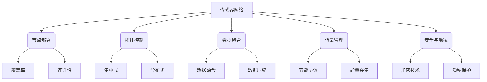

# 物联网(IoT)技术和各种传感器设备的集成：传感器网络的设计与优化

## 1. 背景介绍

### 1.1 问题的由来

随着物联网(IoT)技术的快速发展,各种智能传感器设备在我们的日常生活中无处不在。从智能家居、智慧城市到工业自动化,传感器网络已经成为物联网应用的关键基础设施。然而,设计和优化一个高效、可靠的传感器网络并非易事,需要解决诸多技术挑战。

### 1.2 研究现状  

目前,学术界和工业界已经就传感器网络的设计与优化问题进行了大量研究。一些常见的研究方向包括:

- 节点部署策略
- 能量效率优化
- 数据聚合和融合算法
- 网络拓扑控制
- 安全和隐私保护机制

尽管取得了一些进展,但由于传感器网络的异构性、动态性和资源约束等特点,设计一个高效的传感器网络仍然是一个具有挑战性的问题。

### 1.3 研究意义

优化传感器网络的设计对于提高物联网应用的性能至关重要。一个高效的传感器网络不仅可以降低能耗、延长网络生命周期,还能提高数据传输的可靠性和实时性,从而为物联网应用提供高质量的数据支持。此外,安全性和隐私保护也是传感器网络设计中不可忽视的重要方面。

### 1.4 本文结构

本文将全面探讨传感器网络的设计与优化问题。我们将首先介绍相关的核心概念,然后深入分析核心算法原理和数学建模方法。接下来,我们将通过实际案例和代码示例,展示如何将这些理论付诸实践。最后,我们将总结未来的发展趋势和挑战,并提供相关的学习资源和工具推荐。

## 2. 核心概念与联系

在深入探讨传感器网络的设计与优化之前,我们需要先了解一些核心概念及它们之间的联系。

上图展示了传感器网络设计与优化中的一些关键概念及其相互关系。我们可以从以下几个方面来理解它们:

1. **节点部署**:决定了传感器节点在目标区域的分布情况,直接影响网络的覆盖率和连通性。
2. **拓扑控制**:管理网络拓扑结构,可以采用集中式或分布式方法,以优化网络性能。
3. **数据聚合**:通过数据融合和压缩技术,减少冗余数据,降低网络负载。
4. **能量管理**:设计节能协议和能量采集机制,延长网络生命周期。
5. **安全与隐私**:采用加密技术和隐私保护机制,确保数据的安全性和用户隐私。

这些概念相互关联、相互影响,需要在传感器网络的设计与优化过程中综合考虑。接下来,我们将着重探讨其中的核心算法原理和数学建模方法。

## 3. 核心算法原理 & 具体操作步骤

### 3.1 算法原理概述

传感器网络设计与优化涉及多个方面的算法,包括节点部署、拓扑控制、数据聚合、能量管理和安全性等。这些算法通常需要考虑多个目标函数和约束条件,因此属于多目标优化问题。常见的算法原理包括:

1. **启发式算法**:如遗传算法、蚁群算法等,通过模拟自然界的进化过程或生物行为,寻找近似最优解。
2. **凸优化算法**:将问题转化为凸优化形式,利用数学理论求解全局最优解。
3. **博弈论算法**:将网络中的节点视为理性决策者,采用博弈论方法寻找均衡解。
4. **机器学习算法**:利用监督或无监督学习技术,从历史数据中学习出最优策略。

这些算法原理各有优缺点,需要根据具体问题的特点和优化目标进行选择和设计。

### 3.2 算法步骤详解

以遗传算法为例,我们可以将其应用于传感器节点部署问题。算法的主要步骤如下:

1. **初始化种群**:随机生成一定数量的候选解(节点部署方案)作为初始种群。
2. **计算适应度**:根据覆盖率、连通性等目标函数,计算每个候选解的适应度值。
3. **选择操作**:根据适应度值,选择出一部分较优秀的个体,作为下一代种群的父代。
4. **交叉操作**:对选中的父代个体进行交叉操作,产生新的子代个体。
5. **变异操作**:以一定的变异概率对子代个体进行变异,增加种群的多样性。
6. **更新种群**:将新产生的子代个体加入种群,替换掉部分适应度较低的个体。
7. **终止条件**:若满足终止条件(如迭代次数或适应度收敛),则输出最优解;否则返回步骤2,进行下一轮迭代。

通过不断进化,算法可以逐步找到较优的节点部署方案。其他算法的步骤也有类似的思路,但具体细节会有所不同。

### 3.3 算法优缺点

不同算法在计算复杂度、收敛速度、全局性能等方面存在差异,具有各自的优缺点:

- **启发式算法**:易于实现,可以快速获得较优解,但无法保证全局最优性。
- **凸优化算法**:理论基础扎实,可以获得全局最优解,但问题需要满足凸性条件。
- **博弈论算法**:能够捕捉节点间的相互影响,但计算复杂度较高。
- **机器学习算法**:具有自适应性和泛化能力,但需要大量高质量的训练数据。

在实际应用中,我们往往需要根据问题的特点和优化目标,选择合适的算法或者将多种算法相结合,以获得更好的性能。

### 3.4 算法应用领域

上述算法原理不仅可以应用于传感器网络设计与优化,还可以推广到其他物联网相关领域,如无线通信网络优化、移动计算offloading、边缘计算资源分配等。这些领域面临着类似的挑战,如资源约束、动态环境、多目标优化等,因此可以借鉴相关的算法思路。

## 4. 数学模型和公式 & 详细讲解 & 举例说明

### 4.1 数学模型构建

为了更好地描述和解决传感器网络优化问题,我们需要构建相应的数学模型。以节点部署问题为例,我们可以将其建模为一个整数线性规划(ILP)问题:

$$
\begin{aligned}
\max\limits_{\mathbf{x}} &\quad f(\mathbf{x}) \\
\text{s.t.} &\quad g_i(\mathbf{x}) \leq 0, \quad i = 1, 2, \ldots, m \\
&\quad x_j \in \{0, 1\}, \quad j = 1, 2, \ldots, n
\end{aligned}
$$

其中:

- $\mathbf{x} = (x_1, x_2, \ldots, x_n)$ 是决策变量向量,表示每个候选位置是否部署节点(1表示部署,0表示不部署)。
- $f(\mathbf{x})$ 是目标函数,可以是覆盖率、连通性或两者的加权和。
- $g_i(\mathbf{x})$ 是约束条件,如节点数量限制、成本限制等。
- $m$ 是约束条件的数量,$n$ 是候选位置的数量。

通过求解上述整数线性规划问题,我们可以获得最优的节点部署方案。

### 4.2 公式推导过程

在构建数学模型的过程中,我们通常需要推导一些公式来量化目标函数和约束条件。以覆盖率为例,我们可以引入二元覆盖矩阵 $\mathbf{A} = (a_{ij})_{m \times n}$ 来表示每个节点对目标区域的覆盖情况:

$$
a_{ij} = \begin{cases}
1, & \text{if node $j$ covers area $i$} \\
0, & \text{otherwise}
\end{cases}
$$

则覆盖率可以表示为:

$$
\text{Coverage Rate} = \frac{1}{m} \sum_{i=1}^m \max\limits_{1 \leq j \leq n} (a_{ij} x_j)
$$

上式表示,对于每个目标区域 $i$,如果存在至少一个节点 $j$ 覆盖它,则认为该区域被覆盖。通过求和并归一化,我们可以得到整个网络的覆盖率。

### 4.3 案例分析与讲解

为了更好地理解上述数学模型和公式,我们来分析一个简单的案例。假设我们需要在一个 $5 \times 5$ 的目标区域内部署传感器节点,每个节点的覆盖半径为 $2$ 个单位。我们的目标是最大化覆盖率,同时控制部署的节点数量不超过 $5$ 个。

首先,我们可以将目标区域离散化为 $25$ 个小区域,构建覆盖矩阵 $\mathbf{A}$。例如,如果将节点部署在位置 $(2, 3)$,则该节点可以覆盖矩阵中的第 $8$、$9$、$13$、$14$ 行,对应的 $a_{ij}$ 值为 $1$,其余为 $0$。

接下来,我们可以建立整数线性规划模型:

$$
\begin{aligned}
\max\limits_{\mathbf{x}} &\quad \frac{1}{25} \sum_{i=1}^{25} \max\limits_{1 \leq j \leq 25} (a_{ij} x_j) \\
\text{s.t.} &\quad \sum_{j=1}^{25} x_j \leq 5 \\
&\quad x_j \in \{0, 1\}, \quad j = 1, 2, \ldots, 25
\end{aligned}
$$

求解该模型,我们可以获得最优的节点部署方案,例如将节点部署在位置 $(1, 1)$、$(1, 5)$、$(3, 3)$、$(4, 2)$ 和 $(5, 5)$,从而实现最大覆盖率 $100\%$。

### 4.4 常见问题解答

在构建和求解数学模型的过程中,我们可能会遇到一些常见问题,例如:

1. **如何处理多目标优化问题?**

   对于多目标优化问题,我们可以采用加权求和的方式将多个目标函数合并为单一目标函数,或者转化为多目标规划问题,在获得的 Pareto 最优解集中进行权衡选择。

2. **如何降低计算复杂度?**

   对于大规模问题,求解整数线性规划模型的计算复杂度会非常高。我们可以采用启发式算法获得近似解,或者引入松弛技术将整数规划问题转化为线性规划问题,以降低复杂度。

3. **如何处理动态环境?**

   在实际应用中,传感器网络往往面临动态变化的环境,如节点故障、移动目标等。我们需要设计在线优化算法,实时调整网络配置以适应环境变化。

4. **如何权衡不同目标之间的矛盾?**

   在传感器网络优化中,不同目标之间可能存在矛盾,如覆盖率和能耗之间的权衡。我们需要根据具体应用场景,合理设置目标函数的权重系数,以达到最佳的综合性能。

通过深入理解这些问题,我们可以更好地应用数学模型和算法来解决实际问题。

## 5. 项目实践:代码实例和详