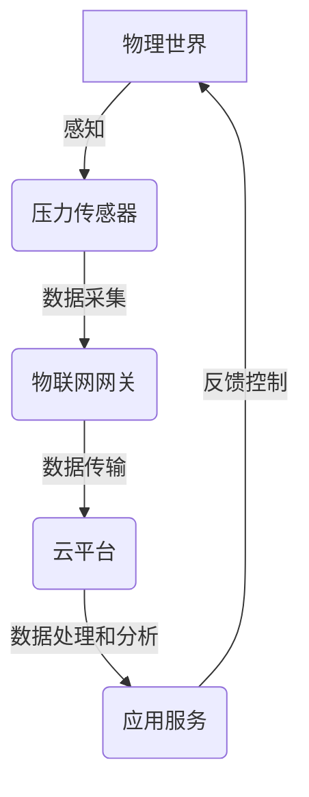

# 物联网(IoT)技术和各种传感器设备的集成：压力传感器的物联网实践

## 1. 背景介绍

### 1.1 问题的由来

随着物联网(IoT)技术的不断发展和普及,各种传感器设备的应用越来越广泛。压力传感器作为一种常见的传感器类型,在工业生产、环境监测、医疗保健等诸多领域发挥着重要作用。然而,如何高效地将压力传感器与物联网技术相结合,实现数据的实时采集、传输和分析,成为了一个亟待解决的问题。

### 1.2 研究现状 

目前,已有一些解决方案尝试将压力传感器与物联网技术相结合,但仍存在一些不足之处。例如,一些方案缺乏可扩展性,难以应对大规模传感器部署;另一些方案则存在数据传输延迟或安全性问题。因此,需要一种更加完善、高效的解决方案来满足实际应用需求。

### 1.3 研究意义

将压力传感器与物联网技术相结合,可以实现对压力数据的实时监测和分析,从而为相关领域提供宝贵的数据支持。例如,在工业生产中,可以通过监测设备的压力变化来预测故障,提高生产效率;在环境监测中,可以实时跟踪大气压力变化,为气象预报提供依据;在医疗保健领域,可以监测患者的血压变化,为诊断和治疗提供参考。

### 1.4 本文结构

本文将首先介绍物联网技术和压力传感器的基本概念,然后阐述将两者相结合的核心算法原理和数学模型,接着通过实际项目实践展示具体的代码实现和应用场景,最后总结未来的发展趋势和面临的挑战。

## 2. 核心概念与联系

物联网(IoT)技术是一种将各种物理设备与互联网相连的技术,通过传感器、软件和网络,实现对物理世界的感知和控制。压力传感器是一种用于测量压力变化的传感器设备,广泛应用于工业、环境和医疗等领域。

将物联网技术与压力传感器相结合,可以实现对压力数据的实时采集、传输和分析。具体来说,压力传感器会将压力变化转换为电信号,然后通过无线传输技术(如WiFi、蓝牙、LoRa等)将数据传输到物联网网关或云平台。在云端,可以对这些数据进行存储、处理和分析,从而实现对压力变化的实时监控和预测。

上图展示了物联网技术与压力传感器集成的基本流程。压力传感器感知物理世界中的压力变化,将采集到的数据传输到物联网网关,再由网关将数据传输到云平台进行处理和分析。分析结果可以反馈到应用服务中,从而实现对物理世界的控制和优化。

## 3. 核心算法原理 & 具体操作步骤

### 3.1 算法原理概述

将压力传感器与物联网技术相结合的核心算法原理可以概括为以下几个方面:

1. **数据采集**: 压力传感器采集物理世界中的压力变化数据,并将其转换为电信号。
2. **数据编码**: 将采集到的电信号进行编码,以便于后续的传输和处理。
3. **数据传输**: 利用无线传输技术(如WiFi、蓝牙、LoRa等)将编码后的数据传输到物联网网关或云平台。
4. **数据解码**: 在网关或云端对接收到的编码数据进行解码,还原出原始的压力数据。
5. **数据处理和分析**: 对解码后的压力数据进行存储、处理和分析,实现压力变化的实时监控和预测。
6. **反馈控制**: 根据分析结果,对物理世界中的相关系统或设备进行反馈控制和优化。

### 3.2 算法步骤详解

1. **数据采集**

   压力传感器通常采用压电效应或应变电阻效应等原理,将压力变化转换为电信号。具体步骤如下:
   
   a. 传感器感受压力变化,产生相应的物理变化(如压电晶体的形变或应变电阻的电阻变化)。
   b. 将物理变化转换为电信号,例如电压或电流变化。
   c. 对电信号进行放大和调理,以便于后续的处理。

2. **数据编码**

   为了便于数据传输和处理,需要对采集到的电信号进行编码。常用的编码方式包括:

   - 模数转换(ADC): 将模拟电信号转换为数字信号。
   - 数据打包: 将多个数据点打包成一个数据帧,以减少传输开销。
   - 数据压缩: 利用无损或有损压缩算法,减小数据的传输量。

3. **数据传输**

   利用无线传输技术将编码后的数据传输到物联网网关或云平台。常用的无线传输技术包括:

   - WiFi: 适用于短距离、高带宽的数据传输。
   - 蓝牙: 适用于低功耗、短距离的数据传输。
   - LoRa: 适用于长距离、低功耗的数据传输。

   传输过程中需要考虑数据的可靠性、安全性和实时性等因素。

4. **数据解码**

   在网关或云端,需要对接收到的编码数据进行解码,还原出原始的压力数据。解码过程与编码过程相反,包括:

   - 数据解压缩
   - 数据帧拆分
   - 数字信号转换为模拟信号

5. **数据处理和分析**

   对解码后的压力数据进行存储、处理和分析,实现压力变化的实时监控和预测。常用的数据处理和分析方法包括:

   - 时间序列分析: 分析压力数据的时间序列模式,预测未来的压力变化趋势。
   - 机器学习算法: 利用监督学习或无监督学习算法,从历史数据中学习压力变化的模式。
   - 异常检测: 设置阈值或建立正常模式,检测压力数据中的异常情况。

6. **反馈控制**

   根据数据分析的结果,对物理世界中的相关系统或设备进行反馈控制和优化。例如:

   - 在工业生产中,当检测到设备压力异常时,可以发出警报或自动调整设备参数。
   - 在环境监测中,当大气压力发生剧烈变化时,可以发出预警信息。
   - 在医疗保健领域,当患者血压异常时,可以通知医护人员采取相应措施。

### 3.3 算法优缺点

上述算法的优点包括:

- 实现了压力传感器与物联网技术的无缝集成,可以实时采集和分析压力数据。
- 利用无线传输技术,避免了布线的限制,提高了系统的灵活性和可扩展性。
- 通过云端处理和分析,可以实现大规模数据的高效处理和智能决策。

但同时也存在一些缺点和挑战:

- 无线传输可能会受到干扰或信号衰减的影响,导致数据传输不可靠。
- 大规模传感器部署时,需要考虑网络带宽和计算资源的限制。
- 数据安全和隐私保护是一个需要重点关注的问题。

### 3.4 算法应用领域

将压力传感器与物联网技术相结合的算法可以广泛应用于以下领域:

- **工业生产**: 监测设备压力,预防故障发生,提高生产效率。
- **环境监测**: 监测大气压力、水压等环境压力变化,为气象预报和环境保护提供数据支持。
- **医疗保健**: 监测患者的血压、眼压等生理压力指标,为诊断和治疗提供依据。
- **交通运输**: 监测车辆轮胎压力、管道压力等,确保运输安全。
- **建筑工程**: 监测建筑物的承重压力,预防结构失稳。

## 4. 数学模型和公式 & 详细讲解 & 举例说明

### 4.1 数学模型构建

为了准确描述压力传感器的工作原理和压力数据的变化规律,我们需要构建相应的数学模型。

假设压力传感器采用压电效应原理,将压力变化转换为电压变化。根据压电效应原理,我们可以建立如下数学模型:

$$V = k_p \cdot P$$

其中:
- $V$ 表示压力传感器输出的电压值
- $P$ 表示施加在传感器上的压力值
- $k_p$ 表示压电系数,是一个与传感器材料和结构相关的常数

上述模型描述了压力与电压之间的线性关系。在实际应用中,我们还需要考虑噪声、温度漂移等因素对测量结果的影响,因此需要对模型进行修正和优化。

### 4.2 公式推导过程

接下来,我们将推导出压力数据在无线传输过程中的数学模型。

假设压力传感器每隔 $\Delta t$ 时间就会采集一次压力数据,形成一个时间序列 $\{P_t\}$。为了便于传输,我们需要对这些数据进行编码。

首先,我们可以对连续的 $n$ 个数据点进行采样,得到一个数据帧:

$$F_i = \{P_{i\cdot n}, P_{i\cdot n+1}, \ldots, P_{(i+1)\cdot n-1}\}$$

其中 $i$ 表示数据帧的编号。

然后,我们可以对数据帧进行无损压缩,例如使用差分编码算法:

$$C_i = \{P_{i\cdot n}, P_{i\cdot n+1} - P_{i\cdot n}, \ldots, P_{(i+1)\cdot n-1} - P_{(i+1)\cdot n-2}\}$$

这样可以减小数据的传输量,提高传输效率。

在无线传输过程中,数据可能会受到噪声干扰,我们可以使用信道编码技术(如卷积编码)来提高传输的可靠性。

最后,在接收端,需要对接收到的数据进行解码,还原出原始的压力数据序列。

### 4.3 案例分析与讲解

为了更好地理解上述数学模型和公式,我们来分析一个具体的案例。

假设我们需要监测一个工业锅炉的压力变化,以预防锅炉爆炸的风险。我们在锅炉上安装了一个压力传感器,每秒钟采集一次压力数据。

1. 根据压电效应原理,我们可以建立如下模型:

   $$V = 0.05 \cdot P$$

   其中,$V$ 表示传感器输出的电压值(单位为伏特 $V$),$P$ 表示锅炉的压力值(单位为帕斯卡 $Pa$),$k_p = 0.05 V/Pa$ 是该传感器的压电系数。

2. 为了便于无线传输,我们每 10 个数据点打包成一个数据帧,并使用差分编码算法进行无损压缩。假设一个数据帧为:

   $$F_i = \{100000, 100100, 100150, 100200, 100250, 100300, 100400, 100500, 100600, 100700\}$$

   则经过差分编码后,数据帧变为:

   $$C_i = \{100000, 100, 50, 50, 50, 50, 100, 100, 100, 100\}$$

   可以看出,差分编码后的数据传输量大大减小。

3. 在无线传输过程中,我们可以使用卷积编码等信道编码技术来提高传输的可靠性。

4. 在接收端,需要对接收到的编码数据进行解码,还原出原始的压力数据序列。对于上面的差分编码数据帧 $C_i$,解码过程如下:

   $$\begin{align*}
   P_{i\cdot 10} &= 100000 \\
   P_{i\cdot 10+1} &= P_{i