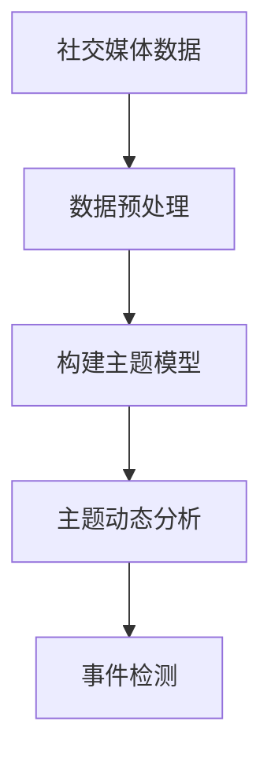

# 社交网络中事件挖掘算法研究

## 1. 背景介绍

### 1.1 问题的由来

在当今信息时代,社交媒体平台如Facebook、Twitter、微博等已经成为人们获取信息、表达观点和分享生活的重要渠道。每天在这些平台上都会产生大量的用户生成内容(User Generated Content, UGC),其中蕴含着各种各样的事件信息。这些事件信息对于政府机构、新闻媒体、企业以及普通用户来说都具有重要的参考价值。

然而,由于社交媒体数据的海量性、多样性和动态性,如何从这些数据中高效、准确地发现事件并提取相关信息,成为一个亟待解决的挑战性问题。传统的事件检测方法通常依赖于预定义的规则或模板,难以适应社交媒体数据的复杂性和多变性。因此,迫切需要开发出新的事件挖掘算法,以满足社交网络大数据时代对事件发现和理解的需求。

### 1.2 研究现状

近年来,社交网络中的事件挖掘算法研究受到了广泛关注,已经取得了一些进展。主要研究方向包括:

1. **基于主题模型的事件检测**:利用主题模型(如LDA)从社交媒体数据中发现潜在的主题,并将主题突变视为事件发生的信号。
2. **基于聚类的事件检测**:根据文本相似性对社交媒体数据进行聚类,将聚类结果视为事件。
3. **基于深度学习的事件检测**:利用深度神经网络模型(如CNN、RNN等)自动学习事件特征,实现事件检测和分类。

虽然取得了一定进展,但现有算法在处理社交媒体数据的多样性、噪声、实时性等方面仍存在不足,事件检测的准确率和召回率有待进一步提高。

### 1.3 研究意义

社交网络中事件挖掘算法的研究具有重要的理论意义和应用价值:

- **理论意义**:可以深化对自然语言处理、数据挖掘、机器学习等领域理论和方法的认识,推动相关领域的发展。
- **应用价值**:能够为政府机构提供突发事件监测和预警,为新闻媒体提供热点新闻线索,为企业提供市场动态分析,为普通用户提供感兴趣事件推送等服务。

### 1.4 本文结构  

本文将系统地介绍社交网络中事件挖掘算法的研究进展。首先阐述相关的核心概念,然后重点介绍目前主流的事件挖掘算法原理、数学模型及实现细节,并通过实例分析算法的应用场景。最后总结研究成果,展望未来的发展趋势和面临的挑战。

## 2. 核心概念与联系

在社交网络中事件挖掘算法研究中,有几个核心概念需要正确理解:

1. **事件(Event)**: 指在特定时间和地点发生的,具有一定影响力和新闻价值的事情。事件通常由若干相关的文本信息描述,这些文本可能来自不同的社交媒体用户。

2. **事件检测(Event Detection)**: 指从社交媒体数据流中自动识别出发生的事件。事件检测是事件挖掘的第一步,也是最关键的一步。

3. **事件跟踪(Event Tracking)**: 指持续监测与已识别事件相关的新出现信息,以了解事件的发展动态。

4. **事件摘要(Event Summarization)**: 指对于一个事件,自动生成概括该事件核心内容的文本摘要。

5. **事件知识库(Event Knowledge Base)**: 指存储已识别事件及其相关信息(如时间、地点、参与者等)的知识库。

上述概念相互关联、环环相扣,共同构成了社交网络中事件挖掘算法的理论框架。其中,事件检测是基础,为后续的事件跟踪、事件摘要和事件知识库构建奠定了基础。

## 3. 核心算法原理 & 具体操作步骤

### 3.1 算法原理概述

目前,社交网络中事件挖掘算法主要基于以下几种核心原理:

1. **主题模型原理**: 将文档集合视为由若干潜在主题混合而成,事件被假设为主题的突变。通过主题模型(如LDA)捕捉主题的动态变化,从而检测事件。

2. **聚类原理**: 基于文本相似性对社交媒体数据进行聚类,将聚类结果视为事件。聚类算法包括K-Means、层次聚类等。

3. **深度学习原理**: 利用深度神经网络模型(如CNN、RNN等)自动学习事件的特征表示,并基于学习到的特征进行事件检测和分类。

4. **规则模板匹配原理**: 基于预定义的规则或模板,从文本数据中匹配出符合条件的事件信息。

上述原理各有优缺点,在实际应用中往往需要结合使用,以发挥不同算法的长处,提高事件挖掘的性能。

### 3.2 算法步骤详解

以基于主题模型的事件检测算法为例,具体步骤如下:

1. **数据预处理**: 对原始的社交媒体数据进行预处理,包括文本清洗、分词、去停用词等,以准备构建主题模型的输入数据。

2. **构建主题模型**: 使用LDA等主题模型算法,在预处理后的文本数据集上训练主题模型,得到文档-主题分布和词-主题分布。

3. **主题动态分析**: 将文档集合按时间维度划分为多个时间窗口,分析每个时间窗口内主题分布的变化情况,检测出突变的主题。

4. **事件检测**: 将主题突变视为事件发生的信号,对突变主题进行分析,输出事件的相关信息(如事件主题词、发生时间等)。

### 3.3 算法优缺点

基于主题模型的事件检测算法具有以下优缺点:

**优点**:

- 无需人工定义规则或模板,能自动发现隐藏在数据中的主题和事件。
- 主题模型能够有效地对文本进行语义建模,捕捉文本的潜在语义信息。
- 算法可解释性较强,检测出的事件可以用主题词来解释。

**缺点**:

- 主题模型对噪声数据敏感,社交媒体数据中存在大量噪声会影响主题质量。
- 难以捕捉持续时间较长的事件,因为长期主题变化不明显。
- 主题粒度控制困难,很难获得适合于事件检测的最佳主题粒度。

### 3.4 算法应用领域

基于主题模型的事件检测算法可以广泛应用于以下领域:

1. **新闻热点发现**: 从社交媒体数据中发现热门新闻事件,为新闻媒体提供报道线索。

2. **突发事件监控**: 实时检测社交网络上的突发事件(如自然灾害、安全事故等),为政府部门提供预警信息。

3. **舆情监控**: 监测与企业、品牌等相关的社交媒体事件,为企业提供舆情分析。

4. **个性化信息推送**: 根据用户兴趣,推送与其感兴趣的事件相关的信息。

## 4. 数学模型和公式 & 详细讲解 & 举例说明

### 4.1 数学模型构建

在基于主题模型的事件检测算法中,常用的数学模型是LDA(Latent Dirichlet Allocation,潜在狄利克雷分布)模型。LDA是一种无监督的主题模型,能够从文档集合中自动发现潜在的主题。

LDA模型的基本思想是:假设每个文档是由一些潜在主题的混合构成的,每个主题又是由一些词的概率分布构成的。具体来说,LDA模型包含以下基本元素:

- $K$: 主题个数
- $\alpha$: 狄利克雷先验参数,控制文档主题分布的离散程度
- $\beta$: 狄利克雷先验参数,控制主题词分布的离散程度
- $\theta_d$: 文档$d$的主题分布
- $\phi_k$: 主题$k$的词分布
- $z_{dn}$: 文档$d$中第$n$个词的主题
- $w_{dn}$: 文档$d$中第$n$个词

LDA模型的生成过程如下:

1. 对每个文档$d$,从狄利克雷分布$Dir(\alpha)$中抽取主题分布$\theta_d$
2. 对每个主题$k$,从狄利克雷分布$Dir(\beta)$中抽取词分布$\phi_k$
3. 对文档$d$中的每个词$w_{dn}$:
    - 从$\theta_d$中抽取主题$z_{dn}$
    - 从$\phi_{z_{dn}}$中抽取词$w_{dn}$

上述过程可以用如下公式表示:

$$
\begin{aligned}
\theta_d &\sim Dir(\alpha) \\
\phi_k &\sim Dir(\beta) \\
z_{dn} &\sim Mult(\theta_d) \\
w_{dn} &\sim Mult(\phi_{z_{dn}})
\end{aligned}
$$

### 4.2 公式推导过程

LDA模型的核心是推断出文档-主题分布$\theta$和主题-词分布$\phi$的后验分布。由于这个后验分布的计算是困难的,通常采用近似推断算法,如变分推断(Variational Inference)、吉布斯采样(Gibbs Sampling)等。

以变分推断为例,其基本思想是使用一个可计算的变分分布$q(\theta, \phi, z)$来近似后验分布$p(\theta, \phi, z|w, \alpha, \beta)$,并最小化两个分布的KL散度:

$$
KL(q(\theta, \phi, z) || p(\theta, \phi, z|w, \alpha, \beta))
$$

通过数学推导,可以得到变分下界:

$$
\begin{aligned}
\mathcal{L}(q) &= \mathbb{E}_q[\log p(\theta, \phi, z, w|\alpha, \beta)] - \mathbb{E}_q[\log q(\theta, \phi, z)] \\
&= \mathbb{E}_q[\log p(w|z, \phi)] + \mathbb{E}_q[\log p(z|\theta)] \\
&\quad + \mathbb{E}_q[\log p(\phi|\beta)] + \mathbb{E}_q[\log p(\theta|\alpha)] \\
&\quad - \mathbb{E}_q[\log q(\phi)] - \mathbb{E}_q[\log q(\theta)] - \mathbb{E}_q[\log q(z)]
\end{aligned}
$$

通过最大化变分下界$\mathcal{L}(q)$,可以得到$\theta$和$\phi$的近似解。

### 4.3 案例分析与讲解

假设有一个社交媒体数据集,包含了一段时间内关于"地震"主题的文本数据。我们希望利用LDA模型来检测这段时间内发生的地震事件。

首先,对原始文本数据进行预处理,包括分词、去停用词等。然后使用LDA模型在预处理后的数据上训练,设置主题数$K=20$。训练完成后,可以得到每个文档的主题分布$\theta_d$,以及每个主题的词分布$\phi_k$。

接下来,我们将文档集合按时间划分为多个时间窗口(例如每天一个窗口),分析每个时间窗口内主题分布的变化情况。如果发现某个主题在某个时间窗口内突然出现或者概率显著增加,就将其视为一个事件发生的信号。

假设在某个时间窗口内,主题12的概率突然增加,我们可以查看主题12的高概率词,发现包含"地震"、"震级"、"救援"等词。因此,我们判断在该时间窗口内发生了一个地震事件。通过进一步分析主题12下的高概率文档,可以获取该地震事件的更多细节信息,如发生时间、地点、影响范围等。

### 4.4 常见问题解答

1. **主题粒度如何选择?**

   主题粒度的选择对事件检测的效果有