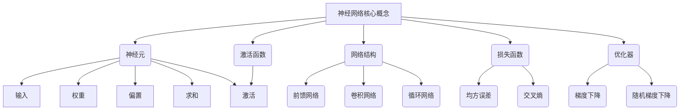

好的,我会严格遵守约束条件,以专业的技术语言写一篇关于神经网络原理与实践的深入博客文章。

# 神经网络(Neural Networks) - 原理与代码实例讲解

## 1. 背景介绍

### 1.1 问题的由来

在过去几十年中,人工智能领域取得了长足的进步,其中神经网络在图像识别、自然语言处理、推荐系统等众多领域发挥着重要作用。神经网络的兴起源于对生物神经系统的模拟,旨在构建具有自主学习能力的智能系统。然而,训练一个高性能的神经网络模型并非易事,需要对其内在原理有深刻的理解。

### 1.2 研究现状  

早期的神经网络研究可以追溯到上世纪20年代,当时的神经网络模型相对简单,如感知器(Perceptron)只能解决线性可分问题。直到20世纪80年代,反向传播(Backpropagation)算法的提出,催生了多层神经网络的发展。21世纪以来,深度学习(Deep Learning)的兴起极大推动了神经网络的发展,涌现出卷积神经网络(CNN)、递归神经网络(RNN)、生成对抗网络(GAN)等多种网络结构和训练策略,显著提高了神经网络在计算机视觉、自然语言处理等领域的性能表现。

### 1.3 研究意义

神经网络具有自主学习、模式识别和泛化能力,在解决非线性、高维复杂问题方面表现出色。深入研究神经网络的原理及实践对于推动人工智能的发展至关重要。本文将全面介绍神经网络的基本概念、数学模型、核心算法,并结合代码实例,帮助读者从理论和实践两个层面对神经网络有更深入的理解。

### 1.4 本文结构

本文共分为8个部分:第2部分介绍神经网络的核心概念;第3部分详细阐述神经网络的核心算法原理和具体操作步骤;第4部分构建神经网络的数学模型,并推导公式和案例分析;第5部分通过代码实例展示神经网络的实现细节;第6部分探讨神经网络在实际场景中的应用;第7部分推荐相关学习资源和开发工具;第8部分总结神经网络的发展趋势和面临的挑战。

## 2. 核心概念与联系

神经网络的核心概念包括神经元、激活函数、网络结构、损失函数和优化器等。

**神经元**是神经网络的基本计算单元,模拟生物神经元的工作原理。它接收来自其他神经元或外部输入的加权信号,并通过激活函数进行非线性转换输出。每个神经元包含输入、权重、偏置、求和和激活等步骤。

**激活函数**引入非线性因素,使神经网络能够拟合更加复杂的函数。常用的激活函数有Sigmoid、Tanh、ReLU等。

**网络结构**则描述了神经元之间的连接方式和层次关系。主要有前馈网络(如多层感知器)、卷积网络(CNN)和循环网络(RNN)等。

**损失函数**用于评估模型的预测值与真实值之间的差距,如均方误差、交叉熵等。模型训练的目标是最小化损失函数。

**优化器**通过不断迭代调整网络中的可训练参数(权重和偏置),使损失函数最小化。常用的优化算法有梯度下降、随机梯度下降等。

上述核心概念相互关联、环环相扣,构成了神经网络的理论基础和工作机制。

## 3. 核心算法原理 & 具体操作步骤  

### 3.1 算法原理概述

神经网络的核心算法是**反向传播(Backpropagation)算法**,用于根据损失函数的梯度信息,有效地调整网络中可训练参数的值,使模型的预测结果不断逼近期望输出。该算法主要分为两个过程:

1. **前向传播(Forward Propagation)**: 输入数据经过网络层层传递,每个神经元根据加权求和的输入和激活函数进行计算,产生该层的输出,最终得到模型的预测输出。

2. **反向传播(Backward Propagation)**: 将模型预测输出与真实标签计算得到损失,利用链式法则,从输出层开始,沿着网络连接的反方向,逐层计算每个权重参数对损失函数的梯度,并根据梯度更新参数值。

通过不断迭代前向传播和反向传播,模型的参数会不断优化,从而提高其在训练数据和测试数据上的性能表现。

### 3.2 算法步骤详解

反向传播算法的具体步骤如下:

1. **初始化网络参数**:对网络中的所有可训练参数(权重和偏置)进行随机初始化。

2. **前向传播**:
    a. 输入层将输入数据传递给隐藏层;
    b. 对于每个隐藏层神经元,计算加权输入之和,并通过激活函数得到该神经元的输出;
    c. 重复上一步,直至输出层,得到模型的预测输出。

3. **计算损失**:使用损失函数计算模型预测输出与真实标签之间的差距。

4. **反向传播**:
    a. 计算输出层神经元关于网络权重的梯度;
    b. 依次向前逐层计算每个隐藏层神经元关于网络权重的梯度;
    c. 利用链式法则,将梯度值传递至上一层,直至输入层。

5. **更新参数**:使用优化算法(如梯度下降)根据计算得到的梯度,更新网络中的可训练参数。

6. **重复步骤2-5**,进行多次迭代,直至模型在验证集上的性能不再有显著提升。

反向传播算法的关键在于通过链式法则计算损失函数对每个参数的梯度,并沿着这些梯度的方向调整参数值,使损失函数不断减小。

### 3.3 算法优缺点

**优点**:

1. 简单高效,易于实现和并行化计算。
2. 通过端到端的训练,能够自动从数据中学习特征表示。
3. 具有很强的泛化能力,可以解决非线性和高维复杂问题。

**缺点**:

1. 需要大量的训练数据,否则容易过拟合。
2. 训练过程计算量大,对硬件要求较高。
3. 模型是一个黑箱,内部参数缺乏可解释性。
4. 对异常数据和对抗样本缺乏鲁棒性。

### 3.4 算法应用领域

反向传播算法是训练神经网络的核心算法,可广泛应用于以下领域:

- **计算机视觉**: 图像分类、目标检测、语义分割等。
- **自然语言处理**: 机器翻译、文本生成、情感分析等。  
- **语音识别**: 自动语音识别、语音合成等。
- **推荐系统**: 个性化推荐、内容过滤等。
- **金融**: 信用评分、欺诈检测、风险管理等。
- **生物信息学**: 蛋白质结构预测、基因表达分析等。

总之,反向传播算法为训练各种复杂的神经网络模型提供了强大的工具,是人工智能领域的核心算法之一。

## 4. 数学模型和公式 & 详细讲解 & 举例说明

### 4.1 数学模型构建

为了形式化地描述神经网络,我们需要构建其数学模型。考虑一个由 $L$ 层组成的全连接神经网络,其中第 $l$ 层有 $n^{(l)}$ 个神经元。令 $W^{(l)}$ 表示第 $l$ 层的权重矩阵,其中 $W_{jk}^{(l)}$ 表示从第 $l-1$ 层第 $k$ 个神经元到第 $l$ 层第 $j$ 个神经元的连接权重;令 $b^{(l)}$ 表示第 $l$ 层的偏置向量。

对于任意一个训练样本 $x$,其在第 $l$ 层的激活值向量 $a^{(l)}$ 可表示为:

$$a^{(l)} = g(W^{(l)}a^{(l-1)} + b^{(l)})$$

其中 $g(\cdot)$ 为激活函数,如Sigmoid函数、ReLU函数等。特别地,输入层的激活值向量为输入样本本身,即 $a^{(1)} = x$。

最终,神经网络的输出向量 $\hat{y}$ 即为最后一层(第 $L$ 层)的激活值向量 $a^{(L)}$。

为了训练神经网络,我们需要定义一个损失函数 $J(W,b)$,用于衡量模型输出 $\hat{y}$ 与真实标签 $y$ 之间的差距。常用的损失函数有均方误差损失函数:

$$J(W,b) = \frac{1}{2m}\sum_{i=1}^m\|\hat{y}^{(i)}-y^{(i)}\|_2^2$$

和交叉熵损失函数:

$$J(W,b) = -\frac{1}{m}\sum_{i=1}^m\sum_{j=1}^ny_j^{(i)}\log\hat{y}_j^{(i)}$$

其中 $m$ 为训练样本的数量。

训练的目标是找到权重矩阵 $W$ 和偏置向量 $b$,使得损失函数 $J(W,b)$ 最小化。这通常通过反向传播算法和梯度下降优化算法来实现。

### 4.2 公式推导过程

接下来,我们将推导反向传播算法中关键的梯度计算公式。为了简化推导过程,我们考虑一个单输出神经网络,其损失函数为:

$$J(W,b) = \frac{1}{2}(\hat{y}-y)^2$$

我们的目标是计算 $\frac{\partial J}{\partial W_{jk}^{(l)}}$ 和 $\frac{\partial J}{\partial b_j^{(l)}}$,即损失函数对第 $l$ 层权重和偏置的偏导数。

根据链式法则,我们有:

$$\frac{\partial J}{\partial W_{jk}^{(l)}} = \frac{\partial J}{\partial a_j^{(l)}}\frac{\partial a_j^{(l)}}{\partial z_j^{(l)}}\frac{\partial z_j^{(l)}}{\partial W_{jk}^{(l)}}$$

$$\frac{\partial J}{\partial b_j^{(l)}} = \frac{\partial J}{\partial a_j^{(l)}}\frac{\partial a_j^{(l)}}{\partial z_j^{(l)}}\frac{\partial z_j^{(l)}}{\partial b_j^{(l)}}$$

其中 $z_j^{(l)} = \sum_kW_{jk}^{(l)}a_k^{(l-1)}+b_j^{(l)}$ 为第 $l$ 层第 $j$ 个神经元的加权输入。

我们可以计算出:

$$\frac{\partial J}{\partial a_j^{(L)}} = \hat{y}-y$$

$$\frac{\partial a_j^{(l)}}{\partial z_j^{(l)}} = g'(z_j^{(l)})$$

$$\frac{\partial z_j^{(l)}}{\partial W_{jk}^{(l)}} = a_k^{(l-1)}$$

$$\frac{\partial z_j^{(l)}}{\partial b_j^{(l)}} = 1$$

将这些结果代入上面的公式,我们可以得到:

$$\frac{\partial J}{\partial W_{jk}^{(l)}} = (\hat{y}-y)g'(z_j^{(L)})a_k^{(l-1)}$$

$$\frac{\partial J}{\partial b_j^{(l)}} = (\hat{y}-y