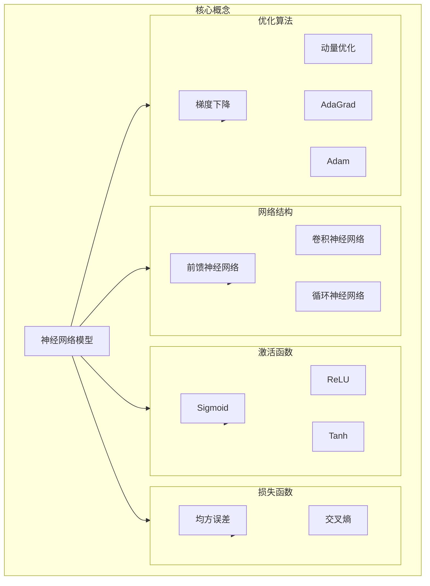

# 神经网络原理与代码实例讲解

## 1. 背景介绍

### 1.1 问题的由来

在过去的几十年里，人工智能领域取得了长足的进步,其中神经网络作为一种强大的机器学习模型,在各个领域都展现出了卓越的性能。神经网络的出现源于对生物神经系统的模拟,旨在构建一种能够像人脑一样学习和处理信息的系统。

随着数据量的激增和计算能力的提高,神经网络在图像识别、自然语言处理、推荐系统等领域取得了突破性的成就。然而,神经网络的内部机理一直是个黑箱,其工作原理和训练过程对于很多人来说仍然是个谜团。因此,深入理解神经网络的原理和实现细节,对于更好地利用这一强大工具至关重要。

### 1.2 研究现状

近年来,神经网络理论和应用研究受到了广泛关注。研究人员不断探索新的网络结构、优化算法和训练技巧,以提高神经网络的性能和泛化能力。同时,一些突破性的工作也为我们揭示了神经网络内部的一些机理,如注意力机制、可解释性等。

然而,神经网络仍然存在一些挑战,例如需要大量的训练数据、对异常输入缺乏鲁棒性、难以解释决策过程等。此外,神经网络的训练过程通常是一个黑箱操作,很难完全理解其内部发生的细节。因此,深入研究神经网络的原理和实现细节,对于更好地利用和改进这一强大工具至关重要。

### 1.3 研究意义

深入理解神经网络的原理和实现细节,对于以下几个方面具有重要意义:

1. **性能优化**:通过掌握神经网络的内部机理,我们可以更好地调整网络结构、优化算法和超参数,从而提高模型的性能和泛化能力。

2. **可解释性**:增强神经网络的可解释性,有助于我们理解模型的决策过程,从而更好地应用于关键领域,如医疗诊断、金融风险评估等。

3. **安全性**:研究神经网络的鲁棒性,有助于提高模型对异常输入和对抗性攻击的防御能力,确保系统的安全可靠。

4. **新模型探索**:深入理解现有神经网络的原理和局限性,有助于启发新型网络结构和学习算法的设计。

5. **知识传播**:将神经网络的原理和实现细节系统化、可视化,有助于推广相关知识,培养更多的人工智能人才。

### 1.4 本文结构

本文将从以下几个方面深入探讨神经网络的原理和实现细节:

1. 介绍神经网络的核心概念和基本原理,包括网络结构、激活函数、损失函数等。

2. 详细阐述神经网络中常用的训练算法,如反向传播算法、优化算法等,并给出具体的操作步骤。

3. 推导神经网络中常用的数学模型和公式,如反向传播公式、梯度下降公式等,并结合具体案例进行讲解。

4. 提供神经网络的代码实例,包括环境搭建、模型实现、训练过程等,并对关键代码进行解读和分析。

5. 介绍神经网络在不同领域的实际应用场景,如计算机视觉、自然语言处理等。

6. 总结神经网络的发展趋势和面临的挑战,并对未来的研究方向进行展望。

7. 推荐相关的学习资源、开发工具和论文,为读者提供进一步学习的途径。

8. 附录部分列出常见问题及解答,帮助读者解决实际操作中可能遇到的困难。

## 2. 核心概念与联系

神经网络是一种强大的机器学习模型,其核心概念包括网络结构、激活函数、损失函数和优化算法等。这些概念相互关联,共同决定了神经网络的性能和行为。

1. **网络结构**:神经网络的结构决定了它如何处理输入数据并产生输出。常见的网络结构包括前馈神经网络(FeedForward Neural Network)、卷积神经网络(Convolutional Neural Network)和循环神经网络(Recurrent Neural Network)等。不同的结构适用于不同的任务,如图像识别、自然语言处理等。

2. **激活函数**:激活函数引入非线性,使神经网络能够拟合复杂的函数。常用的激活函数包括Sigmoid、ReLU(整流线性单元)和Tanh等。选择合适的激活函数对于神经网络的性能和收敛速度有重要影响。

3. **损失函数**:损失函数用于衡量神经网络输出与真实值之间的差异,是训练过程中优化的目标函数。常见的损失函数包括均方误差(Mean Squared Error)和交叉熵(Cross Entropy)等。不同的任务需要选择合适的损失函数。

4. **优化算法**:优化算法用于调整神经网络的参数,使损失函数最小化。常用的优化算法包括梯度下降(Gradient Descent)、动量优化(Momentum)、AdaGrad和Adam等。选择合适的优化算法可以提高训练效率和模型性能。

这些核心概念相互关联,共同决定了神经网络的性能和行为。例如,网络结构决定了数据的流动方式,激活函数引入非线性,损失函数衡量模型的误差,而优化算法则调整参数以最小化损失。理解这些概念及其联系,对于掌握神经网络的原理和实现细节至关重要。

## 3. 核心算法原理 & 具体操作步骤

### 3.1 算法原理概述

神经网络的核心算法是反向传播算法(Backpropagation Algorithm),它是一种基于梯度下降的优化算法,用于训练多层神经网络。反向传播算法的主要思想是:

1. **前向传播**:输入数据经过网络的各层传播,产生最终的输出。

2. **计算误差**:比较输出与真实值的差异,计算损失函数的值。

3. **反向传播**:根据链式法则,计算每个参数对损失函数的梯度,即参数的导数。

4. **更新参数**:使用优化算法(如梯度下降)根据梯度值更新网络中的参数。

5. **迭代训练**:重复上述步骤,不断调整参数,使损失函数最小化。

反向传播算法的核心在于利用链式法则计算梯度,从而实现参数的自动调整。这种端到端的训练方式使得神经网络可以自动从数据中学习特征,而无需人工设计特征提取器。

### 3.2 算法步骤详解

下面我们将详细介绍反向传播算法的具体操作步骤:

1. **初始化网络参数**:随机初始化神经网络中所有可训练的参数,包括权重矩阵和偏置向量。

2. **前向传播**:
   - 输入数据 $X$ 通过网络的第一层,计算第一层的输出 $H_1 = f(W_1X + b_1)$,其中 $f$ 为激活函数。
   - 将第一层的输出 $H_1$ 作为输入,传递到下一层,重复上述过程,直到计算出网络的最终输出 $\hat{Y}$。

3. **计算损失函数**:将网络输出 $\hat{Y}$ 与真实标签 $Y$ 代入损失函数 $L(\hat{Y}, Y)$,计算损失值。常用的损失函数包括均方误差损失和交叉熵损失等。

4. **反向传播**:
   - 计算输出层的误差项 $\delta^L = \frac{\partial L}{\partial \hat{Y}} \odot f'(z^L)$,其中 $\odot$ 表示元素wise乘积,$ f'(z^L) $为激活函数的导数。
   - 依次计算每一层的误差项 $\delta^l = ((W^{l+1})^T \delta^{l+1}) \odot f'(z^l)$。
   - 计算每层参数的梯度:
     $\frac{\partial L}{\partial W^l} = \delta^l (a^{l-1})^T$
     $\frac{\partial L}{\partial b^l} = \sum_k \delta^l_k$

5. **更新参数**:使用优化算法(如梯度下降、动量优化或Adam等)根据计算得到的梯度,更新网络中的参数:
   $W^l \leftarrow W^l - \eta \frac{\partial L}{\partial W^l}$
   $b^l \leftarrow b^l - \eta \frac{\partial L}{\partial b^l}$
   其中 $\eta$ 为学习率。

6. **迭代训练**:重复上述步骤,使用新的参数进行前向传播和反向传播,不断调整参数,直到损失函数收敛或达到最大迭代次数。

通过上述步骤,神经网络可以自动从训练数据中学习特征,并不断优化参数以最小化损失函数。反向传播算法的关键在于利用链式法则计算梯度,从而实现参数的自动调整,这使得神经网络能够处理复杂的非线性问题。

### 3.3 算法优缺点

反向传播算法作为训练神经网络的核心算法,具有以下优缺点:

**优点**:

1. **端到端训练**:反向传播算法实现了神经网络的端到端训练,无需手动设计特征提取器,可以自动从数据中学习最优特征。

2. **通用性强**:反向传播算法可以应用于各种类型的神经网络,如前馈网络、卷积网络和循环网络等,具有很强的通用性。

3. **可扩展性好**:反向传播算法的计算过程可以很好地并行化,利用GPU等硬件加速,提高训练效率。

4. **性能优异**:经过多年的发展,反向传播算法在各种任务上表现出色,在图像识别、自然语言处理等领域取得了卓越成就。

**缺点**:

1. **梯度消失/爆炸**:在训练深层网络时,反向传播算法容易出现梯度消失或梯度爆炸的问题,导致训练困难。

2. **局部最优陷阱**:由于损失函数是非凸的,反向传播算法容易陷入局部最优解,无法找到全局最优解。

3. **需要大量数据**:神经网络通常需要大量的训练数据才能获得良好的性能,数据的质量和数量对模型的性能影响很大。

4. **黑箱性质**:神经网络的决策过程往往缺乏可解释性,被视为一个黑箱,这在一些关键领域可能会引起担忧。

5. **对异常输入缺乏鲁棒性**:神经网络对异常输入或对抗性攻击缺乏鲁棒性,可能会产生错误的预测结果。

尽管存在一些缺点,但反向传播算法仍然是训练神经网络的核心算法,在实践中取得了巨大的成功。研究人员正在不断探索新的方法来解决这些问题,如通过正则化、dropout等技术来缓解过拟合,使用残差连接等结构来缓解梯度消失/爆炸问题,以及探索可解释性和鲁棒性等方向。

### 3.4 算法应用领域

反向传播算法作为训练神经网络的核心算法,在各个领域都有广泛的应用,包括但不限于