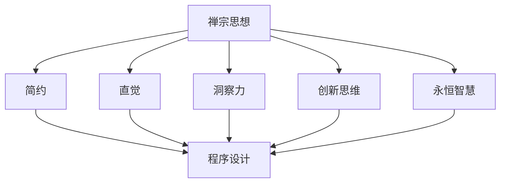
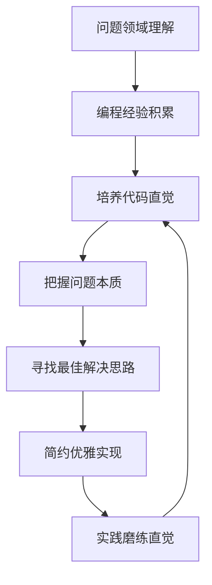

# 禅与计算机程序设计艺术

## 1. 背景介绍

### 1.1 问题的由来

在当今瞬息万变的数字时代,计算机程序设计已经成为一门融合了艺术、科学和哲学的综合学科。程序员不仅需要掌握扎实的编程技能,还需要具备创新思维、审美意识和洞察力,才能创造出优雅、高效且具有长期价值的软件系统。

程序设计的本质是解决问题,但传统的编程教育往往过于强调语法和算法,忽视了编程的艺术性和哲学层面。结果,许多程序员虽然掌握了编码技能,但缺乏对程序设计的深入理解和创新思维,难以应对日益复杂的软件需求。

### 1.2 研究现状

近年来,一些先驱者开始探索将禅宗思想与计算机程序设计相结合,试图从中寻找编程的本质和灵感。他们认为,禅宗强调直觉、简约和洞察,与优秀程序设计所需的品质不谋而合。一些著名的编程语言和范式,如Ruby、Python和函数式编程,都体现了禅宗的影子。

然而,目前关于"禅与计算机程序设计艺术"的系统性研究还相对匮乏。大多数探索都停留在哲学层面,缺乏对具体编程实践的指导。如何将禅宗思想真正融入程序设计的方方面面,仍是一个有待深入探讨的课题。

### 1.3 研究意义

探索"禅与计算机程序设计艺术"不仅有助于提升程序员的编程素养和创新能力,还可以为软件开发注入新的活力和灵感。具体来说,该研究具有以下重要意义:

1. **提高代码质量和可维护性**。借鉴禅宗的简约、直觉和洞察,可以帮助程序员写出更加优雅、精炼和可读的代码,从而提高代码的质量和可维护性。

2. **培养创新思维**。禅宗强调打破常规思维定式,鼓励独立思考和创新。将这种思维方式融入程序设计中,有助于程序员突破陈旧观念,开拓新的解决方案。

3. **促进软件可持续发展**。优秀的软件不仅需要功能强大,还需要具备长期价值。借鉴禅宗的永恒智慧,可以帮助程序员设计出更加可持续、具有长期生命力的软件系统。

4. **丰富编程文化**。将禅宗思想融入程序设计中,不仅可以拓展程序员的视野,还可以为编程文化注入新的活力和深度,使其更加丰富多彩。

### 1.4 本文结构

本文将系统地探讨"禅与计算机程序设计艺术"这一主题。首先,我们将介绍禅宗思想与程序设计之间的内在联系,阐述它们在本质上的相通之处。接下来,我们将详细阐述将禅宗思想应用于程序设计的核心原则和实践方法,包括编码风格、设计模式、测试驱动开发等多个方面。

此外,我们还将构建相关的数学模型,并推导出一些重要公式,以更加严谨和科学的方式阐释"禅与计算机程序设计艺术"的理论基础。为了加深读者的理解,我们将提供大量实际案例和代码示例,并对其进行深入解读和分析。

最后,我们将探讨"禅与计算机程序设计艺术"在实际应用中的前景,介绍相关的工具和学习资源,并对未来的发展趋势和挑战进行展望。

## 2. 核心概念与联系

禅宗思想与计算机程序设计看似毫不相干,但实际上二者在本质上存在着内在的联系和相通之处。下面我们将从几个核心概念入手,阐述它们之间的关联。

### 2.1 简约

禅宗追求简约,摒弃一切多余的东西,追求本真。这种简约的理念与优秀的程序设计不谋而合。优秀的代码应该简洁、精炼、去除冗余,只保留必要的部分。简约的代码不仅更加优雅和可读,而且也更加高效和可维护。

在程序设计中,我们可以借鉴禅宗的简约理念,遵循像"单一职责原则"、"接口隔离原则"这样的设计原则,编写出简洁、高内聚、低耦合的代码。同时,我们也应该培养简约的编码风格,避免过度的注释、过长的函数名和变量名等,让代码保持干净和简洁。

### 2.2 直觉

禅宗强调直觉,鼓励人们超越理性思维,直接领悟事物的本质。在程序设计中,直觉同样扮演着重要的角色。优秀的程序员能够凭借直觉快速把握问题的本质,找到最佳的解决方案。

直觉往往来自于丰富的编程经验和对编程范式的深入理解。通过不断的实践和学习,程序员可以培养出对代码的敏锐直觉,从而写出更加优雅、高效的代码。同时,直觉也有助于程序员预见潜在的问题和风险,从而提前采取应对措施。

### 2.3 洞察力

禅宗追求洞察力,鼓励人们透过表象,洞见事物的本质。在程序设计中,洞察力同样至关重要。优秀的程序员需要具备洞察力,能够洞见问题的本质,找到最根本的解决方案。

洞察力来自于对编程范式、设计模式和算法的深入理解,以及对问题领域的透彻把握。具备洞察力的程序员能够看穿表面现象,发现隐藏的规律和本质,从而设计出更加优雅、高效和可扩展的解决方案。

### 2.4 创新思维

禅宗鼓励打破常规思维定式,勇于创新。在程序设计中,创新思维同样弥足珍贵。优秀的程序员需要具备创新思维,能够突破传统的编程范式和思维模式,开拓新的解决方案。

创新思维源于对现有技术和方法的批判性思考,以及对新事物的开放态度。具备创新思维的程序员不会被既有的观念所束缚,而是勇于尝试新的编程语言、新的架构模式和新的算法,从而推动技术的进步和发展。

### 2.5 永恒智慧

禅宗蕴含着永恒的智慧,超越时间和空间的限制。在程序设计中,我们同样需要追求永恒的价值和智慧,设计出具有长期生命力的软件系统。

永恒智慧体现在编程的基本原则和最佳实践上,如"干燥原则"(Don't Repeat Yourself)、"开放-封闭原则"等。这些原则虽然简单,但蕴含着深刻的智慧,能够指导我们设计出可维护、可扩展和可演化的软件系统。

通过将禅宗思想融入程序设计实践,我们可以提升代码的质量和可维护性,培养创新思维,并为软件注入长期的生命力和价值。下一章节,我们将详细阐述如何将禅宗思想应用于程序设计的具体实践。

## 3. 核心算法原理 & 具体操作步骤

### 3.1 算法原理概述

将禅宗思想融入程序设计实践的核心算法原理,可以概括为"直觉式编程"(Intuitive Programming)。直觉式编程强调通过直觉和洞察力来把握问题的本质,从而设计出简约、优雅和高效的解决方案。

直觉式编程算法的基本思想是:首先,通过对问题领域的深入理解和丰富的编程经验,培养出对代码的敏锐直觉;其次,运用这种直觉快速把握问题的本质,找到最佳的解决思路;最后,以简约、优雅的方式实现这一解决方案,并不断通过实践来磨练直觉。

该算法的核心在于培养和运用直觉,而不是盲目地遵循固定的规则和模式。它鼓励程序员打破常规思维定式,勇于尝试新的编程范式和技术,从而开拓创新的解决方案。

### 3.2 算法步骤详解

1. **深入理解问题领域**。直觉式编程的第一步是对问题领域有深入的理解和把握。这需要程序员花费大量时间和精力去学习和研究该领域的知识,了解其中的规律和本质。只有真正理解了问题的本质,才能培养出对应的直觉。

2. **积累丰富的编程经验**。直觉来自于经验的积累。优秀的程序员需要不断实践编程,尝试不同的编程语言、框架和范式,从中积累经验,培养出对代码的敏锐直觉。

3. **培养代码直觉**。通过对问题领域的深入理解和丰富的编程经验,程序员可以逐步培养出对代码的直觉。这种直觉会让他们在编写代码时,有一种"感觉"或"预感",知道哪种方式更加简约、优雅和高效。

4. **把握问题本质**。在直觉的指引下,程序员可以快速把握问题的本质,看穿表面现象,发现隐藏的规律和本质。这是直觉式编程的关键一步。

5. **寻找最佳解决思路**。把握了问题本质后,程序员就可以运用直觉和创新思维,寻找最佳的解决思路。这可能需要打破常规思维定式,尝试新的编程范式和技术。

6. **简约优雅实现**。找到解决思路后,程序员需要以简约、优雅的方式将其实现为代码。这体现了禅宗"简约"的理念,代码应该精炼、去除冗余,只保留必要的部分。

7. **实践磨练直觉**。直觉是一种动态的过程,需要不断通过实践来磨练和提高。程序员应该反复实践直觉式编程,从中总结经验教训,不断提升自己的直觉水平。

通过这一系列步骤,程序员可以将禅宗思想真正融入到编程实践中,写出简约、优雅、高效且具有长期价值的代码。

### 3.3 算法优缺点

直觉式编程算法的主要优点包括:

1. **简约优雅**。通过直觉和洞察力,程序员可以设计出简约、优雅的解决方案,代码更加精炼和可读。

2. **高效性能**。简约的代码通常也意味着高效,因为它们去除了冗余和不必要的部分,从而提高了性能。

3. **创新思维**。该算法鼓励程序员打破常规思维定式,勇于尝试新的编程范式和技术,从而推动技术的进步和发展。

4. **长期价值**。通过追求简约和永恒智慧,直觉式编程可以帮助程序员设计出具有长期生命力和价值的软件系统。

然而,直觉式编程算法也存在一些缺点和挑战:

1. **经验依赖**。直觉来自于丰富的经验积累,因此该算法对程序员的经验要求较高,新手程序员可能难以掌握。

2. **主观性**。直觉本身具有一定的主观性,不同程序员的直觉可能会有所差异,导致解决方案的差异。

3. **学习曲线陡峭**。培养直觉和洞察力需要大量的时间和努力,学习曲线较为陡峭。

4. **