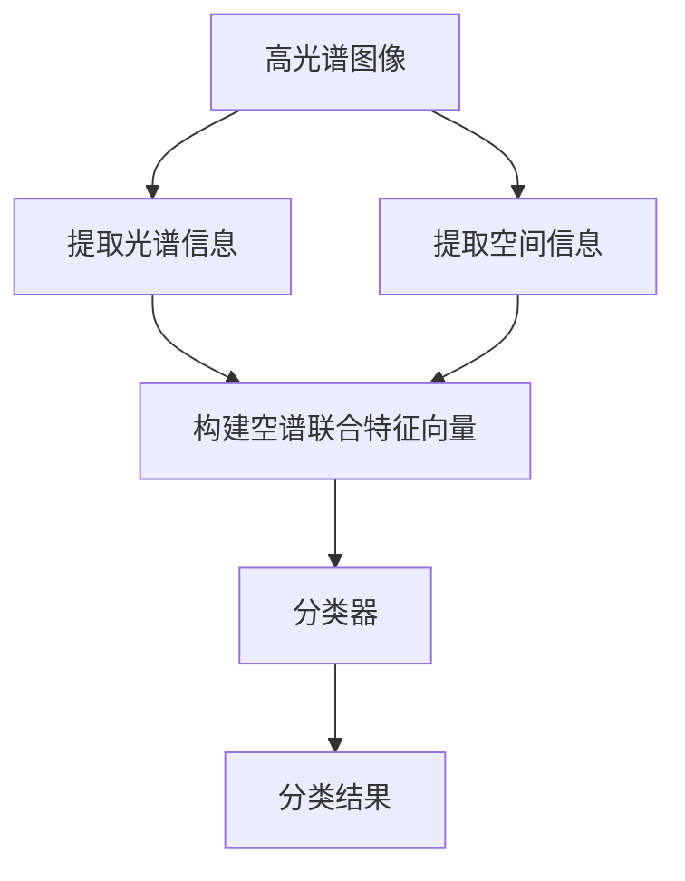

# 空谱联合的高光谱图像分类

## 1. 背景介绍

### 1.1 问题的由来

随着遥感技术的不断发展,高光谱遥感图像在许多领域得到了广泛应用,如环境监测、农业调查、矿产勘探等。高光谱图像能够提供目标物体在可见光和近红外波段的细致光谱信息,从而为物体识别和分类提供了更加丰富的数据支持。然而,由于高光谱数据维度高、冗余信息多等特点,如何有效地利用高光谱信息进行目标分类仍然是一个挑战性问题。

### 1.2 研究现状

传统的高光谱图像分类方法主要依赖于光谱信息,如基于光谱相似性的监督分类、无监督聚类等。但这些方法往往忽视了空间信息的重要性,导致分类精度不高。近年来,一些研究者提出了将光谱信息与空间信息相结合的分类方法,取得了不错的效果。其中,空谱联合分类(Spectral-Spatial Classification)是一种较为典型的方法,通过构建光谱-空间特征向量,同时利用光谱信息和空间信息进行分类。

### 1.3 研究意义

空谱联合分类方法能够充分利用高光谱图像的光谱和空间信息,提高分类精度。同时,该方法具有一定的通用性,可以与不同的分类算法相结合,形成多种空谱联合分类模型。因此,研究空谱联合分类方法对于提高高光谱图像分类性能具有重要意义。

### 1.4 本文结构  

本文首先介绍空谱联合分类的核心概念和基本原理,然后详细阐述常用的空谱联合分类算法,包括算法原理、数学模型、实现步骤等。接下来,通过实例分析和代码示例,对算法进行深入解读。最后,探讨空谱联合分类在实际应用中的场景,并对未来的发展趋势和挑战进行展望。

## 2. 核心概念与联系

空谱联合分类的核心思想是将高光谱图像的光谱信息和空间信息相结合,构建新的特征向量,再基于该特征向量进行分类。具体来说,包括以下几个关键概念:

1. **光谱信息(Spectral Information)**: 指目标物体在不同波长下的反射率或辐射率,通常表现为一条光谱曲线。高光谱图像能够提供目标在可见光和近红外波段的细致光谱信息。

2. **空间信息(Spatial Information)**: 指像素在二维平面上的位置分布及其与周围像素的关系,包括纹理、形状、结构等空间特征。

3. **空谱联合特征向量(Spectral-Spatial Feature Vector)**: 将光谱信息和空间信息融合形成的新的特征向量,通常包含目标像素的光谱值和空域窗口内的空间特征值。

4. **分类器(Classifier)**: 基于空谱联合特征向量,使用监督或无监督的机器学习算法对图像像素进行分类,如支持向量机(SVM)、随机森林(RF)等。

空谱联合分类的基本流程如下所示:

通过空谱联合的方式,能够充分利用高光谱图像中丰富的光谱和空间信息,从而提高目标分类的准确性和鲁棒性。

## 3. 核心算法原理 & 具体操作步骤

### 3.1 算法原理概述

空谱联合分类算法的核心思想是将高光谱图像的光谱信息和空间信息相结合,构建新的特征向量,再基于该特征向量进行分类。算法主要包括以下几个步骤:

1. **提取光谱信息**: 对于每个像素,提取其在不同波段的反射率或辐射率值,形成一条光谱曲线,作为该像素的光谱信息。

2. **提取空间信息**: 对于每个像素,在其周围构建一个空域窗口,提取窗口内像素的空间特征,如纹理、形状、结构等,作为该像素的空间信息。

3. **构建空谱联合特征向量**: 将光谱信息和空间信息融合,形成新的空谱联合特征向量。

4. **分类**: 基于空谱联合特征向量,使用监督或无监督的机器学习算法(如SVM、RF等)对图像像素进行分类。

通过空谱联合的方式,能够充分利用高光谱图像中丰富的光谱和空间信息,从而提高目标分类的准确性和鲁棒性。

### 3.2 算法步骤详解

以下是空谱联合分类算法的具体实现步骤:

1. **确定空域窗口大小**: 根据实际情况确定提取空间信息时使用的空域窗口大小,通常为 $3 \times 3$、$5 \times 5$ 或 $7 \times 7$ 等。

2. **提取光谱信息**: 对于每个像素 $\mathbf{x}_{i}$,提取其在 $B$ 个波段的反射率或辐射率值,形成一条光谱曲线 $\mathbf{s}_{i} = \left(s_{i}^{1}, s_{i}^{2}, \ldots, s_{i}^{B}\right)^{\top}$,作为该像素的光谱信息。

3. **提取空间信息**: 对于每个像素 $\mathbf{x}_{i}$,在其周围构建一个空域窗口 $\mathcal{N}\left(\mathbf{x}_{i}\right)$,提取窗口内像素的空间特征,如灰度值、梯度值、纹理特征等,形成空间特征向量 $\mathbf{v}_{i}$,作为该像素的空间信息。

4. **构建空谱联合特征向量**: 将光谱信息 $\mathbf{s}_{i}$ 和空间信息 $\mathbf{v}_{i}$ 拼接,形成新的空谱联合特征向量 $\mathbf{x}_{i}^{\prime}=\left[\mathbf{s}_{i}^{\top}, \mathbf{v}_{i}^{\top}\right]^{\top}$。

5. **训练分类器**: 使用监督或无监督的机器学习算法,基于空谱联合特征向量 $\left\{\mathbf{x}_{i}^{\prime}\right\}_{i=1}^{N}$ 训练分类器模型。

6. **分类**: 对新的高光谱图像,重复步骤 2-4 构建空谱联合特征向量,然后使用训练好的分类器模型对其进行分类,得到每个像素的类别标签。

通过上述步骤,空谱联合分类算法能够充分利用高光谱图像的光谱信息和空间信息,提高分类精度。

### 3.3 算法优缺点

空谱联合分类算法的优点如下:

1. **分类精度高**: 通过融合光谱和空间信息,能够更好地描述目标特征,提高分类准确率。

2. **适用范围广**: 空谱联合分类算法具有一定的通用性,可以与多种监督或无监督的机器学习算法相结合,形成多种分类模型。

3. **处理简单**: 算法思路清晰,实现过程相对简单,易于理解和编程实现。

4. **计算效率较高**: 相比于一些复杂的深度学习模型,空谱联合分类算法的计算复杂度相对较低,处理速度更快。

缺点如下:

1. **特征提取方式单一**: 目前大多数空谱联合分类算法采用的特征提取方式较为简单,难以充分挖掘数据潜在的丰富信息。

2. **对噪声敏感**: 由于直接使用像素值作为特征,空谱联合分类算法对噪声和异常值较为敏感,需要进行预处理。

3. **参数选择困难**: 空域窗口大小、空间特征类型等参数的选择对分类结果影响较大,但缺乏统一的选择标准。

4. **难以处理高维数据**: 随着光谱维度和空间特征维度的增加,特征向量维度会急剧增大,给分类带来一定挑战。

### 3.4 算法应用领域

空谱联合分类算法主要应用于以下几个领域:

1. **遥感图像分类**: 高光谱遥感图像是空谱联合分类算法的主要应用对象,可用于土地覆盖分类、作物种类识别、矿产勘探等。

2. **医学图像分析**: 将空谱联合分类算法应用于医学影像数据,如磁共振成像(MRI)、计算机断层扫描(CT)等,可用于病灶检测和组织分割。

3. **化学成分分析**: 利用空谱联合分类算法对化学物质的光谱数据和空间结构信息进行分析,可用于成分鉴定和纯度检测。

4. **目标检测与跟踪**: 在计算机视觉领域,空谱联合分类算法可用于目标检测、目标跟踪和行为分析等任务。

5. **异常检测**: 将空谱联合分类算法应用于工业生产线、安防监控等场景,可用于异常情况的及时发现和报警。

总的来说,空谱联合分类算法能够充分利用数据的光谱信息和空间信息,在多个领域发挥重要作用。

## 4. 数学模型和公式 & 详细讲解 & 举例说明

### 4.1 数学模型构建

为了更好地理解和实现空谱联合分类算法,我们需要构建相应的数学模型。假设输入为一幅 $H \times W \times B$ 维的高光谱图像 $\mathbf{X}$,其中 $H$、$W$ 分别表示图像的高度和宽度, $B$ 表示光谱维度(波段数)。我们的目标是对每个像素 $\mathbf{x}_{i} \in \mathbb{R}^{B}$ 进行分类,得到其类别标签 $y_{i} \in \{1, 2, \ldots, C\}$,其中 $C$ 是类别数。

首先,我们需要为每个像素 $\mathbf{x}_{i}$ 构建空谱联合特征向量 $\mathbf{x}_{i}^{\prime}$。对于光谱信息,我们直接使用像素的光谱值 $\mathbf{s}_{i} = \mathbf{x}_{i}$。对于空间信息,我们在像素 $\mathbf{x}_{i}$ 周围构建一个 $r \times r$ 的空域窗口 $\mathcal{N}\left(\mathbf{x}_{i}\right)$,提取窗口内像素的空间特征,如灰度值、梯度值、纹理特征等,形成空间特征向量 $\mathbf{v}_{i}$。然后,我们将光谱信息 $\mathbf{s}_{i}$ 和空间信息 $\mathbf{v}_{i}$ 拼接,形成新的空谱联合特征向量:

$$
\mathbf{x}_{i}^{\prime}=\left[\mathbf{s}_{i}^{\top}, \mathbf{v}_{i}^{\top}\right]^{\top} \in \mathbb{R}^{B+D}
$$

其中, $D$ 是空间特征向量的维度。

接下来,我们需要定义一个分类函数 $f: \mathbb{R}^{B+D} \rightarrow \{1, 2, \ldots, C\}$,将空谱联合特征向量 $\mathbf{x}_{i}^{\prime}$ 映射到相应的类别标签 $y_{i}$。这个分类函数可以是任何监督或无监督的机器学习算法,如支持向量机(SVM)、随机森林(RF)、K 近邻(KNN)等。

对于监督学习,我们需要一个训练集 $\mathcal{D}=\left\{\left(\mathbf{x}_{i}^{\prime}, y_{i}\right)\right\}_{i=1}^{N}$,其中 $\mathbf{x}_{i}^{\prime}$ 是第 $i$ 个训练样本的空谱联合特征向量, $y_{i}$ 是其对应的类别标签。我们的目标是通过优化某个损失函数 $\mathcal{L}$,