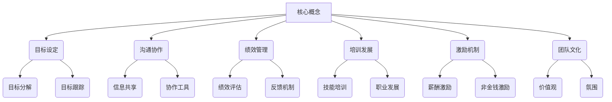
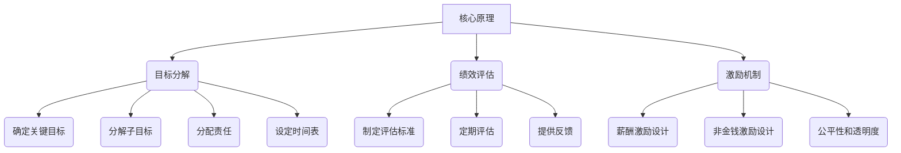

# 管理公司IT团队带领团队完成目标

## 1. 背景介绍

### 1.1 问题的由来

在当今快节奏的商业环境中，IT团队扮演着至关重要的角色。他们负责开发、维护和优化公司的技术基础设施和应用程序,确保业务运营的高效和顺畅。然而,管理一个高绩效的IT团队并非易事,需要领导者具备出色的管理技巧和领导力。

企业面临着日益激烈的竞争,快速变化的技术环境,以及不断扩大的客户需求。为了保持竞争优势,公司必须拥有一支敏捷、高效的IT团队,能够快速响应市场变化,提供创新的解决方案。但是,团队成员往往来自不同的背景和专业领域,具有不同的工作方式和沟通风格,这给团队管理带来了巨大挑战。

### 1.2 研究现状

目前,已有大量研究探讨了IT团队管理的重要性和最佳实践。一些研究强调了明确的目标设定、有效的沟通和协作、持续的培训和发展等因素对于建立高绩效团队的重要性。其他研究则关注了领导风格、激励机制和团队文化等方面对团队绩效的影响。

然而,尽管有许多研究探讨了IT团队管理的不同方面,但将所有这些要素整合到一个全面的框架中,并提供实际的指导和工具仍然是一个挑战。许多公司仍然在努力寻找有效管理IT团队的方法,以确保团队能够高效地完成目标,并为公司创造价值。

### 1.3 研究意义

本文旨在为IT团队领导者提供一个全面的框架和实用的指导,帮助他们有效地管理团队,激发团队潜能,并带领团队完成目标。通过深入探讨团队管理的各个方面,包括目标设定、沟通协作、绩效管理、培训发展、激励机制和团队文化等,本文将为读者提供宝贵的见解和实践经验。

通过本文,读者将能够:

1. 了解建立高绩效IT团队的关键因素和最佳实践。
2. 掌握有效的目标设定、沟通协作和绩效管理技巧。
3. 探索激发团队动力和创造积极团队文化的策略。
4. 获取实用的工具和技巧,以应用于实际的团队管理实践中。

无论您是经验丰富的IT领导者,还是刚踏入管理岗位的新手,本文都将为您提供宝贵的指导,帮助您更好地管理和发展您的IT团队,实现卓越的业绩。

### 1.4 本文结构

本文将分为以下几个部分:

1. **背景介绍**:阐述研究背景、现状和意义。
2. **核心概念与联系**:探讨团队管理的核心概念,如目标设定、沟通协作、绩效管理等,并阐释它们之间的关系。
3. **核心算法原理与具体操作步骤**:介绍有效团队管理的核心原理和具体步骤,包括目标分解、绩效评估、激励机制等。
4. **数学模型和公式详细讲解与举例说明**:通过数学模型和公式,量化团队绩效和管理效率,并结合实际案例进行说明。
5. **项目实践:代码实例和详细解释说明**:提供实际的代码示例,展示如何将理论付诸实践,并进行详细解释。
6. **实际应用场景**:分享真实案例,探讨不同行业和规模公司在IT团队管理方面的实践经验。
7. **工具和资源推荐**:推荐有用的工具、资源和参考文献,帮助读者进一步学习和实践。
8. **总结:未来发展趋势与挑战**:总结本文的核心内容,并展望IT团队管理领域的未来发展趋势和潜在挑战。
9. **附录:常见问题与解答**:回答读者可能遇到的常见问题和疑虑。

通过全面、深入的探讨,本文将为读者提供一个完整的框架,帮助他们更好地管理IT团队,实现卓越的业绩。

## 2. 核心概念与联系

在探讨有效管理IT团队的具体策略和方法之前,我们需要先了解一些核心概念及它们之间的关系。这些概念构成了团队管理的基础,对于建立高绩效团队至关重要。

### 2.1 目标设定 (Goal Setting)

明确的目标设定是有效团队管理的基石。它为团队提供了清晰的方向和期望,有助于团队成员集中精力,并确保所有努力都朝着共同的目标前进。目标设定包括以下两个关键方面:

1. **目标分解 (Goal Breakdown)**: 将总体目标分解为可衡量、可实现的小目标,并为每个小目标分配具体的责任人和截止日期。这有助于使目标更加具体和可操作。

2. **目标跟踪 (Goal Tracking)**: 定期监控目标的进展情况,及时发现并解决任何潜在的障碍或偏差。这有助于确保团队保持在正确的轨道上,并在必要时进行调整。

### 2.2 沟通协作 (Communication and Collaboration)

有效的沟通和协作对于团队的成功至关重要。它有助于建立互信、促进理解,并确保所有团队成员都在朝着同一个方向努力。沟通协作包括以下两个关键方面:

1. **信息共享 (Information Sharing)**: 建立开放、透明的信息共享渠道,确保所有相关信息能够及时、准确地传递给团队成员。这有助于提高效率,避免重复工作和错误。

2. **协作工具 (Collaboration Tools)**: 利用现代协作工具,如项目管理软件、在线协作平台和即时通讯工具,促进团队成员之间的实时协作和沟通。这有助于提高生产力,并确保所有人都保持同步。

### 2.3 绩效管理 (Performance Management)

绩效管理是确保团队成员能够高效工作,并实现预期目标的关键。它包括以下两个关键方面:

1. **绩效评估 (Performance Evaluation)**: 定期评估团队成员的工作表现,并提供建设性的反馈。这有助于识别优秀表现,并发现需要改进的领域。

2. **反馈机制 (Feedback Mechanism)**: 建立双向的反馈机制,鼓励团队成员提供反馈,并确保领导者能够及时回应和解决任何问题或疑虑。这有助于促进开放的沟通,并提高团队的参与度和承诺度。

### 2.4 培训发展 (Training and Development)

持续的培训和发展对于保持团队的竞争力和创新能力至关重要。它包括以下两个关键方面:

1. **技能培训 (Skill Training)**: 根据团队和个人的需求,提供相关的技术培训和软技能培训,以提升团队成员的专业能力和个人发展。

2. **职业发展 (Career Development)**: 为团队成员制定清晰的职业发展路径,提供晋升机会和职业辅导,以保持他们的积极性和动力。

### 2.5 激励机制 (Incentive Mechanisms)

合理的激励机制能够激发团队成员的动力和热情,从而提高工作绩效。它包括以下两个关键方面:

1. **薪酬激励 (Compensation Incentives)**: 建立公平、竞争力的薪酬体系,根据团队成员的贡献和表现提供适当的薪酬奖励。

2. **非金钱激励 (Non-monetary Incentives)**: 除了金钱奖励之外,还可以提供其他形式的激励,如职业发展机会、灵活的工作安排、额外的假期等,以满足团队成员的不同需求。

### 2.6 团队文化 (Team Culture)

积极的团队文化能够促进团队凝聚力,提高工作效率和满意度。它包括以下两个关键方面:

1. **价值观 (Values)**: 确立团队的核心价值观,如诚信、尊重、创新等,并通过领导者的示范和日常实践来传递和加强这些价值观。

2. **氛围 (Atmosphere)**: 营造包容、互助的工作氛围,鼓励团队成员之间的相互支持和合作,促进积极的工作态度和良好的人际关系。

这些核心概念相互关联、相互影响。有效的团队管理需要综合考虑所有这些因素,并将它们有机地结合在一起。只有这样,才能真正建立一支高绩效、高凝聚力的IT团队,带领团队实现卓越的业绩。

## 3. 核心算法原理与具体操作步骤

在了解了团队管理的核心概念之后,我们将深入探讨有效管理IT团队的核心原理和具体操作步骤。这些原理和步骤将为您提供一个清晰的路线图,帮助您系统地规划和执行团队管理策略。

### 3.1 算法原理概述

有效管理IT团队的核心原理可以概括为以下三个方面:

1. **目标分解 (Goal Breakdown)**: 将总体目标分解为可衡量、可实现的小目标,并为每个小目标分配具体的责任人和截止日期。这有助于使目标更加具体和可操作,同时也有利于跟踪进度和问责。

2. **绩效评估 (Performance Evaluation)**: 制定明确的评估标准,定期评估团队成员的工作表现,并提供建设性的反馈。这有助于识别优秀表现,发现需要改进的领域,并促进持续的学习和发展。

3. **激励机制 (Incentive Mechanisms)**: 建立公平、透明的激励机制,包括薪酬激励和非金钱激励,根据团队成员的贡献和表现提供适当的奖励。这有助于激发团队成员的动力和热情,提高工作绩效。

### 3.2 算法步骤详解

#### 步骤 1: 目标分解 (Goal Breakdown)

1. **确定关键目标 (Identify Key Goals)**: 与团队成员和利益相关者进行充分的沟通和讨论,明确确定团队的关键目标。这些目标应该与公司的总体战略和业务目标保持一致。

2. **分解子目标 (Break Down into Sub-goals)**: 将关键目标分解为可衡量、可实现的子目标。每个子目标应该具有明确的定义、范围和可交付成果。

3. **分配责任 (Assign Responsibilities)**: 为每个子目标指定具体的责任人,确保每个团队成员都清楚自己的职责和期望。

4. **设定时间表 (Set Timelines)**: 为每个子目标设定合理的截止日期,并制定详细的里程碑计划。这有助于监控进度,并及时发现和解决任何潜在的延误或障碍。

#### 步骤 2: 绩效评估 (Performance Evaluation)

1. **制定评估标准 (Establish Evaluation Criteria)**: 基于团队的目标和职责,制定明确的绩效评估标准。这些标准应该是可衡量的,并且与团队成员的工