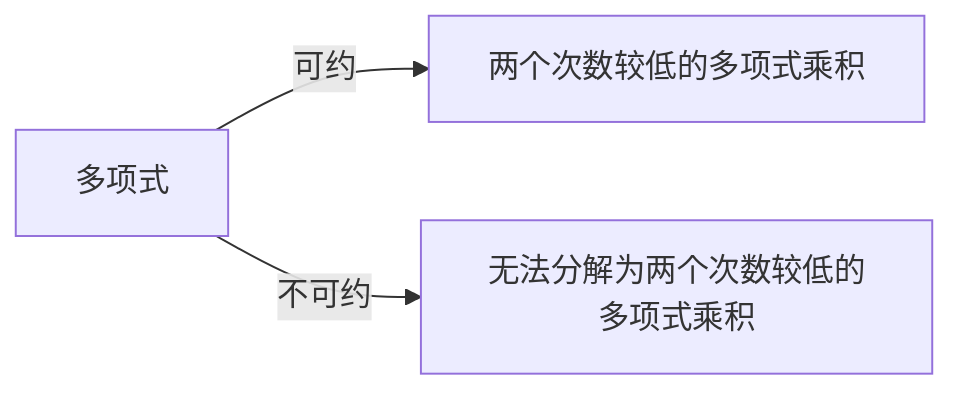

# 线性代数导引：多项式不可约性

## 1. 背景介绍

### 1.1 问题的由来

多项式不可约性是代数和数论中的一个基本概念,它与整数的素性密切相关。在许多数学领域中,多项式不可约性都扮演着重要角色,例如密码学、有限域理论、代数几何等。判断一个多项式是否可约,对于维护密码系统的安全性、设计有限域和构造椭圆曲线等都至关重要。

### 1.2 研究现状

多项式不可约性的研究可以追溯到古希腊时期,当时数学家们已经开始探索整系数多项式的可约性问题。随着代数学的发展,人们逐渐建立起了判定多项式可约性的一些准则和算法。然而,对于高阶多项式,判定其可约性仍然是一个具有挑战性的问题。

目前,已经提出了多种算法来判定多项式的不可约性,例如平方剩余算法、Berlekamp算法、Miller-Rabin算法等。这些算法在不同情况下都有其优缺点,需要根据具体问题进行选择和优化。

### 1.3 研究意义

研究多项式不可约性不仅具有重要的理论价值,同时也有广泛的实际应用。在密码学领域,多项式不可约性是构建安全密码系统的基础,如RSA加密算法就依赖于大素数的存在。在有限域理论中,不可约多项式被用于构造有限域,这对于编码理论和密码学都有重要意义。此外,在代数几何中,不可约多项式也被用于定义代数曲线和代数曲面。

### 1.4 本文结构

本文将全面探讨多项式不可约性的相关理论和算法。首先介绍多项式不可约性的核心概念和与其他数学概念的联系。然后详细阐述判定多项式不可约性的核心算法原理和具体操作步骤,并分析算法的优缺点和应用领域。接下来,我们将构建相关的数学模型,推导公式,并通过案例分析加深理解。此外,本文还将提供代码实例,详细解释实现细节,展示运行结果。最后,我们将探讨多项式不可约性的实际应用场景,介绍相关工具和学习资源,总结未来发展趋势和面临的挑战。

## 2. 核心概念与联系

多项式不可约性是一个基础且重要的概念,它与代数、数论、密码学等多个数学分支息息相关。

首先,我们需要明确多项式可约性和不可约性的定义。一个非常数多项式被称为可约的,如果它能被写成两个次数较低的多项式的乘积;否则,它就被称为不可约的。形式化地,对于一个次数为n的多项式$f(x) \in F[x]$,如果存在两个次数都小于n的多项式$g(x)$和$h(x)$,使得$f(x) = g(x)h(x)$,那么我们就说$f(x)$是可约的;否则,我们说$f(x)$是不可约的。



不可约多项式在代数中扮演着基础的角色,类似于整数论中的素数。事实上,在整数环$\mathbb{Z}$中,一个整数$n$是素数当且仅当多项式$x^n - 1 \in \mathbb{Z}[x]$是不可约的。这种联系揭示了多项式不可约性与整数素性之间的内在关联。

```mermaid
graph LR
    A[整数n是素数] -->|当且仅当| B[多项式x^n-1在Z[x]上不可约]
```

在有限域理论中,不可约多项式被用于构造有限域。具体来说,对于任意素数$p$和正整数$n$,存在唯一的有限域$\operatorname{GF}(p^n)$,其元素个数为$p^n$。这个有限域可以由$\mathbb{F}_p[x]$上的一个不可约多项式$f(x)$的次数为$n$来构造。

```mermaid
graph LR
    A[有限域GF(p^n)] -->|构造自| B[F_p[x]上次数为n的不可约多项式]
```

此外,在密码学领域,多项式不可约性也扮演着关键角色。例如,著名的RSA加密算法就依赖于大素数的存在,而判断一个大整数是否为素数,可以转化为判断相应的多项式是否不可约。

总的来说,多项式不可约性不仅是一个基本的代数概念,同时也与数论、有限域理论和密码学等多个数学分支紧密相连,是一个贯穿多个领域的核心概念。

## 3. 核心算法原理 & 具体操作步骤

### 3.1 算法原理概述

判定一个多项式是否不可约,是一个具有挑战性的问题。目前,已经提出了多种算法来解决这个问题,包括平方剩余算法、Berlekamp算法、Miller-Rabin算法等。这些算法的核心思想是利用一些数论性质和代数性质,来判断给定的多项式是否可以分解为较低次数的多项式乘积。

平方剩余算法基于以下事实:如果一个多项式$f(x) \in \mathbb{F}_p[x]$在有限域$\mathbb{F}_p$上不可约,那么对于任意$a \in \mathbb{F}_p$,方程$f(x) \equiv 0 \pmod p$在$\mathbb{F}_p$中至多有$\deg(f)$个解。利用这一性质,我们可以检测$f(x)$是否在$\mathbb{F}_p$上不可约。

Berlekamp算法则利用了有限域上的因子算法,通过计算多项式的最大公因子来判断其可约性。该算法的时间复杂度为$O(n^3)$,其中$n$是多项式的次数。

Miller-Rabin算法是一种概率算法,它基于以下事实:如果一个多项式$f(x) \in \mathbb{F}_p[x]$在$\mathbb{F}_p$上不可约,那么对于任意$a \in \mathbb{F}_p$,方程$f(x) \equiv 0 \pmod {p, x^{p^k} - x}$在$\mathbb{F}_{p^k}$中至多有$\deg(f)$个解。通过随机选择$a$并检测这一性质,我们可以判断$f(x)$是否在$\mathbb{F}_p$上不可约。

这些算法各有优缺点,需要根据具体情况进行选择和优化。下面我们将详细介绍其中的Miller-Rabin算法。

### 3.2 算法步骤详解

Miller-Rabin算法是一种概率算法,用于判断一个多项式在有限域上是否不可约。该算法的核心思想是利用以下事实:

**定理**：设$f(x) \in \mathbb{F}_p[x]$是一个次数为$n$的多项式,其中$p$是一个素数。如果$f(x)$在$\mathbb{F}_p$上不可约,那么对于任意$a \in \mathbb{F}_p$,方程$f(x) \equiv 0 \pmod {p, x^{p^k} - x}$在$\mathbb{F}_{p^k}$中至多有$n$个解。

基于这一定理,Miller-Rabin算法的步骤如下:

1. 输入: 一个多项式$f(x) \in \mathbb{F}_p[x]$,其次数为$n$。
2. 随机选择一个$a \in \mathbb{F}_p$。
3. 在$\mathbb{F}_{p^k}$中解方程$f(x) \equiv 0 \pmod {p, x^{p^k} - x}$,其中$k$是一个足够大的整数(通常取$k \geq \lceil \log_2 n \rceil + 1$)。
4. 如果方程有超过$n$个解,则返回"$f(x)$在$\mathbb{F}_p$上可约"。
5. 重复步骤2-4若干次(通常取$20$到$50$次)。如果每次都返回"$f(x)$在$\mathbb{F}_p$上不可约",则最终返回"$f(x)$在$\mathbb{F}_p$上不可约"。

该算法的正确性基于以下事实:如果$f(x)$在$\mathbb{F}_p$上可约,那么对于任意$a \in \mathbb{F}_p$,方程$f(x) \equiv 0 \pmod {p, x^{p^k} - x}$在$\mathbb{F}_{p^k}$中将有超过$n$个解。因此,如果算法返回"$f(x)$在$\mathbb{F}_p$上不可约",那么$f(x)$就是不可约的,否则$f(x)$是可约的。

需要注意的是,Miller-Rabin算法是一种概率算法,它的正确性依赖于随机选择的$a$值。因此,我们需要多次重复步骤2-4,以提高算法的可靠性。通常,重复20到50次就可以获得足够高的正确率。

### 3.3 算法优缺点

Miller-Rabin算法具有以下优点:

1. **概率正确性**:尽管是一种概率算法,但如果重复足够多次,它可以给出正确的判定结果。
2. **高效性**:算法的时间复杂度为$O(n^3 \log n \log \log n)$,其中$n$是多项式的次数。对于大多数实际应用场景,该算法都足够高效。
3. **通用性**:该算法适用于任何有限域上的多项式,而不受多项式系数的影响。

然而,Miller-Rabin算法也存在一些缺点:

1. **概率性**:由于是一种概率算法,它无法给出100%正确的结果,只能提供很高的正确率。
2. **参数选择**:算法的正确性和效率依赖于参数$k$的选择,需要根据多项式的次数进行适当的调整。
3. **有限域限制**:该算法只适用于有限域上的多项式,无法直接处理其他环或域上的多项式。

总的来说,Miller-Rabin算法是一种高效且通用的概率算法,适用于判定有限域上多项式的不可约性。但在一些特殊情况下,我们可能需要结合其他算法来获得更好的性能和正确性保证。

### 3.4 算法应用领域

Miller-Rabin算法在多个领域都有重要应用,尤其是密码学和有限域理论。

**密码学应用**

在密码学领域,Miller-Rabin算法被广泛用于生成大素数,这是构建许多加密系统(如RSA加密算法)的基础。具体来说,为了生成一个大素数$p$,我们可以随机选择一个大整数$n$,然后使用Miller-Rabin算法判断多项式$x^n - 1$在有限域$\mathbb{F}_p[x]$上是否不可约。如果不可约,那么$n$就是一个素数。

通过重复多次Miller-Rabin测试,我们可以有很高的置信度判断一个大整数是否为素数。这种基于多项式不可约性的素数测试方法,比直接判断整数的素性更加高效。

**有限域构造**

在有限域理论中,Miller-Rabin算法被用于构造有限域$\operatorname{GF}(p^n)$。具体来说,对于任意素数$p$和正整数$n$,我们可以在$\mathbb{F}_p[x]$上找到一个次数为$n$的不可约多项式$f(x)$,然后将$\mathbb{F}_p[x]$对$f(x)$取剩余环,就可以得到$\operatorname{GF}(p^n)$。

在这个过程中,我们需要使用Miller-Rabin算法来判断$\mathbb{F}_p[x]$上的多项式是否不可约,从而找到合适的$f(x)$。有限域的构造对于编码理论、密码学等领域都有重要应用。

除了上述两个主要应用领域,Miller-Rabin算法也被用于其他一些场合,如计算机代数系统中的多项式因式分解、代数几何中的曲线和曲面构造等。总的来说,作为一种判定多项式不可约性的高效算法,Miller-Rabin算法在多个数学领域都发挥着重要作用。

## 4. 数学模型和公式 & 详细讲解 & 举例说