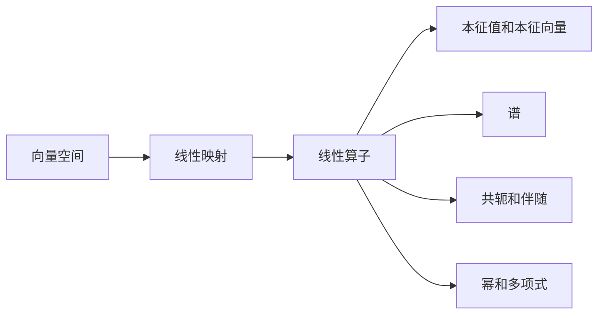

# 线性代数导引：算子代数

关键词：线性代数、算子代数、矩阵、向量空间、特征值、特征向量、谱分解、奇异值分解

## 1. 背景介绍 
### 1.1 问题的由来
线性代数是数学的一个分支,主要研究向量空间和线性映射。它在科学和工程中有着广泛的应用,尤其是在计算机科学、物理学、工程学等领域。算子代数是线性代数的一个重要分支,主要研究线性算子及其性质。

### 1.2 研究现状
目前,算子代数已经成为一个相对成熟的数学分支。很多重要的线性代数概念,如特征值、特征向量、谱分解、奇异值分解等,都可以用算子代数的语言来描述和研究。算子代数在量子力学、信号处理、机器学习等领域都有重要应用。

### 1.3 研究意义  
深入研究算子代数,对于理解和应用线性代数具有重要意义。算子代数为线性代数提供了一个更加抽象和一般化的语言,使得很多线性代数问题可以在更高的层次上进行研究。同时,算子代数也为其他数学分支,如泛函分析、表示论等,提供了重要的工具和思想。

### 1.4 本文结构
本文将首先介绍算子代数的一些核心概念,如线性算子、本征值、谱等,然后介绍几个重要的算子分解,包括谱分解和奇异值分解,并给出它们的几何解释。接着,本文将通过几个具体的例子来说明如何应用算子代数解决实际问题。最后,本文还将介绍一些学习算子代数的资源,并对算子代数的未来发展进行展望。

## 2. 核心概念与联系
在介绍算子代数之前,我们先回顾一下线性代数的一些基本概念。

向量空间是一个集合 $V$,其上定义了加法和数乘运算,满足一些公理。向量空间的元素称为向量。如果 $V$ 是定义在实数域 $\mathbb{R}$ 或复数域 $\mathbb{C}$ 上的有限维向量空间,则称为欧氏空间或酉空间。

线性映射是两个向量空间之间的一个映射 $T: V \to W$,满足

$$
T(ax+by) = aT(x) + bT(y), \forall x,y \in V, a,b \in \mathbb{F}
$$

其中 $\mathbb{F}$ 为 $V,W$ 的定义域。如果 $V=W$,则称 $T$ 为线性算子。

矩阵是一种表示线性映射的方式。一个 $m\times n$ 矩阵 $A$ 可以看作从 $\mathbb{F}^n$ 到 $\mathbb{F}^m$ 的一个线性映射,其中 $\mathbb{F}$ 为定义域。

有了以上基础,我们就可以引入算子代数的核心概念了。设 $V$ 为定义在数域 $\mathbb{F}$ 上的有限维向量空间,$\mathcal{L}(V)$ 表示 $V$ 上全体线性算子构成的集合。

1. 线性算子的和、数乘、乘法:
$$
\begin{aligned}
(S+T)(v) &= S(v) + T(v)\\
(aT)(v) &= aT(v)\\
(ST)(v) &= S(T(v))
\end{aligned}
$$

2. 线性算子的本征值和本征向量:如果存在标量 $\lambda$ 和非零向量 $v$ 使得 
$$
Tv = \lambda v
$$
则称 $\lambda$ 为 $T$ 的一个本征值,$v$ 为 $T$ 对应于 $\lambda$ 的一个本征向量。

3. 线性算子的谱:线性算子 $T$ 的全体本征值构成的集合称为 $T$ 的谱,记为 $\sigma(T)$。

4. 线性算子的共轭:设 $V$ 为酉空间,线性算子 $T$ 的共轭 $T^*$ 定义为满足
$$
\langle Tv, w\rangle = \langle v, T^*w\rangle, \forall v,w \in V
$$
的线性算子。

5. 线性算子的伴随:设 $V$ 为欧氏空间,线性算子 $T$ 的伴随 $T^*$ 定义为满足
$$
\langle Tv, w\rangle = \langle v, T^*w\rangle, \forall v,w \in V
$$
的线性算子。

6. 线性算子的幂:线性算子 $T$ 的 $n$ 次幂定义为 $T$ 与自身的 $n$ 次乘积
$$
T^n = \underbrace{T \cdots T}_{n}
$$

7. 线性算子的多项式:设 $p(x) = \sum_{i=0}^n a_i x^i$ 为数域 $\mathbb{F}$ 上的一个多项式,线性算子 $T$ 的多项式 $p(T)$ 定义为
$$
p(T) = \sum_{i=0}^n a_i T^i
$$

以上就是算子代数的一些核心概念。这些概念之间有着密切的联系,它们共同构成了算子代数的基础。

## 3. 核心算法原理 & 具体操作步骤
### 3.1 算法原理概述
在算子代数中,有两个非常重要的矩阵分解,即谱分解和奇异值分解。它们在矩阵计算和应用中有着广泛的用途。

谱分解是将一个矩阵分解为对角矩阵和酉矩阵的乘积形式。设 $A$ 为 $n$ 阶复矩阵,如果存在酉矩阵 $U$ 和对角矩阵 $\Lambda$ 使得
$$
A = U \Lambda U^*
$$
其中 $\Lambda = \mathrm{diag}(\lambda_1, \ldots, \lambda_n)$,则称上式为 $A$ 的谱分解。$\lambda_1, \ldots, \lambda_n$ 为 $A$ 的本征值。

奇异值分解是将一个矩阵分解为两个酉矩阵和一个对角矩阵的乘积形式。设 $A$ 为 $m \times n$ 复矩阵,如果存在酉矩阵 $U, V$ 和实对角矩阵 $\Sigma$ 使得
$$
A = U \Sigma V^*
$$
其中 $\Sigma = \mathrm{diag}(\sigma_1, \ldots, \sigma_p), p = \min\{m,n\}$,则称上式为 $A$ 的奇异值分解。$\sigma_1, \ldots, \sigma_p$ 称为 $A$ 的奇异值。

### 3.2 算法步骤详解
下面我们详细介绍谱分解和奇异值分解的具体步骤。

谱分解的步骤如下:
1. 求矩阵 $A$ 的特征多项式 $\det(xI-A)$;
2. 求特征多项式的根,即 $A$ 的全体本征值 $\lambda_1, \ldots, \lambda_n$;
3. 对每个本征值 $\lambda_i$,求解线性方程组 $(A-\lambda_i I)x = 0$ 得到对应的特征向量 $v_i$;
4. 将特征向量 $v_1, \ldots, v_n$ 单位化,记为 $u_1, \ldots, u_n$,构成酉矩阵 $U=(u_1, \ldots, u_n)$;
5. 令 $\Lambda = \mathrm{diag}(\lambda_1, \ldots, \lambda_n)$,则有 $A = U \Lambda U^*$。

奇异值分解的步骤如下:
1. 计算 $AA^*$ 和 $A^*A$ 的本征值和本征向量;  
2. 将 $AA^*$ 的单位本征向量按本征值从大到小排列,构成 $U$ 的列向量;
3. 将 $A^*A$ 的单位本征向量按本征值从大到小排列,构成 $V$ 的列向量;
4. 令 $\sigma_i = \sqrt{\lambda_i}$,其中 $\lambda_i$ 为 $AA^*$ 和 $A^*A$ 的第 $i$ 大本征值,构成 $\Sigma = \mathrm{diag}(\sigma_1, \ldots, \sigma_p)$;
5. 则有 $A = U \Sigma V^*$。

### 3.3 算法优缺点
谱分解和奇异值分解都是很好的矩阵分解工具,它们有以下优点:
- 谱分解和奇异值分解都能将矩阵分解为若干简单矩阵的乘积,便于理解和计算;  
- 谱分解和奇异值分解都能揭示矩阵的内在结构和性质;
- 谱分解和奇异值分解在矩阵压缩、降噪、特征提取等方面有重要应用。

但是,谱分解和奇异值分解也有一些局限性:
- 谱分解只适用于方阵,而奇异值分解适用于任意矩阵;  
- 谱分解要求矩阵可对角化,而奇异值分解没有这个要求;
- 谱分解和奇异值分解的计算量较大,对于大型矩阵可能不太适用。

### 3.4 算法应用领域
谱分解和奇异值分解在许多领域都有重要应用,包括:
- 量子力学:谱分解被用于描述量子系统的状态和观测量;
- 信号处理:奇异值分解被用于信号的滤波、降噪、压缩等;
- 机器学习:谱分解和奇异值分解被用于特征提取、降维、推荐系统等;
- 计算机视觉:奇异值分解被用于人脸识别、图像压缩等;
- 数值线性代数:谱分解和奇异值分解被用于矩阵的求逆、行列式计算、线性方程组求解等。

## 4. 数学模型和公式 & 详细讲解 & 举例说明
### 4.1 数学模型构建
我们以谱分解为例,来看看如何建立算子代数的数学模型。

设 $V$ 为 $n$ 维酉空间,$T \in \mathcal{L}(V)$ 为一个线性算子。如果存在 $V$ 的一组基 $\{u_1, \ldots, u_n\}$ 和数域 $\mathbb{F}$ 中的数 $\lambda_1, \ldots, \lambda_n$,使得
$$
Tu_i = \lambda_i u_i, i=1,\ldots,n
$$
则称 $T$ 可对角化。$\lambda_1, \ldots, \lambda_n$ 为 $T$ 的本征值,$u_1, \ldots, u_n$ 为对应的本征向量。

如果记 $U=(u_1, \ldots, u_n), \Lambda = \mathrm{diag}(\lambda_1, \ldots, \lambda_n)$,则有
$$
TU = U\Lambda
$$
即
$$
T = U \Lambda U^{-1}
$$
这就是 $T$ 的谱分解。

### 4.2 公式推导过程
下面我们来推导一下谱分解的公式。

设 $T \in \mathcal{L}(V)$ 可对角化,$\{u_1, \ldots, u_n\}$ 为 $T$ 的一组特征向量,构成 $V$ 的一组基,对应的特征值为 $\lambda_1, \ldots, \lambda_n$。任取 $v \in V$,可以将其表示为
$$
v = \sum_{i=1}^n c_i u_i
$$
其中 $c_1, \ldots, c_n$ 为系数。对 $v$ 作用 $T$ 得
$$
\begin{aligned}
Tv &= T(\sum_{i=1}^n c_i u_i) \\
&= \sum_{i=1}^n c_i Tu_i \\
&= \sum_{i=1}^n c_i \lambda_i u_i \\
&= (\sum_{i=1}^n c_i u_i) \Lambda \\
&= v \Lambda
\end{aligned}
$$
其中 $\Lambda = \mathrm{diag}(\lambda_1, \ldots, \lambda_n)$。令 $U=(u_1, \ldots, u_n)$,则有
$$
TU = U\Lambda
$$
即
$$
T = U \Lambda U^{-1}
$$

### 4.3 案例分析与讲解
下面我们通过一个具体的