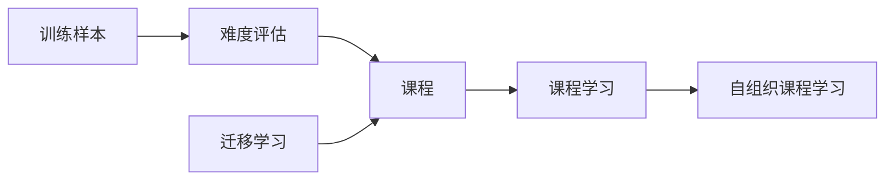

# 维护学习 (Curriculum Learning) 原理与代码实例讲解

关键词：维护学习、课程学习、机器学习、深度学习、迁移学习、学习策略、代码实现

## 1. 背景介绍
### 1.1 问题的由来
在机器学习和深度学习领域,如何高效地训练模型一直是一个重要的研究课题。传统的训练方法通常是将所有的训练样本一次性地喂入模型进行训练,这种方式虽然简单直接,但是存在一些问题:

1. 对于复杂的任务,训练样本的难度差异较大,若一开始就使用难度较大的样本训练,可能导致模型难以收敛。
2. 没有考虑不同训练样本之间的相关性和先后顺序,可能影响模型的泛化能力。
3. 缺乏对模型训练过程的引导和调控,难以充分发挥模型的学习潜力。

针对上述问题,维护学习(Curriculum Learning)应运而生。

### 1.2 研究现状
维护学习最早由Bengio等人于2009年在论文《Curriculum Learning》中提出。核心思想是模仿人类的学习过程,先学习简单、基础的内容,再逐步过渡到复杂、高阶的内容,通过合理地调整训练样本的顺序和难度,来引导模型的学习。

此后,维护学习得到了广泛的关注和研究,主要集中在以下几个方面:

1. 课程(Curriculum)的生成方法:如何度量样本难度并生成合适的训练顺序。代表工作有基于样本复杂度的课程生成、基于迁移学习的课程生成等。

2. 与其他学习范式的结合:将维护学习与迁移学习、多任务学习、持续学习等结合,提出了一系列改进方法。

3. 在不同任务中的应用:在计算机视觉、自然语言处理、强化学习等领域均有维护学习的应用。

总的来说,维护学习已经成为机器学习领域一个重要的研究方向,并取得了丰硕的研究成果。

### 1.3 研究意义
维护学习的研究意义主要体现在以下几个方面:

1. 提高模型训练效率:通过合理安排训练样本的顺序,可以加速模型的收敛,减少训练时间。

2. 增强模型泛化能力:先学习共性、基础的特征,再学习特殊、高阶的特征,有助于模型学到更加鲁棒、泛化的表示。

3. 探索机器学习的基本规律:维护学习模拟了人脑的学习机制,有助于我们更好地理解机器学习乃至人工智能的基本规律。

4. 拓展机器学习的应用场景:使得在样本难度差异较大、样本之间关联性强的场景中,机器学习方法也能够发挥较好的性能。

### 1.4 本文结构
本文将从以下几个方面对维护学习进行详细阐述:

1. 介绍维护学习的核心概念与基本原理。 
2. 讲解维护学习的主要算法,并给出具体的操作步骤。
3. 建立维护学习的数学模型,推导相关公式,并结合案例进行分析讲解。
4. 给出维护学习的代码实例,并对关键部分进行注释说明。
5. 总结维护学习的实际应用场景,并展望其未来发展方向。
6. 推荐维护学习相关的学习资源、开发工具、论文等。
7. 对全文内容进行总结,指出维护学习未来的发展趋势和面临的挑战。
8. 梳理维护学习领域一些常见的问题,并给出解答。

## 2. 核心概念与联系
维护学习的核心概念主要包括:

1. 课程(Curriculum):指训练样本呈现给学习模型的顺序。一般是由简单到复杂,由易到难。

2. 难度评估(Difficulty Evaluation):评估每个训练样本的难度,常见的难度评估指标有样本复杂度、不确定性、多样性等。

3. 课程学习(Curriculum Learning):基于课程的学习范式,通过调整训练数据的顺序,逐步引导模型学习。

4. 迁移学习(Transfer Learning):将已学到的知识迁移到新任务中,常用于生成有效的课程。

5. 自组织课程学习(Self-paced Learning):一种课程学习的变种,可自适应地调整训练样本权重,对不同难度样本施加不同程度的关注。

这些概念之间的联系可以用下面的 Mermaid 图来表示:



从上图可以看出,训练样本经过难度评估生成课程,课程指导模型进行课程学习。迁移学习可为课程的生成提供先验知识。课程学习还可以进一步延伸到自组织课程学习。这些概念环环相扣,共同构成了维护学习的理论框架。

## 3. 核心算法原理 & 具体操作步骤
### 3.1 算法原理概述
维护学习的核心算法可以概括为两个步骤:

1. 课程生成:根据训练样本的难度,生成合适的课程。
2. 模型训练:按照课程定义的顺序,逐步训练模型。

其中,课程生成是维护学习的关键,需要解决两个问题:如何度量样本难度、如何根据样本难度生成最优课程。下面将对这两个问题进行详细阐述。

### 3.2 算法步骤详解
#### 3.2.1 样本难度评估
样本难度评估是生成课程的基础。常见的样本难度评估指标有:

1. 样本复杂度:可用样本的特征维度、语法结构复杂程度等来衡量。
2. 不确定性:可用样本所属类别的概率分布的信息熵来衡量。
3. 多样性:可用样本特征的统计量(如方差)来衡量。
4. 模型置信度:可用模型对样本预测的置信度(如 softmax 概率)来衡量。

具体地,可以用下面的公式来计算样本 $x_i$ 的难度 $d_i$:

$$
d_i = \alpha \cdot \text{ComplexityMeasure}(x_i) + \beta \cdot \text{UncertaintyMeasure}(x_i) + \gamma \cdot \text{DiversityMeasure}(x_i) + \delta \cdot \text{ConfidenceMeasure}(x_i)
$$

其中 $\alpha, \beta, \gamma, \delta$ 为权重系数,可根据具体任务调节。

#### 3.2.2 课程生成
得到样本难度之后,需要根据样本难度生成合适的课程。常见的课程生成策略有:

1. 难度排序:直接按照样本难度排序,从易到难生成课程。
2. 分层采样:将样本划分为若干难度层,每个 epoch 从低难度到高难度层依次采样。
3. 课程调整:在训练过程中,根据模型性能动态调整课程,增大难样本的采样概率。

以难度排序为例,假设样本集 $D=\{(x_1,y_1),\cdots,(x_n,y_n)\}$,样本难度 $\{d_1,\cdots,d_n\}$,课程 $C$ 可表示为样本的有序排列:

$$
C = \{(x_{i_1},y_{i_1}), \cdots, (x_{i_n},y_{i_n})\} 
$$

其中 $\{i_1, \cdots, i_n\}$ 为样本下标的一个排列,满足:

$$
d_{i_1} \leq \cdots \leq d_{i_n}
$$

即课程 $C$ 中样本的难度是严格非递减的。

#### 3.2.3 模型训练
根据生成的课程 $C$,可以按照其中样本的顺序对模型进行训练,伪代码如下:

```
Initialize model parameters θ
for (x, y) in C:
    Compute loss L(x, y; θ)
    Update θ by minimizing L
```

可以看到,维护学习的训练过程与普通的训练过程的区别在于样本的顺序是预先定义好的,而不是随机的。

### 3.3 算法优缺点
维护学习算法的优点主要有:

1. 加速模型收敛:通过合理的课程设计,可以帮助模型更快地达到收敛状态。
2. 提高模型泛化性能:先学习简单、共性的模式,再学习复杂、特殊的模式,有助于模型学到更加鲁棒、泛化的表示。
3. 增强模型的可解释性:课程的生成过程可以反映不同样本之间的相关性和差异性,有助于我们理解模型的决策过程。

但维护学习算法也存在一些局限性:

1. 课程生成的有效性难以保证:课程的质量很大程度上取决于样本难度的评估,而难度评估指标的选取具有一定的主观性和启发性。
2. 课程生成的计算开销较大:难度评估和课程生成都需要额外的计算,尤其是在样本量很大的情况下,会显著增加时间和空间开销。
3. 算法的适用范围有限:维护学习对样本的难度差异和渐进关系有较强的依赖,在样本难度分布比较均匀或随机的情况下,其优势可能不明显。

### 3.4 算法应用领域
维护学习算法已经在多个领域得到了成功应用,包括:

1. 计算机视觉:物体检测、语义分割、行人重识别等。
2. 自然语言处理:机器翻译、语言模型、文本分类等。
3. 语音识别:声学模型训练、关键词识别等。
4. 强化学习:策略学习、环境探索等。

总的来说,维护学习适用于样本难度差异较大、样本之间有明显先后关系的学习任务。

## 4. 数学模型和公式 & 详细讲解 & 举例说明
### 4.1 数学模型构建
考虑一个标准的监督学习任务,训练集 $D=\{(x_1,y_1),\cdots,(x_n,y_n)\}$,其中 $x_i \in \mathcal{X}$ 为输入样本,$y_i \in \mathcal{Y}$ 为对应的标签。假设样本 $x_i$ 的难度为 $d_i$,课程 $C$ 定义为训练集 $D$ 的一个排列:

$$
C = \{(x_{i_1},y_{i_1}), \cdots, (x_{i_n},y_{i_n})\}
$$

其中 $\{i_1, \cdots, i_n\}$ 为 $\{1,\cdots,n\}$ 的一个排列,表示训练样本呈现给模型的顺序。

假设模型的参数为 $\theta$,损失函数为 $L(x_i,y_i;\theta)$,则维护学习的目标是最小化课程 $C$ 下的累积损失:

$$
\min_{\theta} \sum_{t=1}^n L(x_{i_t},y_{i_t};\theta)
$$

其中 $\{i_1, \cdots, i_n\}$ 满足课程 $C$ 定义的顺序约束:

$$
d_{i_1} \leq \cdots \leq d_{i_n}
$$

直观地说,就是要找到一个最优的训练顺序,使得模型在学习过程中的总体损失最小。

### 4.2 公式推导过程
为了求解上述优化问题,需要先生成最优的课程 $C^*$。根据课程的定义,这等价于找到样本难度的一个最优排列:

$$
\{d_{i_1^*}, \cdots, d_{i_n^*}\} = \arg\min_{\{i_1, \cdots, i_n\}} \sum_{t=1}^n L(x_{i_t},y_{i_t};\theta)
$$

然而,这是一个组合优化问题,寻找最优解的时间复杂度是阶乘级的,在样本量较大时难以求解。因此,需要采用一些近似策略。

一种常用的策略是贪心算法,每次选择当前损失最小的样本:

$$
i_t^* = \arg\min_{i \in \{1,\cdots,n\} \setminus \{i_1^*,\cdots,i_{t-1}^*\}} L(x_i,y_i