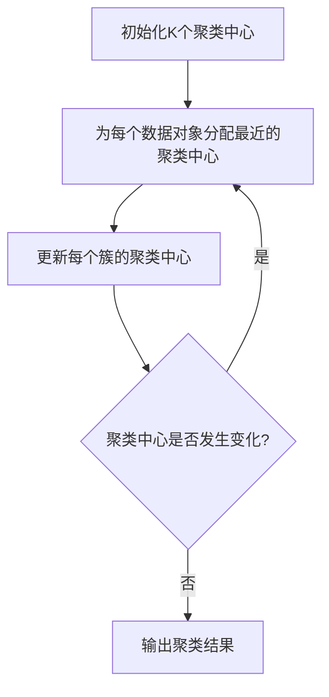
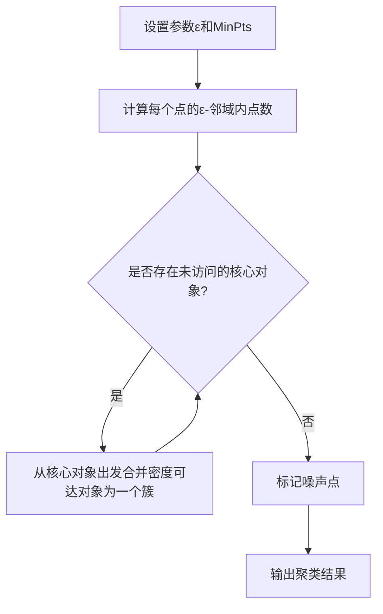

# 聚类分析原理与代码实例讲解

## 1. 背景介绍

### 1.1 问题的由来

在现实世界中,我们经常会遇到需要对大量数据进行分类和组织的场景。无论是网络购物平台上的商品推荐,还是基因组学研究中的基因表达模式分析,抑或是社交网络中的用户群体划分,都需要对海量数据进行有效的聚类分析。聚类分析作为一种无监督学习技术,旨在根据数据之间的相似性自动发现数据的内在结构和模式,从而将数据划分为多个"簇"或"类"。

### 1.2 研究现状

聚类分析已经成为数据挖掘、机器学习和模式识别等领域的核心技术之一。目前,已经提出了多种聚类算法,如传统的K-Means、层次聚类、密度聚类等,以及更先进的基于模型的聚类算法、基于约束的聚类算法等。这些算法各有优缺点,适用于不同的数据类型和应用场景。

### 1.3 研究意义

高效准确的聚类分析技术可以为各个领域的数据分析和决策提供有力支持。例如,在商业智能领域,聚类分析可以帮助企业发现潜在的客户群体,从而制定更有针对性的营销策略;在生物信息学领域,聚类分析可以揭示基因表达模式,为疾病诊断和药物开发提供依据;在社交网络分析中,聚类分析可以识别出用户社区,为个性化推荐和广告投放提供支持。

### 1.4 本文结构

本文将全面介绍聚类分析的原理和实践。首先阐述聚类分析的核心概念和算法原理,包括距离度量、聚类质量评估等;然后详细讲解常见的聚类算法,如K-Means、层次聚类、密度聚类等,并分析它们的数学模型和公式推导过程;接着通过实际代码实例,展示如何在Python中实现这些算法;最后探讨聚类分析在不同领域的应用场景,并总结未来的发展趋势和挑战。

## 2. 核心概念与联系

聚类分析的核心概念包括:

1. **相似性度量(Similarity Measure)**: 用于衡量数据对象之间的相似程度,常用的度量包括欧几里得距离、余弦相似度等。相似性度量是聚类分析的基础。

2. **聚类准则(Clustering Criterion)**: 定义了聚类的目标函数,用于评估聚类结果的质量。不同的聚类算法采用不同的准则,如最小化簇内平方和(K-Means)、最大化簇间距离(层次聚类)等。

3. **簇表示(Cluster Representation)**: 描述簇的特征,如簇中心、密度分布等,不同算法对簇的表示方式不同。

4. **聚类质量评估(Clustering Validation)**: 用于评估聚类结果的有效性和稳健性,常用指标包括簇内平方和、轮廓系数等。

这些核心概念相互关联,共同构成了聚类分析的理论基础。例如,相似性度量决定了数据对象之间的距离,进而影响聚类准则的计算;聚类准则指导算法寻找最优的簇划分;簇表示方式影响聚类质量的评估等。

## 3. 核心算法原理 & 具体操作步骤

### 3.1 算法原理概述

聚类分析的核心算法主要包括以下几类:

1. **基于原型的聚类(Prototype-based Clustering)**
    - **K-Means**: 最经典的聚类算法,通过迭代优化聚类中心来划分簇。
    - **K-Medoids**: 类似于K-Means,但聚类中心是数据对象本身。
    - **高斯混合模型(GMM)**: 基于概率模型,假设数据由多个高斯分布混合而成。

2. **基于密度的聚类(Density-based Clustering)**
    - **DBSCAN**: 基于密度可连接性的算法,能发现任意形状的簇。
    - **OPTICS**: 改进版的DBSCAN,可以自动发现聚类结构。

3. **基于层次的聚类(Hierarchical Clustering)**
    - **凝聚层次聚类(Agglomerative)**: 自底向上的聚类方法。
    - **分裂层次聚类(Divisive)**: 自顶向下的聚类方法。

4. **基于网格的聚类(Grid-based Clustering)**
    - **STING**: 基于统计信息网格的聚类算法。
    - **CLIQUE**: 基于密度网格的聚类算法。

5. **基于约束的聚类(Constraint-based Clustering)**
    - **COP-KMeans**: 在K-Means基础上加入must-link和cannot-link约束。
    - **半监督聚类**: 利用少量标记数据指导聚类过程。

不同算法适用于不同的数据类型和场景,需要根据具体问题选择合适的算法。接下来,我们将重点介绍K-Means和DBSCAN两种经典且广泛使用的聚类算法。

### 3.2 算法步骤详解

#### 3.2.1 K-Means算法

K-Means是一种迭代优化的原型聚类算法,旨在最小化簇内平方和(Intra-Cluster Sum of Squares)。算法步骤如下:

1. **初始化K个聚类中心**,通常是从数据集中随机选择K个点作为初始中心。

2. **为每个数据对象分配最近的聚类中心**,形成K个簇。

3. **更新每个簇的聚类中心**,计算每个簇中所有数据对象的均值作为新的聚类中心。

4. **重复步骤2和3**,直到聚类中心不再发生变化或达到最大迭代次数。

K-Means算法的优点是简单高效,适用于大规模数据集;缺点是需要预先指定簇数K,对初始中心敏感,并且无法处理非凸形状的簇。

#### 3.2.2 DBSCAN算法

DBSCAN(Density-Based Spatial Clustering of Applications with Noise)是一种基于密度的聚类算法,能够发现任意形状的簇,并自动识别噪声点。算法步骤如下:

1. **设置两个参数:邻域半径ε和最小点数MinPts**。

2. **对每个点p,计算其ε-邻域内的点数**。
    - 如果邻域内点数 >= MinPts,则p是**核心对象**。
    - 如果p不是核心对象,但存在核心对象q使得p位于q的ε-邻域内,则p是**边界对象**。
    - 其他点都是**噪声点**。

3. **从一个核心对象开始,通过密度可达关系将所有可达的核心对象和边界对象合并成一个簇**。

4. **继续处理剩余的未访问过的核心对象,形成新的簇**。

5. **将噪声点标记为噪声**。

DBSCAN的优点是能发现任意形状的簇,并自动处理噪声;缺点是对参数ε和MinPts敏感,性能随维度增加而下降。

### 3.3 算法优缺点

#### K-Means算法

**优点**:

- 简单高效,可以处理大规模数据集。
- 收敛性良好,通常能快速收敛到局部最优解。
- 对于球形或高斯分布的簇,效果较好。

**缺点**:

- 需要预先指定簇数K,对初始聚类中心敏感。
- 无法处理非凸形状的簇,对噪声和异常值敏感。
- 只考虑了簇内平方和,忽略了簇间距离。
- 对于不同密度的簇,效果较差。

#### DBSCAN算法

**优点**:

- 不需要预先指定簇数,能自动发现任意形状的簇。
- 对噪声点有很好的鲁棒性,能自动识别并剔除噪声。
- 只需要设置两个参数ε和MinPts,相对简单。

**缺点**:

- 对参数ε和MinPts敏感,需要合理设置。
- 对于高维数据,性能会下降。
- 无法很好地处理不同密度的簇。
- 对于边界点的处理存在一定的模糊性。

### 3.4 算法应用领域

聚类分析算法在各个领域都有广泛的应用,例如:

- **商业智能**: 客户细分、产品推荐、欺诈检测等。
- **生物信息学**: 基因表达模式分析、蛋白质结构预测等。
- **图像处理**: 图像分割、目标检测、场景分类等。
- **网络安全**: 入侵检测、恶意软件分析等。
- **社交网络分析**: 用户社区发现、影响力分析等。
- **文本挖掘**: 文档聚类、主题发现等。

不同领域对聚类算法的要求也不尽相同,需要根据具体场景选择合适的算法。

## 4. 数学模型和公式 & 详细讲解 & 举例说明

### 4.1 数学模型构建

聚类分析的数学模型通常基于以下几个核心要素:

1. **数据表示**: 将原始数据转换为向量形式,如 $\mathbf{x} = (x_1, x_2, \dots, x_d)^\top \in \mathbb{R}^d$。

2. **相似性度量**: 定义数据对象之间的相似性或距离,常用的度量包括:
    - **欧几里得距离**: $\text{dist}(\mathbf{x}, \mathbf{y}) = \sqrt{\sum_{i=1}^d (x_i - y_i)^2}$
    - **曼哈顿距离**: $\text{dist}(\mathbf{x}, \mathbf{y}) = \sum_{i=1}^d |x_i - y_i|$
    - **余弦相似度**: $\text{sim}(\mathbf{x}, \mathbf{y}) = \frac{\mathbf{x}^\top \mathbf{y}}{\|\mathbf{x}\| \|\mathbf{y}\|}$

3. **聚类准则**: 定义聚类的目标函数,如K-Means的簇内平方和:

$$
J = \sum_{j=1}^K \sum_{\mathbf{x} \in C_j} \|\mathbf{x} - \boldsymbol{\mu}_j\|^2
$$

其中 $C_j$ 表示第 $j$ 个簇, $\boldsymbol{\mu}_j$ 为该簇的聚类中心。

4. **簇表示**: 描述簇的特征,如K-Means中的聚类中心 $\boldsymbol{\mu}_j$,DBSCAN中的核心对象和边界对象等。

5. **优化算法**: 求解聚类准则的优化算法,如K-Means的迭代更新、DBSCAN的密度可达性计算等。

通过将原始数据转换为数学模型,我们可以更清晰地理解聚类算法的本质,并利用数学工具对算法进行分析和改进。

### 4.2 公式推导过程

以K-Means算法为例,我们来推导其目标函数的优化过程。

K-Means的目标是最小化所有簇的簇内平方和 $J$:

$$
J = \sum_{j=1}^K \sum_{\mathbf{x} \in C_j} \|\mathbf{x} - \boldsymbol{\mu}_j\|^2
$$

为了求解 $J$ 的最小值,我们可以对每个簇的聚类中心 $\boldsymbol{\mu}_j$ 分别求偏导数,并令其等于 0:

$$
\begin{aligned}