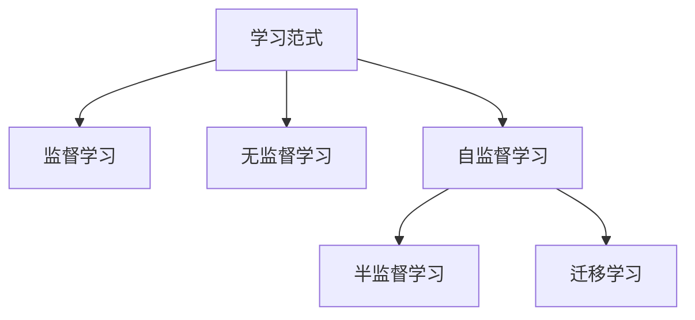

# 自监督学习Self-Supervised Learning原理与代码实例讲解

## 1. 背景介绍

### 1.1 问题的由来

随着深度学习的迅猛发展,人工智能领域取得了令人瞩目的成就。然而,大多数深度学习模型都需要大量的人工标注数据进行监督式训练,这种方式存在以下几个问题:

1. 人工标注数据的成本高昂且耗时耗力。
2. 标注质量参差不齐,存在主观性和不确定性。
3. 某些领域缺乏足够的标注数据,如医疗影像、自动驾驶等。

为了解决这些问题,自监督学习(Self-Supervised Learning)应运而生。

### 1.2 研究现状

自监督学习是一种无需人工标注数据的学习范式,它利用原始数据本身的信息进行模型训练。通过设计合理的预测任务,模型可以从原始数据中自动挖掘出有用的表示特征,从而获得数据的深层次理解能力。

目前,自监督学习在计算机视觉、自然语言处理等领域取得了卓越的成果,展现出巨大的应用潜力。不同的任务往往需要设计不同的预测目标,因此自监督学习的研究主要集中在设计有效的预测任务和损失函数上。

### 1.3 研究意义

自监督学习的出现为深度学习注入了新的活力,它可以充分利用海量的未标注数据,减少对人工标注数据的依赖,从而降低了数据获取的成本。同时,自监督学习可以捕捉数据的内在规律和本质特征,为下游任务提供更加通用和鲁棒的表示,提高了模型的泛化能力。

此外,自监督学习还可以与监督学习相结合,形成半监督学习或者迁移学习,进一步提升模型的性能。因此,自监督学习不仅是深度学习的一个重要补充,也为人工智能的发展开辟了新的道路。

### 1.4 本文结构

本文将全面介绍自监督学习的原理、算法和应用。我们将从自监督学习的核心概念出发,阐述其与其他学习范式的联系;接着详细讲解自监督学习的核心算法原理和数学模型,并辅以代码实例加深理解;然后探讨自监督学习在不同领域的应用场景;最后总结自监督学习的发展趋势和面临的挑战。

通过本文的学习,读者将能够全面掌握自监督学习的理论基础和实践技能,为进一步研究和应用奠定坚实的基础。

## 2. 核心概念与联系

自监督学习(Self-Supervised Learning)是一种无需人工标注数据的学习范式,它通过设计合理的预测任务,利用原始数据本身的信息进行模型训练。与监督学习和无监督学习不同,自监督学习介于两者之间,具有以下特点:

1. 无需人工标注数据,可以充分利用海量未标注数据。
2. 通过预测任务自动挖掘数据的内在规律和本质特征。
3. 获得的表示特征具有更好的通用性和鲁棒性。
4. 可以与监督学习和无监督学习相结合,形成半监督学习或迁移学习。

自监督学习与其他学习范式的联系如下:

1. **监督学习**:需要大量人工标注数据进行模型训练,成本高昂且存在主观性和不确定性。自监督学习可以作为监督学习的预训练步骤,提高模型的初始化质量。
2. **无监督学习**:无需任何标注数据,但难以获得具有实际意义的表示特征。自监督学习通过设计预测任务,可以从原始数据中挖掘出有用的表示特征。
3. **半监督学习**:结合少量标注数据和大量未标注数据进行训练。自监督学习可以作为半监督学习的预训练步骤,提高模型的泛化能力。
4. **迁移学习**:将在源域学习到的知识迁移到目标域。自监督学习可以在源域获得通用的表示特征,为迁移学习提供有力支持。

总的来说,自监督学习是一种灵活的学习范式,它可以充分利用未标注数据,获得通用和鲁棒的表示特征,并与其他学习范式相结合,为深度学习注入新的活力。

## 3. 核心算法原理 & 具体操作步骤

### 3.1 算法原理概述

自监督学习的核心思想是通过设计合理的预测任务,利用原始数据本身的信息进行模型训练,从而获得数据的深层次表示特征。这种思想可以概括为以下三个步骤:

1. **数据预处理**:对原始数据进行适当的预处理,如数据增强、噪声添加等,生成相关但不同的视图(views)。
2. **预测任务设计**:设计一个预测任务,使模型能够从一个视图预测另一个视图的某些属性或表示。
3. **模型训练**:通过最小化预测任务的损失函数,训练模型参数,使模型学习到数据的内在规律和本质特征。

自监督学习的关键在于设计有效的预测任务和损失函数,以确保模型能够从原始数据中学习到有用的表示特征。不同的任务和数据类型往往需要设计不同的预测目标和损失函数。

### 3.2 算法步骤详解

以下是自监督学习算法的详细步骤:

1. **数据预处理**
   - 对原始数据进行适当的预处理,如数据增强、噪声添加等。
   - 生成相关但不同的视图(views),如图像的不同裁剪、不同颜色扭曲等。

2. **预测任务设计**
   - 设计一个预测任务,使模型能够从一个视图预测另一个视图的某些属性或表示。
   - 常见的预测任务包括:
     - 图像领域:相对位置预测、图像恢复、图像着色等。
     - 自然语言处理:句子连续性预测、词袋预测、词关系预测等。

3. **损失函数设计**
   - 设计合适的损失函数,用于衡量预测结果与真实值之间的差异。
   - 常见的损失函数包括:交叉熵损失、均方误差损失、对比损失等。

4. **模型训练**
   - 使用设计好的预测任务和损失函数,训练模型参数。
   - 通过最小化损失函数,使模型学习到数据的内在规律和本质特征。

5. **微调或迁移**
   - 在下游任务上,可以直接使用自监督学习获得的表示特征。
   - 也可以将自监督学习作为预训练步骤,对模型进行微调或迁移学习。

通过上述步骤,自监督学习可以充分利用未标注数据,获得通用和鲁棒的表示特征,为下游任务提供有力支持。

### 3.3 算法优缺点

**优点**:

1. 无需人工标注数据,可以充分利用海量未标注数据。
2. 获得的表示特征具有更好的通用性和鲁棒性。
3. 可以与监督学习和无监督学习相结合,形成半监督学习或迁移学习。
4. 降低了数据获取的成本,提高了模型的泛化能力。

**缺点**:

1. 设计有效的预测任务和损失函数具有一定的挑战性。
2. 自监督学习获得的表示特征可能无法直接用于下游任务,需要进一步微调或迁移。
3. 训练过程相对复杂,需要进行数据预处理和视图生成。
4. 对于某些任务,自监督学习可能无法获得足够好的表示特征。

### 3.4 算法应用领域

自监督学习已经在多个领域展现出巨大的应用潜力,主要包括:

1. **计算机视觉**:图像分类、目标检测、语义分割等。
2. **自然语言处理**:文本分类、机器翻译、问答系统等。
3. **语音识别**:语音识别、语音合成、说话人识别等。
4. **推荐系统**:个性化推荐、内容理解、用户画像构建等。
5. **医疗影像分析**:疾病诊断、医学图像分割、医学报告生成等。
6. **生物信息学**:蛋白质结构预测、基因表达分析、药物设计等。
7. **时序数据分析**:异常检测、预测维护、模式发现等。

自监督学习可以为这些领域提供通用和鲁棒的表示特征,提高模型的性能和泛化能力。未来,自监督学习在更多领域将会有广泛的应用前景。

## 4. 数学模型和公式 & 详细讲解 & 举例说明

### 4.1 数学模型构建

自监督学习的核心思想是通过设计合理的预测任务,利用原始数据本身的信息进行模型训练,从而获得数据的深层次表示特征。为了实现这一目标,我们需要构建一个数学模型来描述自监督学习的过程。

假设我们有一个原始数据集 $\mathcal{D} = \{x_i\}_{i=1}^N$,其中 $x_i$ 表示第 $i$ 个数据样本。我们的目标是学习一个映射函数 $f_\theta: \mathcal{X} \rightarrow \mathcal{Z}$,将原始数据 $x$ 映射到一个潜在表示空间 $\mathcal{Z}$,其中 $\theta$ 表示模型的参数。

为了训练映射函数 $f_\theta$,我们设计一个预测任务,将原始数据 $x$ 分割为两个相关但不同的视图 $x^1$ 和 $x^2$,即 $x^1, x^2 = t(x)$,其中 $t(\cdot)$ 表示视图生成函数。然后,我们定义一个预测函数 $g_\phi: \mathcal{Z} \times \mathcal{Z} \rightarrow \mathcal{Y}$,使其能够从一个视图的表示 $f_\theta(x^1)$ 预测另一个视图的某些属性或表示 $y^2$,即 $y^2 = g_\phi(f_\theta(x^1), f_\theta(x^2))$,其中 $\phi$ 表示预测函数的参数。

为了训练模型参数 $\theta$ 和 $\phi$,我们定义一个损失函数 $\mathcal{L}$,衡量预测结果 $y^2$ 与真实值 $\hat{y}^2$ 之间的差异,即 $\mathcal{L}(y^2, \hat{y}^2)$。通过最小化损失函数,我们可以优化模型参数,使映射函数 $f_\theta$ 学习到数据的内在规律和本质特征。

综上所述,自监督学习的数学模型可以表示为:

$$
\begin{aligned}
\min_{\theta, \phi} \mathbb{E}_{x \sim \mathcal{D}} \left[ \mathcal{L}\left(g_\phi\left(f_\theta(x^1), f_\theta(x^2)\right), \hat{y}^2\right) \right] \\
\text{s.t.} \quad x^1, x^2 = t(x)
\end{aligned}
$$

其中,$\mathbb{E}_{x \sim \mathcal{D}}[\cdot]$ 表示对数据集 $\mathcal{D}$ 中的样本 $x$ 取期望。通过优化上述目标函数,我们可以同时学习映射函数 $f_\theta$ 和预测函数 $g_\phi$ 的参数,从而获得数据的深层次表示特征。

### 4.2 公式推导过程

在上一节中,我们构建了自监督学习的数学模型,现在我们来详细推导一下其中的公式。

假设我们有一个原始数据集 $\mathcal{D} = \{x_i\}_{i=1}^N$,我们的目标是学习一个映射函数 $f_\theta: \mathcal{X} \rightarrow \mathcal{Z}$,将原始数据 $x$ 映射到一个潜在表示空间 $\mathc